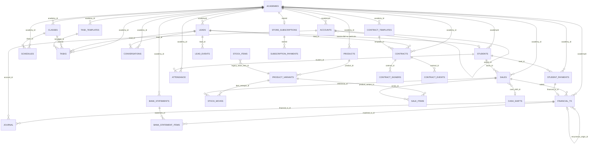
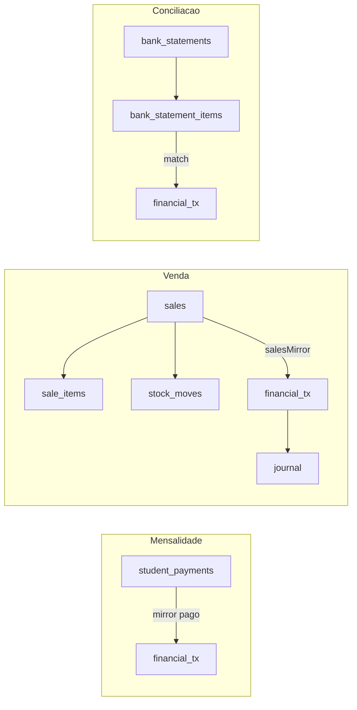
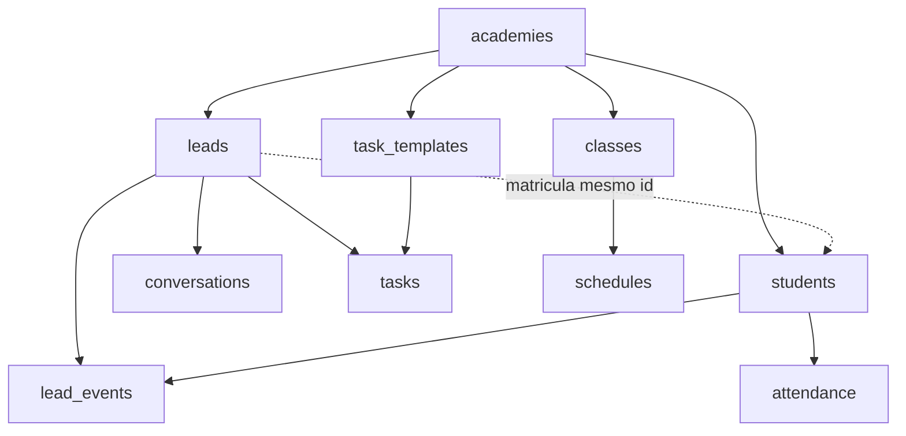
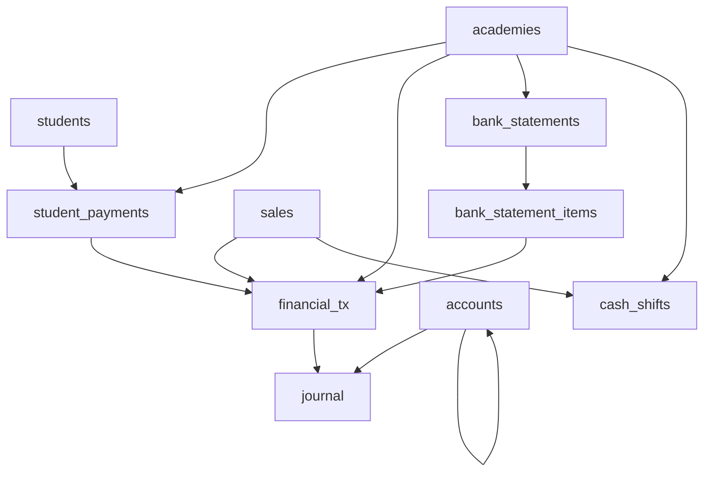

# Modelo de dados — Nave (Appwrite)

Mapa centralizado das **coleções**, **campos de ligação** (FKs lógicas) e **domínios** do banco Appwrite usado pelo Nave.

> **Relacionado:** [appwrite-setup.md](appwrite-setup.md) (provisionamento e env vars) · [multi-tenant-conventions.md](multi-tenant-conventions.md) (isolamento por academia) · manifesto de schema CRM em `scripts/verify-and-fix-schema-crm.mjs`

---

## 1. Como ler este documento

### 1.1 Banco e tenant

| Conceito | Valor |
|----------|--------|
| Banco | Um `DB_ID` para todo o app (`VITE_APPWRITE_DATABASE_ID`) |
| Tenant | **Academia** — documento em `academies` (`$id` = `academyId` na API) |
| Billing Nave | `storeId` nas coleções de assinatura = mesmo `$id` da academia |

Quase toda coleção operacional carrega `academyId` e/ou `academy_id`. Queries e mutações devem filtrar pelo tenant resolvido via `ensureAcademyAccess` (ver [multi-tenant-conventions.md](multi-tenant-conventions.md)).

### 1.2 FKs lógicas (sem constraint no Appwrite)

O Appwrite **não** impõe integridade referencial. Relacionamentos são:

- Atributos `string` com o `$id` do documento pai
- Validados no código (`assertStudentInAcademy`, ownership checks, etc.)
- Às vezes **desnormalizados** (`studentName`, `lead_name`) para listagens rápidas

### 1.3 Legado `lead_id` vs `students`

Após a migração funil → alunos matriculados:

- **`students`** é a fonte de verdade de alunos ativos
- Na matrícula, o aluno pode **reutilizar o `$id` do lead**
- Várias coleções ainda usam o campo **`lead_id`** apontando para esse `$id` (mensalidades, eventos, contratos, `financial_tx`)
- Lookup unificado: `getPersonById()` em `src/lib/personLookup.js` (students → leads → leads_legacy)

### 1.4 Nomenclatura mista

| Canônico (código novo) | Legado (persistência) |
|------------------------|------------------------|
| `academyId` | `academy_id` |
| `studentId` | `lead_id`, `aluno_id`, `student_id` |
| `saleId` | `venda_id`, `origin_id` (contexto financeiro) |

Ao criar schemas novos, preferir `academyId`. Não renomear campos legados sem migração.

### 1.5 JSON embutido (não são FKs)

Configuração e listas ficam em strings JSON dentro de documentos:

| Documento | Campo | Conteúdo |
|-----------|-------|----------|
| `academies` | `settings`, `financeConfig` | Control iD, estoque, Zapster, taxas, contas bancárias; **`settings.turmas[]` legado** (ver §4.6) |
| `academies` | `onboardingChecklist` | Checklist de onboarding |
| `students` | `payer_aliases_json` | Pagadores conhecidos (conciliação) |
| `students` | `custom_answers_json` | Respostas de formulário / matrícula |
| `leads` | `label_ids` | IDs de etiquetas (string JSON) |
| `task_templates` | `items_json` | Itens do playbook |
| `sales` | `pagamentos_json` | Split de pagamentos PDV |

---

## 2. Visão geral (diagrama ER)



---

## 3. Inventário de coleções

Variáveis de ambiente principais. IDs completos: `src/lib/appwrite.js` (frontend) e `lib/server/appwriteCollections.js` (servidor).

### 3.1 Núcleo — tenant e pessoas

| Coleção | Env var | Papel |
|---------|---------|-------|
| `academies` | `VITE_APPWRITE_ACADEMIES_COLLECTION_ID` | Raiz multi-tenant; config em `settings` / `financeConfig` |
| `leads` | `VITE_APPWRITE_LEADS_COLLECTION_ID` | Funil CRM (interessados, não matriculados) |
| `students` | `VITE_APPWRITE_STUDENTS_COLLECTION_ID` | Alunos matriculados |
| `lead_events` | `VITE_APPWRITE_LEAD_EVENTS_COLLECTION_ID` | Timeline (notas, mudanças de etapa, auditoria do funil) |

### 3.2 CRM — atendimento e operação

| Coleção | Env var | Papel |
|---------|---------|-------|
| `conversations` | `VITE_APPWRITE_CONVERSATIONS_COLLECTION_ID` | Threads WhatsApp / inbox |
| `labels` | `VITE_APPWRITE_LABELS_COLLECTION_ID` | Etiquetas do funil |
| `note_notifications` | `VITE_APPWRITE_NOTE_NOTIFICATIONS_COLLECTION_ID` | Notificações internas de @menção |
| `tasks` | `VITE_APPWRITE_TASKS_COLLECTION_ID` | Tarefas operacionais |
| `task_templates` | `VITE_APPWRITE_TASK_TEMPLATES_COLLECTION_ID` | Playbooks / processos |
| `classes` | `VITE_APPWRITE_CLASSES_COLLECTION_ID` | Catálogo de **turmas** (nome, modalidade, capacidade, status) |
| `schedules` | `VITE_APPWRITE_SCHEDULES_COLLECTION_ID` | **Grade semanal** — slots (dia, horário) ligados a `class_id` |
| `attendance` | `VITE_APPWRITE_ATTENDANCE_COL_ID` | Check-ins / presença |
| `academy_events` | `VITE_APPWRITE_ACADEMY_EVENTS_COLLECTION_ID` | Audit log de equipe (convites, papéis) |

### 3.3 Financeiro — mensalidades e caixa

| Coleção | Env var | Papel |
|---------|---------|-------|
| `student_payments` | `VITE_APPWRITE_STUDENT_PAYMENTS_COL_ID` | Mensalidades e cobranças por aluno |
| `financial_tx` | `VITE_APPWRITE_FINANCIAL_TX_COLLECTION_ID` | Caixa / lançamentos consolidados |
| `accounts` | `VITE_APPWRITE_ACCOUNTS_COLLECTION_ID` | Plano de contas |
| `journal` | `VITE_APPWRITE_JOURNAL_COLLECTION_ID` | Lançamentos contábeis (partidas) |
| `bank_statements` | `VITE_APPWRITE_BANK_STATEMENTS_COLLECTION_ID` | Importação de extrato |
| `bank_statement_items` | `VITE_APPWRITE_BANK_STATEMENT_ITEMS_COLLECTION_ID` | Linhas do extrato |
| `financial_audit_log` | `APPWRITE_FINANCIAL_AUDIT_LOG_COLLECTION_ID` | Auditoria de pagamentos |
| `cash_shifts` | `VITE_APPWRITE_CASH_SHIFTS_COLLECTION_ID` | Turnos de caixa PDV |
| `cash_closing` | `VITE_APPWRITE_CASH_CLOSING_COLLECTION_ID` | Fechamento de caixa |
| `plan_freezes` | `VITE_APPWRITE_PLAN_FREEZES_COLLECTION_ID` | Congelamentos de plano (legado/auxiliar) |

### 3.4 Estoque e vendas

| Coleção | Env var | Papel |
|---------|---------|-------|
| `products` | `VITE_APPWRITE_PRODUCTS_COLLECTION_ID` | Produto pai (catálogo) |
| `product_variants` | `VITE_APPWRITE_PRODUCT_VARIANTS_COLLECTION_ID` | SKU / variante com estoque |
| `stock_items` | `VITE_APPWRITE_STOCK_ITEMS_COLLECTION_ID` | Estoque legado (migrar → variantes) |
| `stock_moves` | `VITE_APPWRITE_STOCK_MOVES_COLLECTION_ID` | Movimentações de estoque |
| `sales` | `VITE_APPWRITE_SALES_COLLECTION_ID` | Vendas PDV |
| `sale_items` | `VITE_APPWRITE_SALE_ITEMS_COLLECTION_ID` | Itens da venda |

### 3.5 Contratos (Autentique)

| Coleção | Env var | Papel |
|---------|---------|-------|
| `contract_templates` | `APPWRITE_CONTRACT_TEMPLATES_COLLECTION_ID` | Modelos por academia |
| `contracts` | `APPWRITE_CONTRACTS_COLLECTION_ID` | Documentos enviados |
| `contract_signers` | `APPWRITE_CONTRACT_SIGNERS_COLLECTION_ID` | Signatários |
| `contract_events` | `APPWRITE_CONTRACT_EVENTS_COLLECTION_ID` | Webhooks / histórico Autentique |

Storage: bucket `contract_templates` (`APPWRITE_CONTRACT_TEMPLATES_BUCKET_ID`).

### 3.6 Billing Nave (assinatura da plataforma — Asaas)

Separado do financeiro da academia. Provisionar: `npm run provision:billing`.

| Coleção | Env var | Papel |
|---------|---------|-------|
| `store_subscriptions` | `APPWRITE_BILLING_SUBSCRIPTIONS_COLLECTION_ID` | Assinatura do plano Nave |
| `subscription_payments` | `APPWRITE_BILLING_PAYMENTS_COLLECTION_ID` | Pagamentos Asaas |
| `billing_idempotency_keys` | `APPWRITE_BILLING_IDEMPOTENCY_COLLECTION_ID` | Idempotência checkout |

### 3.7 Infra / integrações

| Coleção | Env var | Papel |
|---------|---------|-------|
| `webhook_logs` | `APPWRITE_WEBHOOK_LOGS_COLLECTION_ID` | Payload bruto de webhooks |
| `webhook_jobs` | `APPWRITE_WEBHOOK_JOBS_COLLECTION_ID` | Fila de processamento |
| `inbound_dead_letter` | `VITE_APPWRITE_INBOUND_DEAD_LETTER_COL_ID` | Mensagens inbound falhas |
| `message_flags` | `VITE_APPWRITE_MESSAGE_FLAGS_COLLECTION_ID` | Flags em mensagens |
| `ai_usage_logs` | `VITE_APPWRITE_AI_USAGE_LOGS_COLLECTION_ID` | Uso de IA por academia |
| `settings` | `APPWRITE_SETTINGS_COLLECTION_ID` | Settings globais (agente) |
| `gateway_events` | *(spec futura)* | Idempotência PagBank — ver spec PagBank |

---

## 4. Relacionamentos por domínio

### 4.1 Academia (raiz)

```
Appwrite Teams (teamId) ←→ academies.ownerId / teamId
academies.$id ──► academyId / academy_id em todas as coleções filhas
academies.settings ──► JSON (Control iD, estoque, automações, Zapster)
academies.financeConfig ──► JSON (contas, taxas, PagBank, regua cobrança)
academies.zapsterInstanceId ──► instância WhatsApp
```

**Espelho billing:** `academies.asaasCustomerId` ↔ `store_subscriptions.storeId` (= `$id` academia).

### 4.2 Funil e alunos

| De | Campo | Para | Notas |
|----|-------|------|-------|
| `leads` | `academyId` | `academies.$id` | Índice principal do funil |
| `students` | `academyId` | `academies.$id` | Matriculados |
| `students` | `$id` | `leads.$id` | Opcional: mesmo ID na conversão |
| `students` | `discount_amount` | — | Desconto individual recorrente em reais aplicado ao preço do plano |
| `lead_events` | `lead_id` | `leads.$id` ou `students.$id` | Timeline |
| `lead_events` | `academy_id` | `academies.$id` | Filtro tenant |
| `tasks` | `lead_id` | pessoa | Tarefa ligada ao lead/aluno |
| `conversations` | `lead_id` | pessoa | Vínculo inbox ↔ perfil |
| `conversations` | `phone_number` | — | Chave alternativa de thread |
| `contracts` | `lead_id` | pessoa | Contrato de matrícula |

**Campos só em `leads` (não migrar para `students`):** `label_ids`, `age`, `is_first_experience`, flags WhatsApp do funil.

### 4.3 Mensalidades → Caixa

Fluxo principal documentado em `lib/server/studentPaymentsHandler.js` e `studentPaymentFinancialTxMirror`:

```
student_payments.lead_id ──► students.$id
student_payments.academy_id ──► academies.$id
student_payments.financial_tx_id ──► financial_tx.$id  (quando pago / espelhado)
financial_tx.lead_id ──► students.$id  (tipo tuition)
financial_tx.origin_type + origin_id ──► student_payments.$id (rastreio)
```

Campos-chave em `student_payments`: `reference_month`, `status`, `method`, `expected_amount`, `paid_amount`, `financial_tx_id`, `capture_method_id`.

### 4.4 Caixa, contabilidade e conciliação

| De | Campo | Para | Notas |
|----|-------|------|-------|
| `financial_tx` | `academyId` | `academies.$id` | |
| `financial_tx` | `saleId` | `sales.$id` | Espelho venda PDV |
| `financial_tx` | `lead_id` | pessoa | Mensalidade / vínculo aluno |
| `financial_tx` | `recurrence_origin_id` | `financial_tx.$id` | Conta fixa → instâncias |
| `financial_tx` | `bank_statement_id` | `bank_statements.$id` | Pós-conciliação |
| `journal` | `financial_tx_id` | `financial_tx.$id` | Partidas contábeis |
| `journal` | `account_id` | `accounts.$id` | |
| `accounts` | `parent_id` | `accounts.$id` | Hierarquia plano de contas |
| `bank_statement_items` | `statement_id` | `bank_statements.$id` | |
| `bank_statement_items` | `matched_tx_id` / `financial_tx_id` | `financial_tx.$id` | Match conciliação |
| `financial_audit_log` | `payment_id` | `student_payments.$id` | |
| `financial_audit_log` | `student_id` | pessoa | |

Tipos e campos core de `financial_tx`: ver `FINANCIAL_TX_CORE_ATTRS` e `OPTIONAL_FINANCIAL_TX_ATTRS` em `lib/server/financeTxFields.js`.

### 4.5 Estoque e vendas

```
products.academy_id ──► academies.$id
product_variants.product_id ──► products.$id
product_variants.legacy_stock_item_id ──► stock_items.$id  (migração)

sales.academy_id / academyId ──► academies.$id
sales.aluno_id ──► students.$id  (opcional)
sales.cash_shift_id ──► cash_shifts.$id

sale_items.venda_id ──► sales.$id
sale_items.item_estoque_id ──► product_variants.$id ou stock_items.$id
sale_items.product_variant_id ──► product_variants.$id

stock_moves.item_estoque_id ──► variante ou legado
stock_moves.referencia_id ──► sales.$id (saída venda)
stock_moves.academy_id ──► academies.$id

financial_tx.saleId ──► sales.$id  (espelho automático — salesMirror.js)
```

### 4.6 Turmas, horários e presença

**Modelo em duas camadas:**

| Coleção | Papel | Campos principais |
|---------|-------|-------------------|
| `classes` | Catálogo da turma (nome exibido em selects, automações, matrícula) | `academy_id`, `name`, `modality`, `instructor`, `level`, `description`, `is_active`, `max_capacity`, `legacy_turma_key`, `color`, `sort_order` |
| `schedules` | Slot na grade semanal | `academy_id`, `class_id`, `name`, `modality`, `instructor`, `days_of_week[]`, `time_start`, `time_end`, `level`, `is_active`, `max_capacity` |

**Relacionamentos:**

| De | Campo | Para | Notas |
|----|-------|------|-------|
| `classes` | `academy_id` | `academies.$id` | Índices: `academy_id`, `academy_id+is_active`, `academy_id+name`, `academy_id+legacy_turma_key` |
| `schedules` | `academy_id` | `academies.$id` | |
| `schedules` | `class_id` | `classes.$id` | Horário pertence a uma turma; exclusão de turma bloqueada se houver horários |
| `tasks` | `classId` | `classes.$id` | Tarefas operacionais por turma |
| `attendance` | `academy_id` | `academies.$id` | |
| `attendance` | `student_id` | `students.$id` | |
| `students` | `turma` | — | **String** (nome da turma), não FK; match por label com `classes.name` |
| `students` | `device_id`, `controlid_user_id` | Control iD (catraca) | |

**Fonte canônica de labels de turma (UI):** `resolveAcademyTurmaLabels()` em `src/lib/academyTurmas.js`:

1. Nomes de `classes` com `is_active !== false`
2. Fallback: `academies.settings.turmas[]` (legado JSON)
3. Fallback final: `DEFAULT_ACADEMY_TURMAS` (`Kids`, `Juniores`, `Adultos`)

Hook frontend: `useAcademyTurmas(academyId)`. Servidor (matrícula pública, automações): `lib/server/academyClasses.js` + `resolveAcademyTurmaLabels`.

**Legado `settings.turmas`:** antes das turmas viviam só em JSON em `academies.settings`. Migração idempotente para `classes`:

```bash
DRY_RUN=1 npm run migrate:academy-turmas-to-classes
npm run migrate:academy-turmas-to-classes
MIGRATE_ACADEMY_ID=<id> npm run migrate:academy-turmas-to-classes
```

Cada label legado vira um doc com `legacy_turma_key` (slug normalizado). Após migração, editar turmas em **Minha academia → Horários** (`ClassesSection`), não mais em lista livre em settings.

Config Control iD vive em `academies.settings` (JSON), não em coleção separada.

### 4.7 Tarefas e automações

| De | Campo | Para |
|----|-------|------|
| `task_templates` | `academy_id` | `academies.$id` |
| `tasks` | `template_id` | `task_templates.$id` |
| `tasks` | `template_batch_id` | agrupa lote do playbook |
| `tasks` | `assigned_to` | userId Appwrite |
| `leads` | `pending_automations` | JSON fila local (cron) |

Gatilhos de template: `enrollment`, `student_exit`, `student_freeze`, etc. (`task_templates.trigger`).

### 4.8 Contratos

```
contract_templates.academy_id ──► academies.$id
contracts.academy_id ──► academies.$id
contracts.lead_id ──► pessoa
contracts.template_id ──► contract_templates.$id
contract_signers.contract_id ──► contracts.$id
contract_events.contract_id ──► contracts.$id
```

### 4.9 Conversas WhatsApp

| De | Campo | Para |
|----|-------|------|
| `conversations` | `academy_id` | `academies.$id` |
| `conversations` | `lead_id` | pessoa (pode ser vazio na triagem) |
| `conversations` | `phone_number` | identificador thread |
| `message_flags` | *(via API)* | flags por mensagem na conversa |

Mensagens: armazenadas no documento `conversations` (campo `messages`) ou payload derivado — ver `lib/server/conversationMessages.js`.

---

## 5. Fluxos de espelhamento (derivados)

Relações que **não são FK direta**, mas são geradas por código:



| Origem | Destino | Módulo |
|--------|---------|--------|
| Pagamento quitado | `financial_tx` (tipo tuition) | `studentPaymentFinancialTxMirror` |
| Venda concluída | `financial_tx` + `journal` | `lib/server/salesMirror.js` |
| Entrada estoque | `financial_tx` (despesa) | `inventoryMoveHandler` |
| Extrato importado | match em `bank_statement_items` | `bankReconciliationMatcher` |
| PagBank webhook | `student_payments` / venda *(spec)* | spec PagBank 2026-06-16 |

---

## 6. Diagramas por módulo

### 6.1 CRM



### 6.2 Financeiro



---

## 7. Manter este mapa atualizado

### 7.1 Fontes de verdade (prioridade)

1. **`scripts/verify-and-fix-schema-crm.mjs`** — LEADS, STUDENTS, TASKS, LEAD_EVENTS, ACCOUNTS, JOURNAL, bank, audit
2. **`lib/server/financeTxFields.js`** — FINANCIAL_TX
3. **Scripts `provision:*`** — demais coleções (`package.json`)
4. **Specs TECH** em `docs/superpowers/specs/` — features novas (linkar, não duplicar regras de negócio)

### 7.2 Comandos úteis

```bash
# Verificar / corrigir schema CRM + financeiro no Appwrite live
npm run verify-and-fix-schema-crm

# Provisionar schema do módulo de agendamento (classes, schedules, …)
npm run provision:booking-schema

# Migrar settings.turmas legado → collection classes
DRY_RUN=1 npm run migrate:academy-turmas-to-classes
npm run migrate:academy-turmas-to-classes

# Auditoria multi-tenant (atributos academy + permissões)
npm run audit:multi-tenant

# Auditoria atributos students (código × manifesto × live)
npm run audit:students-attrs
```

### 7.3 Quando atualizar este arquivo

Atualize **`docs/data-model.md` no mesmo PR** quando:

- Criar coleção nova ou renomear env var de collection
- Adicionar campo `*_id` que liga entidades
- Mudar fluxo de espelhamento (ex.: nova origem → `financial_tx`)
- Separar ou fundir entidades (ex.: leads ↔ students)

---

## 8. Referências cruzadas

| Tópico | Documento |
|--------|-----------|
| Setup Appwrite e env vars | [appwrite-setup.md](appwrite-setup.md) |
| Isolamento por academia | [multi-tenant-conventions.md](multi-tenant-conventions.md) |
| Conciliação / pagadores | [spec conciliação pagadores](superpowers/specs/2026-06-16-conciliacao-pagadores-conhecidos-TECH.md) |
| Contas a pagar | [spec contas a pagar TECH](superpowers/specs/2026-06-16-contas-a-pagar-TECH.md) |
| PagBank | [spec PagBank TECH](superpowers/specs/2026-06-16-pagbank-conciliacao-integracao-TECH.md) |
| Catraca Control iD | [spec catraca TECH](superpowers/specs/2026-06-17-catraca-gaps-prioridade-alta-TECH.md) |
| Turmas e horários (Empresa) | [flows/config/empresa-horarios-turmas.md](flows/config/empresa-horarios-turmas.md) |
| Jornadas de usuário | [flows/README.md](flows/README.md) |

---

*Última revisão estrutural: 2026-06-19 — turmas/horários (`classes` + `schedules`), migração `settings.turmas`, `resolveAcademyTurmaLabels`.*
