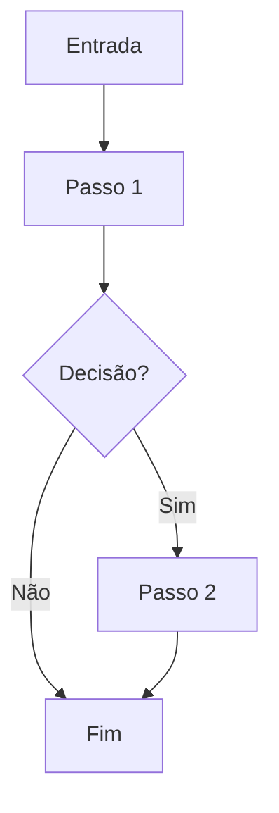

# [Título do fluxo]

| Campo | Valor |
|---|---|
| **id** | `modulo.slug.nome` |
| **módulo** | CRM \| Financeiro \| Vendas \| Config |
| **personas** | recepcionista, owner, instrutor |
| **rotas** | `/rota-principal`, `/rota?tab=` |
| **pré-requisitos** | módulos ativos, integrações, papel mínimo |
| **status** | rascunho \| revisado \| gravado-em-video |
| **última revisão** | YYYY-MM-DD |

**Specs relacionadas:** (links para `docs/superpowers/specs/`)

**Harness relacionado:** (links para `docs/harness/` ou `HARNESS.md`)

**Arquivos-chave:** `src/pages/...`, `src/components/...`

---

## Resumo

[Um parágrafo: o que o usuário alcança ao concluir este fluxo.]

---

## Diagrama de fluxo

---

## Mapa de telas

| # | Rota | Componente | Ação do usuário | Resultado esperado |
|---|---|---|---|---|
| 1 | `/` | `Page.jsx` | Clicar em … | … |

---

## A — Auditoria operacional

### Pré-condições de dados

- [ ] Academia selecionada no contexto correto (multi-tenant)
- [ ] …

### Checklist passo a passo

1. [ ] …
2. [ ] …

### Estados de erro conhecidos

| Situação | Feedback esperado | Referência |
|---|---|---|
| Falha de rede | `ErrorBanner` + retry | [docs/ux-feedback.md](../ux-feedback.md) |

### Permissões e multi-tenant

- Dados isolados por `academyId`; ver [docs/multi-tenant-conventions.md](../multi-tenant-conventions.md).

### Critérios de fluxo saudável vs regressão

**Saudável:** …

**Regressão:** …

---

## B — Roteiro de demonstração em vídeo

**Duração alvo:** X min

### Dados de demonstração sugeridos

| Entidade | Valor fictício |
|---|---|
| Lead | Maria Silva, (11) 99999-0001 |

### Cenas

| Cena | Tela | Narração sugerida | Gancho de valor |
|---|---|---|---|
| 1 | Hoje | "Todo dia começa aqui…" | Visão do dia em um lugar |

### O que não mostrar

- Dados reais de clientes
- Tokens, IDs internos, console do navegador
- Atalhos de desenvolvedor

---

## Variações e atalhos

- **Desktop vs mobile:** …
- **NL command bar:** …
- **Modais globais:** …

---

## Histórico de revisão

| Data | Autor | Mudança |
|---|---|---|
| YYYY-MM-DD | — | Criação inicial |
