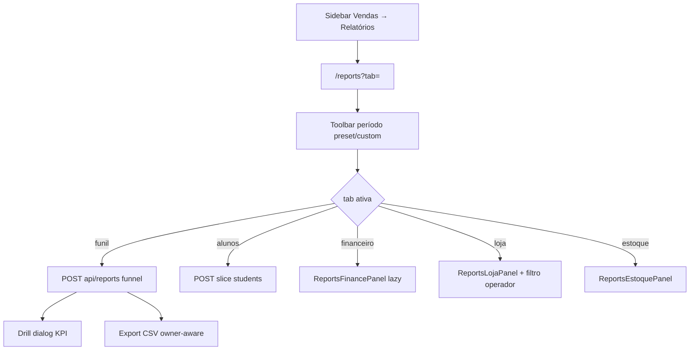

# Relatórios — indicadores por período

| Campo | Valor |
|---|---|
| **id** | `analise.relatorios.indicadores` |
| **módulo** | Análise |
| **personas** | owner, admin |
| **rotas** | `/reports`, `/reports?tab=funil\|alunos\|financeiro\|loja\|estoque` |
| **pré-requisitos** | Academia com dados no período; abas financeiro/loja/estoque exigem módulos ativos |
| **status** | revisado (código) |
| **última revisão** | 2026-06-15 |
| **validação** | [VALIDATION.md](../VALIDATION.md) |

**Specs relacionadas:** —

**Harness relacionado:** `npm test -- reports.test reportsExport reportsFinanceParity reportsPeople`

**Arquivos-chave:** `src/pages/Reports.jsx`, `src/lib/reportsPageConfig.js`, `src/components/reports/ReportsTabPanels.jsx`, `api/reports.js`, `lib/server/reportsLightHandler.js`

---

## Resumo

**Relatórios** consolida indicadores da academia por **período** (presets e intervalo customizado): funil de contatos, métricas de alunos, e painéis de financeiro, vendas e estoque quando os módulos estão ligados. O usuário filtra, atualiza snapshot, exporta CSV (funil) e abre **drill-down** em listas de leads.

---

## Diagrama de fluxo

---

## Mapa de telas

| # | Rota | Componente | Ação do usuário | Resultado esperado |
|---|---|---|---|---|
| 1 | `/reports` | `Reports` | Abrir Relatórios | Default `tab=funil` (primeira aba permitida) |
| 2 | Hub | `HubTabBar` | Trocar aba | Query `?tab=` atualizada |
| 3 | Toolbar | `ReportsPeriodToolbar` | Preset 7d/30d/mês/custom | `from`/`to` validados |
| 4 | Funil | `ReportsFunilPanel` | Ver KPIs e funil | `useFunnelReport` |
| 5 | Funil | Clique em KPI | `ReportsDrillDialog` | Lista de leads do bucket |
| 6 | Funil | Exportar | Menu export | CSV; contato só para owner |
| 7 | Funil | Filtro perfil | `profileFilter` | Recarrega relatório |
| 8 | Alunos | `ReportsStudentsPanel` | Métricas matrícula/churn/ticket médio | `useStudentMetricsReport` |
| 9 | Financeiro | `ReportsFinancePanel` | KPIs caixa | Requer `modules.finance` |
| 10 | Loja | `ReportsLojaPanel` | Vendas no período | Requer `modules.sales`; filtro operador |
| 11 | Estoque | `ReportsEstoquePanel` | Movimentações/resumo | Requer `modules.inventory` |
| 12 | Header | Atualizar | Refresh manual | `fetchReport(true)` / cache indicator |
| 13 | Erro | `ErrorBanner` | Tentar novamente | Retry fetch |

### Abas e visibilidade por módulo

| Tab | Sempre | Condição extra |
|---|---|---|
| `funil` | Sim | — |
| `alunos` | Sim | — |
| `financeiro` | Não | `modules.finance === true` |
| `loja` | Não | `modules.sales === true` |
| `estoque` | Não | `modules.inventory === true` |

### Aliases legados de `?tab=`

| Query antiga | Canônico |
|---|---|
| `vendas` | `loja` |
| `movimentacoes` | `estoque` |
| `visao-geral`, `operador` | redirect ao default |

---

## A — Auditoria operacional

### Pré-condições de dados

- [ ] Academia selecionada (`academyId`)
- [ ] Funil: leads reais no Appwrite (não importação planilha para métricas de comparecimento)
- [ ] Período `from`/`to` válido (sem `dateError`)
- [ ] API `POST /api/reports` com `academyId` do token (body não pode divergir — 403)

### Checklist passo a passo — funil

1. [ ] Sidebar → **Relatórios** abre `/reports?tab=funil`
2. [ ] Toolbar mostra período legível no header
3. [ ] Sem leads: empty state «sem contatos»
4. [ ] Com leads sem atividade no período: empty «sem atividade»
5. [ ] KPIs batem com regras (`attended_at`, `missed_at`, `converted_at` no range)
6. [ ] Gráfico semanal/mensal alterna `chartMode`
7. [ ] Drill abre lista coerente com o KPI
8. [ ] Export desabilitado sem atividade; CSV com máscara CPF para não-owner
9. [ ] Botão atualizar mostra `(cache)` quando `fromSnapshot`

### Checklist passo a passo — outras abas

1. [ ] `?tab=alunos` carrega métricas de alunos sem misturar com funil
2. [ ] Aba financeiro ausente se módulo desligado
3. [ ] `?tab=loja` carrega equipe para filtro operador (`fetchTeamMemberships`)
4. [ ] `?tab=estoque` só com inventory
5. [ ] Tab inválida → redirect para default permitido

### Estados de erro conhecidos

| Situação | Feedback esperado | Referência |
|---|---|---|
| Timeout relatório | `ErrorBanner` + retry | `REPORT_TIMEOUT_MS` em `api/reports.js` |
| Datas inválidas | Erro no toolbar | `dateError` em `useReportsPeriod` |
| academyId divergente | 403 API | Handler reports |
| Export sem dados | CSV vazio com mensagem | `useReportsLeadExport` |

### Critérios de fluxo saudável vs regressão

**Saudável:** abas respeitam módulos; período único compartilhado nas abas com toolbar; multi-tenant estrito na API.

**Regressão:** alias `vendas` quebra; financeiro visível sem módulo; drill vazio com KPI > 0; export vaza telefone para member.

---

## B — Roteiro de demonstração em vídeo

**Duração alvo:** 4 min

### Dados de demonstração sugeridos

| Entidade | Valor fictício |
|---|---|
| Período | Últimos 30 dias |
| KPI destaque | 12 novos contatos, 5 convertidos |
| Meta KPI | Configurada em metas (RAG verde/amarelo) |

### Cenas

| Cena | Tela | Narração sugerida | Gancho de valor |
|---|---|---|---|
| 1 | Funil | "Em um lugar você vê o funil comercial do período." | Visão gestor |
| 2 | Período | "Comparo esta semana com o mês inteiro em dois cliques." | Agilidade |
| 3 | Drill | "Cada número abre a lista — quem compareceu, quem faltou." | Accountability |
| 4 | Alunos | "Além do funil, acompanho matrículas e retenção." | Saúde da base |
| 5 | Loja/Financeiro | "Se vende kimono ou cobra mensalidade, o relatório segue o mesmo período." | Operação unificada |

### O que não mostrar

- IDs internos de leads na narração
- Export CSV com dados reais de clientes em gravação pública
- Erros de timeout em produção

---

## Variações e atalhos

- **Menu:** item Relatórios no accordion Loja → `/reports?tab=funil`
- **Mobile:** mesmo hub via menu «Mais»
- **Metas KPI:** `useReportsKpiGoals` — owner configura metas por academia
- **Light API:** `GET /api/reports?route=light` para widgets externos
- **NL:** sem comando dedicado; usar navegação manual

---

## Histórico de revisão

| Data | Autor | Mudança |
|---|---|---|
| 2026-06-15 | — | Criação inicial |
