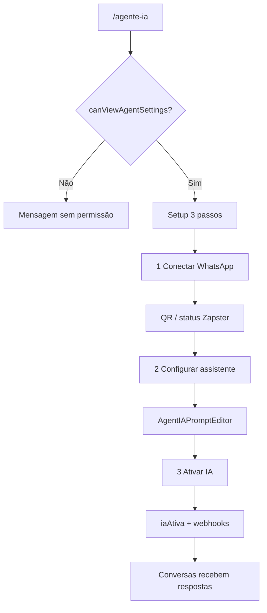

# Agente IA e WhatsApp

| Campo | Valor |
|---|---|
| **id** | `atendimento.agente.ia-whatsapp` |
| **módulo** | Atendimento |
| **personas** | owner, recepcionista (member com permissão de equipe); **admin sem acesso à página** |
| **rotas** | `/agente-ia` |
| **pré-requisitos** | Integração Zapster; papel com `canViewAgentSettings` |
| **status** | revisado (código) |
| **última revisão** | 2026-06-15 |
| **validação** | [VALIDATION.md](../VALIDATION.md) |

**Specs relacionadas:** — (Zapster + prompts em `AgenteIASection`)

**Harness relacionado:** `npm test -- zapsterInstancePhone automationUx` (adjacente)

**Arquivos-chave:** `src/pages/AIAgentSettings.jsx`, `src/components/academy/AgenteIASection.jsx`, `src/hooks/useZapsterWhatsAppConnection.js`, `src/lib/canEditAgentPrompt.js`

---

## Resumo

O **owner** ou **member** autorizado configura o assistente de IA em três passos: **conectar WhatsApp** (QR Zapster), **definir prompt/instruções** e **ativar** o atendimento automático. A página também oferece chat de teste e opções avançadas (FAQ, ações V1).

---

## Diagrama de fluxo

---

## Mapa de telas

| # | Rota | Componente | Ação do usuário | Resultado esperado |
|---|---|---|---|---|
| 1 | `/agente-ia` | `AIAgentSettings` → `AgenteIASection` | Abrir **Agente de Atendimento** | Header + painel setup |
| 2 | Passo 1 | Cartão WhatsApp | Escanear QR / reconectar | `card1Connected` |
| 3 | Passo 1 | Status | Ver desconectado/conectando/online | `formatWaAgentStatus` |
| 4 | Passo 2 | Editor de prompt | Instruções + regras | `isPromptConfigured` |
| 5 | Passo 2 | Salvar prompt | Persistir academia | Só se `canEditAgentPrompt` |
| 6 | Passo 2 | Chat de teste | `AgentIATestChat` | Simular resposta |
| 7 | Passo 3 | Ativar assistente | Toggle IA ativa | Webhooks Zapster registrados |
| 8 | Avançado | FAQ / ações | `AgentIAAdvancedOptions` | `V1_AI_ACTIONS` |
| 9 | Link | Voltar conversas | `/conversas` | Inbox operacional |
| 10 | Menu | Agente no accordion Automações | Só se `canConfigureAgenteIa` | `naviMenu.js` |

---

## A — Auditoria operacional

### Pré-condições de dados

- [ ] Academia com instância WhatsApp provisionada (Zapster)
- [ ] Usuário **owner** ou **member** (`canViewAgentSettings`)

### Permissões por papel

| Papel | Ver `/agente-ia` | Editar prompt | Conectar WA |
|---|---|---|---|
| **owner** | Sim | Sim | Sim |
| **admin** | **Não** (`role === 'admin'`) | — | — |
| **member** | Sim | Se admin no time Appwrite | Conforme equipe |

`canEditAgentPrompt`: titular ou membership com role `admin`/`owner` no time.

Onboarding: member sem `canConfigureAgenteIa` recebe toast ao clicar passos IA/WhatsApp.

### Checklist passo a passo

1. [ ] Owner: `/agente-ia` carrega wizard 3 passos
2. [ ] Admin: mensagem «Você não tem permissão…»
3. [ ] Passo 1: QR exibido quando desconectado
4. [ ] Após conectar: passo 1 marcado done
5. [ ] Passo 2: salvar prompt → `configDone`
6. [ ] Passo 3: ativar → subtitle «Assistente ativo no WhatsApp»
7. [ ] Desconectar / pausar reflete status na UI
8. [ ] Chat de teste responde sem enviar ao cliente real (ambiente de teste)
9. [ ] Billing guard bloqueia se assinatura exigir (`fetchWithBillingGuard`)
10. [ ] Legacy `/automacoes?tab=agente` → redirect `/agente-ia`
11. [ ] Trocar academia → conexão e prompt da academia correta
12. [ ] Inbox ([conversas-inbox.md](../crm/conversas-inbox.md)) reflete mensagens após ativo

### Estados de erro conhecidos

| Situação | Feedback esperado | Referência |
|---|---|---|
| Sem permissão | Card centralizado | `AgenteIASection` L1123 |
| Erro Zapster | `StatusBanner` / toast | `useZapsterWhatsAppConnection` |
| Prompt inválido | Validação `validatePromptFields` | limites de caracteres |

### Critérios de fluxo saudável vs regressão

**Saudável:** Três passos lineares; reconexão automática; handoff humano no inbox preservado.

**Regressão:** Admin acessa agente; IA ativa sem WhatsApp; prompt de outra academia.

---

## B — Roteiro de demonstração em vídeo

**Duração alvo:** 5 min

### Dados de demonstração sugeridos

| Entidade | Valor fictício |
|---|---|
| Academia | Demo WhatsApp |
| Prompt | Tom amigável, horários, preço experimental |

### Cenas

| Cena | Tela | Narração sugerida | Gancho de valor |
|---|---|---|---|
| 1 | Agente IA | "Três passos: WhatsApp, cérebro, ligar." | Setup guiado |
| 2 | QR | "Escaneio com o celular da academia — pronto." | Onboarding rápido |
| 3 | Prompt | "Ensino como a IA fala — testo antes de ir ao ar." | Controle de marca |
| 4 | Ativar | "Ligado — leads no funil já recebem resposta." | 24/7 |
| 5 | Inbox | "Quando precisa de humano, cai aqui nas conversas." | Híbrido IA + equipe |

### O que não mostrar

- QR real de produção em gravação pública
- Chaves API Zapster

---

## Variações e atalhos

- **Onboarding:** `setup_ai` e `connect_whatsapp` → `/agente-ia`
- **Automações:** gatilhos WhatsApp exigem número conectado — ver [automacoes-funil.md](automacoes-funil.md)
- **Lembretes financeiros:** separados em `/empresa?tab=financeiro&section=lembretes-whatsapp`

---

## Histórico de revisão

| Data | Autor | Mudança |
|---|---|---|
| 2026-06-15 | — | Criação Fase 4 |
