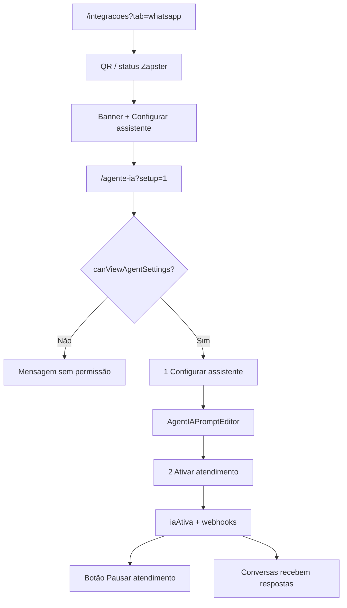

# Agente IA e WhatsApp

| Campo | Valor |
|---|---|
| **id** | `atendimento.agente.ia-whatsapp` |
| **módulo** | Atendimento |
| **personas** | owner, recepcionista (member com permissão de equipe); **admin sem acesso à página** |
| **rotas** | `/integracoes?tab=whatsapp` (conexão), `/agente-ia` (config + ativação), `/agente-ia?setup=1` (handoff) |
| **pré-requisitos** | Integração Zapster; papel com `canViewAgentSettings` |
| **status** | revisado (código) |
| **última revisão** | 2026-06-18 |
| **validação** | [VALIDATION.md](../VALIDATION.md) |

**Specs relacionadas:** [2026-06-17-agente-ia-config-ux-evolucao-PRODUCT.md](../../superpowers/specs/2026-06-17-agente-ia-config-ux-evolucao-PRODUCT.md) (UX painel config — P0) · [2026-06-18-whatsapp-integracoes-agente-handoff-PRODUCT.md](../../superpowers/specs/2026-06-18-whatsapp-integracoes-agente-handoff-PRODUCT.md) (Integrações ↔ Agente IA)

**Harness relacionado:** `npm test -- zapsterInstancePhone automationUx` (adjacente)

**Arquivos-chave:** `src/pages/AIAgentSettings.jsx`, `src/components/academy/AgenteIASection.jsx`, `src/hooks/useZapsterWhatsAppConnection.js`, `src/lib/canEditAgentPrompt.js`

---

## Resumo

O **owner** conecta o WhatsApp em **Integrações** (QR Zapster). Em **Agente IA**, owner ou member autorizado configura o assistente em **dois passos**: **definir prompt/instruções** e **ativar** o atendimento automático. Antes disso, pode ligar **Recursos de IA** (toggle em linha de configuração) para copilot e comandos sem ativar respostas no WhatsApp. Handoff pós-conexão: banner em Integrações + link **Configurar assistente** → `/agente-ia?setup=1` (prefixo «Voltar para Integrações»).

---

## Diagrama de fluxo

---

## Mapa de telas

| # | Rota | Componente | Ação do usuário | Resultado esperado |
|---|---|---|---|---|
| 1 | `/integracoes?tab=whatsapp` | `IntegracoesWhatsAppSection` → `WhatsAppConnectionPanel` | Escanear QR / reconectar | Instância Zapster pareada |
| 2 | Integrações | `WhatsAppSetupStepper` (3 passos) | Ver progresso global | Passo 1 na aba atual; 2–3 linkam Agente IA |
| 3 | Integrações | Handoff pós-conexão | **Configurar assistente** | `/agente-ia?setup=1&from=integracoes` |
| 4 | `/agente-ia` | `AgenteIASection` | Abrir **Agente de Atendimento** | Header + setup 2 passos (após WA) |
| 5 | Agente IA | Status WA resumido | Link **Gerenciar em Integrações** | `/integracoes?tab=whatsapp` |
| 6 | Passo config | Editor de prompt | Instruções + regras | `isPromptConfigured` |
| 7 | Passo ativar | **Ativar atendimento automático** | Botão → `ConfirmDialog` → `handleToggleIa(true)` |
| 8 | PageHeader | Prefix contextual | «Voltar para Integrações» ou conversas | `from=integracoes` / `state.fromIntegracoes` |
| 9 | Sidebar (owner) | **Conectar WhatsApp** | Enquanto WA pendente | `INTEGRACOES_WHATSAPP_PATH` |
| 10 | Menu | **Agente IA** na seção Atendimento | Só se `canConfigureAgenteIa` | `naviMenu.js` → `buildAgenteIaNavItem` |

**UX (P0):** Não existe toggle de `iaAtiva` no header ao lado do título. Ativar e pausar usam apenas os botões do rodapé do card (spec UX 2026-06-17).

---

## A — Auditoria operacional

### Pré-condições de dados

- [ ] Academia com instância WhatsApp provisionada (Zapster)
- [ ] Usuário **owner** ou **member** (`canViewAgentSettings`)

### Permissões por papel

| Papel | Ver `/agente-ia` | Editar prompt | Conectar WA |
|---|---|---|---|
| **owner** | Sim | Sim | Sim |
| **admin** | **Não** (`role === 'admin'`) | — | — |
| **member** | Sim | Se admin no time Appwrite | Conforme equipe |

`canEditAgentPrompt`: titular ou membership com role `admin`/`owner` no time.

Onboarding: member sem `canConfigureAgenteIa` recebe toast ao clicar passos IA/WhatsApp.

### Checklist passo a passo

1. [ ] Owner: `/integracoes?tab=whatsapp` — QR, stepper 3 passos, banner handoff
2. [ ] Owner: sidebar **Conectar WhatsApp** enquanto instância pendente
3. [ ] Owner/member: `/agente-ia` — setup 2 passos após WA conectado
2. [ ] Admin: mensagem «Você não tem permissão…»
3. [ ] Passo 1: QR exibido quando desconectado
4. [ ] Após conectar: passo 1 marcado done
5. [ ] **Recursos de IA:** toggle em setting-row; desligado bloqueia botão ativar (sem hint duplicado no CTA)
6. [ ] Passo 2: salvar prompt → `configDone`; badge **● Pronto para ativar**
7. [ ] Passo 3: botão **Ativar atendimento automático** (sem toggle no header)
8. [ ] Botão ativar disabled se WhatsApp desconectado ou Recursos de IA off
9. [ ] Com agente ativo: botão **Pausar**; badge **● Ativo** ou **● Ativo — WhatsApp desconectado**
10. [ ] Chat de teste responde sem enviar ao cliente real (ambiente de teste)
11. [ ] Billing guard bloqueia se assinatura exigir (`fetchWithBillingGuard`)
12. [ ] Legacy `/automacoes?tab=agente` → redirect `/agente-ia`
13. [ ] Trocar academia → conexão e prompt da academia correta
14. [ ] Inbox ([conversas-inbox.md](../crm/conversas-inbox.md)) reflete mensagens após ativo
15. [ ] CTA ativar/pausar oculto enquanto wizard, editor ou chat de teste abertos
16. [ ] Ativar abre confirmação com número WA e uso do ciclo (se aplicável)
17. [ ] Pausar abre confirmação antes de desligar
18. [ ] PageHeader exibe chip **Assistente ativo** ou **Pausado** com prompt configurado
19. [ ] Desligar Recursos de IA com agente ativo → pausa + toast informativo

### Estados de erro conhecidos

| Situação | Feedback esperado | Referência |
|---|---|---|
| Sem permissão | Card centralizado | `AgenteIASection` L1123 |
| Erro Zapster | `StatusBanner` / toast | `useZapsterWhatsAppConnection` |
| Prompt inválido | Validação `validatePromptFields` | limites de caracteres |
| Recursos de IA off | Botão ativar disabled; banner readonly (sem hint duplicado no CTA) | `AgentServiceControl`, banner readonly |
| WA desconectado | Botão ativar disabled + hint conectar card 1 | `AgentServiceControl` |

### Critérios de fluxo saudável vs regressão

**Saudável:** Três passos lineares; um único controle para ativar/pausar atendimento; reconexão automática; handoff humano no inbox preservado.

**Regressão:** Admin acessa agente; toggle de `iaAtiva` no header; IA ativa sem WhatsApp; prompt de outra academia; dois controles para mesma ação (toggle + botão).

---

## B — Roteiro de demonstração em vídeo

**Duração alvo:** 5 min

### Dados de demonstração sugeridos

| Entidade | Valor fictício |
|---|---|
| Academia | Demo WhatsApp |
| Prompt | Tom amigável, horários, preço experimental |

### Cenas

| Cena | Tela | Narração sugerida | Gancho de valor |
|---|---|---|---|
| 1 | Agente IA | "Três passos: WhatsApp, cérebro, ligar." | Setup guiado |
| 2 | QR | "Escaneio com o celular da academia — pronto." | Onboarding rápido |
| 3 | Prompt | "Ensino como a IA fala — testo antes de ir ao ar." | Controle de marca |
| 4 | Ativar | "Clico em Ativar atendimento automático — a IA passa a responder no WhatsApp." | 24/7 |
| 5 | Inbox | "Quando precisa de humano, cai aqui nas conversas." | Híbrido IA + equipe |

### O que não mostrar

- QR real de produção em gravação pública
- Chaves API Zapster

---

## Variações e atalhos

- **Onboarding:** `connect_whatsapp` → `/integracoes?tab=whatsapp`; `setup_ai` → `/agente-ia?setup=1` (bloqueado até WA conectado)
- **Automações:** gatilhos WhatsApp exigem número conectado — ver [automacoes-funil.md](automacoes-funil.md)
- **Lembretes financeiros:** separados em `/empresa?tab=financeiro&section=lembretes-whatsapp`

---

## Histórico de revisão

| Data | Autor | Mudança |
|---|---|---|
| 2026-06-18 | — | WA em Integrações; handoff; sidebar Conectar WhatsApp; onboarding guard |
| 2026-06-17 | — | P2: ConfirmDialog ativar/pausar, chip no PageHeader, toast IA off |
| 2026-06-17 | — | P1 UX: badges canônicos, banners consolidados, SettingRow shared, testes |
| 2026-06-17 | — | P0 UX config: botão ativar/pausar (sem toggle header); setting-row Recursos de IA; mapa e checklist |
| 2026-06-15 | — | Criação Fase 4 |
