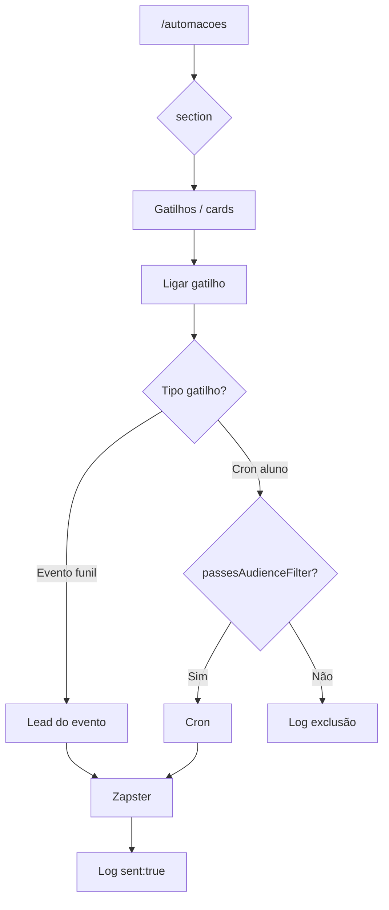

# Automações do funil

| Campo | Valor |
|---|---|
| **id** | `atendimento.automacoes.funil` |
| **módulo** | Atendimento |
| **personas** | owner, admin (editar gatilhos/templates/audiência); member (visualizar) |
| **rotas** | `/automacoes?section=resumo\|captacao\|pos-matricula\|rotinas` (canônico v3); aliases `?tab=modelos\|gatilhos` → redirect |
| **pré-requisitos** | WhatsApp conectado; modelos revisados; **auditoria de campos** (ver abaixo) antes de expor filtros |
| **status** | revisado (spec v3 — alinhado ao código) |
| **última revisão** | 2026-06-17 |
| **validação** | [VALIDATION.md](../VALIDATION.md) |

**Specs relacionadas:**

- [2026-06-17-comunicacao-automatica-evolucao-PRODUCT.md](../../superpowers/specs/2026-06-17-comunicacao-automatica-evolucao-PRODUCT.md) — roadmap mestre
- [2026-06-17-automacoes-hub-unificado-PRODUCT.md](../../superpowers/specs/2026-06-17-automacoes-hub-unificado-PRODUCT.md) — hub unificado (Ondas 1–2)
- [2026-06-16-automacoes-ux-onboarding-PRODUCT.md](../../superpowers/specs/2026-06-16-automacoes-ux-onboarding-PRODUCT.md)
- [2026-06-17-automacoes-ux-clareza-PRODUCT.md](../../superpowers/specs/2026-06-17-automacoes-ux-clareza-PRODUCT.md)
- [2026-06-17-automacoes-ia-restructure-PRODUCT.md](../../superpowers/specs/2026-06-17-automacoes-ia-restructure-PRODUCT.md)

**Harness:** `npm test -- automacoesHub automacoesSettingsSections automacoesSetupWizard automationUx attendanceRetentionCore`

**Arquivos-chave:** `src/pages/Automacoes.jsx`, `AutomacoesConfigTab.jsx`, `AutomacoesSection.jsx`, `lib/automationCore.js`, `lib/attendanceRetentionCore.js`, `api/leads.js`, `lib/server/runAttendanceRetentionCron.js`

---

## Resumo

Em **Mensagens automáticas** (`/automacoes`), a equipe personaliza textos WhatsApp e liga/desliga gatilhos (confirmação de aula, falta, matrícula, aniversário, retenção por frequência, etc.).

**Novidade v3:** gatilhos que atingem **alunos em massa** (cron) possuem **filtro de audiência** configurável. Sem filtro → todos os elegíveis (retrocompatível). A v3 define: campo nulo = incluído; writes separados de `active` vs `audience`; log estruturado; preview de audiência antes de salvar.

Gatilhos de **evento no funil** (confirmação, falta no lead X) disparam para o lead do evento — **sem** filtro de audiência na UI (N/A).

Wizard: modelos → WhatsApp → gatilhos. Processos da equipe: `/tarefas?tab=processos`.

---

## Pré-requisito obrigatório: auditoria de campos

**Antes de expor filtros na UI**, executar auditoria na coleção de alunos (`students` / leads matriculados) e documentar em `docs/flows/VALIDATION.md`:

| Campo canônico (código) | Atributo Appwrite | Uso no filtro |
|---|---|---|
| Tipo / categoria | `type` | Adulto · Criança · Juniores |
| Plano | `plan` (nome, não ID) | Multi-select vs `financeConfig.plans[].name` |
| Turma | `turma` (nome, não ID) | Multi-select vs `academy.settings.turmas[]` |
| Ingresso | `enrollmentDate` | Tenure novato/veterano (&lt;60 / ≥60 dias) |

> **Nota de código:** não existem `category`, `plan_id`, `class_id` nem `enrolled_at` no schema atual de alunos. Turmas não são coleção `CLASSES_COL` — ficam em `academies.settings` JSON.

**Regra UI:** expor filtro só se taxa de preenchimento ≥ 80% na academia (amostra ou query). Abaixo disso: ocultar com comentário no código até backfill.

**Baseline esperada (schema CRM):** `type`, `plan`, `turma`, `enrollmentDate` existem em `scripts/verify-and-fix-schema-crm.mjs`; taxa real é por academia.

---

## Modelo de audiência

### Onde se aplica

| Classe de gatilho | Audiência configurável |
|---|---|
| Evento funil (`schedule_confirm`, `missed`, …) | **Não** — lead do evento |
| Cron aluno (`birthday`, `absent_student`, `newcomer_at_risk`) | **Sim** |
| Financeiro WhatsApp (Onda 2 hub) | **Sim** (+ `billingMode` plano) |

### Conceito

Filtros opcionais, cumulativos (**AND**). Vazio = todos os elegíveis do gatilho.

### Atributos de filtro (v3 — nomes alinhados ao código)

| Filtro UI | Valores | Campo aluno | Exibir se |
|---|---|---|---|
| **Tipo** | Adulto · Criança · Juniores | `type` | ≥ 80% preenchido |
| **Plano** | Planos de `financeConfig.plans` | `plan` (match por **nome**) | ≥ 80% |
| **Turma** | Turmas de `academy.settings.turmas` | `turma` (match por **nome**) | ≥ 80% |
| **Tempo de casa** | Novato &lt; 60d · Veterano ≥ 60d | `enrollmentDateYmd()` | campo ingresso existe |

### Campo nulo = incluído

Dado ausente no aluno **nunca exclui** — evita silêncio por cadastro incompleto. Log com `field_null_included` quando aplicável.

### Persistência em `automations_config`

Estender chaves existentes em `parseAutomationsConfig` — **não** substituir por árvore `triggers.*`:

```js
// academies.automations_config (JSON string)
{
  "birthday": {
    "active": true,
    "templateKey": "birthday",
    "delayMinutes": 0,
    "audience": {
      "types": [],
      "planNames": [],
      "turmas": [],
      "tenure": null
    }
  },
  "absent_student": {
    "active": true,
    "templateKey": "recovery",
    "thresholdDays": 10,
    "audience": { "types": [], "planNames": [], "turmas": [], "tenure": null }
  },
  "newcomer_at_risk": {
    "active": true,
    "templateKey": "recovery",
    "thresholdDays": 7,
    "audience": { "types": [], "planNames": [], "turmas": [], "tenure": null }
  }
}
```

> `newcomer_at_risk`: cron já limita `enrolled_at` &lt; 60d — **não** fixar `tenure: 'novato'` na audiência (redundante).

### Writes separados (toggle vs audiência)

`automations_config` é **string JSON** no Appwrite — **sem** dot-notation. Padrão obrigatório:

1. `parseAutomationsConfig(raw)`
2. Merge só a chave alterada (`active` ou `audience`)
3. `serializeAutomationsConfig` + `updateDocument`

Nunca sobrescrever o objeto inteiro sem ler o estado atual.

### Função de avaliação

`passesAudienceFilter(student, audience, { triggerKey, academyId })` em `lib/automationAudience.js` (novo), usada por crons antes do envio.

### Log `automation_logs` (nova coleção)

```js
{
  academy_id, trigger, student_id,
  passed: false,
  reasons: ['plan_mismatch:Premium'],
  sent: false,
  evaluated_at
}
```

**Volume:** logar `passed: false` (exclusão) e `sent: true`; **não** logar `passed: true` sem envio.

Provisionar coleção + índices `academy_id`, `evaluated_at` antes do deploy.

### Anti-spam retenção

Usar campo existente `retention_automation_anchor` (não criar `absence_notified_at`). Zerar anchor em novo check-in. Par `(studentId, triggerKey)` um envio por ciclo de ausência — já implementado em `runAttendanceRetentionCron.js`.

---

## Gatilhos — inventário

### Funil (evento)

| Chave | Quando dispara | Audiência |
|---|---|---|
| `schedule_confirm` | Confirma agendamento experimental | N/A |
| `presence_confirmed` | Presença na aula | N/A |
| `missed` | Falta na aula | N/A |
| `waiting_decision` | Etapa Aguardando decisão | N/A |
| `followup_d1_attended` | Cron D+1 pós-experimental | N/A |
| `converted` | Matrícula realizada | N/A |
| `schedule_reminder` | Antes da aula | N/A |

### Rotinas (cron — audiência v3)

| Chave | Quando dispara | Threshold | Cron |
|---|---|---|---|
| `birthday` | Aniversário ~9h BRT | — | `api/leads.js` (cron aniversário) |
| `absent_student` | Sem check-in X dias | 5–30, default 10 | `runAttendanceRetentionCron` |
| `newcomer_at_risk` | Novato sem check-in 7d | fixo 7 | `runAttendanceRetentionCron` |

> Não criar nova Vercel Function. Retenção já roda em cron existente; medir timeout antes de ampliar loops.

---

## Diagrama de fluxo



---

## Mapa de telas (v3)

| # | Rota | Ação | Resultado |
|---|---|---|---|
| 1 | `/automacoes?section=gatilhos` | Abrir hub | Cards com modo + audiência (cron) |
| 2 | Card cron | Expandir «Para quem» | Multi-select tipo, plano, turma, tenure |
| 3 | Card | Alterar filtro | Preview «X alunos» (query ativos) |
| 4 | Card | Audiência 0 | Aviso antes de salvar; permitir «Salvar mesmo assim» |
| 5 | Card | Salvar audiência | Merge JSON só `audience` |
| 6 | Card | Toggle | Merge JSON só `active` |
| 7 | Legado `?tab=gatilhos` | Redirect | `?section=captacao` ou slug equivalente |

---

## Permissões

| Papel | Ver | Editar gatilhos/modelos/audiência |
|---|---|---|
| owner | Sim | Sim |
| admin | Sim | Sim |
| member | Sim | Não (audiência read-only) |

---

## A — Auditoria operacional

### Checklist

**Dados**
- [ ] Auditoria de campos documentada (`type`, `plan`, `turma`, `enrollmentDate`)
- [ ] Filtros &lt; 80% ocultos na UI

**Persistência**
- [ ] Toggle não apaga `audience`; audiência não apaga `active`
- [ ] Docs sem `audience` → todos os elegíveis

**Lógica**
- [ ] Campo nulo → incluído
- [ ] `passesAudienceFilter` antes de todo cron com audiência
- [ ] `retention_automation_anchor` anti-duplicata retenção

**Log**
- [ ] Exclusão e envio logados; `passed:true` sem envio não logado

**UX**
- [x] Preview estimado ao mudar filtro (atualiza em tempo real, sem depender de blur)
- [x] Label dinâmica com **nomes** (plano/turma removido → «(removido)»)
- [x] Member read-only
- [x] Banner «audiência não salva» + toggle bloqueado até salvar/descartar
- [x] Badge colapsado só com contagem («N alunos»), sem duplicar label
- [x] Confirmar ao fechar painel com alterações não salvas
- [x] IDs de checkbox únicos por gatilho (`triggerKey` prefix)

**Retrocompat**
- [ ] Nenhum aluno que recebia antes deixa de receber após deploy sem filtros

### Saudável vs regressão

**Saudável:** filtro vazio = todos; nulo = incluído; writes independentes; preview antes de salvar.

**Regressão:** excluir por nulo; toggle apaga audiência; label com ID cru; cron timeout; envio fora da audiência.

---

## B — Demo (inalterado em espírito)

Modelos → ativar um gatilho com audiência estreita → mostrar preview «N alunos» → evento no funil dispara só para o lead.

---

## Histórico

| Data | Versão | Mudança |
|---|---|---|
| 2026-06-16 | v1 | Onboarding P0/P1 |
| 2026-06-17 | v2 | IA restructure P4; grupos modelos/gatilhos |
| 2026-06-17 | **v3** | Audiência por gatilho cron; log; preview; writes separados; alinhamento campos reais (`type`, `plan`, `turma`, `enrollmentDate`); chaves `absent_student` / `newcomer_at_risk` / `missed` |
