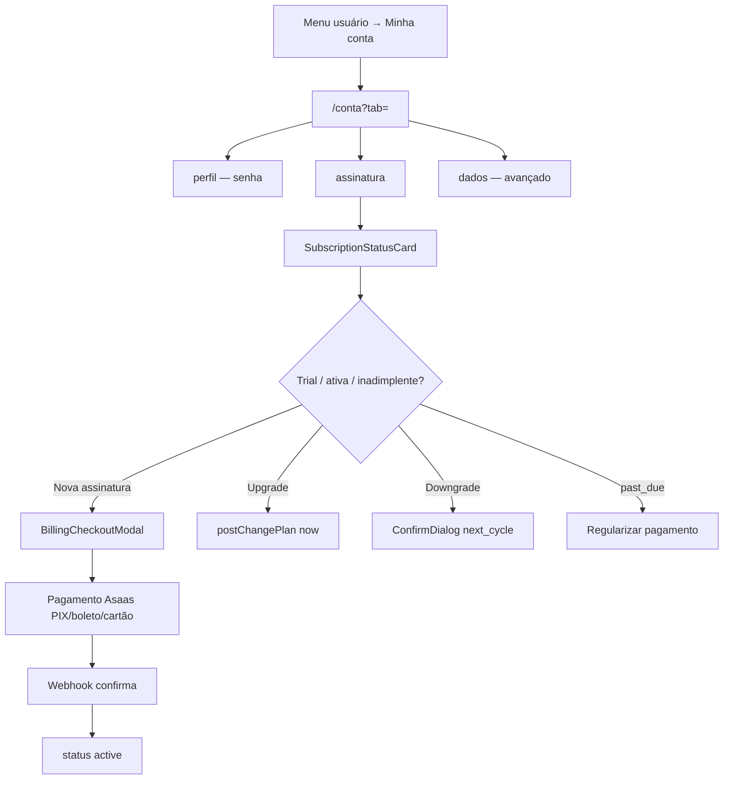

# Conta e assinatura do Nave

| Campo | Valor |
|---|---|
| **id** | `config.conta.assinatura` |
| **módulo** | Conta |
| **personas** | titular da academia (owner) para cobrança; qualquer usuário logado para perfil |
| **rotas** | `/conta`, `/conta?tab=perfil`, `/conta?tab=assinatura`, `/conta?tab=dados` |
| **pré-requisitos** | Login; `VITE_BILLING_ENABLED=true` para cobrança real (Asaas); CPF/CNPJ na academia para assinar |
| **status** | revisado (código) |
| **última revisão** | 2026-06-15 |
| **validação** | [VALIDATION.md](../VALIDATION.md) |

**Specs relacionadas:** — (integração Asaas em `api/billing.js`, `lib/billing/`)

**Harness relacionado:** `npm test -- billingGateClient trialCopy` + `lib/billing/planOrder.test.js`

**Arquivos-chave:** `src/pages/UserAccount.jsx`, `src/lib/accountSettingsSections.js`, `src/components/account/PlansTabContent.jsx`, `src/lib/billingApi.js`, `src/lib/planConfig.js`, `api/billing.js`

---

## Resumo

Em **Minha conta**, o usuário gerencia **perfil** (senha), **assinatura comercial do Nave** (Starter / Studio / Pro via Asaas) e opções **avançadas** da conta. A assinatura é **por academia** (`storeId = academyId`) e só o **titular** pode consultar status, pagar, mudar ou cancelar plano na API.

Não confundir com **planos de mensalidade de alunos** (`financeConfig.plans` em Minha academia → Financeiro).

---

## Diagrama de fluxo

---

## Mapa de telas

| # | Rota | Componente | Ação do usuário | Resultado esperado |
|---|---|---|---|---|
| 1 | `/conta` | `UserAccount` | Abrir **Minha conta** | Sidebar `AcademyTabSettingsLayout`; default `tab=perfil` |
| 2 | `?tab=perfil` | Card perfil | Ver nome/e-mail | Avatar iniciais |
| 3 | Perfil | **Alterar senha** | `ModalShell` + `authService.updatePassword` | Toast sucesso; `FieldError` se senha atual errada |
| 4 | `?tab=assinatura` | `PlansTabContent` | Ver planos e status | Cards Starter / Studio / Pro |
| 5 | Assinatura | `SubscriptionStatusCard` | Ler trial, uso IA, próxima cobrança | `fetchBillingStatus` |
| 6 | Assinatura | Assinar plano | `BillingCheckoutModal` 3 passos | `postCheckout` → URL pagamento |
| 7 | Checkout | PIX / Boleto / Cartão | Dados fiscais + endereço | Janela Asaas; ativação pós-confirmação |
| 8 | Assinatura | Upgrade | Botão «Fazer upgrade» | `postChangePlan(..., 'now')` |
| 9 | Assinatura | Downgrade | Confirmar | `postChangePlan(..., 'next_cycle')` |
| 10 | Assinatura | `InvoiceHistoryTable` | Histórico faturas | `fetchBillingPayments` |
| 11 | Assinatura | Cancelar | `SubscriptionActionsPanel` | `postCancelSubscription` fim do período ou imediato |
| 12 | Assinatura | Inadimplente | **Regularizar pagamento** | `fetchPaymentMethodLink` nova aba |
| 13 | `?tab=dados` | Avançado | Reexibir checklist onboarding | `reopenOnboardingBanner` |
| 14 | Dados | `AvancadoSection` | Preferências/export | Dados da academia selecionada |
| 15 | Topbar | Chip **Trial: N dias** | Clique | Navega `?tab=assinatura` |

### Abas da conta (sidebar)

| Tab | Conteúdo |
|---|---|
| `perfil` | Identidade + alteração de senha |
| `assinatura` | Planos Nave, checkout, faturas, cancelamento |
| `dados` | Checklist + seção avançada (exportar / limpar dados) |

---

## A — Auditoria operacional

### Pré-condições de dados

- [ ] Usuário autenticado
- [ ] Para assinatura: usuário é **owner** da academia (`assertAcademyOwnedByOwner`)
- [ ] `companyTaxOk` ou CPF/CNPJ em `/empresa` (alerta em `SubscriptionStatusCard`)
- [ ] Billing live: `VITE_BILLING_ENABLED=true` no build

### Permissões por papel

| Papel | Ver `/conta` | Assinatura (API) | Alterar senha |
|---|---|---|---|
| **owner** | Sim | Sim (status, checkout, cancelar) | Sim (própria conta) |
| **admin** | Sim | **Não** (403 na API) | Sim |
| **member** | Sim | **Não** | Sim |

Mutations de CRM podem ser bloqueadas pelo gate quando `accessLevel` ≠ `full` (`billingGateClient`).

### Status de assinatura

| status | Significado UI |
|---|---|
| `trial` | Teste grátis; dias restantes |
| `active` | Plano pago ativo |
| `past_due` | Inadimplente — regularizar |
| `inactive` / `canceled` | Encerrada — escolher plano |
| `preview` | Billing desligado no ambiente |

### Checklist passo a passo — owner

1. [ ] Menu usuário → `/conta` abre com sidebar Perfil / Assinatura / Avançado
2. [ ] `?tab=seguranca` legacy → redirect `perfil`
3. [ ] Alterar senha: mínimo 8 caracteres; confirmação deve coincidir
4. [ ] `?tab=assinatura` carrega status e três planos (`PLAN_CONFIG`)
5. [ ] Sem billing live: banner «Prévia»; botões «Em breve»
6. [ ] Com billing live: assinar Starter → modal → checkout Asaas
7. [ ] Após pagamento confirmado: badge «Plano atual» no card
8. [ ] Upgrade Starter → Studio imediato (toast sucesso)
9. [ ] Downgrade → `ConfirmDialog` próximo ciclo
10. [ ] `past_due`: botão regularizar abre link Asaas
11. [ ] Cancelar assinatura: fim do período (default) ou imediato
12. [ ] Histórico de faturas lista pagamentos CONFIRMED/PENDING/OVERDUE
13. [ ] Trocar academia → status recarrega para `academyId` atual
14. [ ] Legacy `/planos` → `/conta?tab=assinatura`; `/profile` → `/conta`

### Checklist — não-owner

1. [ ] Member/admin: aba Assinatura visível na UI
2. [ ] `fetchBillingStatus` falha (403) — card de status vazio ou erro silencioso
3. [ ] Checkout retorna forbidden se tentar via API

### Estados de erro conhecidos

| Situação | Feedback esperado | Referência |
|---|---|---|
| `TAX_IN_USE` | CPF/CNPJ já em outra academia | `BillingCheckoutModal` |
| Senha atual incorreta | `FieldError` inline | `UserAccount.submitPassword` |
| `SUBSCRIPTION_PAST_DUE` | Bloqueio mutações lead | `billingGateClient` |
| Sessão expirada | Redirect login | `billingApi` code `AUTH` |

### Critérios de fluxo saudável vs regressão

**Saudável:** Owner assina e vê uso de conversas IA; upgrade/downgrade previsível; gate redireciona para assinatura.

**Regressão:** Admin consegue checkout; plano aluno confundido com plano Nave; trial sem chip no topbar.

---

## B — Roteiro de demonstração em vídeo

**Duração alvo:** 4–5 min

### Dados de demonstração sugeridos

| Entidade | Valor fictício |
|---|---|
| Academia | Demo Trial |
| Plano | Studio (mais popular) |
| Pagamento | PIX sandbox Asaas |

### Cenas

| Cena | Tela | Narração sugerida | Gancho de valor |
|---|---|---|---|
| 1 | Minha conta | "Aqui fica minha conta pessoal e a assinatura do Nave." | Separação clara |
| 2 | Assinatura | "Três planos — o limite é conversas da IA no WhatsApp." | Pricing transparente |
| 3 | Status | "No trial, vejo quantos dias restam e quantas conversas usei." | Controle de uso |
| 4 | Checkout | "PIX, boleto ou cartão — pago no Asaas e o plano ativa sozinho." | Sem fricção |
| 5 | Empresa | "Antes de assinar, cadastro CPF/CNPJ da academia." | Compliance |

### O que não mostrar

- Chaves Asaas ou webhooks
- Dados fiscais reais
- Confundir com mensalidades de alunos

---

## Variações e atalhos

- **Planos Nave:** `starter` R$ 297, `studio` R$ 597, `pro` R$ 997 — `planConfig.js`
- **Planos alunos:** `/empresa?tab=financeiro&section=planos` — outro domínio
- **Onboarding:** link «Ver planos» → `?tab=assinatura`; passo `company_tax` → `/empresa?focus=tax`
- **API:** tudo em `/api/billing` (único arquivo — limite Vercel Hobby)
- **Gate:** mutações bloqueadas com `accessLevel: limited|none` quando billing live

---

## Histórico de revisão

| Data | Autor | Mudança |
|---|---|---|
| 2026-06-15 | — | Criação |
