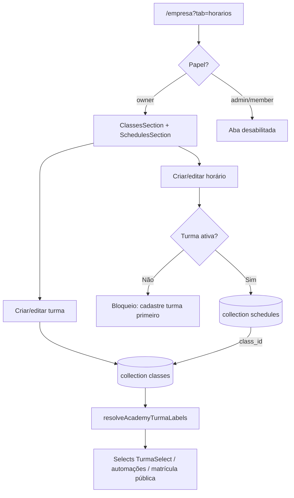

# Empresa — turmas e horários

| Campo | Valor |
|---|---|
| **id** | `config.empresa.horarios-turmas` |
| **módulo** | Configuração |
| **personas** | owner (editar turmas e horários); admin/member veem turmas em selects via hook, mas aba Horários é só owner |
| **rotas** | `/empresa?tab=horarios` |
| **pré-requisitos** | Schema `classes` e `schedules` provisionado (`npm run provision:booking-schema`); academia selecionada |
| **status** | revisado (código) |
| **última revisão** | 2026-06-19 |
| **validação** | [VALIDATION.md](../VALIDATION.md) |

**Specs relacionadas:** — (modelo em [data-model.md](../../data-model.md#46-turmas-horários-e-presença))

**Harness relacionado:**

```bash
npm test -- classes classesStore schedules schedulesStore academyTurmas
```

**Arquivos-chave:** `src/pages/AcademySettings.jsx`, `src/components/academy/ClassesSection.jsx`, `src/components/academy/SchedulesSection.jsx`, `src/components/academy/ClassesTurmasRedirectSection.jsx`, `src/store/classesStore.js`, `src/store/schedulesStore.js`, `src/lib/academyTurmas.js`, `src/hooks/useAcademyTurmas.js`, `src/components/recepcao/RecepcaoSchedulesGrid.jsx`

---

## Resumo

O titular cadastra **turmas** (catálogo: nome, modalidade, capacidade, ativo/inativo) e **horários** (slots na grade semanal: dias, início/fim, turma vinculada) em **Minha academia → Horários**. Os nomes das turmas alimentam selects em perfis de aluno/lead, matrícula pública, automações e recepção. O campo `students.turma` permanece string (nome), sem `class_id` nesta fase.

Academias que ainda tinham lista livre em `academies.settings.turmas[]` podem migrar para `classes` com `npm run migrate:academy-turmas-to-classes`.

---

## Diagrama de fluxo



---

## Mapa de telas

| # | Rota | Componente | Ação do usuário | Resultado esperado |
|---|---|---|---|---|
| 1 | `/empresa?tab=horarios` | `AcademySettings` | Abrir aba **Horários** (owner) | Turmas acima, grade de horários abaixo |
| 2 | Mesma | `ClassesSection` | Nova turma: nome, modalidade, capacidade, ativo | Doc em `classes`; toast sucesso |
| 3 | Mesma | `ClassesSection` | Toggle ativo/inativo (Power) | `is_active` atualizado; inativas somem de selects novos |
| 4 | Mesma | `ClassesSection` | Excluir turma com horários | Erro `class_has_schedules`; ConfirmDialog não confirma exclusão |
| 5 | Mesma | `SchedulesSection` | Novo horário (sem turmas ativas) | Botão desabilitado / empty state orientando criar turma |
| 6 | Mesma | `SchedulesSection` | Novo horário: turma, dias, HH:mm | Doc em `schedules` com `class_id` |
| 7 | `/empresa?tab=alunos` | `ClassesTurmasRedirectSection` | Ver lista read-only + link | Redireciona editor para aba Horários |
| 8 | `/` (Recepção) | `RecepcaoSchedulesGrid` | Ver grade do dia | Horários ativos com capacidade quando preenchida |
| 9 | `/students`, perfis | `TurmaSelect` via `useAcademyTurmas` | Escolher turma | Opções = nomes de `classes` ativas (fallback settings) |

---

## A — Auditoria operacional

### Pré-condições de dados

- [ ] `npm run provision:booking-schema` executado no projeto Appwrite
- [ ] `VITE_APPWRITE_CLASSES_COLLECTION_ID` e `VITE_APPWRITE_SCHEDULES_COLLECTION_ID` no `.env` (default `classes` / `schedules`)
- [ ] Usuário logado como **owner** para editar a aba Horários
- [ ] (Opcional) Migração legado: `DRY_RUN=1 npm run migrate:academy-turmas-to-classes` antes de rodar live

### Checklist passo a passo

1. [ ] `/empresa?tab=horarios` visível e habilitada só para owner
2. [ ] Criar turma «Adulto Noite» com modalidade `bjj` e capacidade 20
3. [ ] Listagem exibe capacidade («até 20 alunos» ou «Ilimitado»)
4. [ ] Criar horário vinculado à turma: seg/qua, 19:00–20:30
5. [ ] Listagem de horários mostra nome da turma e capacidade (horário ou herança)
6. [ ] Desativar turma: horário existente mantém select com sufixo «(inativa)» na edição; nova turma inativa não aparece em «Novo horário»
7. [ ] Tentar excluir turma com horário → mensagem em PT sobre horários vinculados
8. [ ] Empresa → Alunos: seção Turmas read-only aponta para `/empresa?tab=horarios`
9. [ ] Perfil aluno / lead: select Turma lista nomes das `classes` ativas
10. [ ] Matrícula pública: opções de turma vêm de `resolveAcademyTurmaLabels` (classes → settings → padrão)
11. [ ] Automações → audiência por turma: opções via `useAcademyTurmas`, match em `students.turma` por nome

### Estados de erro conhecidos

| Situação | Feedback esperado | Referência |
|---|---|---|
| Collection não configurada | Empty state / banner em `ClassesSection` | `isClassesConfigured()` |
| Excluir turma com horários | Toast/erro «Existem horários vinculados…» | `classesStore.deleteClass` |
| Aba Horários sem permissão | Tab disabled + tooltip titular | `AcademySettings.getTabDisabledState` |
| Falha de rede | `useToast` + retry | [docs/ux-feedback.md](../../ux-feedback.md) |

### Permissões e multi-tenant

- Queries filtram `academy_id` / `academyId` pelo tenant atual.
- Stores (`classesStore`, `schedulesStore`) validam academia antes de mutações.

### Critérios de fluxo saudável vs regressão

**Saudável:** turmas e horários isolados por academia; labels de turma consistentes entre Empresa, perfis e matrícula pública; exclusão de turma protegida.

**Regressão:** editor de lista livre `settings.turmas` voltando na UI; selects vazios com turmas ativas cadastradas; horário sem `class_id`; member conseguindo editar aba Horários.

---

## B — Roteiro de demonstração em vídeo

**Duração alvo:** 4 min

### Dados de demonstração sugeridos

| Entidade | Valor fictício |
|---|---|
| Turma | Adulto Noite — bjj — até 25 alunos |
| Horário | Seg/Qua 19:00–20:30, vinculado à turma |
| Turma kids | Kids 16h — kids — ilimitado |

### Cenas

| Cena | Tela | Narração sugerida | Gancho de valor |
|---|---|---|---|
| 1 | Empresa → Horários | «Aqui você define turmas e a grade da semana.» | Um lugar para catálogo + agenda |
| 2 | Nova turma | «Nome, modalidade e capacidade — isso alimenta cadastros e automações.» | Dados consistentes |
| 3 | Novo horário | «Cada slot aponta para uma turma — recepção vê a grade do dia.» | Operação do dia |
| 4 | Perfil aluno | «O select Turma já reflete o que você cadastrou.» | Sem lista duplicada |
| 5 | Alunos → Turmas | «A lista antiga virou atalho — edição centralizada em Horários.» | Menos confusão |

### O que não mostrar

- `legacy_turma_key`, IDs Appwrite, console
- Script de migração em produção sem `DRY_RUN`

---

## Notas de implementação

### Fonte canônica de labels

`resolveAcademyTurmaLabels({ settingsRaw, classes })` — ordem: `classes` ativas → `settings.turmas` → padrão sistema.

### Legado

- `AcademyTurmasSection.jsx` — **deprecated** (substituído por `ClassesTurmasRedirectSection` + `ClassesSection`)
- `students.turma` — string; futuro `class_id` fora do escopo desta entrega

### Comandos ops

```bash
npm run provision:booking-schema
DRY_RUN=1 npm run migrate:academy-turmas-to-classes
npm run migrate:academy-turmas-to-classes
```
