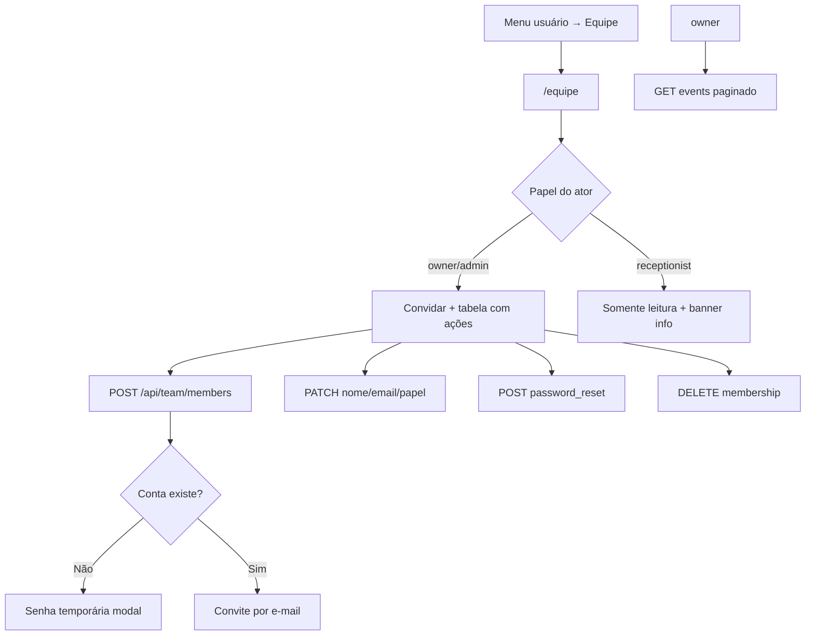

# Equipe — colaboradores e papéis

| Campo | Valor |
|---|---|
| **id** | `config.equipe.colaboradores` |
| **módulo** | Configuração |
| **personas** | owner (titular), admin |
| **rotas** | `/equipe` |
| **pré-requisitos** | Academia com `teamId` Appwrite (criado ao salvar dados da academia) |
| **status** | revisado (código) |
| **última revisão** | 2026-06-15 |
| **validação** | [VALIDATION.md](../VALIDATION.md) |

**Specs relacionadas:** —

**Harness relacionado:** `npm test -- teamPermissions teamMembershipLabel`

**Arquivos-chave:** `src/pages/Equipe.jsx`, `src/components/academy/EquipeSection.jsx`, `src/lib/teamPermissions.js`, `src/lib/teamApi.js`, `lib/server/teamMembers.js` (via `api/agent.js?route=team-members`)

---

## Resumo

Em **Equipe**, o titular e administradores convidam colaboradores (recepcionista ou administrador), editam dados, redefinem senha e removem acessos. O titular ainda vê **auditoria** de alterações. Recepcionistas acessam a página em modo leitura. Papéis mapeiam para times Appwrite (`owner` / `admin` / `member`).

---

## Diagrama de fluxo

---

## Mapa de telas

| # | Rota | Componente | Ação do usuário | Resultado esperado |
|---|---|---|---|---|
| 1 | `/equipe` | `Equipe` | Abrir pelo menu conta | Header + `EquipeSection` |
| 2 | Equipe | Sem `teamId` | — | Empty «Salve dados da academia primeiro» |
| 3 | Equipe | Convidar | Form nome, e-mail, papel | `createTeamMember` |
| 4 | Convite | Sucesso | — | Toast convite **ou** modal senha temporária |
| 5 | Tabela | Editar | `ModalShell` | `updateTeamMember` |
| 6 | Editar | E-mail (owner) | — | Pode exigir reconfirmação por e-mail |
| 7 | Tabela | Redefinir senha | `ConfirmDialog` | `resetTeamMemberPassword` |
| 8 | Tabela | Remover | `ConfirmDialog` | Remove do time Appwrite |
| 9 | Owner | Auditoria | Carregar mais | `fetchTeamAuditEvents` paginado |
| 10 | Recepcionista | Ver lista | — | `StatusBanner` sem ações de gestão |

### Papéis disponíveis no convite

| Papel UI | Quem pode atribuir | Appwrite roles |
|---|---|---|
| **Recepcionista** | Owner e admin | `member` |
| **Administrador** | Somente owner | `admin` |
| **Titular** | — (owner da academia) | `owner` / `ownerId` |

---

## A — Auditoria operacional

### Pré-condições de dados

- [ ] Academia selecionada com `teamId` válido
- [ ] Ator autenticado com membership no time ou `ownerId` da academia
- [ ] E-mail único no ecossistema Appwrite (409 se conflito)

### Matriz de permissões

| Ação | Owner | Admin | Recepcionista |
|---|---|---|---|
| Ver página | Sim | Sim | Sim (lista) |
| Convidar recepcionista | Sim | Sim | Não |
| Convidar admin | Sim | Não | Não |
| Editar recepcionista | Sim | Sim (não a si) | Não |
| Editar admin | Sim | Não | Não |
| Editar e-mail | Sim | Não | Não |
| Remover outro membro | Sim | Só recepcionista | Não |
| Redefinir senha de outro | Sim | Só recepcionista | Não |
| Ver auditoria | Sim | Não | Não |

Fonte: `teamPermissions.js` — testes Vitest cobrem matriz.

### Checklist passo a passo — owner

1. [ ] Menu usuário → **Equipe** → `/equipe`
2. [ ] Formulário «Convidar colaborador» visível
3. [ ] Convidar recepcionista com e-mail novo → modal senha ou convite
4. [ ] Membro aparece na tabela com papel e status
5. [ ] Editar nome e papel de recepcionista
6. [ ] Alterar e-mail dispara aviso de reconfirmação quando aplicável
7. [ ] Convidar administrador (opção só para owner)
8. [ ] Redefinir senha → toast sucesso
9. [ ] Remover membro → some da lista
10. [ ] Seção auditoria lista eventos; «Carregar mais» pagina
11. [ ] Troca de academia recarrega membros (`key={academyId}`)

### Checklist passo a passo — admin

1. [ ] Vê convite apenas para recepcionista (select travado em admin)
2. [ ] Não edita outro admin nem titular
3. [ ] Não vê auditoria

### Checklist passo a passo — recepcionista

1. [ ] Banner: «Somente titular e administradores gerenciam…»
2. [ ] Sem formulário de convite nem coluna ações

### Estados de erro conhecidos

| Situação | Feedback esperado | Referência |
|---|---|---|
| Sem teamId | Mensagem salvar academia | `EquipeSection` empty |
| 403 | Toast / `FieldError` permissão | Handlers API |
| 409 e-mail duplicado | Mensagem amigável | `handleCreateMember` |
| 401 sessão | «Sessão expirada» | `teamApi` |
| Load falhou | `ErrorBanner` + retry | `membersLoadError` |

### Critérios de fluxo saudável vs regressão

**Saudável:** permissões UI alinhadas à API; owner não removível; admin não escala privilégio; auditoria só owner.

**Regressão:** recepcionista convida admin; admin altera e-mail; remoção do titular; leak de membros entre academias.

---

## B — Roteiro de demonstração em vídeo

**Duração alvo:** 3 min

### Dados de demonstração sugeridos

| Entidade | Valor fictício |
|---|---|
| Novo membro | Carla Recepção — recepcao@demo.academy |
| Admin | João Admin — já existente |
| Auditoria | Evento «membro_adicionado» recente |

### Cenas

| Cena | Tela | Narração sugerida | Gancho de valor |
|---|---|---|---|
| 1 | Equipe | "Cada colaborador entra com login próprio — nada de senha compartilhada." | Segurança |
| 2 | Convite | "Convido a recepcionista por e-mail; ela define a senha ou recebe temporária." | Onboarding rápido |
| 3 | Papéis | "Administrador opera o CRM; recepcionista foca no dia a dia." | Menor privilégio |
| 4 | Auditoria | "O titular vê quem entrou ou saiu da equipe." | Governança |
| 5 | Tarefas | Link em Tarefas → «Cadastre na Equipe» se time faltando | Integração operação |

### O que não mostrar

- Senha temporária em texto legível na gravação final (borrar ou usar demo)
- IDs de membership Appwrite
- E-mails reais de clientes

---

## Variações e atalhos

- **Menu:** avatar → Equipe (desktop e mobile «Mais»)
- **Legado:** `/empresa?tab=equipe` → redirect `/equipe` (`empresaLegacyRedirects.js`)
- **API:** rewrite `vercel.json` `/api/team/members` → `api/agent.js?route=team-members`
- **Relatórios loja:** mesma lista de membros para filtro operador
- **Tarefas:** atribuição requer equipe vinculada

---

## Histórico de revisão

| Data | Autor | Mudança |
|---|---|---|
| 2026-06-15 | — | Criação inicial |
