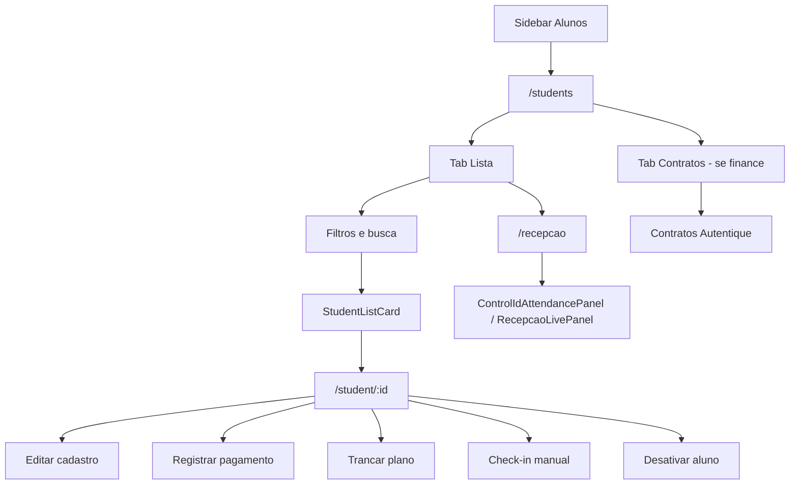

# Alunos — lista, perfil e presença

| Campo | Valor |
|---|---|
| **id** | `crm.aluno.perfil-presenca` |
| **módulo** | CRM |
| **personas** | recepcionista, owner, instrutor |
| **rotas** | `/students`, `/students?tab=contratos`, `/recepcao`, `/student/:id` |
| **pré-requisitos** | Alunos matriculados; módulo `finance` para aba Contratos; Control iD para presença ao vivo |
| **status** | revisado (código); staging pendente |
| **última revisão** | 2026-07-16 |
| **validação** | [VALIDATION.md](../VALIDATION.md) |

**Specs relacionadas:**

- [docs/contracts-autentique.md](../contracts-autentique.md) — assinatura digital de contratos
- [config/empresa-horarios-turmas.md](../config/empresa-horarios-turmas.md) — catálogo de turmas (`classes`) usado no select Turma
- [2026-07-16-student-profile-payments-status-first-design.md](../../superpowers/specs/2026-07-16-student-profile-payments-status-first-design.md) — aba Pagamentos status-first

**Harness relacionado:** `npm test -- studentStatus deactivateStudent academyTurmas`

**Arquivos-chave:** `src/pages/Alunos.jsx`, `src/pages/Students.jsx`, `src/pages/StudentProfile.jsx`, `src/components/attendance/ControlIdAttendancePanel.jsx`

---

## Resumo

O operador consulta a **lista de alunos**, filtra por status/plano/turma, abre o **perfil** para dados cadastrais, pagamentos (se financeiro ativo), contratos e check-in manual; na visão **presença**, acompanha entradas via Control iD ou registra presença; com módulo financeiro, a aba **Contratos** centraliza documentos Autentique.

---

## Diagrama de fluxo

---

## Mapa de telas

| # | Rota | Componente | Ação do usuário | Resultado esperado |
|---|---|---|---|---|
| 1 | `/students` | `Alunos.jsx` + `Students.jsx` | Abrir **Alunos** na sidebar | Hub com tab **Lista** ativa |
| 2 | `/students` | Barra de filtros | Buscar nome, filtrar status/plano/turma | Lista paginada atualiza |
| 3 | `/students` | `StudentListCard` | Clicar no aluno | Navega para `/student/:id` |
| 3b | `/students` | `StudentListCard` — ações rápidas | Ícone presença / conversa / perfil | Presença manual (se coleção configurada); atendimento no inbox; abrir perfil |
| 4 | `/students` | Toolbar | Importar / exportar planilha | Planilha processada; toasts de progresso |
| 5 | `/recepcao` | `Recepcao.jsx` | Abrir recepção (link interno ou menu) | Painel ao vivo + histórico Control iD |
| 6 | `/students?tab=contratos` | `ContractsPageContent` | Tab Contratos (módulo finance) | Lista de contratos da academia |
| 7 | `/student/:id` | `StudentProfile.jsx` | Ver dados e timeline | Perfil completo com status, badges e resumo do plano com desconto individual quando existir |
| 8 | `/student/:id` | Seção financeira | Registrar pagamento / produto | `StudentPaymentModal` (+ **Recebido via** em cartão) |
| 9 | `/student/:id` | Presença | Check-in manual | Evento de presença na timeline |
| 10 | `/student/:id` | Plano | Trancar / retomar plano | `PlanFreezeModal`; histórico de trancamentos |
| 11 | `/student/:id` | Menu ações | Desativar ou reativar aluno | Status atualizado; confirmação via `ConfirmDialog` |
| 12 | `/student/:id` | Contratos (chip/seção) | Criar contrato Autentique | `CreateContractModal` |

---

## A — Auditoria operacional

### Pré-condições de dados

- [ ] Pelo menos um aluno matriculado ativo
- [ ] Opções de **Turma** no perfil/cadastro vêm de `useAcademyTurmas` (collection `classes` ativas; ver [empresa-horarios-turmas](../config/empresa-horarios-turmas.md))
- [ ] Para contratos: módulo `finance` + Autentique em `/integracoes`
- [ ] Para presença Control iD: dispositivo configurado
- [ ] Para pagamentos no perfil: permissão `canManageStudentPayments`

### Checklist passo a passo

1. [ ] `/students` carrega lista com paginação (scroll infinito ou load more)
2. [ ] Busca por nome parcial retorna resultados corretos
3. [ ] Filtro "Ativos" / "Inativos" / inadimplência funciona conforme badges
4. [ ] Clicar aluno → `/student/:id` com nome e plano corretos
4b. [ ] **Cadastrar aluno** (modal na lista): com graduações ativas, campo **Faixa/Evolução** opcional; valor persiste no perfil
4c. [ ] Com graduações ativas e aluno com faixa preenchida: subtexto do card na lista exibe graduação (entre turma e telefone)
5. [ ] Editar telefone, **turma** ou plano → salvar → toast de sucesso; dados persistem após reload
5b. [ ] Com **Graduações** salvas em Empresa → Alunos → Graduações: campo **Faixa/Evolução** visível no perfil (select inline após turma)
5c. [ ] Sem graduações configuradas: campo **Faixa/Evolução** ausente no perfil (exceto aluno com valor legado — somente leitura + banner)
5d. [ ] Seção **Quem costuma pagar**: campo de adicionar nome visível sem precisar de “Editar tudo”; aliases persistem ao adicionar/remover
5e. [ ] Clique no **avatar** abre upload de foto; foto aparece no avatar após salvar (bucket `VITE_APPWRITE_STUDENT_PHOTOS_BUCKET_ID`)
6. [ ] Check-in manual no perfil (se presença configurada) → evento na timeline
7. [ ] **`/recepcao`** exibe painel ao vivo e histórico Control iD (ou empty state se não configurado)
7b. [ ] *Nota:* `/students?view=presenca` e `/presenca` **não** ativam modo presença no hub embutido (`Students embedded`) — usar `/recepcao`
8. [ ] Com finance: tab **Contratos** visível; sem finance: tab oculta
9. [ ] Registrar pagamento no perfil — modal valida valor, método e meio de captura (cartão, 2+ meios)
9b. [ ] Venda de produto na timeline — **Ver detalhes** abre modal; owner/admin pode **Trocar** item (venda concluída)
9b. [ ] Pagamento **pago/parcial** espelha em Financeiro → Lançamentos; badge **No Caixa** no perfil (link) ou **Caixa pendente** se falhar
9c. [ ] Taxa/avulso **pago** classificado como **Outras receitas** no Caixa (não Mensalidade)
9d. [ ] Excluir pagamento com troco cancela entrada e saída de troco no Caixa
9e. [ ] Aba Pagamentos: faixa no topo **Em dia / Em atraso** (ou Coberto/Trancado); CTA registrar logo abaixo
9e2. [ ] Owner/admin: **Cobertura histórica** no perfil — N meses (1–24) como `covered` / R$ 0 / sem Caixa; pula meses já pagos
9f. [ ] Lista em linhas compactas (ações só ao expandir); default Mensalidades · 3 meses; sem lista duplicada do extrato
9g. [ ] Card de status na coluna esquerda usa as **mesmas labels** que a SituationHero; some ao abrir a aba Pagamentos; clique abre a aba
9h. [ ] Sem presença configurada: `StatusBanner` com ação **Abrir Recepção** (sem botão de check-in morto)
10. [ ] Trancar plano — datas e motivo salvos; badge de trancado no perfil
11. [ ] Desativar aluno — confirmação; some de filtros "Ativos"
11b. [ ] Excluir aluno — `ConfirmDialog` (mesmo padrão de excluir lançamento)
12. [ ] Trocar academia — lista mostra só alunos da academia atual
13. [ ] Aba **Frequência** — aluno trancado exibe banner «frequência não avaliada»
14. [ ] Aba **Frequência** — aluno inativo exibe banner com histórico abaixo
15. [ ] Aluno **em contato** (retenção) — banner com «Voltar para a fila» na aba Frequência
16. [ ] Se o plano do aluno estiver marcado como isento em Financeiro → Planos, o perfil mostra badge **Plano isento** e o card financeiro mostra **Isento**, sem cobrança mensal
17. [ ] Se `discount_amount > 0`, o card financeiro mostra plano original, desconto aplicado e valor final cobrado

### Estados de erro conhecidos

| Situação | Feedback esperado | Referência |
|---|---|---|
| Falha ao carregar alunos | `ErrorBanner` + retry | `Students.jsx` |
| Pagamento inválido | `FieldError` no modal | `StudentPaymentModal` |
| Espelho Caixa falhou | Toast warning + badge **Caixa pendente**; conciliação → Verificar espelhos | `studentPaymentsApi`, `StudentPaymentsList` |
| Control iD offline | Estado no painel de presença | `ControlIdAttendancePanel` |

### Permissões e multi-tenant

- Coleção `students` filtrada por academia; perfil não acessível cross-tenant via IDOR.
- Financeiro no perfil respeita `useCanViewStudentFinance`.
- Ver [docs/multi-tenant-conventions.md](../multi-tenant-conventions.md).

### Critérios de fluxo saudável vs regressão

**Saudável:** Badges de status/inadimplência coerentes; export sem PII desnecessária; perfil carrega bundle em uma viagem (`fetchStudentProfileBundle`).

**Regressão:** Aluno de outra academia visível; pagamento salvo sem permissão; presença duplicada sem feedback.

---

## B — Roteiro de demonstração em vídeo

**Duração alvo:** 4 min

### Dados de demonstração sugeridos

| Entidade | Valor fictício |
|---|---|
| Aluno | Pedro Santos — Plano Intermediário, turma Noite |
| Presença | Entrada simulada 19:02 |
| Contrato | "Contrato anual 2026" pendente assinatura |

### Cenas

| Cena | Tela | Narração sugerida | Gancho de valor |
|---|---|---|---|
| 1 | Lista alunos | "Todos os matriculados numa lista com busca e filtros — achar alguém leva segundos." | Operação diária |
| 2 | Filtros | "Filtro por turma, plano ou quem está inadimplente." | Gestão segmentada |
| 3 | Perfil | "Um clique e você vê cadastro, histórico, pagamentos e presença." | Visão 360° |
| 4 | Presença | "Na recepção em `/recepcao`, a catraca integrada mostra entradas ao vivo." | Controle de frequência |
| 5 | Pagamento | "Registrar mensalidade ou venda de produto sem ir ao financeiro." | Agilidade na recepção |
| 6 | Contratos | "Contrato digital enviado para assinar no celular do aluno." | Menos papel |

### O que não mostrar

- Importação CSV com erros de validação (a menos que demo de migração)
- CPF completo em export (máscara em `maskCpfForExport`)
- Fluxo financeiro completo (ver fase futura `docs/flows/financeiro/`)

---

## Variações e atalhos

- **Presença canônica:** `/recepcao` (não `/students?view=presenca` no hub atual)
- **Alias de rota:** `/alunos` → `/students` (mesmo hub)
- **Legado:** `/presenca` redireciona para `/students?view=presenca`, mas modo presença não ativa com `Students embedded` — preferir `/recepcao`
- **NL command bar:** prefill de pagamento via evento `NL_PAYMENT_PREFILL_EVENT`
- **Chat widget:** painel WhatsApp embutido no perfil (`NaviChatWidgetPanel`); seção **Comunicação** na coluna esquerda direciona para a aba **Conversa** (sem botão WA duplicado quando conectado)

---

## Histórico de revisão

| Data | Autor | Mudança |
|---|---|---|
| 2026-07-22 | — | Cobertura histórica no perfil (sem Caixa): checklist 9e2 |
| 2026-06-25 | — | Espelho pagamento→Caixa: fee/other na reconciliação, OUTROS_RECEITA, cancel troco, badge No Caixa |
| 2026-06-23 | — | Card financeiro passa a exibir desconto individual da matrícula quando houver |
| 2026-06-15 | — | Criação inicial |
| 2026-06-19 | — | Graduação opt-in: cadastro rápido, perfil, subtexto na lista |
| 2026-06-19 | — | Plano isento/bolsista refletido no perfil e no card financeiro |
