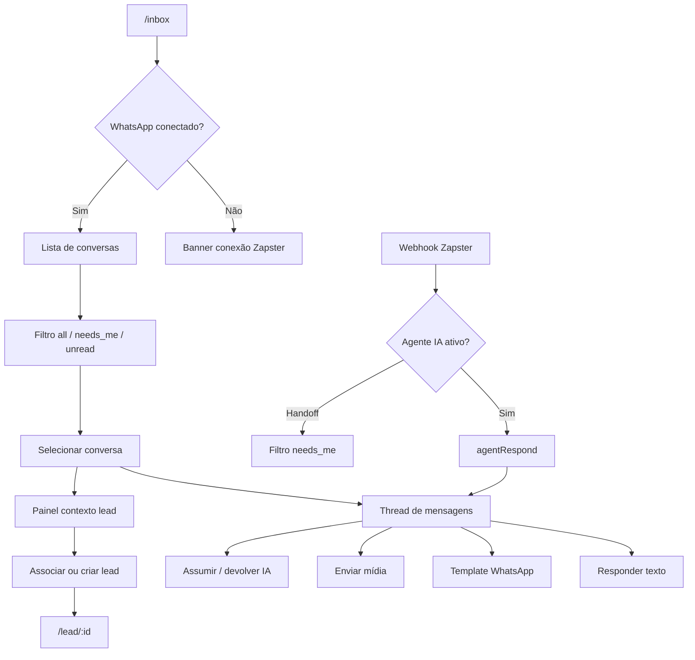

# Conversas — inbox WhatsApp

| Campo | Valor |
|---|---|
| **id** | `crm.conversas.inbox` |
| **módulo** | CRM |
| **personas** | recepcionista, owner |
| **rotas** | `/inbox`, `/inbox?phone=`, `/inbox?filter=needs_me` |
| **pré-requisitos** | WhatsApp conectado via Zapster; conversas sincronizadas |
| **status** | revisado |
| **última revisão** | 2026-06-15 |

**Specs relacionadas:**

- [2026-06-09-ia-acoes-whatsapp-design.md](../superpowers/specs/2026-06-09-ia-acoes-whatsapp-design.md) — ações IA no WhatsApp
- [2026-06-11-conversa-cadastro-lead-ia-design.md](../superpowers/specs/2026-06-11-conversa-cadastro-lead-ia-design.md) — cadastro de lead pela conversa

**Harness relacionado:** [HARNESS.md](../../HARNESS.md) — Inbox & Agente de IA (`npm test -- inbox agentRespond zapsterWebhook`)

**Arquivos-chave:** `src/pages/Inbox.jsx`, `src/components/inbox/*`, `lib/server/zapsterWebhook.js`, `lib/server/agentRespond.js`

---

## Resumo

A página **Conversas** centraliza o atendimento WhatsApp: lista de tickets com filtros (todos, precisa de mim, não lidos), thread de mensagens em tempo real, envio de texto/mídia/templates, painel de contexto do lead associado, handoff entre agente IA e humano, e ações para criar ou vincular contatos ao CRM.

---

## Diagrama de fluxo

---

## Mapa de telas

| # | Rota | Componente | Ação do usuário | Resultado esperado |
|---|---|---|---|---|
| 1 | `/inbox` | `Inbox.jsx` | Abrir **Conversas** | Layout lista + thread (desktop) ou sheet (mobile) |
| 2 | `/inbox` | `InboxGlobalBanners` | Ver status conexão | Banner se WhatsApp desconectado |
| 3 | `/inbox` | `InboxListSection` | Filtrar Todos / Precisa de mim / Não lidos | Lista filtrada |
| 4 | `/inbox` | Item da lista | Selecionar conversa | Thread carrega; mensagens em ordem cronológica |
| 5 | `/inbox` | `InboxThreadSection` | Digitar e enviar | Mensagem outbound; otimistic update |
| 6 | `/inbox` | Menu templates | Escolher modelo | Placeholders substituídos; envio via API |
| 7 | `/inbox` | Composer `/` | Slash commands | Atalhos de template |
| 8 | `/inbox` | `InboxContextPanel` | Ver dados do lead | Estágio, follow-up, ações rápidas |
| 9 | `/inbox` | Handoff | Assumir conversa da IA | Ticket passa para humano; badge atualiza |
| 10 | `/inbox` | Associar lead | Vincular número a contato CRM | Lead linkado; contexto preenchido |
| 11 | `/inbox` | Criar lead | A partir da conversa | Novo lead com telefone pré-preenchido |
| 12 | `/inbox?phone=` | Deep link | Abrir conversa por número | Auto-seleção da thread |
| 13 | `/inbox` | `FollowupOutcomeDialog` | Registrar outcome de follow-up | Mesmo fluxo do Hoje, no contexto inbox |

---

## A — Auditoria operacional

### Pré-condições de dados

- [ ] Instância Zapster conectada (`useZapsterWhatsAppConnection`)
- [ ] Pelo menos uma conversa inbound nos últimos 7 dias
- [ ] Agente IA configurado em `/agente-ia` (para testar handoff)
- [ ] Templates WhatsApp em Minha academia / Automações

### Checklist passo a passo

1. [ ] `/inbox` carrega lista sem erro persistente
2. [ ] Banner de desconexão aparece quando WhatsApp offline
3. [ ] Filtro **Não lidos** — só conversas com unread
4. [ ] Filtro **Precisa de mim** — tickets em handoff ou aguardando humano
5. [ ] Selecionar conversa — histórico carrega; scroll no fim das novas mensagens
6. [ ] Enviar mensagem de texto — aparece na thread; confirmação de entrega
7. [ ] Enviar template — placeholders corretos (nome, academia)
8. [ ] Receber mensagem (teste inbound) — aparece em tempo real ou após refresh
9. [ ] Painel de contexto mostra lead associado ou CTA para associar
10. [ ] Assumir conversa da IA — filtro needs_me atualiza; IA para de responder
11. [ ] Criar lead da conversa — lead aparece em `/pipeline`
12. [ ] Mobile: sheet de conversa abre/fecha; composer acessível
13. [ ] Trocar academia — lista só conversas da academia atual

### Estados de erro conhecidos

| Situação | Feedback esperado | Referência |
|---|---|---|
| Billing bloqueado | Guard em `fetchWithBillingGuard` | toast/banner |
| Upload mídia falhou | `InboxMediaUploadError` | toast |
| Agente timeout | Handoff automático | `lib/constants.js` handoff config |
| Falha envio | Toast com `friendlyError` | [docs/ux-feedback.md](../ux-feedback.md) |

### Permissões e multi-tenant

- Conversas e JWT inbox escopados por academia.
- Webhook valida tenant antes de persistir mensagem.
- Ver [docs/multi-tenant-conventions.md](../multi-tenant-conventions.md) e [HARNESS.md](../../HARNESS.md).

### Critérios de fluxo saudável vs regressão

**Saudável:** Realtime ou polling mantém thread atualizada; handoff idempotente; read/unread otimista (`inboxConversationState.js`).

**Regressão:** Mensagens de outra academia; IA responde após handoff humano; template com placeholders crus `{nome}`.

---

## B — Roteiro de demonstração em vídeo

**Duração alvo:** 4–5 min

### Dados de demonstração sugeridos

| Entidade | Valor fictício |
|---|---|
| Contato | (11) 97777-5555 — "Mariana" (não associada) |
| Template | Boas-vindas pós-experimental |
| Agente IA | Nome "Assistente Nave" |

### Cenas

| Cena | Tela | Narração sugerida | Gancho de valor |
|---|---|---|---|
| 1 | Inbox lista | "Todo WhatsApp da academia aqui — sem celular pessoal na mão." | Canal único |
| 2 | Filtro Precisa de mim | "O que precisa de humano aparece destacado — a IA já triou o resto." | IA + humano |
| 3 | Thread | "Histórico completo, mídia, tudo sincronizado." | Profissionalismo |
| 4 | Template | "Modelos com nome e horário — resposta em um clique." | Velocidade |
| 5 | Contexto lead | "Vinculo o número ao lead e vejo estágio e follow-up ao lado." | CRM integrado |
| 6 | Criar lead | "Número novo? Virou lead no funil sem redigitar telefone." | Zero retrabalho |
| 7 | Handoff | "Assumo da IA quando preciso de conversa sensível." | Controle humano |

### O que não mostrar

- QR code de conexão Zapster em produção
- Tokens JWT ou headers de API
- Conversas reais de clientes
- Debug `VITE_INBOX_DEBUG` no console

---

## Variações e atalhos

- **Mobile:** bottom nav **Conversas**; `InboxConversationSheet` em viewport estreita
- **FAB inbox:** `NaviInboxShortcut` em outras páginas
- **Deep link:** `?phone=` normaliza e seleciona conversa
- **Atalho teclado:** `useInboxKeyboard` para navegação power-user
- **Widget chat:** painel flutuante reutiliza estado (`useInboxChatWidgetSync`)
- **NL / agente:** ações IA documentadas na spec `ia-acoes-whatsapp`

---

## Histórico de revisão

| Data | Autor | Mudança |
|---|---|---|
| 2026-06-15 | — | Criação inicial |
