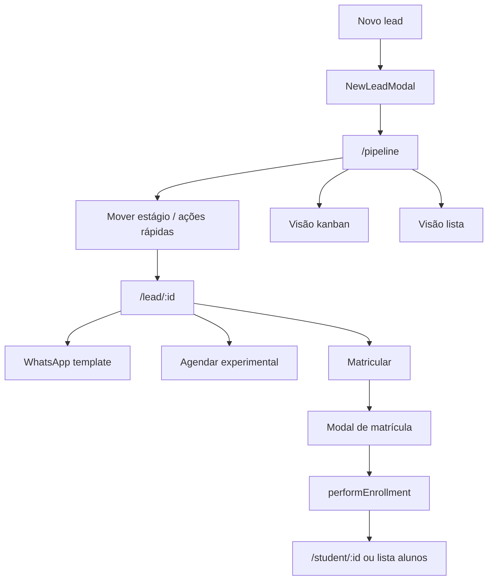

# Funil — do novo lead à matrícula

| Campo | Valor |
|---|---|
| **id** | `crm.funil.lead-matricula` |
| **módulo** | CRM |
| **personas** | recepcionista, owner |
| **rotas** | `/pipeline`, `/lead/:id`, modal **Novo lead** (global) |
| **pré-requisitos** | Usuário autenticado; estágios do funil configurados em Minha academia |
| **status** | revisado |
| **última revisão** | 2026-06-15 |

**Specs relacionadas:**

- [2026-06-17-funil-correcao-definitiva-PRODUCT.md](../superpowers/specs/2026-06-17-funil-correcao-definitiva-PRODUCT.md) — triagem desktop, movimentação e colunas custom
- [2026-06-10-followup-experimental-design.md](../superpowers/specs/2026-06-10-followup-experimental-design.md) — ações pós-experimental
- [2026-06-12-lead-history-summary-cache-design.md](../superpowers/specs/2026-06-12-lead-history-summary-cache-design.md) — resumo IA no perfil
- [2026-06-11-conversa-cadastro-lead-ia-design.md](../superpowers/specs/2026-06-11-conversa-cadastro-lead-ia-design.md) — cadastro via conversa

**Harness relacionado:** `npm test -- enrollmentFlow performEnrollment`

**Arquivos-chave:** `src/pages/Pipeline.jsx`, `src/pages/LeadProfile.jsx`, `src/components/leads/NewLeadModal.jsx`, `src/lib/performEnrollment.js`

---

## Resumo

O operador captura um novo contato, acompanha o lead no **Funil** (kanban ou lista), abre o perfil para histórico e comunicação, move entre estágios conforme o playbook e conclui com **matrícula** — criando o registro de aluno e encerrando o ciclo comercial no CRM.

---

## Diagrama de fluxo

---

## Mapa de telas

| # | Rota | Componente | Ação do usuário | Resultado esperado |
|---|---|---|---|---|
| 1 | (global) | `NewLeadModal` | Sidebar **Novo lead** ou FAB mobile | Modal com nome, telefone, origem, estágio inicial |
| 2 | `/pipeline` | `Pipeline.jsx` | Salvar novo lead | Lead aparece na coluna do estágio escolhido |
| 3 | `/pipeline` | Kanban / lista | Arrastar card ou menu de estágio | Estágio atualizado; automações disparam se configuradas |
| 3b | `/pipeline` (kanban desktop) | `InboxTriageCard` no card | Confirmar / Vincular aluno / Não é lead | Triagem concluída **sem** abrir perfil; mover para etapa ≠ Novo confirma triagem implicitamente |
| 3c | `/pipeline` (lista mobile) | Link **Triar no Inbox** | Abrir conversa | Triagem no Inbox — **sem** callout no card mobile |
| 4 | `/pipeline` | Card do lead | Clicar no card (fora da área de triagem) | Navega para `/lead/:id` |
| 5 | `/pipeline` | Menu ⋮ no card | WhatsApp, nota, matricular, excluir | Ação contextual sem sair do funil |
| 6 | `/lead/:id` | `LeadProfile.jsx` | Editar dados, aba **Conversa** / **Histórico** | Dados persistidos; WhatsApp integrado na aba Conversa |
| 6b | `/lead/:id` | Aba Conversa | WA desconectado | Banner + empty “WhatsApp não conectado” + **Configurar WhatsApp** + **Abrir WhatsApp Web** (manual) → `/agente-ia` |
| 6c | `/lead/:id` | Aba Conversa | WA offline com histórico | Banner com link **Reconectar** → `/agente-ia`; thread read-only |
| 7 | `/lead/:id` | Botão matricular | Iniciar matrícula | Modal com plano, data, pagamento opcional (`MatriculaPaymentStep`) |
| 8 | Modal matrícula | Pagamento opcional | Forma + **Recebido via** (cartão) | `registerEnrollmentPayment` com `capture_method_id` |
| 9 | Modal matrícula | `executeMatricula` | Confirmar | `performEnrollment` cria aluno; lead marcado matriculado |
| 10 | `/pipeline` | Filtros (período, estágio) | Refinar visualização | Lista/kanban filtrados; contadores atualizados |
| 11 | `/lead/:id` | Resumo IA (se ativo) | Gerar/atualizar resumo | Cache de histórico exibido no perfil |

---

## A — Auditoria operacional

### Pré-condições de dados

- [ ] Estágios do funil definidos em `/empresa?tab=funil`
- [ ] Planos de mensalidade (se matrícula com plano financeiro) em `/empresa?tab=financeiro`
- [ ] Templates WhatsApp configurados para mensagens de estágio
- [ ] Lead de teste em estágio aberto (não matriculado)

### Checklist passo a passo

1. [ ] Abrir **Novo lead** — modal visível e campos obrigatórios validados
2. [ ] Criar lead "Teste Fluxo" — aparece em `/pipeline` no estágio correto
3. [ ] Alternar kanban ↔ lista **(desktop; largura > 1023px)** — mesmo lead visível em ambas
3b. [ ] Lead inbound em **Novo** (desktop) — callout triagem: Confirmar / Vincular / Não é lead **sem** navegar ao perfil
3c. [ ] Mover lead inbound para etapa custom (ex.: Primeiro contato) — card permanece na coluna; toast de confirmação implícita
3d. [ ] Mobile — link **Triar no Inbox** na coluna Novo; sem callout no card
4. [ ] Mover lead para estágio "Aguardando decisão" ou equivalente — badge e contador da coluna atualizam
5. [ ] Abrir perfil `/lead/:id` — dados consistentes com o card
6. [ ] Registrar nota ou evento na timeline — evento aparece ordenado
7. [ ] Enviar mensagem ou template WhatsApp — pela aba **Conversa** (integrado); com WA offline, usar **Abrir WhatsApp Web** no empty (envio manual) ou reconectar em `/agente-ia`
7b. [ ] Com WA desconectado — banner na coluna esquerda + empty na aba Conversa com CTAs **Configurar WhatsApp** e **Abrir WhatsApp Web**; tab “Conversa (offline)” com indicador âmbar
7c. [ ] Com WA offline e histórico — banner no painel com **Reconectar**; composer desabilitado
8. [ ] Iniciar matrícula — modal exige plano/data quando aplicável
9. [ ] Confirmar matrícula — lead some do funil aberto; aluno criado em `/students`
10. [ ] Abrir perfil do aluno `/student/:id` — vínculo com lead preservado
11. [ ] Exportar planilha (menu pipeline) — arquivo gerado sem dados de outra academia

### Estados de erro conhecidos

| Situação | Feedback esperado | Referência |
|---|---|---|
| Telefone duplicado | Validação no modal / toast | `NewLeadModal` |
| Matrícula sem plano obrigatório | Erro no modal de matrícula | `performEnrollment` |
| WhatsApp desconectado no perfil | Banner warning + empty na aba Conversa (Configurar + wa.me) + tab “Conversa (offline)” + Reconectar com histórico | Spec [2026-06-16-lead-profile-whatsapp-offline-states-PRODUCT.md](../superpowers/specs/2026-06-16-lead-profile-whatsapp-offline-states-PRODUCT.md) |

### Permissões e multi-tenant

- Leads e alunos escopados por `academyId`.
- Exportação e listagem não devem incluir registros de outras academias.
- Ver [docs/multi-tenant-conventions.md](../multi-tenant-conventions.md).

### Critérios de fluxo saudável vs regressão

**Saudável:** Contadores de coluna batem com cards visíveis; matrícula idempotente (não duplica aluno); automações disparam com feedback (`automationUx`).

**Regressão:** Card some sem mudança de estágio; matrícula parcial (aluno sem lead); kanban não persiste drag; filtros de período incorretos; botões de triagem abrem perfil do lead; lead em etapa custom reaparece só em Novo.

**Spec:** [2026-06-17-funil-correcao-definitiva-PRODUCT.md](../superpowers/specs/2026-06-17-funil-correcao-definitiva-PRODUCT.md)

---

## B — Roteiro de demonstração em vídeo

**Duração alvo:** 4–5 min

### Dados de demonstração sugeridos

| Entidade | Valor fictício |
|---|---|
| Novo lead | Carla Mendes, (11) 98888-1234, origem Instagram |
| Estágios | Contato → Experimental agendada → Matriculado |
| Plano | Mensalidade Padrão — R$ 200 |

### Cenas

| Cena | Tela | Narração sugerida | Gancho de valor |
|---|---|---|---|
| 1 | Novo lead | "Chegou mensagem no Instagram? Cadastro em 20 segundos." | Captura sem atrito |
| 2 | Funil kanban | "Cada coluna é um estágio do seu funil — você vê onde cada pessoa está." | Visualização do pipeline |
| 3 | Mover estágio | "Arrasto Carla para 'Experimental agendada' — o time inteiro vê a mesma informação." | Colaboração |
| 4 | Perfil do lead | "Histórico completo: ligações, WhatsApp, notas — tudo num lugar." | Contexto único |
| 5 | WhatsApp | "Modelos prontos com nome e horário — um clique e a mensagem sai." | Comunicação rápida |
| 6 | Matrícula | "Decidiu matricular? Plano, data de início, e virou aluno automaticamente." | Fechamento sem retrabalho |

### O que não mostrar

- Importação em massa de planilha (fluxo separado)
- Configuração de estágios em Minha academia (fluxo de config)
- IDs internos de lead no Appwrite

---

## Variações e atalhos

- **Entrada alternativa:** lead criado a partir do **Inbox** ao associar conversa (`docs/flows/crm/conversas-inbox.md`)
- **Matrícula pelo funil:** menu rápido no card sem abrir perfil
- **Filtro por mês de matrícula:** visão de convertidos no período
- **Automações:** ao mudar estágio, processos em `/automacoes?tab=processos` podem enviar mensagens
- **Mobile (≤1023px):** vista lista agrupada por estágio; kanban só no desktop
- **Rota legada:** `/new-lead` redireciona ou abre modal — preferir atalho global

---

## Histórico de revisão

| Data | Autor | Mudança |
|---|---|---|
| 2026-06-15 | — | Criação inicial |
