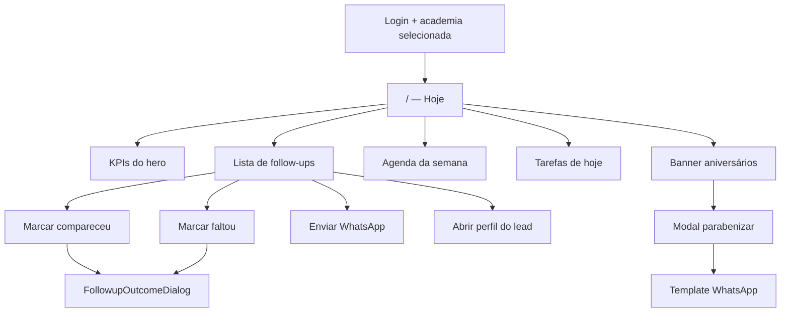

# Hoje — rotina diária no dashboard

| Campo | Valor |
|---|---|
| **id** | `crm.hoje.dashboard` |
| **módulo** | CRM |
| **personas** | recepcionista, owner, instrutor |
| **rotas** | `/` |
| **pré-requisitos** | Usuário autenticado; academia selecionada; módulo CRM ativo |
| **status** | revisado (código); staging pendente |
| **última revisão** | 2026-06-15 |
| **validação** | [VALIDATION.md](../VALIDATION.md) |

**Specs relacionadas:**

- [2026-06-10-dashboard-retornos-row-design.md](../superpowers/specs/2026-06-10-dashboard-retornos-row-design.md) — aniversários e retornos
- [2026-06-10-followup-experimental-design.md](../superpowers/specs/2026-06-10-followup-experimental-design.md) — follow-up e outcomes

**Harness relacionado:** — (sem harness dedicado; lógica em `src/lib/dashboardDayBriefing.js`, `src/lib/followupState.js`)

**Arquivos-chave:** `src/pages/Dashboard.jsx`, `src/components/dashboard/*`, `src/lib/dashboardDayBriefing.js`

---

## Resumo

A página **Hoje** é o ponto de partida da rotina diária: o operador vê KPIs do dia (agenda, follow-ups, matrículas do mês), executa contatos pendentes, registra presença ou falta em aulas experimentais, acompanha tarefas do dia e trata aniversários de alunos — tudo sem sair da home.

---

## Diagrama de fluxo

---

## Mapa de telas

| # | Rota | Componente | Ação do usuário | Resultado esperado |
|---|---|---|---|---|
| 1 | `/` | `Dashboard.jsx` | Abrir app (item **Hoje** na sidebar) | Hero com data, saudação e KPIs carregam |
| 2 | `/` | `DashboardHeroKpi` | Clicar KPI (retornos, aulas hoje, matrículas, tarefas) | Retornos → scroll; Aulas hoje → agenda; Matrículas → `/reports?tab=funil`; Tarefas → `/tarefas?status=pendentes&period=today` |
| 3 | `/` | Lista **Retornos pendentes** | **Concluir retorno** (ícone ✓) | `FollowupOutcomeDialog` abre; após confirmar, lead atualiza/some da lista |
| 4 | `/` | `DashboardAgendaWeekPanel` | **Compareceu** / **Faltou** na aula do dia | Registro direto (`markLeadAttended` / `markLeadMissed`); toast de sucesso |
| 5 | `/` | `FollowupCopilotButtons` | Escolher ação sugerida (WhatsApp, remarcar, etc.) | Ação correspondente (template, estágio, perfil) |
| 6 | `/` | Card de lead (retornos ou agenda) | Clicar nome | Navega para `/lead/:id`; voltar retorna ao Hoje (`LEAD_PROFILE_FROM_DASHBOARD`) |
| 7 | `/` | `DashboardAgendaWeekPanel` | Navegar semanas / ver colunas por dia | Agenda por dia com experimentais agendadas |
| 8 | `/` | KPI **Tarefas** | Clicar no indicador | Abre `/tarefas?status=pendentes&period=today` (conclusão na página Tarefas) |
| 9 | `/` | `DashboardBirthdayBanner` | Clicar **Parabenizar** | `DashboardBirthdayModal` com alunos aniversariantes |
| 10 | `/` | Modal aniversário | Enviar template WhatsApp | Mensagem outbound; toast de sucesso ou erro amigável |
| 11 | `/` | Botão **Novo lead** (header/empty) | Criar lead rápido | `NewLeadModal` global abre |
| 12 | `/` | Control iD (se integrado) | **Liberar catraca** | `ConfirmDialog` + API; feedback de sucesso/erro |

---

## A — Auditoria operacional

### Pré-condições de dados

- [ ] Pelo menos uma academia no contexto do usuário
- [ ] Para follow-ups: leads em estágio de retorno/experimental com datas de agenda configuradas
- [ ] Para aniversários: alunos ativos com data de nascimento preenchida
- [ ] Para WhatsApp: integração Zapster conectada (templates em Minha academia)
- [ ] Para catraca: integração Control iD configurada em `/integracoes`

### Checklist passo a passo

1. [ ] Acessar `/` logado — página carrega sem `ErrorBanner` persistente
2. [ ] Hero exibe linha de data e KPIs (aulas hoje, matrículas no mês, retornos, tarefas)
3. [ ] Lista **Retornos pendentes** mostra leads que precisam de contato (badge de temperatura quando aplicável)
4. [ ] Clicar **Concluir retorno** (✓) em um retorno — `FollowupOutcomeDialog` abre; após confirmar, lead some da lista ou atualiza estado
5. [ ] Na **Agenda da semana**, marcar **Compareceu** ou **Faltou** — toast de sucesso; lead atualiza estágio (sem dialog de outcome)
6. [ ] Enviar WhatsApp no retorno (botão WA) — toast de sucesso ou erro amigável
7. [ ] Clicar no nome do lead — navega para `/lead/:id`; voltar retorna ao Hoje
8. [ ] Painel de agenda da semana lista eventos (até `FOLLOWUP_AGENDA_MAX_DAYS` dias)
9. [ ] KPI **Tarefas** com pendências — clique leva a `/tarefas?status=pendentes&period=today`
10. [ ] Se houver aniversariantes: banner visível; modal lista nomes corretos
11. [ ] Trocar de academia no menu do usuário — KPIs e listas refletem só dados da nova academia

### Estados de erro conhecidos

| Situação | Feedback esperado | Referência |
|---|---|---|
| Falha ao carregar leads/tarefas | `ErrorBanner` com retry | [docs/ux-feedback.md](../ux-feedback.md) |
| WhatsApp desconectado | Erro amigável no envio de template | `friendlyError` |
| Control iD indisponível | Mensagem na ação de catraca | `controlidApi.js` |

### Permissões e multi-tenant

- Todos os dados filtrados por `academyId` do store; troca de academia recarrega contexto.
- Ver [docs/multi-tenant-conventions.md](../multi-tenant-conventions.md).

### Critérios de fluxo saudável vs regressão

**Saudável:** KPIs coerentes com filtros do dia; follow-ups não reaparecem após outcome registrado; toasts em ações destrutivas/transitórias.

**Regressão:** Lista vazia com leads elegíveis; KPI zerado com dados existentes; envio WhatsApp sem feedback; vazamento de leads de outra academia após switch.

---

## B — Roteiro de demonstração em vídeo

**Duração alvo:** 3 min

### Dados de demonstração sugeridos

| Entidade | Valor fictício |
|---|---|
| Lead em follow-up | João Pereira — aula experimental ontem |
| Aluno aniversariante | Ana Costa — 15/06 |
| Academia | Academia Demo Nave |

### Cenas

| Cena | Tela | Narração sugerida | Gancho de valor |
|---|---|---|---|
| 1 | Login → Hoje | "O dia da recepção começa aqui: em um olhar você vê o que precisa de atenção hoje." | Centralização da operação |
| 2 | Hero KPIs | "Quantos follow-ups, quantas aulas na agenda, quantas matrículas no mês — sem abrir cinco telas." | Visibilidade imediata |
| 3 | Retornos | "Depois da experimental, os retornos aparecem aqui. Concluo o contato num dialog — ou mando WhatsApp com um clique." | Velocidade no pós-aula |
| 3b | Agenda semana | "Na agenda, registro compareceu ou faltou na hora da aula." | Registro na recepção |
| 4 | Agenda semana | "A semana inteira de experimentais num painel — nada passa batido." | Planejamento |
| 5 | Aniversário | "O Nave avisa quem faz aniversário e já sugere mensagem personalizada." | Relacionamento |
| 6 | Novo lead | "Precisa cadastrar alguém que chegou na porta? Novo lead sem sair da home." | Captura rápida |

### O que não mostrar

- IDs de documento Appwrite ou `academyId` na URL
- Console de rede com tokens JWT
- Dados reais de academias clientes
- Erros de billing bloqueado (a menos que seja demo específica de assinatura)

---

## Variações e atalhos

- **Mobile:** bottom nav com **Hoje** como primeira aba; layout responsivo em `dashboard.css`
- **NL command bar:** contexto de página registrado via `useNlPageContext` — comandos em linguagem natural podem acionar ações do dashboard
- **Novo lead:** atalho global na sidebar (`dispatchOpenNewLeadModal`) e FAB no mobile
- **Recepção ao vivo:** fluxo relacionado em `/recepcao` (catraca/presença em tempo real), não substitui o Hoje

---

## Histórico de revisão

| Data | Autor | Mudança |
|---|---|---|
| 2026-06-15 | — | Criação inicial |
| 2026-06-15 | — | Validação código: retornos vs agenda; KPI tarefas |
