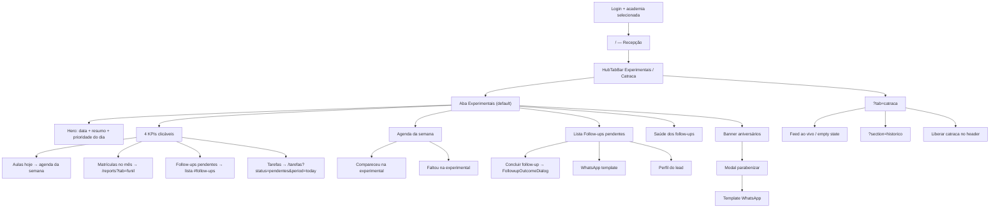

# Recepção — mesa do dia (experimentais e catraca)

| Campo | Valor |
|---|---|
| **id** | `crm.recepcao.mesa` |
| **módulo** | CRM |
| **personas** | recepcionista, owner, instrutor |
| **rotas** | `/` (default = aba Experimentais), `/?tab=catraca`, `/?tab=catraca&section=historico`, `/?tab=catraca&section=retencao` |
| **aliases legados** | `/recepcao` → `/?tab=catraca`; `/presenca` → `/?tab=catraca&section=historico`; `?retornos=1` ou `?tab=retornos` → Experimentais + scroll para follow-ups; `#follow-ups` → scroll na aba Experimentais |
| **pré-requisitos** | Usuário autenticado; academia selecionada; módulo CRM ativo |
| **status** | revisado (código); staging pendente |
| **última revisão** | 2026-06-17 |
| **validação** | [VALIDATION.md](../VALIDATION.md) |

**Specs relacionadas:**

- [2026-06-17-recepcao-navegacao-PRODUCT.md](../../superpowers/specs/2026-06-17-recepcao-navegacao-PRODUCT.md) — hub Recepção e navegação
- [2026-06-10-dashboard-retornos-row-design.md](../../superpowers/specs/2026-06-10-dashboard-retornos-row-design.md) — lista e saúde de follow-ups (spec histórica; UI usa «follow-up»)
- [2026-06-10-followup-experimental-design.md](../../superpowers/specs/2026-06-10-followup-experimental-design.md) — follow-up e outcomes

**Fluxo relacionado:** [recepcao-controlid.md](recepcao-controlid.md) — detalhe da aba **Catraca** (Control iD, histórico, retenção)

**Harness relacionado:** `src/test/recepcaoHubTabs.test.js`, `src/test/dashboardDayBriefing.test.js`; lógica em `src/lib/dashboardDayBriefing.js`, `src/lib/followupState.js`, `src/lib/recepcaoHubTabs.js`, `src/lib/dashboardReceptionCopy.js`

**Arquivos-chave:** `src/pages/Dashboard.jsx`, `src/components/recepcao/RecepcaoCatracaTab.jsx`, `src/components/recepcao/RecepcaoTodaySlotsSection.jsx`, `src/components/recepcao/RecepcaoSchedulesGrid.jsx`, `src/components/dashboard/*`, `src/lib/recepcaoHubTabs.js`

---

## Resumo

A página **Recepção** (`/`) é a mesa do dia com duas abas via `HubTabBar`:

1. **Experimentais** (default, sem `?tab`) — hero com 4 KPIs, **alerta de retenção** (quando há alunos em risco), agenda da semana, lista **Follow-ups pendentes**, painel **Saúde dos follow-ups** (quando há dados), aniversários.
2. **Catraca** (`?tab=catraca`) — sub-abas Ao vivo, Histórico (`?section=historico`) e **Retenção** (`?section=retencao`). Ver [recepcao-controlid.md](recepcao-controlid.md).

Rotas legadas redirecionam para os destinos canônicos acima.

**Terminologia na UI:** follow-up (não «retorno»). URLs legadas `?retornos=1` permanecem por compatibilidade.

---

## Diagrama de fluxo

---

## Mapa de telas

| # | Rota | Componente | Ação do usuário | Resultado esperado |
|---|---|---|---|---|
| 1 | `/` | `Dashboard.jsx` + `HubTabBar` | Abrir **Recepção** (sidebar / bottom nav) | Abas **Experimentais** (default) e **Catraca**; badge na aba Experimentais quando há follow-ups abertos |
| 2 | `/` | Hero | Ler resumo / prioridade | Linha de data, `buildDaySummaryLine`, banner «Ver agora» quando há aula iminente ou follow-ups prioritários |
| 3 | `/` | `DashboardHeroKpi` | Clicar **Aulas experimentais hoje** | Rola para `DashboardAgendaWeekPanel` (mobile: expande semana se necessário) |
| 4 | `/` | `DashboardHeroKpi` | Clicar **Matrículas no mês** | Navega para `/reports?tab=funil` |
| 5 | `/` | `DashboardHeroKpi` | Clicar **Follow-ups pendentes** | Rola para lista `#follow-ups` (mobile: expande painel colapsável) |
| 6 | `/` | `DashboardHeroKpi` | Clicar **Tarefas** | Navega para `/tarefas?status=pendentes&period=today` |
| 7 | `/` | Lista **Follow-ups pendentes** | **Concluir follow-up** (ícone ✓) | `FollowupOutcomeDialog` abre; após confirmar, lead atualiza/some da lista |
| 8 | `/` | `FollowupCopilotButtons` | Ação sugerida (WhatsApp, remarcar, etc.) | Template, estágio ou perfil conforme playbook |
| 9 | `/` | `DashboardAgendaWeekPanel` | **Compareceu** / **Faltou** na aula do dia | `markLeadAttended` / `markLeadMissed`; toast; **sem** `FollowupOutcomeDialog` |
| 10 | `/` | Card de lead (follow-ups ou agenda) | Clicar nome | `/lead/:id` com `LEAD_PROFILE_FROM_DASHBOARD`; voltar retorna à Recepção |
| 11 | `/` | `FollowupHealthPanel` | Ver temperaturas / D+1 | Pills em dia · esfriando · crítico; barra «Follow-up no dia seguinte»; links para leads em atenção |
| 11b | `/` | `RecepcaoTodaySlotsSection` | Ver **Aulas de hoje** (slots) | Lista com lotação; expandir inscritos; inscrever aluno (requer schema `class_slots` + API bookings) |
| 11c | `/` | `RecepcaoSchedulesGrid` | Ver **Grade de horários** | Grade semanal read-only; mobile colapsável com lista do dia; filtro por modalidade |
| 12 | `/` | `DashboardBirthdayBanner` | **Parabenizar** | `DashboardBirthdayModal` + template WhatsApp |
| 13 | `/` | Header | **Novo lead** | `NewLeadModal` global |
| 14 | `/` (zero state) | Welcome card | **Adicionar primeiro lead** | Modal de novo lead ou link para funil |
| 15 | `/?tab=catraca` | `RecepcaoCatracaTab` | Ao vivo / Histórico / Liberar catraca | Ver [recepcao-controlid.md](recepcao-controlid.md) |
| 16 | Aliases | `Recepcao.jsx`, `Attendance.jsx` | `/recepcao`, `/presenca`, `?retornos=1` | Redirect canônico sem perder intenção (catraca, histórico ou scroll follow-ups) |

### Contagens (evitar confusão na auditoria)

| Indicador | O que conta |
|---|---|
| KPI **Follow-ups pendentes** | Leads na lista com **contato ainda pendente** no ciclo (`followUpsNeedingContact` — sem WhatsApp/resposta no ciclo) |
| Badge da lista / aba Experimentais | Total de follow-ups **abertos** na janela da agenda (`followUps.length`, até `FOLLOWUP_AGENDA_MAX_DAYS` dias) |
| Chip mobile (≤767px) | Mesmo total da lista (`followUps.length`) |

O KPI pode ser **menor** que o badge quando há leads em dia (`on_track`) que já receberam contato no ciclo.

---

## A — Auditoria operacional

### Pré-condições de dados

- [ ] Pelo menos uma academia no contexto do usuário
- [ ] Para follow-ups: leads com status compareceu/faltou na experimental e data da aula dentro da janela (`FOLLOWUP_AGENDA_MAX_DAYS`)
- [ ] Para KPI matrículas: alunos/leads com data de ingresso no mês (API `fetchStudentMetricsForRange` com fallback local)
- [ ] Para aniversários: alunos ativos com data de nascimento preenchida
- [ ] Para WhatsApp: integração Zapster conectada (templates em Minha academia)
- [ ] Para catraca: integração Control iD ou coleção de presença manual — ver [recepcao-controlid.md](recepcao-controlid.md)

### Checklist passo a passo — aba Experimentais

1. [ ] Acessar `/` logado — sem `ErrorBanner` persistente; título **Recepção**; subtítulo «Recepção e follow-ups do dia»
2. [ ] Hero exibe **4 KPIs**: aulas hoje, matrículas no mês, follow-ups pendentes, tarefas
3. [ ] KPI **Matrículas no mês** — clique abre `/reports?tab=funil`
4. [ ] KPI **Follow-ups pendentes** — clique rola até a lista; KPI ≤ badge da lista quando há contatos já feitos no ciclo
5. [ ] Lista **Follow-ups pendentes** — grupos por temperatura; badge no título = total aberto
6. [ ] **Concluir follow-up** (✓) abre `FollowupOutcomeDialog`; após confirmar, lead some ou atualiza
7. [ ] **Agenda da semana** — Compareceu/Faltou registra presença **sem** dialog de outcome
8. [ ] **Mobile (≤767px):** agenda inicia em **Hoje**; **Ver semana** expande; chip de follow-ups quando `followUps.length > 0`; painel follow-ups colapsável
9. [ ] WhatsApp no follow-up — toast sucesso ou `friendlyError`
10. [ ] Nome do lead → `/lead/:id` → voltar à Recepção
11. [ ] **Saúde dos follow-ups** visível quando há métricas (temperatura ou D+1)
11b. [ ] **Aulas de hoje** — badges «Em andamento» / «Em breve»; skeleton ao carregar; lotação N/max
11c. [ ] **Grade de horários** — lotação na coluna hoje (quando slots existem); filtro modalidade persiste na sessão; link «Editar horários» (owner); coluna horário sticky no desktop
12. [ ] KPI **Tarefas** → `/tarefas?status=pendentes&period=today`
13. [ ] Aniversariantes: banner + modal + template
14. [ ] Trocar academia — KPIs e listas refletem só a nova academia
15. [ ] Com presença configurada e alunos em risco — banner **«X alunos em risco»** com link para `/?tab=catraca&section=retencao`

### Checklist passo a passo — aba Catraca

16. [ ] `/?tab=catraca` — empty state com link para Integrações se sem Control iD nem presença manual
17. [ ] Com integração: sub-abas **Ao vivo**, **Histórico** (`?section=historico`) e **Retenção** (`?section=retencao`)
18. [ ] **Liberar catraca** no header (só nesta aba, com Control iD ativo)
19. [ ] `/recepcao` e `/presenca` redirecionam para destinos canônicos

### Estados de erro conhecidos

| Situação | Feedback esperado | Referência |
|---|---|---|
| Falha ao carregar leads/tarefas | `ErrorBanner` com retry | [docs/ux-feedback.md](../ux-feedback.md) |
| WhatsApp desconectado | Erro amigável no envio de template | `friendlyError` |
| Control iD indisponível | Status offline / empty state na aba Catraca | `controlidApi.js`, `RecepcaoCatracaTab` |
| API indisponível em dev (`vite` sem `vercel dev`) | Tarefas: mensagem `api_proxy_unavailable` | `vite.config.js`, `useTaskStore` |

### Permissões e multi-tenant

- Todos os dados filtrados por `academyId` do store; troca de academia recarrega contexto.
- Ver [docs/multi-tenant-conventions.md](../multi-tenant-conventions.md).

### Critérios de fluxo saudável vs regressão

**Saudável:** 4 KPIs coerentes; follow-ups não reaparecem após outcome; compareceu/faltou só na agenda; toasts em ações transitórias; aliases legados redirecionam.

**Regressão:** Lista vazia com leads elegíveis; KPI matrículas zerado com ingressos no mês; KPI follow-up desalinhado com lista vazia; envio WhatsApp sem feedback; vazamento entre academias; aba Catraca sem redirect de `/recepcao`.

---

## B — Roteiro de demonstração em vídeo

**Duração alvo:** 3 min

### Dados de demonstração sugeridos

| Entidade | Valor fictício |
|---|---|
| Lead em follow-up | João Pereira — aula experimental ontem |
| Aluno aniversariante | Ana Costa — 15/06 |
| Academia | Academia Demo Nave |

### Cenas

| Cena | Tela | Narração sugerida | Gancho de valor |
|---|---|---|---|
| 1 | Login → Recepção | "O dia da recepção começa aqui: em um olhar você vê o que precisa de atenção hoje." | Centralização da operação |
| 2 | Hero KPIs | "Experimentais hoje, matrículas do mês, follow-ups e tarefas — sem abrir cinco telas." | Visibilidade imediata |
| 3 | Follow-ups | "Depois da experimental, os follow-ups aparecem aqui. Concluo num dialog ou mando WhatsApp com um clique." | Velocidade no pós-aula |
| 3b | Agenda semana | "Na agenda, registro compareceu ou faltou na hora da aula." | Registro na recepção |
| 4 | Saúde follow-ups | "Vejo quem está esfriando antes de perder o lead." | Gestão proativa |
| 5 | Aniversário | "O Nave avisa quem faz aniversário e sugere mensagem." | Relacionamento |
| 6 | Novo lead | "Cadastro rápido sem sair da recepção." | Captura na porta |
| 7 | Aba Catraca | "Na mesma tela, a catraca ao vivo quando a academia usa Control iD." | Operação unificada |

### O que não mostrar

- IDs de documento Appwrite ou `academyId` na URL
- Console de rede com tokens JWT
- Dados reais de academias clientes
- Erros de billing bloqueado (a menos que seja demo específica de assinatura)

---

## Variações e atalhos

- **Mobile:** bottom nav — primeiro slot **Recepção** (`/`); layout em `dashboard.css`
- **NL command bar:** `useNlPageContext` registra contexto da página
- **Novo lead:** header, empty state e FAB mobile (`dispatchOpenNewLeadModal`)
- **Catraca:** rota canônica `/?tab=catraca`; setup em `/integracoes?tab=catraca` — [recepcao-controlid.md](recepcao-controlid.md)
- **Proativo (hub):** `proactiveHub.js` linka follow-ups com `/?retornos=1` (alias legado)

---

## Histórico de revisão

| Data | Autor | Mudança |
|---|---|---|
| 2026-06-15 | — | Criação inicial |
| 2026-06-15 | — | Validação código: follow-ups vs agenda; KPI tarefas |
| 2026-06-17 | — | Hub Recepção (abas Experimentais/Catraca); redirects legados |
| 2026-06-17 | — | KPIs restaurados (matrículas, follow-ups, tarefas); terminologia «follow-up»; diagrama e contagens documentadas |
