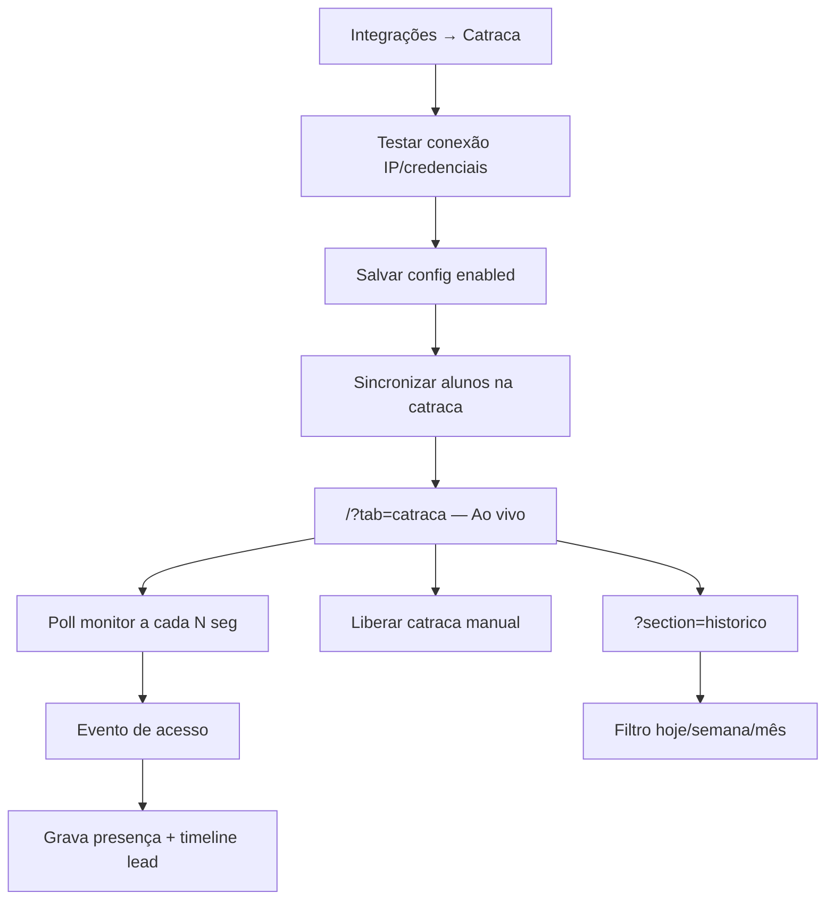

# Recepção — Control iD (ao vivo e histórico)

| Campo | Valor |
|---|---|
| **id** | `crm.recepcao.controlid` |
| **módulo** | CRM / Operação |
| **personas** | recepcionista, owner, admin |
| **rotas** | `/?tab=catraca` (ao vivo), `/?tab=catraca&section=historico`, `/?tab=catraca&section=retencao`, `/integracoes?tab=catraca` (setup) |
| **aliases legados** | `/recepcao` → `/?tab=catraca`; `/presenca` → `/?tab=catraca&section=historico` |
| **pré-requisitos** | Academia com alunos; hardware Control iD na rede local; servidor/ponte na recepção (quando aplicável) |
| **status** | revisado (código) |
| **última revisão** | 2026-06-17 |
| **validação** | [VALIDATION.md](../VALIDATION.md) |

**Specs relacionadas:** [2026-06-17-catraca-gaps-prioridade-alta-PRODUCT.md](../superpowers/specs/2026-06-17-catraca-gaps-prioridade-alta-PRODUCT.md)

**Harness relacionado:** `bootstrapRoutePrefetch.test.js` (`/recepcao` exige bootstrap de alunos)

**Arquivos-chave:** `src/pages/Recepcao.jsx`, `src/components/attendance/RecepcaoLivePanel.jsx`, `src/components/attendance/ControlIdAttendancePanel.jsx`, `src/components/attendance/AttendanceAtRiskSection.jsx`, `src/components/academy/ControlIdCatracaSection.jsx`, `src/lib/controlidApi.js`, `lib/server/controlidHandlers.js`

**Fluxo relacionado:** [aluno-perfil-presenca.md](aluno-perfil-presenca.md) (perfil do aluno, foto na catraca)

---

## Resumo

A aba **Catraca** da **Recepção** (`/?tab=catraca`) é a tela operacional na porta: feed **ao vivo** Control iD, **liberação manual** e **histórico** filtrável. Configuração em **Integrações → Catraca**. Fluxo pai: [hoje-dashboard.md](hoje-dashboard.md).

---

## Diagrama de fluxo

---

## Mapa de telas

| # | Rota | Componente | Ação do usuário | Resultado esperado |
|---|---|---|---|---|
| 1 | `/integracoes?tab=catraca` | `Integracoes` + `ControlIdCatracaSection` | Ativar integração | Sidebar Integrações; checkbox «Integração ativa» |
| 2 | Catraca | Testar conexão | IP, porta, usuário, senha | Lista de portais; toast sucesso |
| 3 | Catraca | Salvar | `saveControlIdConfig` | Config persistida por academia |
| 4 | `/?tab=catraca` | `RecepcaoCatracaTab` | Abrir aba Catraca na Recepção | Sub-abas **Ao vivo** (default) e **Histórico** |
| 5 | Ao vivo | `RecepcaoLivePanel` | Ver status dispositivo | Online / offline / não configurado |
| 6 | Ao vivo | **Liberar catraca** (header em `Dashboard.jsx` ou painel) | Motivo obrigatório → `releaseControlIdGate` | Toast; entrada manual no feed |
| 7 | Ao vivo | Feed entradas hoje | Poll automático | Novos registros com hora e link ao perfil |
| 8 | `?section=historico` | `ControlIdAttendancePanel` | Trocar período | Hoje, 7 dias, 30 dias, etc. |
| 8b | Catraca → Retenção | `AttendanceAtRiskSection` | Ver retenção por frequência / alunos em risco | KPIs do hero ou `?section=retencao` (sem sub-aba Retenção); filtros turma/**Faixa/Evolução** |
| 8c | Catraca (sem Control iD) | `AttendanceAtRiskSection` | Presença só manual (`VITE_APPWRITE_ATTENDANCE_COL_ID`) | Banner info + fila de retenção; feed ao vivo indisponível |
| 9 | Histórico | Atualizar / sync | `syncAllControlId` | Toast com contagem sincronizada |
| 10 | Histórico | Liberar catraca | Mesmo endpoint de release | Liberação remota |
| 11 | `/` Recepção | Botão **Liberar catraca** no header | Só visível na aba `?tab=catraca` com integração ativa | `ConfirmDialog` + `releaseControlIdGate` |
| 12 | `/student/:id` | Foto Control iD | Sincronizar rosto | `StudentControlIdPhoto` quando integração ativa |

### Abas da catraca (`RecepcaoCatracaTab`)

| Sub-aba | Query | Conteúdo |
|---|---|---|
| Ao vivo (default) | `/?tab=catraca` | Status, liberar porta, feed do dia; no desktop, fila de retenção ao lado |
| Histórico | `/?tab=catraca&section=historico` | Lista agrupada por data, filtros, sync em massa |

Retenção (`/?tab=catraca&section=retencao`) abre via KPIs do hero (Em risco / Sumidos) ou deep link — **sem** sub-aba própria na tablist.

---

## A — Auditoria operacional

### Pré-condições de dados

- [ ] `academyId` no contexto da sessão
- [ ] Integração ativa em `/integracoes?tab=catraca`
- [ ] Alunos com `controlid_user_id` (ou legado `device_id`) após sync
- [ ] Rede local alcança IP da catraca (ou `VITE_CONTROLID_API_BASE` em dev)

### Permissões

| Papel | Ver recepção | Configurar catraca | Liberar porta |
|---|---|---|---|
| **owner** | Sim | Sim | Sim |
| **admin** | Sim | Sim | Sim |
| **member** (recepcionista) | Sim | Via menu Integrações se tiver acesso à conta | Sim |

APIs usam `ensureAcademyAccess` + JWT; dados isolados por `academyId`.

### Checklist passo a passo — setup

1. [ ] Menu usuário → **Integrações** → aba **Catraca**
2. [ ] Marcar «Integração ativa»
3. [ ] Preencher **URL do servidor na recepção** (relay local), se diferente do padrão da instalação
4. [ ] Preencher IP, porta, usuário; senha na primeira vez ou ao retestar
5. [ ] **Testar conexão** → portais listados
6. [ ] Selecionar portal e **Salvar** (inclui intervalo entre entradas, se configurado)
7. [ ] Conferir **Última sincronização** (atualiza após sync de alunos)
8. [ ] No histórico (ou painel de alunos), **Sincronizar todos** se necessário
9. [ ] (Opcional) Ativar **Bloquear inadimplentes** se módulo financeiro estiver ativo

### Checklist passo a passo — operação diária

1. [ ] Abrir `/?tab=catraca` na Recepção (ou `/recepcao`, que redireciona)
2. [ ] Status **Online** com IP visível quando polling OK
3. [ ] Entrada na catraca aparece no feed em até um ciclo de poll (~intervalo configurado no painel)
4. [ ] **Liberar catraca** habilitado só com integração configurada; exige motivo (3–500 caracteres)
5. [ ] Clique em «ver perfil» abre `/student/:id`
6. [ ] Aba **Histórico** carrega registros do período
7. [ ] Troca de academia recarrega feed e status

### Estados de erro conhecidos

| Situação | Feedback esperado | Referência |
|---|---|---|
| Catraca não configurada | Botão liberar desabilitado; link para Integrações | `RecepcaoLivePanel` → `/integracoes?tab=catraca` |
| Presença manual sem Control iD | Banner info no topo; **Retenção por frequência** visível se `ATTENDANCE_COL` configurado | `RecepcaoCatracaTab` |
| Poll falha | Status **Offline** | `deviceOnline = false` |
| Sync parcial | Toast warning com `failed` | `syncAllControlId` |
| Release falha | Toast erro `friendlyError` | `useToast` |
| Aluno sem vínculo na catraca | Evento ignorado no servidor | `processAccessEvent` retorna null |
| Cooldown / inadimplente | Linha «ignorada» no feed ao vivo (amarelo) | `ignored` no monitor |
| Sync inadimplente com bloqueio ativo | Toast aviso; aluno não vai ao equipamento | `controlid_sync` / `sync-all` |

### Critérios de fluxo saudável vs regressão

**Saudável:** integração ativa, poll estável, presenças deduplicadas por `device_log_id`, timeline do lead com evento `attendance`.

**Regressão:** feed não atualiza com aba visível; liberar manual sem toast; histórico vazio com entradas no dia; leak entre academias.

---

## B — Roteiro de demonstração em vídeo

**Duração alvo:** 3 min

### Dados de demonstração sugeridos

| Entidade | Valor fictício |
|---|---|
| Aluno | Ana Costa — já sincronizada na catraca |
| IP catraca | 192.168.1.100 (rede da academia) |
| Entrada simulada | 18:04 — reconhecimento facial |

### Cenas

| Cena | Tela | Narração sugerida | Gancho de valor |
|---|---|---|---|
| 1 | Integrações → Catraca | "Conectamos o Control iD uma vez; IP e portal salvos por academia." | Setup único |
| 2 | `/?tab=catraca` Ao vivo | "Na recepção, a aba Catraca mostra quem entrou hoje em tempo real." | Operação visual |
| 3 | Liberar catraca | "Visitante ou entrega? Um toque libera a porta." | Flexibilidade |
| 4 | Perfil aluno | "Cada entrada alimenta o histórico de presença do aluno." | CRM integrado |
| 5 | Histórico | "Filtro por semana para conferência de frequência." | Gestão |

### O que não mostrar

- Senha do equipamento Control iD
- `controlid_user_id` interno
- Logs do servidor local / console

---

## Variações e atalhos

- **Recepção:** botão «Liberar catraca» no header **somente** na aba `?tab=catraca` (`controlIdCfg.enabled && isCatracaTab`)
- **Alunos:** `ControlIdAttendancePanel` em `view=presenca` com link «Modo recepção» → `/?tab=catraca`
- **Legado:** `/recepcao` → `/?tab=catraca`; `/presenca` → histórico canônico
- **Dev:** `VITE_CONTROLID_API_BASE` aponta para ponte local
- **API:** rotas via `api/leads?route=controlid_*` e `GET /api/control-id/status`

---

## Histórico de revisão

| Data | Autor | Mudança |
|---|---|---|
| 2026-06-17 | — | Rotas canônicas `/?tab=catraca`; alinhado ao hub Recepção em [hoje-dashboard.md](hoje-dashboard.md) |
| 2026-06-17 | — | P2: seções na config, badge bloqueado, última sync no histórico |
| 2026-06-17 | — | P0/P1: sync ignora inadimplentes, feed de entradas ignoradas, release para recepcionista |
| 2026-06-17 | — | F4 catraca: bloqueio de inadimplentes |
| 2026-06-17 | — | F3 catraca: anti-passback (intervalo entre entradas) |
| 2026-06-17 | — | F2 catraca: justificativa obrigatória na liberação manual |
| 2026-06-17 | — | F1 catraca: URL relay na UI, última sincronização visível |
| 2026-06-15 | — | Criação inicial |
