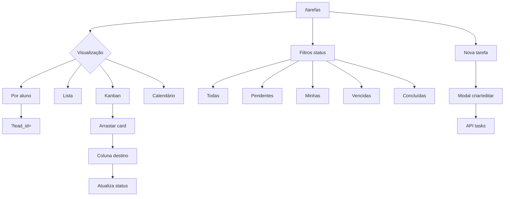

# Tarefas — operação diária

| Campo | Valor |
|---|---|
| **id** | `crm.tarefas.operacao` |
| **módulo** | CRM |
| **personas** | recepcionista, owner, instrutor |
| **rotas** | `/tarefas`, `/tarefas?lead_id=`, `/tarefas?new=1`, `/tarefas?filter=overdue` |
| **pré-requisitos** | Usuário autenticado; equipe com `teamId` para atribuição |
| **status** | revisado |
| **última revisão** | 2026-06-15 |

**Specs relacionadas:** — (tarefas de cobrança seguem `src/lib/collectionRules.js`)

**Harness relacionado:** `npm test -- taskDue taskLinkablePeople`

**Arquivos-chave:** `src/pages/Tasks.jsx`, `src/store/useTaskStore.js`, `src/components/shared/TaskCard.jsx`

---

## Resumo

A página **Tarefas** organiza pendências da equipe em quatro visualizações (por aluno, lista, kanban, calendário), com filtros por status, responsável e prazo. O operador cria tarefas vinculadas a leads/alunos, conclui ou reabre itens, e usa o kanban para arrastar entre colunas — incluindo tarefas automáticas de cobrança quando configuradas.

---

## Diagrama de fluxo

---

## Mapa de telas

| # | Rota | Componente | Ação do usuário | Resultado esperado |
|---|---|---|---|---|
| 1 | `/tarefas` | `Tasks.jsx` | Abrir **Tarefas** na sidebar | Header + toggle de visualização |
| 2 | `/tarefas` | `HubTabBar` | Escolher Por aluno / Lista / Kanban / Calendário | View persiste em `localStorage` (`nave_tasks_view`) |
| 3 | `/tarefas` | Filter chips | Todas, Pendentes, Minhas, Vencidas, Concluídas | Lista filtrada; chip ativo destacado |
| 4 | `/tarefas` | Chip **Esta semana** | Alternar período | Tarefas fora da semana ocultas; hint se sem prazo |
| 5 | `/tarefas` | **Nova tarefa** | Abrir modal | Formulário com título, prazo, responsável, vínculo aluno |
| 6 | `/tarefas?new=1` | Modal | Deep link abre criação | Modal já visível ao carregar |
| 7 | `/tarefas?lead_id=` | Filtro ativo | Vindo do perfil do aluno | Chip "Aluno: Nome ✕" filtra tarefas |
| 8 | `/tarefas` | `TaskCard` | Marcar concluída | Status `done`; move para coluna/seção concluídas |
| 9 | `/tarefas` | Kanban | Arrastar entre Atrasadas / A fazer / Concluídas | Status atualizado via API |
| 10 | `/tarefas` | Por aluno | Expandir grupo do aluno | Tarefas pendentes e concluídas do vínculo |
| 11 | `/tarefas` | Calendário | Navegar datas | Tarefas por dia de vencimento |
| 12 | `/tarefas` | Tarefa de cobrança | Registrar tentativa | `CollectionResultModal` com resultado da cobrança |

---

## A — Auditoria operacional

### Pré-condições de dados

- [ ] Membros da equipe carregados (`teams` API) para atribuição
- [ ] Leads e alunos no store para vínculo em "Por aluno"
- [ ] Tarefa de teste pendente com prazo ontem (para filtro Vencidas)

### Checklist passo a passo

1. [ ] `/tarefas` carrega sem erro; skeleton some após fetch
2. [ ] Alternar as 4 visualizações — estado persiste após reload
3. [ ] Filtro **Pendentes** — só tarefas não concluídas
4. [ ] Filtro **Minhas** — só tarefas atribuídas ao usuário logado
5. [ ] Filtro **Vencidas** — tarefas com prazo passado e abertas
6. [ ] **Nova tarefa** — criar com título e prazo — aparece na lista
7. [ ] Vincular aluno na criação — grupo correto em "Por aluno"
8. [ ] Concluir tarefa na lista — some de Pendentes; visível em Concluídas
9. [ ] Kanban: arrastar de A fazer → Concluídas — persistido após refresh
10. [ ] Deep link `/tarefas?lead_id=X` — filtro aplicado; ✕ remove filtro
11. [ ] Limite 500 tarefas — aviso `tasks-limit-notice` se atingido
12. [ ] Link "Configurar processos automáticos" → `/automacoes?tab=processos`

### Estados de erro conhecidos

| Situação | Feedback esperado | Referência |
|---|---|---|
| Falha API tasks | `ErrorBanner` + retry | `Tasks.jsx` |
| Update concorrente | Toast; `isUpdating` bloqueia duplo submit | `useTaskStore` |
| Membros não carregados | Lista de responsáveis vazia ou fallback | `membersError` |

### Permissões e multi-tenant

- `fetchTasks` sempre com `academyId`; filtros server-side via `serverTaskFilters`.
- Ver [docs/multi-tenant-conventions.md](../multi-tenant-conventions.md).

### Critérios de fluxo saudável vs regressão

**Saudável:** Kanban drag reflete status real; filtro Minhas usa `userId` correto; tarefas de cobrança abrem modal especializado.

**Regressão:** Drag reverte silenciosamente; filtro URL ignorado; tarefas de outra academia visíveis.

---

## B — Roteiro de demonstração em vídeo

**Duração alvo:** 3–4 min

### Dados de demonstração sugeridos

| Entidade | Valor fictício |
|---|---|
| Tarefa | "Ligar para confirmar experimental — Carla" |
| Responsável | Recepção (usuário demo) |
| Prazo | Amanhã |

### Cenas

| Cena | Tela | Narração sugerida | Gancho de valor |
|---|---|---|---|
| 1 | Tarefas lista | "Pendências da equipe num só lugar — nada fica só na cabeça de ninguém." | Organização |
| 2 | Por aluno | "Agrupo por aluno: vejo tudo que falta fazer para a Carla." | Contexto por pessoa |
| 3 | Nova tarefa | "Crio em segundos, defino prazo e quem é responsável." | Delegação clara |
| 4 | Kanban | "Arrasto para Concluídas quando finalizei — visual estilo Trello." | Gestão visual |
| 5 | Vencidas | "Filtro o que está atrasado e priorizo o dia." | Urgência visível |
| 6 | Automações | "E tarefas podem nascer sozinhas dos processos automáticos." | Escala operacional |

### O que não mostrar

- Tarefas internas de sistema sem rótulo amigável
- Erro de membros da equipe não configurados
- Mais de 500 tarefas sem usar filtros (cenário extremo)

---

## Variações e atalhos

- **Do Hoje:** tarefas do dia linkam para `/tarefas`
- **Do perfil aluno/lead:** criar tarefa com `?lead_id=` pré-preenchido
- **URL:** `?status=pendentes`, `?filter=overdue`, `?period=today` aplicam filtros iniciais
- **Mobile:** layout adaptado; kanban pode exigir scroll horizontal
- **Processos automáticos:** tarefas geradas por automações em `/automacoes`

---

## Histórico de revisão

| Data | Autor | Mudança |
|---|---|---|
| 2026-06-15 | — | Criação inicial |
