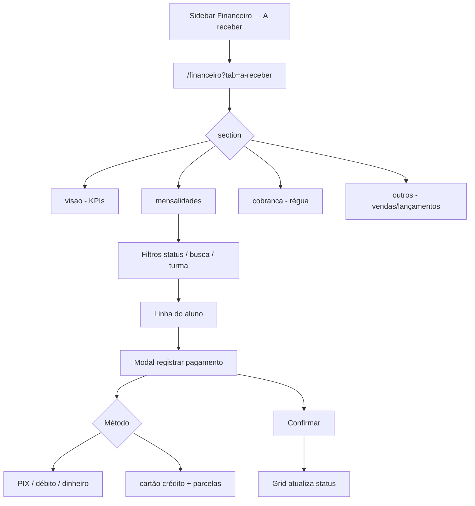

# A receber — mensalidades e cobrança

| Campo | Valor |
|---|---|
| **id** | `financeiro.a-receber.mensalidades` |
| **módulo** | Financeiro |
| **personas** | recepcionista (member), admin, owner |
| **rotas** | `/financeiro?tab=a-receber`, `/financeiro?tab=a-receber&section=mensalidades` |
| **pré-requisitos** | Módulo `finance` ativo; planos configurados; conta bancária em Minha academia → Financeiro → Recebimento |
| **status** | revisado (código) |
| **última revisão** | 2026-06-15 |
| **validação** | [VALIDATION.md](../VALIDATION.md) |

**Specs relacionadas:**

- [2026-06-15-mensalidades-parcelamento-taxas-PRODUCT.md](../../superpowers/specs/2026-06-15-mensalidades-parcelamento-taxas-PRODUCT.md)
- [2026-06-15-taxas-cartao-metodos-canonicos-PRODUCT.md](../../superpowers/specs/2026-06-15-taxas-cartao-metodos-canonicos-PRODUCT.md)
- [2026-06-15-financeiro-nav-non-owner-PRODUCT.md](../../superpowers/specs/2026-06-15-financeiro-nav-non-owner-PRODUCT.md)

**Harness relacionado:** `npm test -- mensalidades paymentMethods mensalidadesPaymentForm`

**Arquivos-chave:** `src/pages/Caixa.jsx`, `src/components/finance/ReceivablesTab.jsx`, `src/components/finance/MensalidadesPanel.jsx`, `src/lib/financeiroReceivablesSections.js`

---

## Resumo

O operador acessa **A receber → Mensalidades**, filtra alunos por status do mês (em dia, atraso, exceções), registra pagamento com método e taxas (PIX, dinheiro, cartão, parcelas no crédito) e acompanha KPIs do mês de referência.

---

## Diagrama de fluxo

---

## Mapa de telas

| # | Rota | Componente | Ação do usuário | Resultado esperado |
|---|---|---|---|---|
| 1 | `/financeiro?tab=a-receber` | `ReceivablesTab` | Abrir **A receber** | Hub com sub-abas: Visão geral, Mensalidades, Cobrança, Outros |
| 2 | `&section=mensalidades` | `MensalidadesPanel` | Selecionar **Mensalidades** | Grade/lista do mês de referência |
| 3 | Mensalidades | Seletor de mês | Trocar mês de referência | KPIs e linhas recalculam |
| 4 | Mensalidades | `MensalidadesStatusFilter` | Filtrar (pago, pendente, atraso, exceções) | Lista filtrada |
| 5 | Mensalidades | Busca / turma | Refinar lista | Alunos correspondentes |
| 6 | Mensalidades | Célula / ação pagar | Abrir modal de pagamento | `openPaymentModal` com aluno e mês |
| 7 | Modal | Tipo mensalidade / pacote | Escolher categoria | Valor e regras do plano |
| 8 | Modal | Método de pagamento | PIX, dinheiro, débito, crédito, transferência | Taxa aplicada quando configurada |
| 9 | Modal | Parcelas (só crédito) | Selecionar 1–12x | `expectedAmountWithCardFee` no total |
| 10 | Modal | Conta bancária | Selecionar conta | Obrigatório se há contas configuradas |
| 11 | Modal | Confirmar | Salvar pagamento | Toast sucesso; status na grade atualiza |
| 12 | Mensalidades | Exportar CSV | Download planilha | Arquivo gerado (`exportMensalidadesGridCsv`) |

---

## A — Auditoria operacional

### Pré-condições de dados

- [ ] Módulo `finance` habilitado na academia
- [ ] Pelo menos um plano em `/empresa?tab=financeiro&section=planos` (owner)
- [ ] Conta para recebimento em `section=recebimento`
- [ ] Alunos ativos com plano e dia de vencimento
- [ ] Taxas de cartão configuradas (se testar parcelas/crédito)

### Permissões por papel

| Papel | Acesso A receber | Mensalidades | Notas |
|---|---|---|---|
| **member** | Sim | Sim | Aba padrão do hub; sem Conciliação/Fechamento |
| **admin** | Sim | Sim | Idem + Previsão e Conferência do mês |
| **owner** | Sim | Sim | + Conciliação |

### Checklist passo a passo

1. [ ] Abrir `/financeiro?tab=a-receber&section=mensalidades` — painel carrega sem `ErrorBanner` persistente
2. [ ] Sub-aba **Visão geral** mostra resumo do mês e links para detalhes
3. [ ] Sub-aba **Mensalidades** lista alunos do mês de referência
4. [ ] Filtro de status reduz a lista (ex.: só em atraso)
5. [ ] Busca por nome parcial encontra aluno
6. [ ] Abrir modal de pagamento — valor do plano pré-preenchido
7. [ ] PIX — total sem parcelas; confirmar → toast sucesso
8. [ ] Cartão crédito 3x — campo parcelas visível; total com taxa coerente com config
9. [ ] Sem conta bancária configurada — CTA/link para `EMPRESA_FINANCE_ACCOUNTS_PATH`
10. [ ] Após pagamento, célula do mês reflete status pago/parcial
11. [ ] Sub-aba **Cobrança** — fila de régua (não é lista de mensalidades)
12. [ ] Member acessando `?tab=conciliacao` — redirect para aba permitida
13. [ ] Trocar academia — lista só alunos da academia atual

### Estados de erro conhecidos

| Situação | Feedback esperado | Referência |
|---|---|---|
| Falha ao carregar pagamentos | `ErrorBanner` + retry | `MensalidadesPanel` |
| Conta bancária inválida | Erro no modal / botão desabilitado | `validateBankAccountForPayment` |
| Data futura inválida | Validação no formulário | `isPaymentDateInFuture` |
| Falha ao salvar | Toast erro amigável | [docs/ux-feedback.md](../../ux-feedback.md) |

### Critérios de fluxo saudável vs regressão

**Saudável:** Taxa de cartão refletida no total; parcelas só em crédito; export CSV bate com filtros visíveis.

**Regressão:** Pagamento salvo sem conta quando obrigatória; subcobrança em parcelas; dados de outra academia na grade.

---

## B — Roteiro de demonstração em vídeo

**Duração alvo:** 4–5 min

### Dados de demonstração sugeridos

| Entidade | Valor fictício |
|---|---|
| Aluno | Pedro Santos — Plano Intermediário R$ 200 |
| Mês | Mês corrente |
| Pagamento demo | PIX R$ 200; depois crédito 3x com taxa |

### Cenas

| Cena | Tela | Narração sugerida | Gancho de valor |
|---|---|---|---|
| 1 | A receber | "Tudo que a academia tem a receber num lugar — mensalidades, cobrança e outros." | Visão financeira |
| 2 | Mensalidades | "Vejo quem está em dia, quem atrasou e filtro por turma." | Controle de inadimplência |
| 3 | Modal PIX | "Registro o PIX em segundos — valor do plano já vem preenchido." | Agilidade na recepção |
| 4 | Cartão 3x | "No crédito parcelado, o Nave já aplica a taxa configurada." | Sem subcobrança |
| 5 | Visão geral | "Os KPIs do mês fecham o quadro para o dono da academia." | Gestão |

### O que não mostrar

- IDs de transação ou `academyId`
- Configuração de planos/taxas (fluxo Fase 2B)
- Alias `/mensalidades` (usar `/financeiro?tab=a-receber&section=mensalidades`)

---

## Variações e atalhos

- **Sidebar:** Financeiro → A receber → mensalidades (`naviMenu.js`)
- **Perfil do aluno:** registrar pagamento em [`crm/aluno-perfil-presenca.md`](../crm/aluno-perfil-presenca.md)
- **Deep link:** `?student=` / NL prefill (`NL_PAYMENT_PREFILL_EVENT`)
- **Exceções:** view dedicada em `PaymentExceptionsView` dentro do painel
- **Rotas legadas:** `/caixa`, `/mensalidades` → redirect para hub canônico

---

## Histórico de revisão

| Data | Autor | Mudança |
|---|---|---|
| 2026-06-15 | — | Criação Fase 2A |
