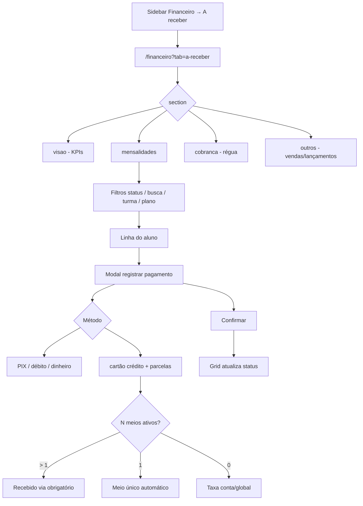

# A receber — mensalidades e cobrança

| Campo | Valor |
|---|---|
| **id** | `financeiro.a-receber.mensalidades` |
| **módulo** | Financeiro |
| **personas** | recepcionista (member), admin, owner |
| **rotas** | `/financeiro?tab=a-receber`, `/financeiro?tab=a-receber&section=mensalidades` |
| **pré-requisitos** | Módulo `finance` ativo; planos configurados; conta bancária em Minha academia → Financeiro → Recebimento |
| **status** | revisado (código) |
| **última revisão** | 2026-07-23 |
| **validação** | [VALIDATION.md](../VALIDATION.md) |

**Specs relacionadas:**

- [2026-07-23-plan-price-snapshot-design.md](../../superpowers/specs/2026-07-23-plan-price-snapshot-design.md) — valor esperado usa `plan_price` quando presente
- [2026-07-22-mensalidades-coluna-pagador-design.md](../../superpowers/specs/2026-07-22-mensalidades-coluna-pagador-design.md)
- [2026-06-15-mensalidades-parcelamento-taxas-PRODUCT.md](../../superpowers/specs/2026-06-15-mensalidades-parcelamento-taxas-PRODUCT.md)
- [2026-06-15-taxas-cartao-metodos-canonicos-PRODUCT.md](../../superpowers/specs/2026-06-15-taxas-cartao-metodos-canonicos-PRODUCT.md)
- [2026-06-15-financeiro-nav-non-owner-PRODUCT.md](../../superpowers/specs/2026-06-15-financeiro-nav-non-owner-PRODUCT.md)
- [2026-06-17-formas-recebimento-meios-captura-PRODUCT.md](../../superpowers/specs/2026-06-17-formas-recebimento-meios-captura-PRODUCT.md) — formas ativas + «Recebido via»

**Harness relacionado:** `npm test -- mensalidadesPaymentForm captureMethods paymentMethodSettings appwriteErrors`

**Arquivos-chave:** `src/pages/Caixa.jsx`, `src/components/finance/ReceivablesTab.jsx`, `src/components/finance/MensalidadesPanel.jsx`, `src/lib/mensalidadesPaymentForm.js`, `src/components/finance/CaptureMethodSelect.jsx`, `src/lib/captureMethodPaymentForm.js`, `src/components/shared/PaymentFormErrorBanner.jsx`, `src/components/finance/FinanceBankAccountsSetupBanner.jsx`

---

## Resumo

O operador acessa **A receber → Mensalidades**, filtra alunos por status do mês (em dia, atraso, exceções), registra pagamento com método e taxas (PIX, dinheiro, cartão, parcelas no crédito). A grade lista **Pagador** ao lado do aluno (1º alias de quem paga → responsável → pai/mãe) para conferência; o CSV exporta a mesma coluna. Em cartão, se houver mais de um **meio de captura** ativo, escolhe **Recebido via** (maquininha/link). Formas desativadas na config não aparecem no modal. Alunos cujo plano está marcado como **isento** em Minha academia → Financeiro → Planos aparecem com status **Isento**, sem vencimento e sem ação de registrar pagamento. Valor esperado: se o aluno tem `students.plan_price`, usa esse snapshot menos `discount_amount`; senão, preço de catálogo do plano menos desconto.

---

## Diagrama de fluxo

---

## Mapa de telas

| # | Rota | Componente | Ação do usuário | Resultado esperado |
|---|---|---|---|---|
| 1 | `/financeiro?tab=a-receber` | `ReceivablesTab` | Abrir **A receber** | Hub com sub-abas: Visão geral, Mensalidades, Cobrança, Outros |
| 2 | `&section=mensalidades` | `MensalidadesPanel` | Selecionar **Mensalidades** | Grade/lista do mês de referência |
| 3 | Mensalidades | Seletor de mês | Trocar mês de referência | KPIs e linhas recalculam |
| 4 | Mensalidades | `MensalidadesStatusFilter` | Filtrar (pago, pendente, coberto, trancado, isento, atraso recepção, régua) | Lista ou resumo filtrados |
| 5 | Mensalidades | Busca / turma / plano | Refinar lista ou resumo | Alunos correspondentes |
| 6 | Mensalidades | Célula / ação pagar | Abrir modal de pagamento | `openPaymentModal` com aluno e mês |
| 7 | Modal | Tipo mensalidade / pacote | Escolher categoria | Valor e regras do plano |
| 8 | Modal | Método de pagamento | PIX, dinheiro, débito, crédito, transferência | Só formas **ativas** em `formas-recebimento` |
| 8b | Modal | **Recebido via** (cartão) | Selecionar meio de captura | Visível só se 2+ meios ativos; `FieldError` se vazio |
| 9 | Modal | Parcelas (só crédito) | Selecionar 1–12x | Taxa/prazo do meio ou conta/global |
| 10 | Modal | Conta bancária | Selecionar conta | Preenchida pelo meio ou forma; obrigatória |
| 11 | Modal | Confirmar | Salvar pagamento | Toast sucesso; duplicata/erro API em `PaymentFormErrorBanner` |
| 12 | Modal (sem conta) | Rodapé | Tentar confirmar | Botão desabilitado + `PaymentModalFooterHint` com link para Recebimento |
| 13 | Mensalidades | Exportar CSV | Download planilha (Lista ou Resumo) | Arquivo gerado (`exportMensalidadesGridCsv`) |

---

## A — Auditoria operacional

### Pré-condições de dados

- [ ] Módulo `finance` habilitado na academia
- [ ] Pelo menos um plano em `/empresa?tab=financeiro&section=planos` (owner)
- [ ] Conta para recebimento em `section=recebimento`
- [ ] Formas desejadas ativas em `section=formas-recebimento`
- [ ] Opcional: meios de captura para cartão (2+ meios → testar «Recebido via»)
- [ ] Alunos ativos com plano e dia de vencimento
- [ ] Taxas de cartão configuradas (se testar parcelas/crédito)

### Permissões por papel

| Papel | Acesso A receber | Mensalidades | Notas |
|---|---|---|---|
| **member** | Sim | Sim | Aba padrão do hub; sem Conciliação/Fechamento |
| **admin** | Sim | Sim | Idem + Previsão e Conferência do mês |
| **owner** | Sim | Sim | + Conciliação |

### Checklist passo a passo

1. [ ] Abrir `/financeiro?tab=a-receber&section=mensalidades` — painel carrega sem `ErrorBanner` persistente
2. [ ] Sub-aba **Visão geral** mostra resumo do mês e links para detalhes
3. [ ] Sub-aba **Mensalidades** lista alunos do mês de referência
3b. [ ] Coluna **Pagador** ao lado do aluno (alias → responsável → pai/mãe); CSV inclui `pagador`
4. [ ] Filtro de status reduz a lista (ex.: só pendente ou só atraso na recepção)
5. [ ] Chip **Pagos no mês** inclui pagos e cobertos; dropdown **Pago** só pagos efetivos
6. [ ] Filtros de turma e plano funcionam na grade **Lista** e na aba **Resumo**
7. [ ] Busca por nome parcial encontra aluno
8. [ ] Abrir modal de pagamento — valor esperado pré-preenchido: `plan_price` (ou catálogo) líquido de desconto individual
9. [ ] PIX — total sem parcelas; confirmar → toast sucesso
10. [ ] Cartão crédito 3x — campo parcelas visível; total com taxa do meio/conta
10b. [ ] Cartão com 2 meios — **Recebido via** obrigatório; sem seleção → `FieldError`
10c. [ ] Cartão com 1 meio — salva sem dropdown; `capture_method_id` no payload
10d. [ ] Forma desativada (ex. transferência) — não aparece no grid de métodos
11. [ ] Sem conta bancária — banner no painel + hint no rodapé do modal; botão Confirmar desabilitado; link `EMPRESA_FINANCE_ACCOUNTS_PATH` (owner/admin)
12. [ ] Valor zero ou data inválida — `FieldError` no campo (não só toast)
13. [ ] Dinheiro com valor recebido menor que o total — `FieldError` em valor recebido
14. [ ] Duplicata (mesmo valor+data) — mensagem no banner do modal (`studentPaymentFriendlyError`)
15. [ ] Após pagamento, célula do mês reflete status pago/parcial
16. [ ] Sub-aba **Cobrança** — fila de régua (não é lista de mensalidades)
17. [ ] Member acessando `?tab=conciliacao` — redirect para aba permitida
18. [ ] Trocar academia — lista só alunos da academia atual
19. [ ] Plano marcado como isento em `section=planos` faz o aluno aparecer como **Isento**, com valor `Isento`, vencimento `—` e sem CTA de cobrança
20. [ ] Aluno isento não entra em régua, inadimplência nem nos KPIs financeiros de mensalidades
20b. [ ] Aluno com plano anual / cobertura histórica cobrindo o mês **não** aparece em A receber nem nos KPIs de esperado/atraso da Visão geral
20c. [ ] Espelho de mensalidade no Caixa (`origin_type: student_payment`) **não** aparece como “Lançamento pendente” na Visão geral
20d. [ ] Em item de lançamento na Visão, **Abrir** abre o detalhe do TX mesmo se estiver fora do período da aba Lançamentos
21. [ ] Deep link `?filtro=` (ex. `overdue`, `paid_in_month`, `covered`) aplica filtro na grade de Mensalidades (não redireciona para Cobrança)
21b. [ ] Chip **Em atraso** filtra a lista; link **Abrir fila de cobrança** permanece separado
21c. [ ] KPIs Esperado/Recebido/Em aberto visíveis acima da grade; Em aberto sincroniza com dropdown de status
22. [ ] Grade carrega todos os alunos ativos (não só primeira página do store)

### Estados de erro conhecidos

| Situação | Feedback esperado | Referência |
|---|---|---|
| Falha ao carregar pagamentos | `ErrorBanner` + retry | `MensalidadesPanel` |
| Conta bancária ausente / inválida | Banner no painel + `FieldError` no campo conta + rodapé do modal | `validateMensalidadesPaymentForm`, `FinanceBankAccountsSetupBanner` |
| Valor, data, troco, meio inválido | `FieldError` no campo; foco no primeiro erro | `validateMensalidadesPaymentForm`, `validateCaptureMethodForSubmit` |
| Forma desativada no servidor | Erro API no banner | `assertPaymentMethodActive` |
| Duplicata ou erro API ao salvar | `PaymentFormErrorBanner` persistente | `studentPaymentFriendlyError` |
| Data futura inválida | Validação no formulário | `isPaymentDateInFuture` |

### Critérios de fluxo saudável vs regressão

**Saudável:** Taxa de cartão refletida no total; parcelas só em crédito; meio correto quando N>1; export CSV bate com filtros visíveis.

**Regressão:** Pagamento salvo sem conta quando obrigatória; cartão sem meio quando N>1; subcobrança em parcelas; dados de outra academia na grade.

---

## B — Roteiro de demonstração em vídeo

**Duração alvo:** 4–5 min

### Dados de demonstração sugeridos

| Entidade | Valor fictício |
|---|---|
| Aluno | Pedro Santos — Plano Intermediário R$ 200 |
| Mês | Mês corrente |
| Pagamento demo | PIX R$ 200; depois crédito 3x com taxa |

### Cenas

| Cena | Tela | Narração sugerida | Gancho de valor |
|---|---|---|---|
| 1 | A receber | "Tudo que a academia tem a receber num lugar — mensalidades, cobrança e outros." | Visão financeira |
| 2 | Mensalidades | "Vejo quem está em dia, quem atrasou e filtro por turma." | Controle de inadimplência |
| 3 | Modal PIX | "Registro o PIX em segundos — valor do plano já vem preenchido." | Agilidade na recepção |
| 4 | Cartão 3x | "No crédito parcelado, escolho a maquininha e o Nave aplica a taxa certa." | Sem subcobrança |
| 5 | Visão geral | "Os KPIs do mês fecham o quadro para o dono da academia." | Gestão |

### O que não mostrar

- IDs de transação ou `academyId`
- Configuração de planos/taxas (fluxo Fase 2B)
- Alias `/mensalidades` (usar `/financeiro?tab=a-receber&section=mensalidades`)

---

## Variações e atalhos

- **Sidebar:** Financeiro → A receber → mensalidades (`naviMenu.js`)
- **Config formas/meios:** [config-inicial-financeiro.md](config-inicial-financeiro.md) → `section=formas-recebimento`
- **Perfil do aluno:** registrar pagamento em [`crm/aluno-perfil-presenca.md`](../crm/aluno-perfil-presenca.md)
- **Deep link:** `?filtro=` (`paid`, `paid_in_month`, `pending`, `overdue`, `covered`, `frozen`, `regua_*`, etc.) · `?student=` / NL prefill (`NL_PAYMENT_PREFILL_EVENT`)
- **Exceções:** view dedicada em `PaymentExceptionsView` dentro do painel
- **Rotas legadas:** `/caixa`, `/mensalidades` → redirect para hub canônico

---

## Histórico de revisão

| Data | Autor | Mudança |
|---|---|---|
| 2026-07-23 | — | Valor esperado: `plan_price` snapshot quando presente; senão catálogo (− desconto) |
| 2026-07-22 | — | A receber / Visão geral: cobertura de pacote; exclui espelho de mensalidade; deep link `?tx=` resolve fora do período |
| 2026-07-22 | — | A receber / Visão geral respeitam cobertura por pacote anual e cobertura histórica |
| 2026-07-22 | — | Fix: CSS de KPIs + dropdown de status restaurados em `finance.css`; sync `filtro`/`search` sem reset em todo `searchParams` |
| 2026-06-25 | — | Filtros unificados (status/turma/plano em Lista e Resumo), `paid_in_month`, coberto/trancado, paginação completa de alunos, export em ambas as views |
| 2026-06-23 | — | Mensalidades e projeções passam a usar `students.discount_amount` no valor esperado |
| 2026-06-15 | — | Criação Fase 2A |
| 2026-06-16 | — | Auditoria salvamento: `FieldError`, banners, rodapé modal, matriz em VALIDATION.md |
| 2026-06-17 | — | Fase 2: «Recebido via», formas ativas, `capture_method_id` |
| 2026-06-19 | — | Planos isentos/bolsista: status `Isento`, sem cobrança e fora dos KPIs |
