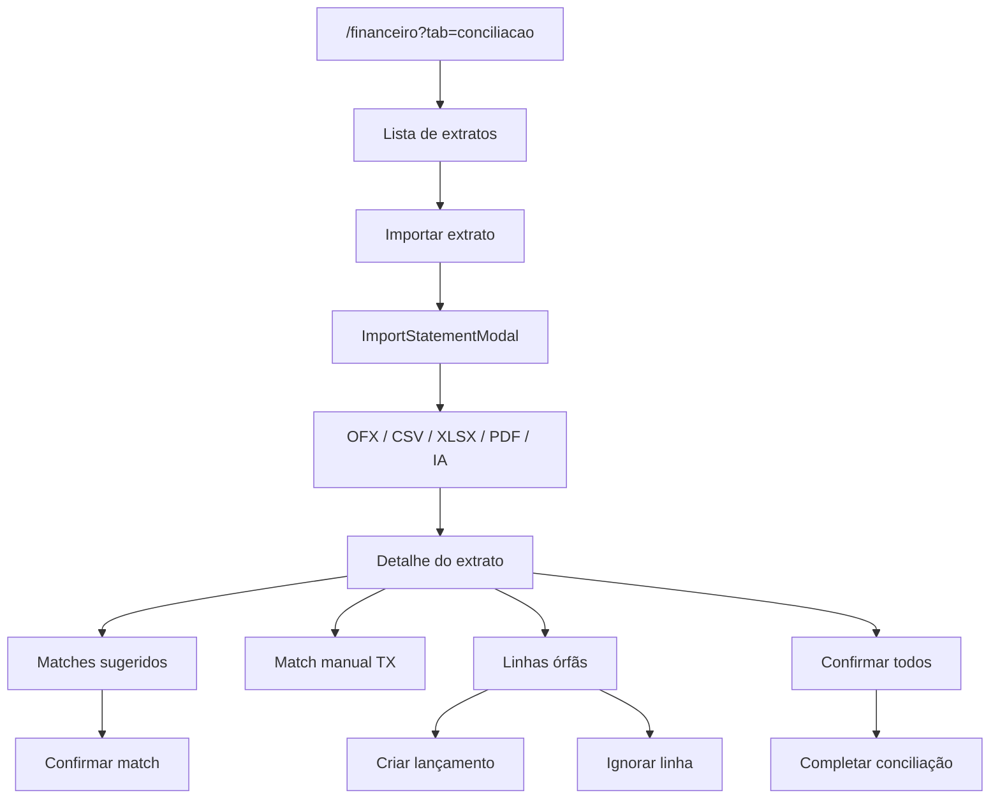

# Conciliação bancária

| Campo | Valor |
|---|---|
| **id** | `financeiro.conciliacao.bancaria` |
| **módulo** | Financeiro |
| **personas** | owner (obrigatório); admin/member **sem acesso** à aba |
| **rotas** | `/financeiro?tab=conciliacao` |
| **pré-requisitos** | Módulo `finance`; contas bancárias; lançamentos liquidados; extrato bancário (OFX/CSV/XLSX/PDF) |
| **status** | revisado (código) |
| **última revisão** | 2026-06-17 |
| **validação** | [VALIDATION.md](../VALIDATION.md) |

**Specs relacionadas:**

- [2026-06-15-conciliacao-ux-refactor-PRODUCT.md](../../superpowers/specs/2026-06-15-conciliacao-ux-refactor-PRODUCT.md)
- [2026-06-15-conciliacao-multi-formato-PRODUCT.md](../../superpowers/specs/2026-06-15-conciliacao-multi-formato-PRODUCT.md)
- [2026-06-16-conciliacao-deduplicacao-extratos-PRODUCT.md](../../superpowers/specs/2026-06-16-conciliacao-deduplicacao-extratos-PRODUCT.md)
- [2026-06-16-conciliacao-pagadores-conhecidos-PRODUCT.md](../../superpowers/specs/2026-06-16-conciliacao-pagadores-conhecidos-PRODUCT.md) *(P0a/P0b/P1 implementados)*
- [2026-06-16-conciliacao-pagadores-conhecidos-TECH.md](../../superpowers/specs/2026-06-16-conciliacao-pagadores-conhecidos-TECH.md) *(P0a/P0b/P1 implementados)*
- [2026-06-16-conciliacao-ux-evolucao-PRODUCT.md](../../superpowers/specs/2026-06-16-conciliacao-ux-evolucao-PRODUCT.md) *(rascunho — onboarding, mobile, mensalidade inline, regras)*
- [2026-06-16-conciliacao-ux-evolucao-TECH.md](../../superpowers/specs/2026-06-16-conciliacao-ux-evolucao-TECH.md)

**Harness relacionado:** `npm test -- bankRecon bankReconciliationMatcher bankReconciliationValidation`

**Arquivos-chave:** `src/components/finance/ReconciliationTab.jsx`, `src/components/finance/ImportStatementModal.jsx`, `src/lib/bankReconciliationApi.js`

---

## Resumo

O **owner** importa extratos bancários, revisa sugestões de match automático, confirma vínculos com lançamentos liquidados, trata linhas órfãs (criar lançamento ou ignorar) e finaliza a conciliação do período.

---

## Diagrama de fluxo

---

## Mapa de telas

| # | Rota | Componente | Ação do usuário | Resultado esperado |
|---|---|---|---|---|
| 1 | `/financeiro?tab=conciliacao` | `ReconciliationTab` | Abrir aba (owner) | Lista de extratos importados |
| 2 | Conciliação | **Importar** | Abrir `ImportStatementModal` | Upload arquivo; parsing |
| 3 | Modal import | Selecionar conta / arquivo | Confirmar | Extrato na lista; hint no rodapé se botão desabilitado (`importDisabledReason`) |
| 4 | Lista | **Abrir** extrato | Ver detalhe | KPIs: pendentes, conciliados, gap |
| 5 | Detalhe | `BankReconPairRow` | Confirmar match sugerido | `confirmBankMatch` |
| 6 | Detalhe | **Confirmar todos** | Batch | `confirmAllBankMatches` |
| 7 | Detalhe | Match manual | Escolher TX + nota | `manualReconcileTx` |
| 8 | Detalhe | Órfãos Nave / banco | Criar TX ou ignorar | `createTxFromBankItem` / `ignoreBankItem` |
| 8b | Detalhe | Lista órfãos Nave | Buscar / filtrar entradas-saídas / ver detalhes | Filtro local + `FinanceTxDetailDrawer` |
| 9 | Detalhe | **Completar conciliação** | Nota opcional | `completeBankReconciliation`; status reconciliado |
| 9b | Detalhe | **Handoff fechamento** | Após `completed_at` | Card com link `/financeiro?tab=fechamento&month=YYYY-MM` |
| 10 | Detalhe | Espelhos mensalidades | Reconciliar mirrors | `reconcileStudentPaymentMirrors` |
| 11 | Detalhe | Voltar | Lista de extratos | `setSelectedId('')` |

---

## A — Auditoria operacional

### Pré-condições de dados

- [ ] Usuário com papel **owner**
- [ ] Conta bancária vinculada à academia
- [ ] Lançamentos **liquidados** no período do extrato
- [ ] Arquivo de extrato de teste (OFX ou CSV)

### Permissões por papel

| Papel | Aba Conciliação |
|---|---|
| **owner** | Visível e funcional |
| **admin** | Aba oculta; URL `?tab=conciliacao` redireciona (só owner em `buildFinanceiroOwnerLeafTabs`) |
| **member** | Redirect para aba permitida |

### Checklist passo a passo

1. [ ] Owner: `/financeiro?tab=conciliacao` carrega lista (vazia ou com extratos)
2. [ ] Admin/member: URL `?tab=conciliacao` redireciona para aba permitida
3. [ ] Importar extrato OFX/CSV — extrato aparece na tabela
3b. [ ] Importar sem conta selecionada — botão desabilitado com texto explicativo no rodapé
4. [ ] Abrir extrato — KPIs e contadores coerentes
5. [ ] Confirmar match sugerido — linha sai de pendentes
6. [ ] **Confirmar todos** (se houver sugestões) — batch OK; toast
7. [ ] Match manual: selecionar lançamento liquidado compatível — vincula
8. [ ] Tentar match com TX pendente — erro `tx_not_settled` amigável
9. [ ] Valor/direção divergente — mensagem `amount_mismatch` / `direction_mismatch`
10. [ ] Ignorar linha órfã — some da fila de ação
10b. [ ] Linha órfã crédito com mensalidade pendente compatível — bloco “Possível mensalidade não registrada” + link para mensalidades com prefill
10c. [ ] Registrar pagamento inline (`BankReconRegisterPaymentModal`) — **Recebido via** se cartão com 2+ meios
10d. [ ] Após registrar pagamento via deep link — banner “volte ao extrato” retorna à conciliação (`?tab=conciliacao&statement=`)
10e. [ ] Lista órfãos Nave — busca por aluno/valor; filtro Entradas/Saídas; clique abre detalhes do lançamento
11. [ ] Completar conciliação — status extrato → reconciliado
12. [ ] Trocar academia — só extratos da academia atual

### Estados de erro conhecidos

| Situação | Feedback esperado | Referência |
|---|---|---|
| `direction_mismatch` | Mensagem em português | `RECON_ERROR_MESSAGES` |
| `tx_not_settled` | Só liquidados | `ReconciliationTab` |
| `tx_already_reconciled` | TX já usado | API |
| Falha import | Toast / banner | `ImportStatementModal` |
| Import sem conta / arquivo | Hint no rodapé do modal | `importDisabledReason` |

### Critérios de fluxo saudável vs regressão

**Saudável:** Matches automáticos estáveis; completar só quando pendências tratadas; mirrors de mensalidade reconciliáveis.

**Regressão:** Confirmar match duplicado; extrato de outra academia; IA PDF sem feedback de progresso.

---

## B — Roteiro de demonstração em vídeo

**Duração alvo:** 5–6 min

### Dados de demonstração sugeridos

| Entidade | Valor fictício |
|---|---|
| Extrato | `extrato-demo.ofx` — período mês corrente |
| Conta | Conta principal PIX |
| Lançamentos | 3 entradas liquidadas compatíveis |

### Cenas

| Cena | Tela | Narração sugerida | Gancho de valor |
|---|---|---|---|
| 1 | Conciliação | "O dono importa o extrato do banco e o Nave sugere os vínculos." | Menos planilha manual |
| 2 | Import | "OFX, CSV, até PDF com interpretação por IA." | Multi-formato |
| 3 | Matches | "Um clique confirma; ou reviso caso a caso." | Controle + velocidade |
| 4 | Órfãos | "Linha sem lançamento? Crio ou ignoro com rastreio." | Fechamento limpo |
| 5 | Completar | "Fecho a conciliação do período com auditoria." | Governança financeira |

### O que não mostrar

- Extratos reais de clientes
- Tokens de API ou payloads de webhook

---

## Variações e atalhos

- **Formatos:** OFX, CSV, XLSX, PDF (`formatSourceLabel`; PDF pode usar `parse_method === 'ai'`)
- **Lançamentos:** origem em [`lancamentos-caixa.md`](lancamentos-caixa.md) deve estar liquidada antes do match
- **Mensalidades:** pagamentos podem gerar mirrors reconciliáveis no painel

---

## Histórico de revisão

| Data | Autor | Mudança |
|---|---|---|
| 2026-06-15 | — | Criação Fase 2A |
| 2026-06-16 | — | Hint `importDisabledReason` no rodapé do modal de import |
| 2026-06-17 | — | Modal registrar pagamento: «Recebido via» (meios de captura) |
