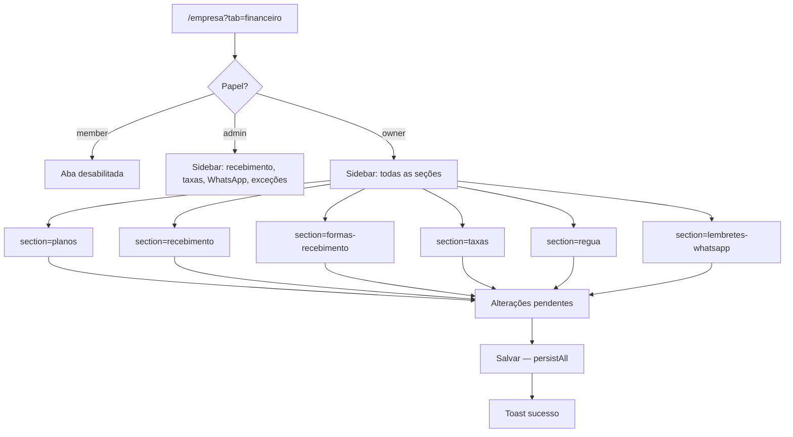

# Config inicial do financeiro

| Campo | Valor |
|---|---|
| **id** | `financeiro.config.inicial` |
| **módulo** | Financeiro / Config |
| **personas** | owner (setup completo); admin (recebimento, taxas, WhatsApp, exceções) |
| **rotas** | `/empresa?tab=financeiro`, `/empresa?tab=financeiro&section=<slug>` |
| **pré-requisitos** | Módulo `finance` ativo na academia; papel owner ou admin |
| **status** | revisado (código) |
| **última revisão** | 2026-07-23 |
| **validação** | [VALIDATION.md](../VALIDATION.md) |

**Specs relacionadas:**

- [2026-06-15-financeiro-nav-non-owner-PRODUCT.md](../../superpowers/specs/2026-06-15-financeiro-nav-non-owner-PRODUCT.md)
- [2026-06-15-mensalidades-parcelamento-taxas-PRODUCT.md](../../superpowers/specs/2026-06-15-mensalidades-parcelamento-taxas-PRODUCT.md)
- [2026-06-17-formas-recebimento-meios-captura-PRODUCT.md](../../superpowers/specs/2026-06-17-formas-recebimento-meios-captura-PRODUCT.md) — formas ativas + meios de captura (Fase 2)

- [2026-06-28-taxas-recebedor-bandeira-PRODUCT.md](../../superpowers/specs/2026-06-28-taxas-recebedor-bandeira-PRODUCT.md) — recebedores (PagBank, Asaas…) e bandeira no pagamento
- [2026-07-23-plan-price-snapshot-design.md](../../superpowers/specs/2026-07-23-plan-price-snapshot-design.md) — preço de lista vs `plan_price` do aluno

**Harness relacionado:** `npm test -- financeSettingsSections financeConfigValidation captureMethods resolveAcquirerFees feeReceivers resolveFeeReceiver`

**Arquivos-chave:** `src/pages/AcademySettings.jsx`, `src/components/finance/FinanceiroConfigTab.jsx`, `src/lib/financeSettingsSections.js`, `src/lib/financeConfigValidation.js`, `src/hooks/useFinanceConfigState.js`, `src/components/finance/settings/FinanceSettingsPaymentMethodsSection.jsx`, `src/components/finance/settings/FinanceSettingsCaptureMethodPanel.jsx`, `src/components/finance/settings/FinanceSettingsFeeReceiversSection.jsx`, `src/lib/captureMethods.js`, `src/lib/feeReceivers.js`, `src/lib/paymentMethodSettings.js`

---

## Resumo

O titular (ou admin, em escopo limitado) configura o financeiro em **Minha academia → Financeiro**: planos de mensalidade, contas para recebimento, **formas de recebimento** (PIX, cartão, etc.), **meios de captura** por maquininha/link, taxas de cartão, régua de cobrança, lembretes WhatsApp e opcionalmente contratos. Alterações em campos inline ficam pendentes até **Salvar** na barra fixa **no topo do painel**; modais de conta bancária e recebedor de taxas gravam direto ao clicar **Salvar** no modal.

O passo de onboarding `setup_finance` aponta para esta tela e considera concluído quando existe ao menos um plano nomeado.

---

## Diagrama de fluxo

---

## Mapa de telas

| # | Rota | Componente | Ação do usuário | Resultado esperado |
|---|---|---|---|---|
| 1 | `/empresa?tab=financeiro` | `AcademySettings` + `FinanceiroConfigTab` | Abrir **Minha academia → Financeiro** | Layout sidebar + painel da seção ativa |
| 2 | `&section=planos` (owner) | `FinanceSettingsPlansSection` | Adicionar/editar plano | Nome, preço de **lista** (default para novas matrículas), repasse de taxas, contratos opcionais; alunos existentes usam `plan_price` no perfil |
| 3 | `&section=recebimento` | `FinanceSettingsBanksSection` | Adicionar conta bancária/PIX | Modal; saldo inicial; **Salvar** no modal persiste na academia |
| 3b | `&section=formas-recebimento` | `FinanceSettingsPaymentMethodsSection` | Ativar formas; conta padrão; automações; preview | `paymentMethodSettings` |
| 3c | `&section=formas-recebimento` (crédito/débito) | `FinanceSettingsCaptureMethodPanel` | CRUD meios de captura; vínculo a recebedor de taxas | `captureMethods[]` |
| 4 | `&section=taxas` | `FinanceSettingsFeesSection` | Repasse ao aluno (`cardFees`) + recebedores com matriz por bandeira | `feeReceivers[]`, `acquirerFeePolicy` |
| 5 | `&section=regua` (owner) | `FinanceSettingsCollectionSection` | Etapas e rótulo de atraso | `collectionRules` + `overdueLabel` |
| 6 | `&section=lembretes-whatsapp` | `FinanceSettingsWhatsappRemindersSection` | Ativar lembretes antes/depois vencimento | `whatsappReminders` |
| 7 | `&section=excecoes` | `FinanceSettingsExceptionsSection` | Personalizar rótulos de bolsa/cortesia | `exceptionStatusLabels` |
| 8 | `&section=contratos` (owner) | `ContractTemplatesPage` (embedded) | Modelos de contrato | Vínculo com planos na matrícula |
| 9 | Qualquer seção editável (campos inline) | `FinanceSettingsStickySave` | **Salvar** ou **Descartar** | `persistAll` grava em `financeConfig`; barra sticky no topo do painel |
| 10 | Onboarding | Checklist inicial | Clicar passo financeiro | Navega para `/empresa?tab=financeiro` |

### Seções da sidebar (grupos)

| Grupo | Slug | Owner | Admin |
|---|---|---|---|
| Essencial | `planos` | ✅ | — |
| Essencial | `recebimento` | ✅ | ✅ |
| Essencial | `formas-recebimento` | ✅ | ✅ |
| Recomendado | `taxas` | ✅ | ✅ |
| Recomendado | `regua` | ✅ | — |
| Recomendado | `lembretes-whatsapp` | ✅ | ✅ |
| Recomendado | `contratos` | ✅ | — |
| Avançado | `excecoes` | ✅ | ✅ |
| Avançado | `plano-contas`, `razao-contabil` | ✅ | — (ver [plano-contas-categorias.md](plano-contas-categorias.md)) |

---

## A — Auditoria operacional

### Pré-condições de dados

- [ ] Academia com `modules.finance === true`
- [ ] Usuário **owner** ou **admin** (`canAccessEmpresaFinanceSettings`)
- [ ] `academyId` selecionado no contexto

### Permissões por papel

| Papel | Aba Financeiro (Empresa) | Seções visíveis | Default `?section=` |
|---|---|---|---|
| **owner** | Sim | Todas | `planos` |
| **admin** | Sim | Recebimento, formas de recebimento, taxas, WhatsApp, exceções | `recebimento` |
| **member** | Aba desabilitada no `HubTabBar` | — | — |

Deep link `?section=planos` para admin → redirect para primeira seção permitida (`FinanceiroConfigTab` + `useAcademyTabSection`).

### Checklist passo a passo — owner

1. [ ] `/empresa?tab=financeiro` abre com sidebar e seção **Planos** (default)
2. [ ] Adicionar plano com nome e preço de lista → barra **Alterações não salvas** aparece
3. [ ] Salvar → toast sucesso; plano persiste após reload; editar preço de lista **não** altera `plan_price` de alunos já matriculados
3b. [ ] Plano com nome vazio + Salvar → hint na barra fixa; link **Ir para Planos de mensalidade**; persistência bloqueada
4. [ ] **Contas bancárias** (`#contas`): adicionar banco/PIX, saldo inicial
4b. [ ] **Formas de recebimento**: ativar/desativar forma; conta padrão; toggles de automação; preview «Se você registrar hoje»; coluna OK
4c. [ ] **Meios de captura** (cartão crédito/débito): adicionar meio (nome, canal, conta); matriz 1x–12x ou «usar taxas da conta»
4d. [ ] Meio com taxas próprias — coluna OK da forma exige meio configurado ou `useDefaultFees`
4b. [ ] Conta só com agência (sem banco/PIX/conta) → `FieldError` ao aplicar no modal; não some silenciosamente no save global
5. [ ] **Taxas**: percentuais > 0 marcam progresso (`feesConfigured`)
6. [ ] **Régua**: customizar etapa ou rótulo de atraso → `collectionRulesConfigured`
7. [ ] **WhatsApp**: habilitar lembrete antes ou depois do vencimento
8. [ ] **Contratos**: link em planos abre `section=contratos`; modelos disponíveis no select do plano
9. [ ] Descartar alterações → estado volta ao último salvo
10. [ ] Remover plano/conta → `ConfirmDialog` antes de excluir
11. [ ] Onboarding `setup_finance` marca done quando há plano nomeado
12. [ ] Trocar academia → config da academia correta carrega

### Checklist passo a passo — admin

1. [ ] Aba Financeiro acessível (não bloqueada)
2. [ ] Sidebar **sem** planos, régua, contratos, plano de contas, razão
3. [ ] Default abre em **Recebimento**; **Formas de recebimento** editável
4. [ ] Editar taxas e salvar funciona
5. [ ] URL `?section=planos` redireciona para seção permitida

### Estados de erro conhecidos

| Situação | Feedback esperado | Referência |
|---|---|---|
| Plano sem nome ou conta incompleta | Hint na barra fixa + link para seção | `validateFinanceConfigBeforeSave`, `FinanceSettingsStickySave` |
| `FinanceConfigTooLargeError` | Toast erro ao salvar | `useFinanceConfigState` |
| Falha de rede no save | Toast `friendlyError` | `persistAll` |
| Member tenta abrir aba | Tab desabilitada + tooltip | `getTabDisabledState` |

### Critérios de fluxo saudável vs regressão

**Saudável:** Seção ativa sempre renderiza conteúdo; progresso essencial (planos + recebimento + taxas + régua para owner) coerente com `financeSettingsProgress`; links do hub `/financeiro` para `EMPRESA_FINANCE_ACCOUNTS_PATH` funcionam.

**Regressão:** Admin com painel vazio; member acessa config; salvar sem feedback; planos não aparecem em mensalidades após save.

---

## B — Roteiro de demonstração em vídeo

**Duração alvo:** 6–7 min

### Dados de demonstração sugeridos

| Entidade | Valor fictício |
|---|---|
| Plano | Mensalidade Adulto — R$ 199 |
| Conta | Banco Inter · PIX `demo@academia.com.br` |
| Taxas | PIX 0%, débito 1,5%, crédito 2,5% |
| Meio captura | Stone presencial — crédito 3x com 30 dias crédito |

### Cenas

| Cena | Tela | Narração sugerida | Gancho de valor |
|---|---|---|---|
| 1 | Empresa → Financeiro | "Antes de cobrar, configuro o financeiro em um só lugar." | Setup centralizado |
| 2 | Planos | "Crio o plano com preço de lista — novas matrículas usam esse valor; alunos já matriculados mantêm o acordado no perfil." | Clareza operacional |
| 3 | Recebimento | "Cadastro onde o dinheiro cai — PIX e banco nos comprovantes." | Rastreabilidade |
| 3b | Formas + meios | "Ativo PIX e cartão; cadastro cada maquininha com taxa e prazo de crédito." | Conciliação e previsão corretas |
| 4 | Taxas | "Se repasso taxa de cartão, defino aqui uma vez." | Menos erro no caixa |
| 5 | Régua / WhatsApp | "Automatizo lembretes antes e depois do vencimento." | Cobrança proativa |
| 6 | Salvar | "Tudo fica pendente até eu confirmar — nada salva por engano." | Segurança |

### O que não mostrar

- JSON de `financeConfig` no DevTools
- Dados bancários reais de clientes
- Seções owner-only para persona admin na demo de recepcionista

---

## Variações e atalhos

- **Links do hub operacional:** `EMPRESA_FINANCE_ACCOUNTS_PATH` → `section=recebimento#contas`; config geral → `EMPRESA_FINANCE_CONFIG_PATH`
- **Aliases legados:** `/finance` → `/empresa?tab=financeiro`; `/contratos/modelos` → `section=contratos`
- **Progresso:** `buildFinanceSettingsSummaries` + `financeSettingsProgress` — owner: 4 núcleos; admin: 2 (recebimento + taxas)
- **Próximo passo operacional:** após setup, fluxo [a-receber-mensalidades.md](a-receber-mensalidades.md)

---

## Histórico de revisão

| Data | Autor | Mudança |
|---|---|---|
| 2026-07-23 | — | Planos: preço = lista; alunos usam `plan_price` (spec snapshot) |
| 2026-06-15 | — | Criação Fase 2B |
| 2026-06-16 | — | Validação pré-save, link para seção com erro, conta incompleta no modal Recebimento |
| 2026-06-17 | — | Fase 2: meios de captura (`captureMethods`), preview na forma, matriz taxas/prazos |
