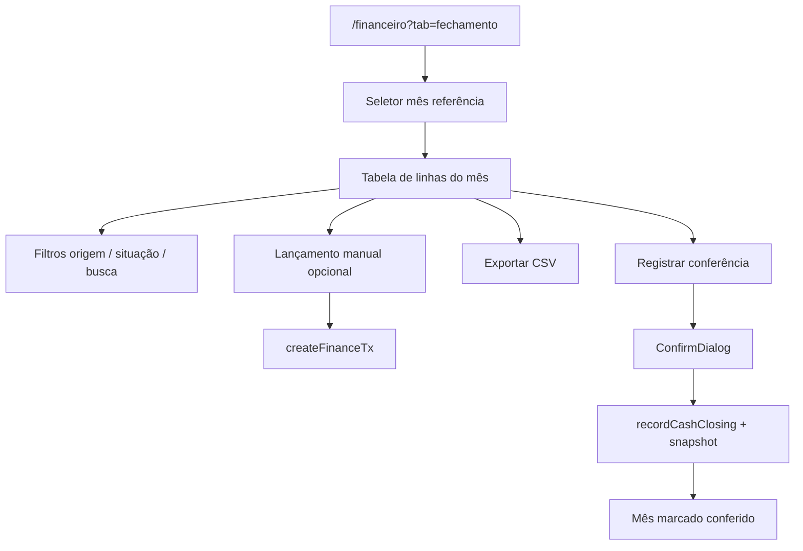

# Conferência do mês (fechamento)

| Campo | Valor |
|---|---|
| **id** | `financeiro.fechamento.mensal` |
| **módulo** | Financeiro |
| **personas** | admin, owner (member **sem acesso** à aba) |
| **rotas** | `/financeiro?tab=fechamento` |
| **pré-requisitos** | Módulo `finance`; lançamentos e mensalidades do mês; regime caixa/competência definido |
| **status** | revisado (código) |
| **última revisão** | 2026-06-16 |
| **validação** | [VALIDATION.md](../VALIDATION.md) |

**Specs relacionadas:** — (comportamento em `MonthlyClosingTab` + `src/lib/monthlyClosing.js`)

**Harness relacionado:** `npm test -- monthlyClosing financeClosingData`

**Arquivos-chave:** `src/components/finance/MonthlyClosingTab.jsx`, `src/lib/monthlyClosing.js`, `src/lib/financeTxApi.js` (`recordCashClosing`, `fetchMonthlyClosing`)

---

## Resumo

Admin ou owner revisa todas as movimentações do mês (mensalidades, vendas, lançamentos manuais), filtra por origem e situação, exporta CSV, lança recebimentos manuais se necessário e **registra a conferência do mês** com snapshot dos totais.

---

## Diagrama de fluxo

---

## Mapa de telas

| # | Rota | Componente | Ação do usuário | Resultado esperado |
|---|---|---|---|---|
| 1 | `/financeiro?tab=fechamento` | `MonthlyClosingTab` | Abrir **Conferência do mês** | Tabela do mês de referência |
| 2 | Fechamento | Seletor mês | Trocar `referenceMonth` | Dados recarregam |
| 3 | Fechamento | `FinanceRegimeToggle` | Caixa vs competência | Colunas e totais ajustam |
| 4 | Toolbar | Filtros origem/situação | Refinar linhas | `filterClosingRows` |
| 5 | Toolbar | Busca | Por nome/descrição | Lista filtrada |
| 6 | Tabela | Linhas por aluno/TX | Revisar valores e métodos | Totais no rodapé |
| 7 | Toolbar | **Novo recebimento** | Form manual | `validateClosingManualReceiptForm` + `createFinanceTx` com `bank_account`; `FieldError` inline |
| 8 | Toolbar | **Exportar** | CSV | `exportClosingCsv` |
| 9 | Toolbar | **Registrar conferência** | Abrir confirmação | `ConfirmDialog` |
| 10 | Dialog | Confirmar | Gravar fechamento | `recordCashClosing`; toast sucesso |
| 11 | Pós-fechamento | Badge/data | Ver mês conferido | `cashClosing.closed_at` exibido |

---

## A — Auditoria operacional

### Pré-condições de dados

- [ ] Papel **admin** ou **owner**
- [ ] Movimentações no mês (mensalidades pagas, lançamentos, vendas)
- [ ] Mês de referência selecionado (default: mês corrente)

### Permissões por papel

| Papel | Aba Conferência do mês |
|---|---|
| **owner** | Sim |
| **admin** | Sim |
| **member** | Redirect (aba restrita) |

### Checklist passo a passo

1. [ ] Owner/admin: `/financeiro?tab=fechamento` carrega tabela
2. [ ] Member: `?tab=fechamento` redireciona para aba permitida
3. [ ] Trocar mês de referência — linhas e totais atualizam
4. [ ] Filtro por origem (mensalidade, venda, manual, etc.) funciona
5. [ ] Filtro por situação (pago, pendente, etc.) funciona
6. [ ] Busca por nome de aluno encontra linha
7. [ ] Totais do rodapé batem com linhas visíveis (após filtros)
8. [ ] Export CSV baixa arquivo com nome da academia e mês
9. [ ] Lançamento manual — validação inline (descrição, valor, data, conta); nova linha após salvar
10. [ ] **Registrar conferência** — dialog de confirmação
11. [ ] Após registrar — indicador de mês conferido; não permite duplicar sem mudança
12. [ ] Erro `snapshot_mismatch` se totais mudaram — mensagem pede atualizar página
13. [ ] Evento `CASH_CLOSING_UPDATED_EVENT` dispara após sucesso (outras abas podem reagir)

### Estados de erro conhecidos

| Situação | Feedback esperado | Referência |
|---|---|---|
| Falha ao carregar | `ErrorBanner` + retry | `MonthlyClosingTab` |
| `snapshot_mismatch` | Toast + reload sugerido | `registerClosing` |
| Falha manual TX | `FieldError` inline ou toast (`friendlyError`) | `validateClosingManualReceiptForm` |
| Sem conta bancária | `FinanceBankAccountsSetupBanner` no form manual | `MonthlyClosingTab` |

### Critérios de fluxo saudável vs regressão

**Saudável:** Snapshot gravado com totais corretos; export reflete filtros; fechamento idempotente na UI.

**Regressão:** Registrar com totais desatualizados sem erro; member acessa aba; vazamento cross-tenant.

---

## B — Roteiro de demonstração em vídeo

**Duração alvo:** 3–4 min

### Dados de demonstração sugeridos

| Entidade | Valor fictício |
|---|---|
| Mês | Mês anterior fechado |
| Linhas | Mix mensalidades + 1 venda + 1 despesa manual |

### Cenas

| Cena | Tela | Narração sugerida | Gancho de valor |
|---|---|---|---|
| 1 | Conferência | "Antes de fechar o mês, reviso tudo que entrou e saiu." | Ritual de fechamento |
| 2 | Filtros | "Filtro por origem — só mensalidades, só vendas." | Auditoria segmentada |
| 3 | Totais | "Os totais fecham com o que eu esperava do caixa." | Confiança |
| 4 | Export | "Exporto para o contador ou para arquivo." | Compliance |
| 5 | Registrar | "Um clique marca o mês como conferido — fica registrado." | Trilha de auditoria |

### O que não mostrar

- Fechar mês com dados incompletos sem comentar impacto
- Alias `?tab=closing` (redireciona para `fechamento`)

---

## Variações e atalhos

- **Regime:** toggle caixa/competência (`FINANCE_REGIME`) altera critério temporal
- **Colunas opcionais:** visibilidade em `localStorage` (`navi-finance-closing-cols`)
- **Config:** link para `/empresa?tab=financeiro` quando falta setup
- **Legacy:** `?tab=closing` → `fechamento` via `financeiroLegacyTabToSlug`

---

## Histórico de revisão

| Data | Autor | Mudança |
|---|---|---|
| 2026-06-15 | — | Criação Fase 2A |
