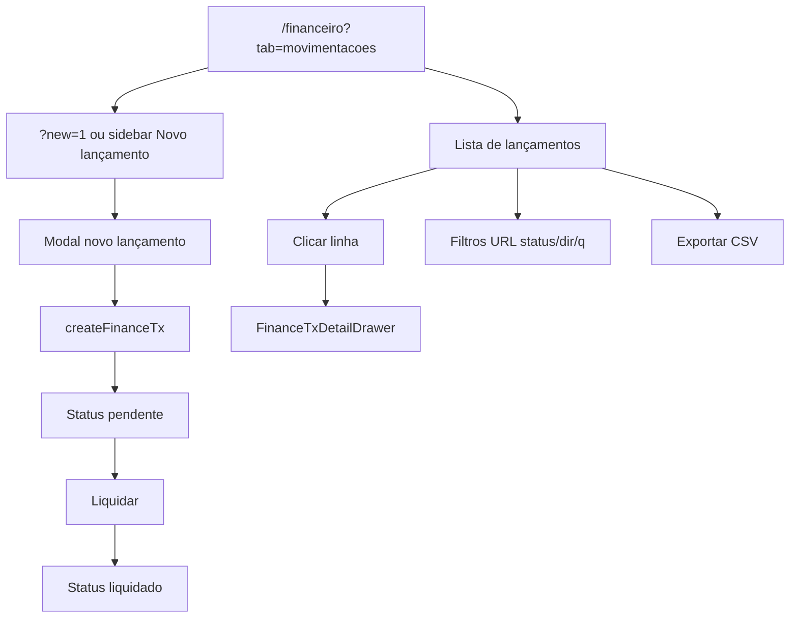

# Lançamentos — caixa e movimentações

| Campo | Valor |
|---|---|
| **id** | `financeiro.lancamentos.caixa` |
| **módulo** | Financeiro |
| **personas** | recepcionista (member), admin, owner |
| **rotas** | `/financeiro?tab=movimentacoes`, `/financeiro?tab=movimentacoes&new=1`, `/financeiro?tab=movimentacoes&tx=` |
| **pré-requisitos** | Módulo `finance`; categorias/plano de contas (recomendado); contas bancárias para liquidação |
| **status** | revisado (código) |
| **última revisão** | 2026-06-16 |
| **validação** | [VALIDATION.md](../VALIDATION.md) |

**Specs relacionadas:**

- [2026-06-15-financeiro-lancamentos-refactor-PRODUCT.md](../../superpowers/specs/2026-06-15-financeiro-lancamentos-refactor-PRODUCT.md)
- [2026-06-15-plano-contas-categorias-PRODUCT.md](../../superpowers/specs/2026-06-15-plano-contas-categorias-PRODUCT.md)

**Harness relacionado:** [docs/harness/finance-lancamentos.md](../../harness/finance-lancamentos.md) — `npm test -- financeTx`

**Arquivos-chave:** `src/components/finance/TransacoesTab.jsx`, `src/components/finance/FinanceTxDetailDrawer.jsx`, `src/lib/financeTxApi.js`, `src/lib/naviMenu.js` (`FINANCEIRO_NOVO_LANCAMENTO_PATH`)

---

## Resumo

O operador registra entradas e saídas em **Lançamentos**, filtra por status/direção/conta, liquida pendências, abre o drawer de detalhe (incluindo aluno vinculado), exporta CSV e usa o atalho global **Novo lançamento** na sidebar.

---

## Diagrama de fluxo

---

## Mapa de telas

| # | Rota | Componente | Ação do usuário | Resultado esperado |
|---|---|---|---|---|
| 1 | `/financeiro?tab=movimentacoes` | `TransacoesTab` | Abrir **Lançamentos** | Lista paginada com toolbar de filtros |
| 2 | `?new=1` | Modal novo TX | Atalho sidebar ou URL | Modal de criação aberto |
| 3 | Modal | Preencher tipo, valor, categoria, aluno | Campos obrigatórios | Validação inline (`FieldError`) |
| 4 | Modal | Receber agora / pendente | Toggle regime | Cria liquidado ou pendente |
| 5 | Lista | Filtros status/direção/banco/busca | Chips e campos | URL atualiza (`?status`, `?dir`, `?q`) |
| 6 | Lista | Clicar linha | Abrir drawer | `FinanceTxDetailDrawer` — «Liquida em…» / crédito previsto (meio de captura) |
| 7 | `?tx=<id>` | Drawer | Deep link | Drawer abre após load |
| 8 | Drawer / menu linha | Liquidar | `patchFinanceTx action settle` | Status → liquidado; toast |
| 9 | Drawer | Estornar | `reverseFinanceTx` | Confirmação; movimento revertido |
| 10 | Toolbar | Importar planilha | `ImportFinanceTxModal` | Lançamentos em lote |
| 11 | Toolbar | Exportar CSV | Download | `exportFinanceTransactionsCsv` |
| 12 | Lista | Coluna Aluno | Visualizar vínculo | Nome via `lead_name` server-side |

---

## A — Auditoria operacional

### Pré-condições de dados

- [ ] Módulo `finance` ativo
- [ ] Categorias disponíveis (default saída: «Outras despesas»)
- [ ] Opcional: alunos no sistema para vincular lançamento

### Permissões por papel

| Papel | Lançamentos | Liquidar / estornar | Importar |
|---|---|---|---|
| **member** | Sim | Conforme permissões de caixa | Verificar UI |
| **admin** | Sim | Sim | Sim |
| **owner** | Sim | Sim | Sim |

### Checklist passo a passo

1. [ ] `/financeiro?tab=movimentacoes` carrega sem erro persistente
1b. [ ] Academia sem conta bancária — `FinanceBankAccountsSetupBanner` com link para Recebimento (owner/admin)
2. [ ] Sidebar **Novo lançamento** abre modal (`?tab=movimentacoes&new=1`)
3. [ ] Criar entrada pendente — aparece na lista com status pendente
4. [ ] Liquidar lançamento — status muda para liquidado
5. [ ] Coluna **Aluno** preenchida quando `lead_id` + `lead_name` existem (sem depender só do store)
6. [ ] Busca por nome de aluno na toolbar encontra lançamento
7. [ ] Clicar linha → drawer; ESC fecha
8. [ ] `?tx=<id>` abre drawer após carregar lista
9. [ ] Filtros na URL persistem ao recarregar
10. [ ] Export CSV reflete filtros ativos
11. [ ] Member em `?tab=previsao` ou `conciliacao` — redirect para aba permitida

### Estados de erro conhecidos

| Situação | Feedback esperado | Referência |
|---|---|---|
| Falha listagem | `ErrorBanner` + retry | `TransacoesTab` |
| Validação modal | `FieldError` nos campos | harness QA manual |
| Erro API | Toast amigável | `financeTxFriendlyError` |

### Critérios de fluxo saudável vs regressão

**Saudável:** Filtros URL sincronizados; drawer com todos os campos; liquidação idempotente na UI.

**Regressão:** Coluna aluno vazia com `lead_name` no servidor; drawer não abre com `?tx=`; filtros perdidos no reload.

---

## B — Roteiro de demonstração em vídeo

**Duração alvo:** 4 min

### Dados de demonstração sugeridos

| Entidade | Valor fictício |
|---|---|
| Lançamento | Despesa «Material de limpeza» R$ 85 saída |
| Entrada | Mensalidade avulsa R$ 200 entrada vinculada a aluno |

### Cenas

| Cena | Tela | Narração sugerida | Gancho de valor |
|---|---|---|---|
| 1 | Lançamentos | "Todo movimento do caixa: entradas, saídas, pendentes e liquidados." | Rastreabilidade |
| 2 | Novo lançamento | "Registro uma despesa em poucos campos — categoria e conta." | Registro rápido |
| 3 | Liquidar | "Pendente vira liquidado quando o dinheiro entrou." | Fluxo de caixa real |
| 4 | Drawer + aluno | "Cada lançamento pode ter o aluno — relatórios e conciliação agradecem." | CRM + financeiro |
| 5 | Export | "Exporto o período filtrado para o contador." | Integração externa |

### O que não mostrar

- Import com planilha inválida (a menos que demo de migração)
- Rotas legadas `/caixa` como passo principal

---

## Variações e atalhos

- **Atalho sidebar:** `FINANCEIRO_NOVO_LANCAMENTO_PATH` = `?tab=movimentacoes&new=1`
- **A receber → Outros:** itens com link para `?tab=movimentacoes&tx=`
- **Regime competência:** toggle em toolbar (`FinanceRegimeToggle`)
- **Recorrência:** lançamentos recorrentes no modal (ícone `Repeat`)

---

## Histórico de revisão

| Data | Autor | Mudança |
|---|---|---|
| 2026-06-15 | — | Criação Fase 2A |
| 2026-06-16 | — | Banner `FinanceBankAccountsSetupBanner` quando sem conta |
