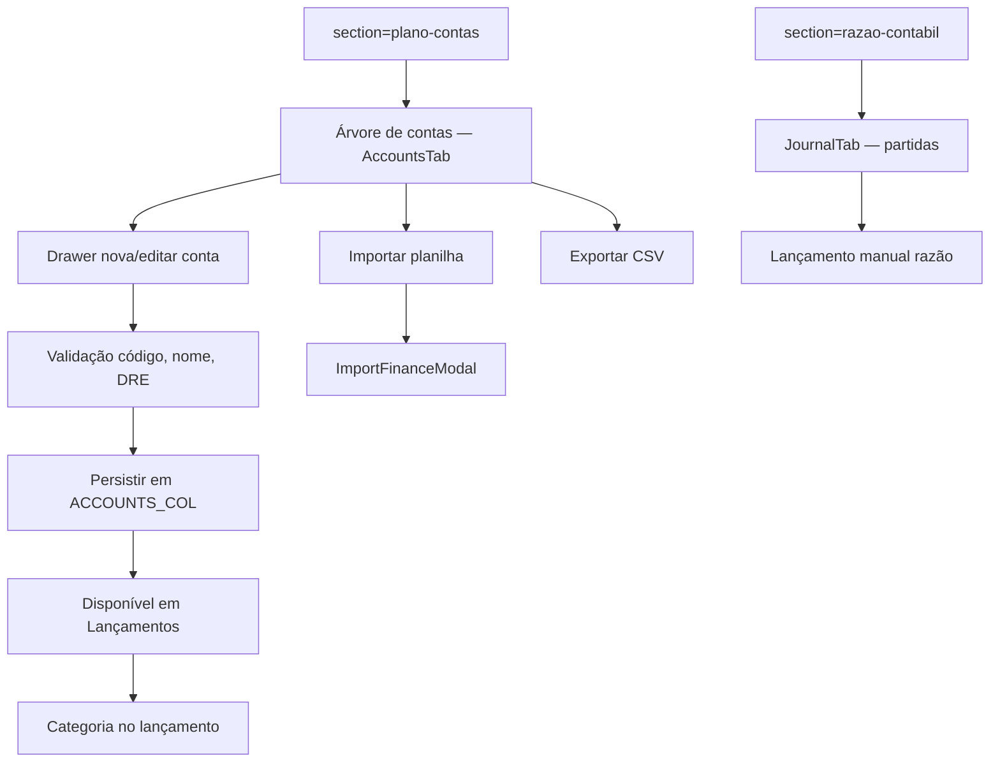

# Plano de contas e categorias

| Campo | Valor |
|---|---|
| **id** | `financeiro.config.plano-contas` |
| **módulo** | Financeiro / Config |
| **personas** | owner (obrigatório para editar); admin sem acesso à seção |
| **rotas** | `/empresa?tab=financeiro&section=plano-contas`, `/empresa?tab=financeiro&section=razao-contabil` |
| **pré-requisitos** | Módulo `finance`; papel owner; opcional: plano importado ou contas seed |
| **status** | revisado (código) |
| **última revisão** | 2026-06-15 |
| **validação** | [VALIDATION.md](../VALIDATION.md) |

**Specs relacionadas:**

- [2026-06-15-plano-contas-categorias-PRODUCT.md](../../superpowers/specs/2026-06-15-plano-contas-categorias-PRODUCT.md)
- [2026-06-15-plano-contas-categorias-TECH.md](../../superpowers/specs/2026-06-15-plano-contas-categorias-TECH.md)

**Harness relacionado:** [docs/harness/finance-plano-contas.md](../../harness/finance-plano-contas.md) — `npm test -- financeAccountFormRules financeCategories financeAccountCategories financeAccountsDrawer financeTxCategorySelect`

**Arquivos-chave:** `src/components/finance/CaixaAccountingPanel.jsx`, `src/components/finance/AccountsTab.jsx`, `src/components/finance/JournalTab.jsx`, `src/lib/financeCategories.js`

---

## Resumo

O **owner** mantém o plano de contas (contas contábeis com código, tipo, natureza e grupo DRE), importa/exporta planilha, consulta o **razão contábil** e garante que subcontas de receita/despesa apareçam como **categorias** nos lançamentos — sem duplicar entradas fixas do sistema (ex.: «Mensalidades» vs `4.1.1`).

---

## Diagrama de fluxo

---

## Mapa de telas

| # | Rota | Componente | Ação do usuário | Resultado esperado |
|---|---|---|---|---|
| 1 | `&section=plano-contas` | `CaixaAccountingPanel` → `AccountsTab` | Abrir **Plano de contas** | Lista/árvore de contas da academia |
| 2 | Plano de contas | **Nova conta** / editar | Abrir drawer lateral | Formulário com código, nome, tipo, natureza, DRE |
| 3 | Drawer | Preencher subconta de despesa | Herdar tipo/natureza/DRE do pai | Defaults corretos para aparecer no caixa |
| 4 | Drawer | Salvar com código vazio/duplicado | — | `FieldError` inline (não só toast) |
| 5 | Toolbar | **Importar planilha** | `ImportFinanceModal` | Contas (+ opcional planos/bancos); modo merge/replace |
| 6 | Toolbar | **Exportar plano** | Download CSV | `exportAccountsCsv` |
| 7 | `&section=razao-contabil` | `JournalTab` (embedded) | Ver histórico por conta | Partidas dobradas |
| 8 | Razão | Nova partida manual | Débito/crédito | `addEntry` no store contábil |
| 9 | Razão | Deep link `?from=tx&txId=` | Vindo de lançamento | Destaque do TX vinculado |
| 10 | `/financeiro?tab=movimentacoes` | Modal/drawer lançamento | Escolher categoria | Subcontas receita/despesa; default saída «Outras despesas» |
| 11 | Lançamentos | Tipo Entrada vs Saída | Trocar direção | Grupos de categoria adequados; sem duplicata fixo+conta |

---

## A — Auditoria operacional

### Pré-condições de dados

- [ ] Papel **owner**
- [ ] Módulo `finance` ativo
- [ ] Conta Appwrite `ACCOUNTS_COL` acessível (ambiente configurado)

### Permissões por papel

| Papel | Plano de contas | Razão contábil |
|---|---|---|
| **owner** | Editar, importar, exportar | Ver e lançar partidas |
| **admin** | Seção oculta na sidebar; URL redirect | Oculto |
| **member** | Sem acesso à aba Empresa → Financeiro | — |

### Checklist passo a passo

1. [ ] Owner: `?section=plano-contas` renderiza `AccountsTab` (não painel vazio)
2. [ ] Admin: seção não aparece na sidebar; deep link redireciona
3. [ ] Criar subconta receita `4.1.2` com DRE válido → aparece no select de **Lançamentos** (entrada)
4. [ ] Criar lançamento **Saída** → categoria default «Outras despesas» (não CMV)
5. [ ] Conta que duplica `dreAccount` fixo (ex. `4.1.1` Mensalidades) **não** aparece duplicada no select
6. [ ] Código/nome vazios no drawer → erro no campo
7. [ ] Código duplicado ou protegido → bloqueio com mensagem
8. [ ] Importar planilha modelo → linhas esperadas (`4.1.2`, `6.2.3`, etc.)
9. [ ] Exportar plano → CSV com códigos e nomes
10. [ ] `?section=razao-contabil` — listar e criar partida manual
11. [ ] Liquidar mensalidade automática → razão `1.1.1` / `4.1.1` inalterado (regressão)
12. [ ] Trocar academia → só contas do `academyId` atual

### Estados de erro conhecidos

| Situação | Feedback esperado | Referência |
|---|---|---|
| Código/nome inválidos | `FieldError` no drawer | `financeAccountFormRules` |
| Conta protegida | Erro ao criar/editar | `PROTECTED_CODES` |
| Import sem academia | Toast/erro seleção | `CaixaAccountingPanel` |
| DRE obrigatório em resultado | Validação no drawer | spec G5 |

### Critérios de fluxo saudável vs regressão

**Saudável:** Subcontas úteis no caixa; zero duplicata fixo+conta; DRE classificado; import/export idempotente por academia.

**Regressão:** Subconta despesa com defaults ativo/devedora some do select; «Mensalidades» e `4.1.1` juntos; default saída = CMV.

---

## B — Roteiro de demonstração em vídeo

**Duração alvo:** 4–5 min

### Dados de demonstração sugeridos

| Entidade | Valor fictício |
|---|---|
| Subconta | `6.2.3` — Material de limpeza (despesa) |
| Subconta | `4.1.2` — Aulas avulsas (receita) |
| Lançamento | Saída R$ 150 em Material de limpeza |

### Cenas

| Cena | Tela | Narração sugerida | Gancho de valor |
|---|---|---|---|
| 1 | Plano de contas | "No avançado, monto o plano que alimenta o DRE." | Contabilidade sem planilha paralela |
| 2 | Drawer | "Subconta herda o tipo do pai — já nasce no lugar certo." | Menos erro de configuração |
| 3 | Import | "Ou importo o modelo e parto do padrão da academia." | Onboarding rápido |
| 4 | Lançamentos | "No caixa, só vejo categorias que fazem sentido — sem duplicata." | Operador confiante |
| 5 | Razão | "O razão mostra o que foi lançado — manual ou automático." | Trilha contábil |

### O que não mostrar

- Edição de contas protegidas do sistema
- `?tab=extrato` no hub (redireciona para razão em Empresa — ver spec extrato-consolidacao)

---

## Variações e atalhos

- **Hub legado:** `/financeiro?tab=extrato` ou `?tab=razao` → `/empresa?tab=financeiro&section=razao-contabil` (`financeiroHubTabs.js`)
- **Categorias fixas:** `FINANCE_CATEGORIES` permanece para automações; UI deduplica por `dreAccount`
- **Grupos de saída:** Despesas Operacionais antes de CMV/CPV no select
- **Relacionado:** lançamentos em [lancamentos-caixa.md](lancamentos-caixa.md); setup básico em [config-inicial-financeiro.md](config-inicial-financeiro.md)

---

## Histórico de revisão

| Data | Autor | Mudança |
|---|---|---|
| 2026-06-15 | — | Criação Fase 2B |
