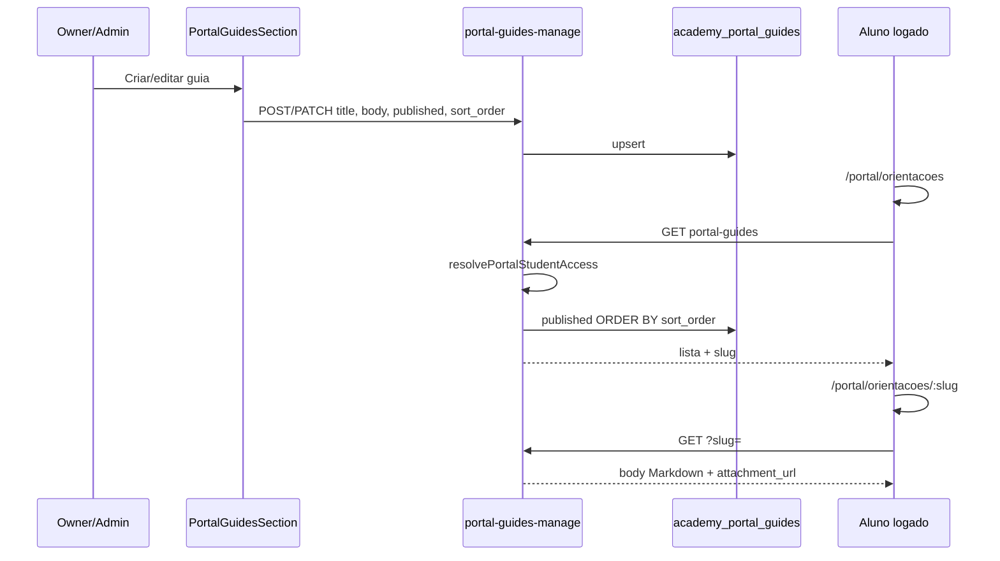

# Portal — guias de orientação (staff → aluno)

| Campo | Valor |
|---|---|
| **id** | `portal.orientacoes.guias` |
| **módulo** | Portal |
| **personas** | owner, admin, aluno, responsável |
| **rotas** | `/empresa?tab=portal` (staff), `/portal/orientacoes`, `/portal/orientacoes/:slug` |
| **pré-requisitos** | Schema `academy_portal_guides`; papel owner ou admin para CRUD |
| **status** | revisado (código) |
| **última revisão** | 2026-06-25 |
| **validação** | [VALIDATION.md](../VALIDATION.md) |

**Specs relacionadas:**

- [docs/superpowers/specs/2026-06-25-portal-aluno-PRODUCT.md](../../superpowers/specs/2026-06-25-portal-aluno-PRODUCT.md) §8.6

**Harness relacionado:** `npm test -- portalGuides portal --pool=threads`

**Arquivos-chave:** `src/components/academy/PortalGuidesSection.jsx`, `src/pages/portal/PortalGuides.jsx`, `src/components/portal/PortalMarkdown.jsx`, `lib/server/portalGuidesHandler.js`, `lib/server/portalGuidesManageHandler.js`

---

## Resumo

Owner/admin publica **guias em Markdown** (regras, FAQ, regulamento) na aba **Empresa → Portal**. Alunos autenticados leem em `/portal/orientacoes`. Conteúdo é **por academia** (não varia por filho no seletor). Rascunhos (`published=false`) nunca aparecem no portal.

---

## Diagrama de fluxo

---

## Mapa de telas

| # | Rota | Componente | Ação do usuário | Resultado esperado |
|---|---|---|---|---|
| 1 | `/empresa?tab=portal` | `PortalGuidesSection` | Criar guia | POST `portal-guides-manage` |
| 2 | `/empresa?tab=portal` | `PortalGuidesSection` | Editar / ordenar / publicar | PATCH com `sort_order` |
| 3 | `/empresa?tab=portal` | `PortalGuidesSection` | Despublicar (rascunho) | `published=false`; some do portal |
| 4 | `/empresa?tab=portal` | `PortalGuidesSection` | Excluir | DELETE por `id` |
| 5 | `/portal/orientacoes` | `PortalGuides` | Listar guias | Só `published=true` |
| 6 | `/portal/orientacoes/:slug` | `PortalGuides` + `PortalMarkdown` | Ler conteúdo | `rehype-sanitize`; anexo como link |
| 7 | `/portal` | `PortalHome` | Cards em destaque | Até 2 guias publicados |

**Permissão staff:** tab Portal em `AcademySettings` visível só para `owner` e `admin` (`role !== 'member'`).

---

## A — Auditoria operacional

### Pré-condições de dados

- [ ] `APPWRITE_ACADEMY_PORTAL_GUIDES_COL_ID` configurado
- [ ] Academia ativa no contexto staff (`x-academy-id`)
- [ ] Aluno com `student_portal_access.status = active`

### Checklist passo a passo — staff

1. [ ] Owner/admin vê tab **Portal** em Empresa
2. [ ] Recepcionista (`member`) **não** vê tab Portal
3. [ ] Criar guia com título, corpo Markdown e `published=true`
4. [ ] Slug gerado único por academia (colisão tratada no servidor)
5. [ ] Reordenar guias → `sort_order` reflete na lista do aluno
6. [ ] Despublicar → guia some do portal; permanece editável no staff
7. [ ] Excluir → removido das duas pontas

### Checklist passo a passo — aluno

1. [ ] `/portal/orientacoes` lista apenas publicados, ordenados
2. [ ] Clicar guia → `/portal/orientacoes/:slug` com conteúdo renderizado
3. [ ] HTML/script malicioso no Markdown **não** executa (sanitize)
4. [ ] `attachment_url` abre em nova aba quando presente
5. [ ] Mesmos guias para qualquer filho selecionado no switcher
6. [ ] Sem login → redirect `/portal/login`

### Estados de erro conhecidos

| Situação | Feedback esperado | Referência |
|---|---|---|
| Slug inexistente | 404 ou empty state | `portalGuidesHandler` |
| Sem permissão staff | 403 | `portalGuidesManageHandler` |
| Portal não configurado | 500 `portal_not_configured` | handlers |

### Permissões e multi-tenant

- Guias filtrados por `academy_id` do vínculo portal ativo.
- CRUD staff exige `ensureAcademyAccess` + role owner/admin no manage handler.
- Leitura aluno: `resolvePortalStudentAccess` antes de listar.

### Critérios de fluxo saudável vs regressão

**Saudável:** owner publica → aluno vê em segundos após reload; ordem estável; rascunho invisível.

**Regressão:** member publica guia; rascunho no portal; XSS no Markdown; guias de outra academia.

---

## B — Roteiro de demonstração em vídeo

**Duração alvo:** 3 min

### Dados de demonstração sugeridos

| Entidade | Valor fictício |
|---|---|
| Guia 1 | "Regras do tatame" — higiene, kimono |
| Guia 2 | "Sua primeira aula" — chegar 15 min antes |
| Anexo | `regulamento-demo.pdf` (URL Blob) |

### Cenas

| Cena | Tela | Narração sugerida | Gancho de valor |
|---|---|---|---|
| 1 | Empresa → Portal | "Você escreve uma vez; todos os alunos leem." | Comunicação centralizada |
| 2 | Preview Markdown | "Formatação simples, sem depender de PDF no WhatsApp." | Clareza |
| 3 | `/portal/orientacoes` | "O aluno encontra tudo no app da academia." | Menos dúvidas na recepção |

### O que não mostrar

- Editor com conteúdo real de regulamento proprietário
- URLs Blob com tokens longos

---

## Variações e atalhos

- **Categorias/filtros:** não no MVP; lista única ordenada por `sort_order`.
- **Segmentação por turma/faixa:** fora do escopo v1 (ver PRODUCT §18).

---

## Histórico de revisão

| Data | Autor | Mudança |
|---|---|---|
| 2026-06-25 | — | Criação inicial |
