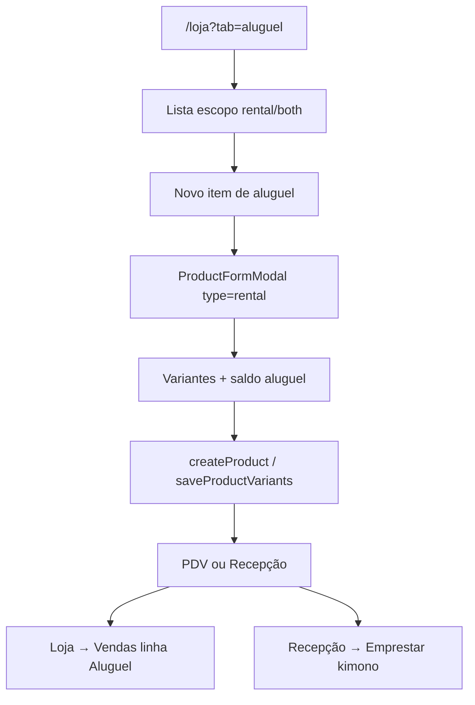

# Aluguel — catálogo na Loja

| Campo | Valor |
|---|---|
| **id** | `vendas.aluguel.catalogo` |
| **módulo** | Vendas |
| **personas** | owner, admin, recepcionista (member) |
| **rotas** | `/loja?tab=aluguel`, `/loja?tab=aluguel&import=1`, `?edit=`, `?duplicate=` |
| **pré-requisitos** | Módulo `sales` ou `inventory` ativo |
| **status** | revisado (código) |
| **última revisão** | 2026-07-16 |
| **validação** | [VALIDATION.md](../VALIDATION.md) |

**Specs relacionadas:** [2026-07-16-loja-aba-aluguel-PRODUCT.md](../../superpowers/specs/2026-07-16-loja-aba-aluguel-PRODUCT.md) · [2026-06-16-venda-aluguel-estoque-dual-PRODUCT.md](../../superpowers/specs/2026-06-16-venda-aluguel-estoque-dual-PRODUCT.md)

**Harness relacionado:** `npm test -- lojaProductScope productsCatalogScope productImport`

**Arquivos-chave:** `src/pages/Loja.jsx`, `src/pages/Products.jsx`, `src/lib/lojaProductScope.js`, `src/components/recepcao/KimonoLoanPanel.jsx`

---

## Resumo

O operador cadastra e mantém a **frota de aluguel** (kimonos e itens emprestáveis) na aba **Loja → Aluguel**. Itens `type=rental` aparecem **somente** aqui; venda e insumo ficam em **Produtos**. Itens `both` aparecem nas duas abas. A operação diária (emprestar grátis ou cobrar) ocorre em **Recepção** e **Loja → Vendas**, respectivamente.

---

## Diagrama de fluxo

---

## Mapa de telas

| # | Rota | Componente | Ação do usuário | Resultado esperado |
|---|---|---|---|---|
| 1 | `/loja?tab=aluguel` | `Products catalogScope=aluguel` | Abrir **Aluguel** | Lista rental + both; sem sale/supply |
| 2 | Aluguel | **Novo item de aluguel** | Modal tipo `rental` default | Select só rental/both |
| 3 | Modal | Preço de aluguel + variantes | Salvar | `rental_price`, pools `rental_available` |
| 4 | `?edit=` escopo errado | Redirect | Abrir edit de produto sale em Aluguel | Toast + redirect `tab=produtos` |
| 5 | `?import=1` | `ProductImportModal` | Importar planilha | `type=rental` default |
| 6 | Recepção | Kimonos vazio | CTA cadastro | Link `/loja?tab=aluguel` |
| 7 | Loja → Vendas | PDV | Linha Aluguel | Consome pool aluguel |

---

## A — Auditoria operacional

### Pré-condições

- [ ] `modules.sales === true` **ou** `modules.inventory === true`

### Checklist

1. [ ] `/loja?tab=aluguel` carrega só rental/both
2. [ ] Item `rental` criado não aparece em Produtos
3. [ ] Modal na aba Aluguel não oferece tipo Venda/Insumo isolados
4. [ ] Deep link `?edit=` redireciona entre abas com toast
5. [ ] Import na aba Aluguel grava `type=rental`
6. [ ] Recepção sem frota mostra link para Loja → Aluguel
7. [ ] PDV aluga item cadastrado com `rental_price`
8. [ ] Trocar academia → isolamento por tenant

### Estados de erro

| Situação | Feedback |
|---|---|
| Edit em aba errada | Toast info + redirect `tab=` |
| Frota vazia na Recepção | CTA cadastrar em Aluguel |
| Preço ausente no import rental | Linha `incomplete` |

---

## B — Demo (4 min)

| Cena | Narração |
|---|---|
| Aluguel | "Cadastro a frota de kimonos só na aba Aluguel." |
| Variantes | "Cada tamanho com saldo no armário." |
| Recepção | "Na recepção empresto sem cobrar." |
| PDV | "Ou cobro o aluguel no caixa." |

---

## Variações

- **both:** editável em Produtos e Aluguel
- **Próximo:** [pdv-nova-venda.md](pdv-nova-venda.md), Recepção kimonos

---

## Histórico

| Data | Mudança |
|---|---|
| 2026-07-16 | Criação — Fase 2 aba Aluguel |
