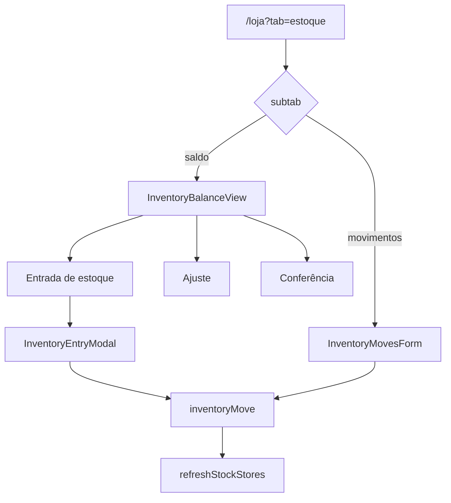

# Estoque e movimentações

| Campo | Valor |
|---|---|
| **id** | `vendas.estoque.movimentacoes` |
| **módulo** | Vendas |
| **personas** | owner, admin, recepcionista (member) |
| **rotas** | `/loja?tab=estoque`, `/loja?tab=estoque&subtab=saldo|movimentos`, `?item=` |
| **pré-requisitos** | Módulo `inventory` ativo; produtos cadastrados |
| **status** | revisado (código) |
| **última revisão** | 2026-06-25 |
| **validação** | [VALIDATION.md](../VALIDATION.md) |

**Specs relacionadas:** [2026-06-25-entrada-estoque-correcao-vinculo-caixa-PRODUCT.md](../superpowers/specs/2026-06-25-entrada-estoque-correcao-vinculo-caixa-PRODUCT.md)

**Harness relacionado:** `npm test -- lojaInventoryTabs inventoryMoveFinanceLink inventoryMovesList stockEntryCorrection stockEntryPhase3`

**Arquivos-chave:** `src/pages/Inventory.jsx`, `src/components/inventory/InventoryBalanceView.jsx`, `src/components/inventory/InventoryMovesPanel.jsx`, `src/components/inventory/InventoryMovesHistory.jsx`, `src/components/inventory/InventoryEntryModal.jsx`, `src/store/useInventoryStore.js`

---

## Resumo

Com o módulo **estoque** ativo, o operador consulta saldos (**Inventário**), registra entradas/saídas/ajustes/conferências e revisa o log em **Movimentações**. Entradas podem gerar despesa no caixa quando `modules.finance` está ligado.

---

## Diagrama de fluxo

---

## Mapa de telas

| # | Rota | Componente | Ação do usuário | Resultado esperado |
|---|---|---|---|---|
| 1 | `/loja?tab=estoque` | `Inventory` | Abrir **Estoque** | Default `subtab=saldo` |
| 2 | `&subtab=saldo` | `InventoryBalanceView` | Ver saldos por item | Quantidade, mínimo, status |
| 3 | Inventário | **Registrar entrada** | `InventoryEntryModal` | `inventoryMove` tipo entrada |
| 4 | Entrada | Com financeiro | Custo + conta | Toast «Entrada e despesa no Caixa» |
| 5 | Inventário | **Ajustar** | `InventoryAdjustModal` | `adjustStock` |
| 6 | Inventário | **Conferir** | `InventoryCheckModal` | `checkItem` |
| 7 | Inventário | **Configurar item** | Mínimo, unidade, notas | `updateItem` |
| 8 | `&subtab=movimentos` | `InventoryMovesPanel` | Histórico + nova movimentação | Abas Histórico / Nova movimentação |
| 8b | Histórico | `InventoryMovesHistory` | Ver movimentos + link Caixa | Badge «No Caixa» → `/financeiro?tab=movimentacoes&tx=` |
| 8c | Histórico | **Corrigir** (admin) | `StockEntryCorrectionWizard` | Estorno Caixa + ajuste de quantidade |
| 9 | Toolbar | **Configurações** | `StockSettingsSection` | Regras de estoque da academia |
| 10 | Toolbar | **Importar em lote** | Link → `produtos&import=1` | Import centralizado em Produtos |
| 11 | `?item=<id>` | Highlight | Destacar linha no inventário | Scroll/foco no item |

---

## A — Auditoria operacional

### Pré-condições de dados

- [ ] `modules.inventory === true`
- [ ] Produtos/itens de estoque existentes (via catálogo ou import)

### Permissões por papel

| Papel | Estoque | Movimentar |
|---|---|---|
| **owner** | Sim | Sim |
| **admin** | Sim | Sim |
| **member** | Sim | Sim |

Sem `inventory`, a aba **Estoque** não aparece no hub Loja (`Inventory` retorna `null`).

### Checklist passo a passo

1. [ ] `/loja?tab=estoque` carrega inventário
2. [ ] `subtab` default = `saldo` (`resolveInventorySubtab`)
3. [ ] Trocar para **Movimentações** → `lojaEstoqueTabParams('movimentos')`
4. [ ] Entrada aumenta `current_quantity`
5. [ ] Com financeiro: entrada grava `financial_tx_id` + badge «No Caixa» no histórico
6. [ ] Hint no modal de entrada orienta correção posterior
7. [ ] Histórico destaca divergência estoque × Caixa (banner âmbar)
8. [ ] Corrigir quantidade com snapshot WAC restaura custo médio quando saldo volta ao anterior
9. [ ] Ajuste positivo/negativo com mensagem `formatAdjustToast`
10. [ ] Conferência registra sem alterar saldo (conforme regra `checkItem`)
11. [ ] Venda no PDV decrementa estoque (integração cross-fluxo)
12. [ ] `first_stock_entry` onboarding auto-done quando qty > 0
13. [ ] Legacy `/estoque` → `/loja?tab=estoque`
14. [ ] `?item=` destaca item correto
15. [ ] Multi-tenant: só itens da academia atual

### Estados de erro conhecidos

| Situação | Feedback esperado | Referência |
|---|---|---|
| Falha movimento | Toast erro store | `useInventoryStore.error` |
| Módulo off | Aba ausente | `Loja.jsx` tabs |

### Critérios de fluxo saudável vs regressão

**Saudável:** Saldo bate com movimentações; sync após venda; entrada financeira opcional coerente.

**Regressão:** Estoque negativo sem aviso; venda não baixa saldo; leak cross-tenant.

---

## B — Roteiro de demonstração em vídeo

**Duração alvo:** 3–4 min

### Dados de demonstração sugeridos

| Entidade | Valor fictício |
|---|---|
| Item | Kimono M — saldo 5 |
| Entrada | +10 unidades, custo R$ 120 |

### Cenas

| Cena | Tela | Narração sugerida | Gancho de valor |
|---|---|---|---|
| 1 | Inventário | "Vejo o que tenho em prateleira, por tamanho." | Visibilidade |
| 2 | Entrada | "Chegou mercadoria — registro e já lanço no caixa se quiser." | Estoque + financeiro |
| 3 | Movimentações | "Todo histórico fica auditável." | Rastreio |
| 4 | PDV | "Na venda, o saldo cai sozinho." | Integração |

### O que não mostrar

- Ajustes destrutivos em produção sem contexto

---

## Variações e atalhos

- **Sub-abas:** `INVENTORY_SUBTAB_LABELS` — Inventário / Movimentações
- **Onboarding:** `onboardingStepPath('first_stock_entry')` → esta rota
- **Relacionado:** [produtos-catalogo.md](produtos-catalogo.md), [pdv-nova-venda.md](pdv-nova-venda.md)

---

## Histórico de revisão

| Data | Autor | Mudança |
|---|---|---|
| 2026-06-25 | — | Fase 3: WAC snapshot, backfill, hints, banner inconsistência |
| 2026-06-15 | — | Criação Fase 4 |
