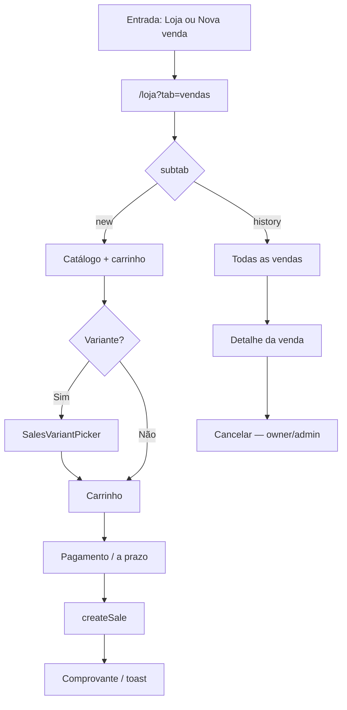

# PDV e nova venda

| Campo | Valor |
|---|---|
| **id** | `vendas.pdv.nova-venda` |
| **módulo** | Vendas |
| **personas** | recepcionista (member), admin, owner |
| **rotas** | `/loja?tab=vendas`, `/loja?tab=vendas&subtab=new`, `/loja?tab=vendas&subtab=history`, `/loja?tab=vendas&pdv=1` |
| **pré-requisitos** | Módulo `sales` ativo; produtos cadastrados em `/loja?tab=produtos`; estoque quando item controla saldo |
| **status** | revisado (código) |
| **última revisão** | 2026-06-26 |
| **validação** | [VALIDATION.md](../VALIDATION.md) |

**Specs relacionadas:**

- [2026-06-15-modal-venda-produto-PRODUCT.md](../../superpowers/specs/2026-06-15-modal-venda-produto-PRODUCT.md)

**Harness relacionado:** `npm test -- lojaSalesTabs nlAction`

**Arquivos-chave:** `src/pages/Loja.jsx`, `src/pages/Sales.jsx`, `src/components/sales/SalesNewSaleTab.jsx`, `src/components/sales/NovaVendaModal.jsx`, `src/store/useSalesStore.js`, `src/lib/lojaSalesTabs.js`

---

## Resumo

O operador registra vendas de produtos pelo hub **Loja → Vendas** (tela cheia ou **modo PDV**), ou pelo atalho global **Nova venda** na sidebar (`NovaVendaModal`). O fluxo cobre catálogo, carrinho, variantes, pagamento (incluindo split e venda a prazo), comprovante e consulta/cancelamento em **Todas as vendas**.

---

## Diagrama de fluxo

---

## Mapa de telas

| # | Rota | Componente | Ação do usuário | Resultado esperado |
|---|---|---|---|---|
| 1 | `/loja?tab=vendas` | `Loja` → `Sales` | Abrir **Vendas** no menu Loja | Sub-abas Nova venda / Todas as vendas |
| 2 | `&subtab=new` | `SalesNewSaleTab` | Buscar produto no catálogo | Item no carrinho |
| 3 | Nova venda | Produto com variantes | Escolher tamanho/cor | `SalesVariantPicker` |
| 4 | Nova venda | Ajustar qty/preço | Editar linha | Total recalcula |
| 5 | Nova venda | Vincular aluno (opcional) | Busca typeahead | `searchStudentsForSale` |
| 6 | Nova venda | Cliente avulso | Nome + telefone | Sem `aluno_id` |
| 7 | Checkout | Formas de pagamento | PIX, dinheiro, cartão, split | `SalesPaymentBlock`; **Recebido via** em cartão (2+ meios) |
| 8 | Checkout | Venda a prazo | Toggle + data vencimento | `deferred: true` |
| 9 | Checkout | **Concluir venda** | Submit | `createSale`; toast; comprovante |
| 10 | Toolbar | **Modo PDV** | `?pdv=1` | UI fullscreen; hotkeys F2–F4 |
| 11 | PDV | Suspender carrinho | Pausar atendimento | `suspendCart` / retomar |
| 12 | Sidebar | **Nova venda** | `NovaVendaModal` | Mesmo `SalesNewSaleTab` em modal |
| 13 | `&subtab=history` | `SalesHistoryTab` | Filtrar período/status | Lista paginada |
| 14 | Todas as vendas | Abrir venda | `SaleDetailModal` | Detalhe itens + pagamentos |
| 15 | Todas as vendas | Cancelar (owner/admin) | `SalesCancelModal` | `cancelSale`; comprovante cancelamento |
| 16 | Vendas | **Configurações** | `?config=1` ou botão | `SalesSettingsSection` inline |

---

## A — Auditoria operacional

### Pré-condições de dados

- [ ] Módulo `sales` habilitado (`modules.sales === true`)
- [ ] Pelo menos um produto ativo em **Produtos**
- [ ] Saldo em estoque para itens com controle de quantidade
- [ ] Opcional: turno de caixa aberto (`CashShiftBanner`) — bypass em `modalMode`

### Permissões por papel

| Papel | Registrar venda | Cancelar venda | Config vendas |
|---|---|---|---|
| **member** | Sim | Não | Conforme settings |
| **admin** | Sim | Sim | Sim |
| **owner** | Sim | Sim | Sim |

### Checklist passo a passo

1. [ ] `/loja?tab=vendas` carrega com `subtab=new` normalizado
2. [ ] Módulo `sales` off → mensagem «Módulo de loja não está ativo»
3. [ ] Adicionar produto ao carrinho e concluir com PIX → venda `concluida`
4. [ ] Produto sem estoque → erro `no_stock` / `stock_stale`; catálogo recarrega
5. [ ] Variante obrigatória sem seleção → validação antes do submit
6. [ ] Venda a prazo sem data → mensagem de erro no checkout
7. [ ] Split de pagamento com total divergente → bloqueio (`paymentsUiValid`)
7b. [ ] Cartão com 2 meios de captura — **Recebido via** na linha de pagamento
8. [ ] **Modo PDV** (`?pdv=1`) oculta tabs do hub; preferência em `localStorage` `sales:pdvMode:v1`
9. [ ] Atalho sidebar **Nova venda** abre modal; dirty → `ConfirmDialog` ao fechar
10. [ ] Todas as vendas: filtros período, status, canal, busca
11. [ ] Cancelamento só owner/admin; member não vê ação
12. [ ] Legacy `/vendas` → redirect para `/loja?tab=vendas`
13. [ ] Legacy `?tab=new` → normaliza para `?tab=vendas&subtab=new`
14. [ ] Trocar academia → catálogo e histórico da academia atual

### Estados de erro conhecidos

| Situação | Feedback esperado | Referência |
|---|---|---|
| `no_stock` / `stock_stale` | Toast warning + reload catálogo | `SalesNewSaleTab` |
| Erro API venda | Toast `friendlySaleError` | `useSalesStore` |
| Fechar modal com carrinho | `ConfirmDialog` descartar | `NovaVendaModal` |
| Escape com variant picker aberto | Não fecha modal pai | spec modal-venda-produto |

### Critérios de fluxo saudável vs regressão

**Saudável:** Idempotência (`idempotency_key`); estoque decrementa; comprovante após venda; PDV responsivo.

**Regressão:** Venda duplicada no double-click; cancelamento por member; erro de validação invisível no modal.

---

## B — Roteiro de demonstração em vídeo

**Duração alvo:** 5–6 min

### Dados de demonstração sugeridos

| Entidade | Valor fictício |
|---|---|
| Produto | Kimono Branco — M — R$ 289 |
| Cliente | Aluno demo ou cliente avulso |
| Pagamento | PIX integral |

### Cenas

| Cena | Tela | Narração sugerida | Gancho de valor |
|---|---|---|---|
| 1 | Loja → Vendas | "A loja fica no mesmo hub: vendas, produtos e estoque." | Um lugar para operação |
| 2 | Catálogo | "Clico no produto, escolho o tamanho, e o carrinho fecha o total." | Rapidez no balcão |
| 3 | PDV | "No modo PDV, tela cheia e atalhos para quem fica no caixa o dia todo." | Foco operacional |
| 4 | Pagamento | "PIX, dinheiro ou divide em duas formas — fecha certinho com o total." | Flexibilidade |
| 5 | Todas as vendas | "Qualquer venda do período — abro, imprimo ou cancelo com motivo." | Auditoria |

### O que não mostrar

- Dados reais de clientes ou valores sensíveis
- Erros de API crus sem `friendlySaleError`
- Fluxo B do perfil do aluno em detalhe (ver spec modal — escopo separado)

---

## Variações e atalhos

- **Modal global:** `NOVA_VENDA_MENU_ACTION` em `naviMenu.js` — não exige caixa aberto (`modalMode`)
- **Perfil do aluno:** pagamento → produto usa `StudentProductSaleStep` (mesma API, UX diferente)
- **NL command bar:** `register_sale` via `useNlAction` → `createSale`
- **Produtos:** pré-requisito em `/loja?tab=produtos`; estoque em `/loja?tab=estoque` quando `modules.inventory`
- **Aliases:** `/vendas`, `/produtos`, `/estoque` → redirects para `/loja?tab=…`

---

## Histórico de revisão

| Data | Autor | Mudança |
|---|---|---|
| 2026-06-15 | — | Criação Fase 3 |
| 2026-06-17 | — | Checkout: «Recebido via» em cartão (`SalesPaymentBlock`) |
