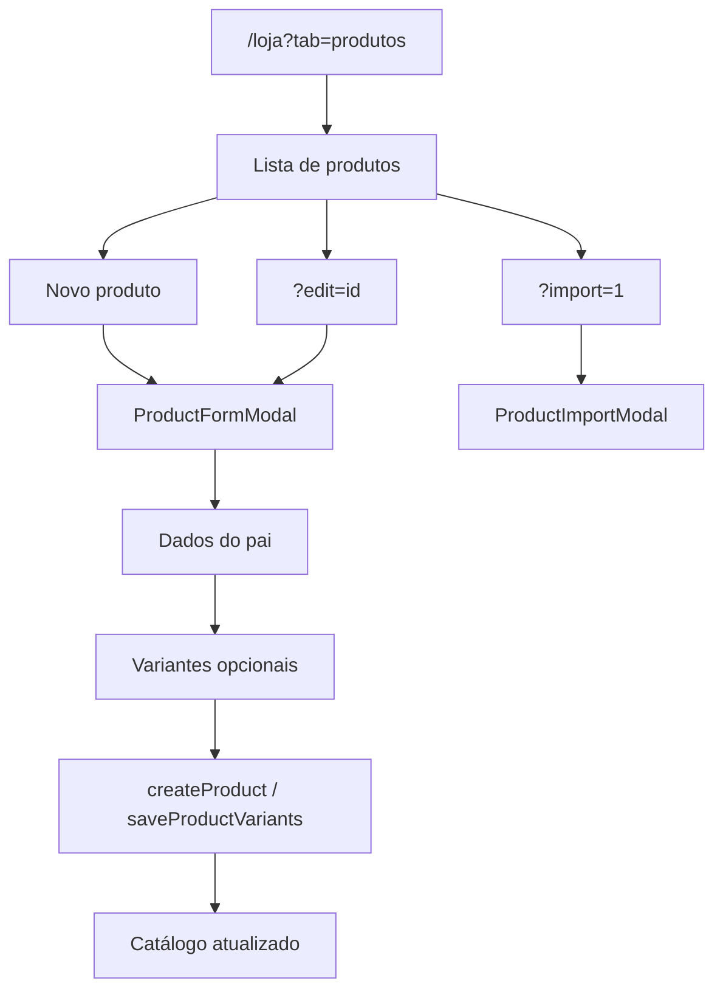

# Produtos e catálogo

| Campo | Valor |
|---|---|
| **id** | `vendas.produtos.catalogo` |
| **módulo** | Vendas |
| **personas** | owner, admin, recepcionista (member) |
| **rotas** | `/loja?tab=produtos`, `/loja?tab=aluguel`, `/loja?tab=produtos&import=1`, `?edit=`, `?duplicate=` |
| **pré-requisitos** | Módulo `sales` ou `inventory` ativo |
| **status** | revisado (código) |
| **última revisão** | 2026-06-15 |
| **validação** | [VALIDATION.md](../VALIDATION.md) |

**Specs relacionadas:** — (catálogo pai/variante em `productCatalog.js`)

**Harness relacionado:** `npm test -- productCatalog productCatalogDb`

**Arquivos-chave:** `src/pages/Products.jsx`, `src/components/products/ProductFormModal.jsx`, `src/store/useProductsStore.js`, `src/lib/productCatalog.js`

---

## Resumo

O operador mantém o **catálogo de produtos** (nome, preço, categoria, variantes tamanho/cor, imagem), importa em lote, duplica itens e consulta movimentações de estoque por produto. Itens de **aluguel** (`type: rental`) ficam na aba **Aluguel**; venda e insumo na aba **Produtos**; itens `both` aparecem nas duas. Produtos ativos alimentam o PDV ([pdv-nova-venda.md](pdv-nova-venda.md)).

---

## Diagrama de fluxo

---

## Mapa de telas

| # | Rota | Componente | Ação do usuário | Resultado esperado |
|---|---|---|---|---|
| 1 | `/loja?tab=produtos` | `Products` | Abrir **Produtos** | Lista venda/insumo/both (sem rental puro) |
| 1b | `/loja?tab=aluguel` | `Products catalogScope=aluguel` | Abrir **Aluguel** | Lista rental/both; criação default `type=rental` |
| 2 | Produtos | **Novo produto** | Abrir modal passo 1 | `ProductFormModal` criação |
| 3 | Modal | Dados básicos | Nome, preço, categoria, imagem | `createProduct` via `/api/products` |
| 4 | Modal | Passo variantes | Tamanhos/cores, SKU | `saveProductVariants` |
| 5 | Lista | Expandir pai | Ver variantes | Árvore pai → filhos |
| 6 | Lista | Menu ⋯ | Duplicar / excluir / tamanhos | `ProductDeleteDialog` se houver vendas |
| 7 | `?edit=<id>` | Deep link | Editar produto/variante | Modal abre no passo correto |
| 8 | `?duplicate=<id>` | Deep link | Duplicar | Modal modo duplicate |
| 9 | `?import=1` | `ProductImportModal` | Importar CSV/planilha | Filtro pós-import na lista |
| 10 | Lista | Movimentações | `ProductStockMovesDrawer` | Histórico do item |
| 11 | Hub Loja | Sem módulos sales/inventory | — | Aba ausente no `HubTabBar` |

---

## A — Auditoria operacional

### Pré-condições de dados

- [ ] `modules.sales === true` **ou** `modules.inventory === true`
- [ ] `academyId` selecionado

### Permissões por papel

| Papel | Acessar Produtos | CRUD |
|---|---|---|
| **owner** | Sim | Sim |
| **admin** | Sim | Sim |
| **member** | Sim | Sim (sem restrição extra na página) |

### Checklist passo a passo

1. [ ] `/loja?tab=produtos` carrega catálogo
2. [ ] Criar produto simples (sem variantes) → aparece na lista
3. [ ] Criar produto com 2 variantes → expandir mostra ambas
4. [ ] Variantes duplicadas (mesmo tamanho+cor) → erro de validação
5. [ ] Editar preço do pai → reflete no PDV após refresh catálogo
6. [ ] Excluir produto com vendas → aviso `deleteHasSales`
7. [ ] Import `?import=1` abre modal e limpa query após abrir
8. [ ] Filtros busca/categoria/status refinam lista
9. [ ] Legacy `/produtos` → redirect `/loja?tab=produtos`
10. [ ] Onboarding `first_product` auto-done ao criar primeiro produto
11. [ ] Trocar academia → catálogo isolado por tenant
12. [ ] `refreshStockStores` após save sincroniza estoque/vendas

### Estados de erro conhecidos

| Situação | Feedback esperado | Referência |
|---|---|---|
| Falha API produtos | Toast `friendlyError` | `productsApiPost` |
| Variante com saldo ao excluir | Toast warning | `handleSave` phase variants |
| Sem módulo loja | `canAccess` false | `Products.jsx` |

### Critérios de fluxo saudável vs regressão

**Saudável:** Variantes únicas; preço positivo no PDV; import não duplica IDs.

**Regressão:** Produto de outra academia; deep link `edit` quebra modal; catálogo legado sem migração.

---

## B — Roteiro de demonstração em vídeo

**Duração alvo:** 4 min

### Dados de demonstração sugeridos

| Entidade | Valor fictício |
|---|---|
| Produto | Kimono Academia — R$ 289 |
| Variantes | P, M, G |

### Cenas

| Cena | Tela | Narração sugerida | Gancho de valor |
|---|---|---|---|
| 1 | Produtos | "Antes de vender, cadastro o que a loja oferece." | Catálogo único |
| 2 | Variantes | "Um produto, vários tamanhos — cada um com estoque próprio." | E-commerce no balcão |
| 3 | Import | "Ou importo a planilha de uma vez." | Setup rápido |
| 4 | PDV link | "Na hora da venda, tudo já aparece no caixa." | Ponta a ponta |

### O que não mostrar

- Migração legado `legacy-group` (salvo demo técnica)
- Tokens JWT nas chamadas API

---

## Variações e atalhos

- **Só `sales`:** aba Produtos visível sem Estoque completo
- **Só `inventory`:** produtos para controle de saldo
- **Catálogo legado:** banner migrar formato pai/variante
- **Próximo passo:** [estoque-movimentacoes.md](estoque-movimentacoes.md) ou [pdv-nova-venda.md](pdv-nova-venda.md)

---

## Histórico de revisão

| Data | Autor | Mudança |
|---|---|---|
| 2026-06-15 | — | Criação Fase 4 |
