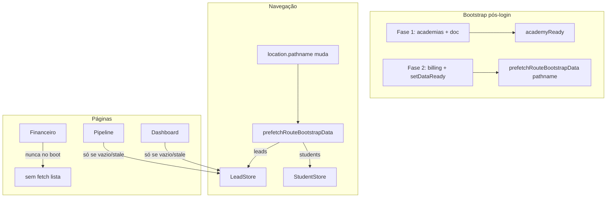

# Shell Performance — Fase S2 Implementation Plan

> **For agentic workers:** REQUIRED SUB-SKILL: Use superpowers:subagent-driven-development (recommended) or superpowers:executing-plans to implement this plan task-by-task. Steps use checkbox (`- [ ]`) syntax for tracking.

**Goal:** Completar o bootstrap sob demanda (leads/alunos só quando a rota precisa) e remover o CSS restante do critical path, sem regressão de UX no Dashboard/Funil.

**Architecture:** `prefetchRouteBootstrapData` vira a única porta de entrada para warm-up de listas; páginas deixam de disparar `fetch*` redundante no mount. CSS de módulos (`sales`, `equipe`, `chat-widget`, etc.) migra para as rotas lazy — mesmo padrão da S1.

**Tech Stack:** React 19 + Vite, Zustand (`useLeadStore`, `useStudentStore`), React Router, Vitest.

**Baseline pós-S1 (build 2026-06-10):**
- `index-*.js` gzip: **158,9 KB**
- `index-*.css` gzip: **38,7 KB**
- Chunks lazy: `NlCommandBar` 13,3 KB gzip; CSS por rota (`Dashboard` 9,3 KB, `Pipeline` 5,4 KB, etc.)

**Já implementado (não repetir):**
- CSS split: `pipeline`, `dashboard`, `lead-profile`, `reports` fora do `index.css`
- Lazy `NovaVendaModal` + `NlCommandBar`
- `client.ping()` adiado (`requestIdleCallback`)
- `syncBilling` não bloqueia mais leads/alunos
- `setupAcademyPhase2` / `handleAcademyChange` usam `prefetchRouteBootstrapData`
- Badge inbox: primeiro fetch em idle + poll 90s
- Store: `leadsReady`, `studentsReady` + testes em `bootstrapRoutePrefetch.test.js`

---

## Diagrama alvo

---

## Meta S2

| Métrica | Atual | Meta |
|---------|-------|------|
| `index-*.css` gzip | 38,7 KB | **< 30 KB** |
| `index-*.js` gzip | 158,9 KB | **< 145 KB** |
| Requests leads+alunos ao abrir `/financeiro` | 0* | **0** |
| Double-fetch em `/` (home) | possível race | **0** |

\*Com boot atual em `/financeiro` direto, prefetch não dispara leads/alunos — validar com teste.

---

### Task 1: Prefetch na troca de rota

**Files:**
- Modify: `src/App.jsx`
- Test: `src/test/bootstrapRoutePrefetch.test.js` (opcional: teste de integração leve)

- [ ] **Step 1:** Adicionar `useEffect` em `App.jsx` que, quando `academyReady && academyIdStore`, chama `void prefetchRouteBootstrapData(location.pathname)` (sem `AbortSignal` compartilhado com bootstrap).
- [ ] **Step 2:** Garantir que o efeito não re-roda em cada render irrelevante — deps: `[academyReady, academyIdStore, location.pathname]`.
- [ ] **Step 3:** Rodar testes existentes: `npm test -- --run src/test/bootstrapRoutePrefetch.test.js`

---

### Task 2: Eliminar double-fetch no Dashboard

**Files:**
- Modify: `src/pages/Dashboard.jsx`
- Modify: `src/lib/bootstrapRoutePrefetch.js` (se precisar expor helper `shouldSkipListFetch`)

- [ ] **Step 1:** No `useEffect` de `fetchLeads`, adicionar guarda: `if (loading || leadsLastFetchedAt) return` (mesmo padrão de `Pipeline.jsx` ~1541).
- [ ] **Step 2:** No `useEffect` de `fetchStudents`, adicionar guarda: `if (loading || studentsLastFetchedAt) return`.
- [ ] **Step 3:** Smoke manual: login → `/` → Network tab deve mostrar **no máximo 1** request de leads e 1 de alunos.

---

### Task 3: `dataReady` → flags por domínio

**Files:**
- Modify: `src/store/useLeadStore.js`
- Modify: `src/store/useStudentStore.js`
- Modify: `src/App.jsx`
- Grep: `dataReady` em `src/` (hoje só store + App)

- [ ] **Step 1:** Em `setupAcademyPhase2` e `handleAcademyChange`, **não** chamar `setDataReady(true)` antes do prefetch; manter `academyReady` como gate do shell.
- [ ] **Step 2:** Derivar `dataReady` automaticamente: `leadsReady || studentsReady` (ou remover uso se nenhum consumidor externo).
- [ ] **Step 3:** Documentar deprecação de `dataReady` no store (comentário JSDoc).

---

### Task 4: CSS round 2 — tirar módulos do `index.css`

**Files:**
- Modify: `src/index.css` (remover imports)
- Modify: rotas/componentes abaixo (adicionar imports)

| CSS global | Mover para |
|------------|------------|
| `sales.css` | `Sales.jsx`, `Loja.jsx`, `Products.jsx`, `Inventory.jsx`; `NovaVendaModal.jsx` |
| `stock-settings.css` | `StockSettingsSection.jsx` |
| `equipe.css` | `Equipe.jsx` |
| `chat-widget.css` | `NaviChatWidget.jsx`, `NaviChatWidgetPanel.jsx` |
| `tokens/finance.css` | já importado em abas financeiras — **remover do index** se tokens duplicados não quebrarem shell |

- [ ] **Step 1:** Remover um import por vez; build + checar rota afetada.
- [ ] **Step 2:** `npm run build` — anotar novo tamanho `index-*.css` gzip.
- [ ] **Step 3:** Verificar perfis (`LeadProfile`, `StudentProfile`) com chat widget aberto.

---

### Task 5: Adiar `NlCommandBar` até primeira interação (opcional, alto ganho JS)

**Files:**
- Modify: `src/App.jsx`
- Modify: `src/components/NlCommandBarTrigger.jsx` (prefetch no hover/focus)

- [ ] **Step 1:** Estado `nlChunkReady` — só montar `<NlCommandBar>` após `setNlOpen(true)` **ou** atalho ⌘K/Ctrl+K capturado no shell (listener leve em `App.jsx`).
- [ ] **Step 2:** `NlCommandBarTrigger`: `onMouseEnter` / `onFocus` → `import('./NlCommandBar.jsx')` (preload).
- [ ] **Step 3:** Confirmar que ⌘K funciona na primeira tecla (pode haver ~100ms de suspense).

**Risco:** primeira abertura com delay perceptível — mitigar com preload no hover.

---

### Task 6: Fontes — menos bloqueio de render (S4 antecipado)

**Files:**
- Modify: `src/index.css` (remover `@import` Google Fonts)
- Modify: `index.html` ou `src/main.jsx`

- [ ] **Step 1:** Trocar `@import url('fonts.googleapis.com...')` por `<link rel="preconnect">` + `<link rel="stylesheet">` com `display=swap` no `index.html`.
- [ ] **Step 2:** (Opcional) Self-host subset WOFF2 de Plus Jakarta Sans — maior ganho LCP, mais esforço.
- [ ] **Step 3:** Lighthouse local ou Web Vitals em staging.

---

### Task 7: Verificação final

- [ ] `npm run build` — registrar `index-*.js` e `index-*.css` gzip
- [ ] `npm test -- --run src/test/bootstrapRoutePrefetch.test.js`
- [ ] Checklist manual:
  - Login → `/` → Dashboard carrega KPIs
  - Login → navegar para `/financeiro` → sem fetch leads no Network antes de abrir aba
  - Trocar academia em `/pipeline` → lista repopula
  - Badge inbox aparece após idle
  - ⌘K abre NL bar
  - Nova venda abre modal

---

## Fora de escopo (Fase S3)

- Extrair `App.jsx` em layout / bootstrap / routes
- `fetchLeads` paginado server-side (API dedicada)
- Self-host fonts completo
- Medição Web Vitals por rota em produção

---

## Ordem recomendada de execução

1. Task 1 (prefetch rota) — desbloqueia valor do bootstrap atual
2. Task 2 (dedupe Dashboard) — corrige race
3. Task 4 (CSS) — ganho em todas as rotas
4. Task 3 (dataReady) — limpeza
5. Task 5 ou 6 — conforme tempo
6. Task 7 — verificação

**Estimativa:** 2–3 dias de dev + QA.
