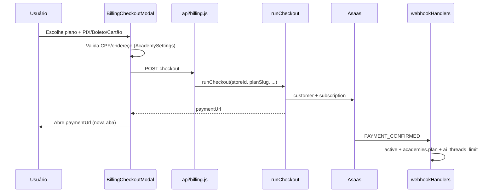
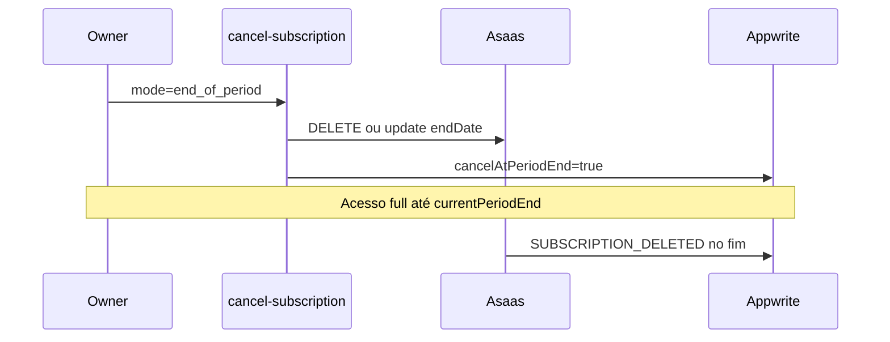

# Portal de assinatura + checkout unificado — Implementation Plan

> **For agentic workers:** REQUIRED SUB-SKILL: Use superpowers:subagent-driven-development (recommended) or superpowers:executing-plans to implement this plan task-by-task. Steps use checkbox (`- [ ]`) syntax for tracking.

**Goal:** Substituir links estáticos Asaas por checkout via API, e entregar portal self-service em Conta → Assinatura: status, faturas, cancelar, trocar cartão e mudança de plano (upgrade/downgrade).

**Architecture:** Estender `api/billing.js?action=*` (sem novos arquivos em `/api/` — limite Hobby 11/12 functions). Lógica de domínio em `lib/billing/*`; UI em componentes novos sob `src/components/account/billing/`, montados por `PlansTabContent.jsx`. Asaas continua fonte de verdade para cobrança; Appwrite (`store_subscriptions`, `subscription_payments`, `academies`) espelha estado via API + webhooks.

**Tech Stack:** Asaas API v3, Appwrite, Vercel Functions (`api/billing.js`), React + `ConfirmDialog` / `useToast` / `ModalShell`, Vitest.

---

## Diagnóstico (estado atual)

| Capacidade | Backend | UI | Risco |
|------------|---------|-----|-------|
| Ver planos | `GET ?action=plans` | Grid em `PlansTabContent.jsx` | OK |
| Status trial/active | `GET ?action=status` + `gate.js` | Chip topbar (`App.jsx`); aba planos não mostra status rico | Médio |
| Checkout | `POST ?action=checkout` → `runCheckout.js` | **`VITE_ASAAS_LINK_*`** (sem `storeId`) | **Alto** |
| Cancelar | Webhook `SUBSCRIPTION_DELETED` só | Nada | Alto |
| Faturas | Webhook grava `subscription_payments` | Nada | Médio |
| Trocar cartão | Nada | Nada | Alto |
| Downgrade | Nada | Botão "upgrade" abre link genérico | Alto |

**Decisão de produto:** manter **30 dias de trial** (`TRIAL_DAYS`); assinatura paga só após trial ou checkout explícito.

---

## File map

| File | Action | Responsibility |
|------|--------|----------------|
| `lib/billing/asaasClient.js` | Modify | `cancelAsaasSubscription`, `updateAsaasSubscription`, `listCustomerPayments`, `getPaymentUpdateCardUrl` |
| `lib/billing/runCheckout.js` | Modify | Persistir `planSlug` na subscription row |
| `lib/billing/changePlan.js` | **Create** | Upgrade imediato vs downgrade no próximo ciclo |
| `lib/billing/cancelSubscription.js` | **Create** | Cancel imediato vs `cancelAtPeriodEnd` |
| `lib/billing/listPaymentsForStore.js` | **Create** | Merge Appwrite + Asaas para histórico |
| `lib/billing/webhookHandlers.js` | Modify | `SUBSCRIPTION_UPDATED`; respeitar `cancelAtPeriodEnd` |
| `api/billing.js` | Modify | Novas actions (ver tabela abaixo) |
| `src/lib/billingApi.js` | **Create** | Cliente fetch tipado para ações de billing |
| `src/components/account/billing/SubscriptionStatusCard.jsx` | **Create** | Plano, status, trial, vencimento, CPF ok? |
| `src/components/account/billing/BillingCheckoutModal.jsx` | **Create** | Wizard checkout unificado |
| `src/components/account/billing/InvoiceHistoryTable.jsx` | **Create** | Lista de faturas |
| `src/components/account/billing/SubscriptionActionsPanel.jsx` | **Create** | Cancelar, trocar cartão, mudar plano |
| `src/components/account/PlansTabContent.jsx` | Modify | Compor portal; remover `VITE_ASAAS_LINK_*` |
| `src/components/account/PlansContent.jsx` | Modify | Alinhar com `PlansTabContent` ou delegar |
| `lib/billing/*.test.js` | **Create** | Testes unitários handlers puros |
| `src/test/billingPortal.test.js` | **Create** | Testes UI helpers / billingApi |
| `.env.example` | Modify | Documentar remoção futura de `VITE_ASAAS_LINK_*` |
| `docs/appwrite-setup.md` | Modify | Campos `planSlug`, `pendingPlanSlug`, `cancelAtPeriodEnd` |

### Novas actions em `api/billing.js` (mesmo handler)

| action | Método | Body / query |
|--------|--------|----------------|
| `checkout` | POST | *(existente)* |
| `subscription-summary` | GET | `storeId` — status + subscription row + próxima cobrança |
| `payments` | GET | `storeId`, `limit?` |
| `cancel-subscription` | POST | `storeId`, `mode: 'end_of_period' \| 'immediate'` |
| `change-plan` | POST | `storeId`, `planSlug`, `when: 'now' \| 'next_cycle'` |
| `payment-method-link` | GET | `storeId` — URL para atualizar cartão (fatura pendente Asaas) |

Todas exigem JWT + `assertAcademyOwnedByOwner` (owner da academia).

---

## Fluxos (referência)

### Checkout unificado



### Cancelar (fim do período — recomendado default)



### Downgrade (próximo ciclo — recomendado)

- **Upgrade (starter→studio):** `change-plan` + `when=now` → `PUT /subscriptions/{id}` valor maior + `externalReference` novo; webhook ou handler atualiza `ai_threads_limit` imediatamente.
- **Downgrade (pro→starter):** `when=next_cycle` → grava `pendingPlanSlug`; no `PAYMENT_CONFIRMED` do ciclo ou cron `billing-reconcile`, aplica plano menor e limites.

---

## Phase 0 — Fundação backend (pré-requisito)

### Task 0.1: Estender cliente Asaas

**Files:**
- Modify: `lib/billing/asaasClient.js`
- Create: `lib/billing/asaasClient.test.js`

- [ ] **Step 1: Testes para wrappers (mock `asaasFetch`)**

```javascript
// cancelAsaasSubscription(id) → DELETE /subscriptions/{id}
// updateAsaasSubscription(id, body) → PUT /subscriptions/{id}
// listCustomerPayments(customerId, { limit, offset })
// listSubscriptionPayments já existe — aumentar limit default para 24
```

- [ ] **Step 2: Implementar funções**
- [ ] **Step 3: `npm test -- lib/billing/asaasClient.test.js`**

### Task 0.2: Persistir `planSlug` na subscription

**Files:**
- Modify: `lib/billing/runCheckout.js`
- Modify: `lib/billing/billingAppwriteStore.js` (se precisar helper)
- Modify: `lib/billing/webhookHandlers.js` (fallback: ler `planSlug` da row)

- [ ] **Step 1: Em `runCheckout`, após criar assinatura Asaas, `updateSubscriptionByStoreId({ planSlug, asaasSubscriptionId, ... })`**
- [ ] **Step 2: Webhook: se `externalReference` falhar, usar `planSlug` da row**
- [ ] **Step 3: Teste unitário em `runCheckout` (mock store)**

### Task 0.3: Enriquecer `GET ?action=status`

**Files:**
- Modify: `api/billing.js`
- Modify: `lib/billing/gate.js` (opcional: exportar shape documentado)

- [ ] **Retornar junto com `evaluateBillingAccess`:**
  - `planSlug` (subscription row)
  - `currentPlan` (academies.plan)
  - `asaasSubscriptionId`, `cancelAtPeriodEnd`
  - `companyTaxOk` (CPF/CNPJ preenchido)
  - `currentPeriodEnd`, `trialDaysRemaining` (calc no servidor)
  - `pendingPlanSlug` (se existir)

---

## Phase 1 — Checkout unificado (prioridade máxima)

**Por quê primeiro:** elimina dessincronização plano ↔ academia causada por `VITE_ASAAS_LINK_*`.

### Task 1.1: Cliente API frontend

**Files:**
- Create: `src/lib/billingApi.js`
- Create: `src/test/billingApi.test.js`

- [ ] **Funções:** `fetchBillingStatus`, `postCheckout`, `fetchPayments`, `postCancel`, `postChangePlan`, `fetchPaymentMethodLink`
- [ ] **Usar `createSessionJwt()` + header `Authorization`**
- [ ] **Erros: mapear para `friendlyError` / toast**

### Task 1.2: Modal de checkout

**Files:**
- Create: `src/components/account/billing/BillingCheckoutModal.jsx`
- Reuse: validação CPF de `AcademySettings` / `validateBillingCustomer` shape

- [ ] **Passos do modal:**
  1. Resumo do plano escolhido (preço, conversas IA)
  2. Dados fiscais (CPF/CNPJ, nome, email — pré-preencher academia + user)
  3. Forma de pagamento: PIX | BOLETO | CREDIT_CARD
  4. Confirmar → `POST /api/billing/checkout`
  5. Sucesso → abrir `paymentUrl` + toast "Conclua o pagamento na janela aberta"
- [ ] **Usar `ModalShell` + `FieldError` + `useToast`**
- [ ] **Bloquear submit se `companyTaxOk === false` sem dados válidos**

### Task 1.3: Integrar em PlansTabContent

**Files:**
- Modify: `src/components/account/PlansTabContent.jsx`
- Modify: `src/components/account/PlansContent.jsx` (delegar ou extrair hook compartilhado)

- [ ] **Remover `CHECKOUT_LINKS` / `VITE_ASAAS_LINK_*`**
- [ ] **`handleCheckout(planKey)` → abre `BillingCheckoutModal` com `planSlug`**
- [ ] **Rótulos botão:**
  - Sem plano pago: "Assinar" / trial
  - Plano menor → maior: "Fazer upgrade"
  - Plano maior → menor: "Mudar para {plan}" (abre fluxo downgrade — Phase 3)
- [ ] **Feature flag:** se `!billingLive`, manter prévia atual**

### Task 1.4: Teste manual + deprecar env vars

- [ ] **Sandbox Asaas:** checkout PIX e cartão para academia teste; confirmar webhook atualiza `academies.plan`
- [ ] **`.env.example`:** marcar `VITE_ASAAS_LINK_*` como deprecated
- [ ] **Commit:** `feat(billing): checkout unificado via API`

---

## Phase 2 — Portal: status e shell

### Task 2.1: SubscriptionStatusCard

**Files:**
- Create: `src/components/account/billing/SubscriptionStatusCard.jsx`

- [ ] **Exibir:**
  - Badge: Trial | Ativa | Inadimplente | Cancelada
  - Plano atual + limite IA usado/limit (`planService` ou status API)
  - "Trial termina em X dias" / "Próxima cobrança em DD/MM"
  - Alerta se `past_due` com CTA "Regularizar pagamento"
  - Link "Atualizar CPF/CNPJ" → Academy Settings se `!companyTaxOk`

### Task 2.2: Layout da aba Assinatura

**Files:**
- Modify: `src/components/account/PlansTabContent.jsx`

- [ ] **Ordem vertical:**
  1. `SubscriptionStatusCard`
  2. Grid de planos (existente)
  3. `InvoiceHistoryTable` (Phase 3)
  4. `SubscriptionActionsPanel` (Phase 3–4)
- [ ] **Carregar `subscription-summary` uma vez; passar props aos filhos**

---

## Phase 3 — Histórico de faturas

### Task 3.1: Backend list payments

**Files:**
- Create: `lib/billing/listPaymentsForStore.js`
- Modify: `api/billing.js` (`?action=payments`)

- [ ] **Merge:**
  - Documentos `subscription_payments` no Appwrite (ordenar `paidAt` desc)
  - Complementar com `GET /subscriptions/{id}/payments` Asaas (status PENDING com `invoiceUrl`)
- [ ] **Deduplicar por `asaasPaymentId`**
- [ ] **Response:** `{ payments: [{ id, value, status, billingType, paidAt, invoiceUrl, dueDate }] }`

### Task 3.2: UI InvoiceHistoryTable

**Files:**
- Create: `src/components/account/billing/InvoiceHistoryTable.jsx`

- [ ] **Tabela:** Data | Valor | Forma | Status | Ação "Ver boleto/fatura" (`invoiceUrl`)**
- [ ] **Empty state:** "Nenhuma fatura ainda"**
- [ ] **Loading skeleton**

### Task 3.3: Testes

- [ ] **`lib/billing/listPaymentsForStore.test.js`** — merge e dedupe
- [ ] **Commit:** `feat(billing): histórico de faturas`

---

## Phase 4 — Cancelar assinatura

### Task 4.1: Backend cancel

**Files:**
- Create: `lib/billing/cancelSubscription.js`
- Modify: `api/billing.js` (`?action=cancel-subscription`)

- [ ] **`mode: 'end_of_period'` (default UX):**
  - Chamar Asaas para encerrar ao fim do ciclo (ver doc Asaas: `DELETE` com comportamento ou `update` `endDate`)
  - `updateSubscriptionByStoreId({ cancelAtPeriodEnd: true })`
  - **Não** zerar acesso imediato — `gate.js` já usa `currentPeriodEnd`
- [ ] **`mode: 'immediate'`:**
  - `DELETE /subscriptions/{id}`
  - `status: canceled`, limpar `asaasSubscriptionId`
  - Acesso `none` após resposta
- [ ] **Idempotência:** se já `inactive`/`canceled`, retornar 200**

### Task 4.2: UI cancel

**Files:**
- Create: `src/components/account/billing/SubscriptionActionsPanel.jsx` (seção cancel)
- Reuse: `ConfirmDialog`

- [ ] **Botão "Cancelar assinatura" (destructive, só owner)**
- [ ] **Dialog explica:**
  - Fim do período: mantém acesso até DD/MM
  - Imediato: perde acesso agora
- [ ] **Após sucesso:** toast + refetch status
- [ ] **Se `cancelAtPeriodEnd`:** mostrar banner "Cancelamento agendado para DD/MM" + opção "Manter assinatura" (reverter — stretch, Asaas recreate)**

### Task 4.3: Gate e webhook

- [ ] **`gate.js`:** se `cancelAtPeriodEnd && now < currentPeriodEnd` → `accessLevel: full`**
- [ ] **Webhook `SUBSCRIPTION_DELETED`:** set `cancelAtPeriodEnd: false`**
- [ ] **Teste:** `lib/billing/cancelSubscription.test.js`**

---

## Phase 5 — Trocar cartão

### Abordagem em 2 estágios

**Estágio A (MVP — esta fase):** link da fatura pendente  
**Estágio B (futuro):** tokenização Asaas no front (`creditCardToken` + `PUT subscription`)

### Task 5.1: Backend payment-method-link

**Files:**
- Modify: `api/billing.js` (`?action=payment-method-link`)

- [ ] **Buscar próxima cobrança PENDING em `/subscriptions/{id}/payments`**
- [ ] **Retornar `{ url: payment.invoiceUrl }` ou erro amigável**
- [ ] **Se assinatura só PIX/boleto:** mensagem "Adicione cartão ao assinar com cartão"**

### Task 5.2: UI

- [ ] **Botão "Atualizar forma de pagamento" em `SubscriptionActionsPanel`**
- [ ] **Abre URL Asaas em nova aba**
- [ ] **Visível se `billingType === CREDIT_CARD` ou status `past_due`**

---

## Phase 6 — Downgrade e upgrade via API

### Task 6.1: changePlan module

**Files:**
- Create: `lib/billing/changePlan.js`
- Modify: `api/billing.js` (`?action=change-plan`)

- [ ] **`resolvePlan(planSlug)` + comparar ordem `PLAN_ORDER`**
- [ ] **Upgrade (`when=now`):**
  - `updateAsaasSubscription(id, { value: plan.asaas_value, description, externalReference: nave:{storeId}:{slug} })`
  - Atualizar Appwrite + `academies.plan` + `ai_threads_limit` (proporcional opcional — YAGNI: aplicar limite novo imediato)
- [ ] **Downgrade (`when=next_cycle`):**
  - `updateSubscriptionByStoreId({ pendingPlanSlug: slug })`
  - No webhook `PAYMENT_CONFIRMED` ou reconcile: se `pendingPlanSlug`, aplicar após confirmar pagamento do ciclo atual
- [ ] **Bloquear downgrade se `past_due`**

### Task 6.2: UI mudança de plano

- [ ] **Botões no grid já distinguem upgrade vs downgrade**
- [ ] **Downgrade:** `ConfirmDialog` "Mudança vale no próximo ciclo (DD/MM)"
- [ ] **Upgrade com assinatura ativa:** confirmar cobrança proporcional (copy honesta: "valor ajustado pelo Asaas")**

### Task 6.3: Webhook SUBSCRIPTION_UPDATED

- [ ] **Handler opcional:** sincronizar `currentPeriodEnd`, status**
- [ ] **Testes:** `changePlan.test.js`**

---

## Phase 7 — Hardening

### Task 7.1: billing-reconcile

- [ ] **Auto-corrigir status mismatch simples (Asaas ACTIVE + local past_due)**
- [ ] **Aplicar `pendingPlanSlug` quando detectar ciclo novo**

### Task 7.2: Observabilidade

- [ ] **Logs estruturados `[billing]` em novas actions**
- [ ] **Não logar CPF/CNPJ completo**

### Task 7.3: Documentação

- [ ] **`docs/appwrite-setup.md`:** novos campos subscription
- [ ] **Checklist go-live billing no `.env.example`**

---

## Ordem de entrega recomendada

| Sprint | Entregável | Valor |
|--------|------------|-------|
| 1 | Phase 0 + Phase 1 | Checkout confiável, webhook liga plano certo |
| 2 | Phase 2 + Phase 3 | Portal útil: status + faturas |
| 3 | Phase 4 + Phase 5 | Retenção/churn: cancelar + cartão |
| 4 | Phase 6 + Phase 7 | Downgrade + reconciliação |

**MVP vendável (mínimo):** Phase 0 + 1 + 2 + 3.  
**Portal "completo" do pedido:** até Phase 6.

---

## Test plan (aceitação)

- [ ] Nova academia em trial → checkout Starter PIX → webhook → `status: active`, `plan: starter`, limite IA 300
- [ ] Checkout Studio com CPF já usado em outra academia → 400
- [ ] Repetir checkout mesma combinação em 1h → mesma `paymentUrl` (idempotência)
- [ ] Lista faturas mostra pagamento confirmado + link pendente
- [ ] Cancel end_of_period → acesso até `currentPeriodEnd`; depois `inactive`
- [ ] Trocar cartão abre `invoiceUrl` válido (sandbox)
- [ ] Downgrade Pro→Starter → `pendingPlanSlug`; após renovação, `plan: starter`, limite 300
- [ ] Upgrade Starter→Pro → limite 2000 imediato
- [ ] Owner-only: membro recepcionista não chama actions (403)

---

## Riscos e mitigações

| Risco | Mitigação |
|-------|-----------|
| Links antigos ainda em produção | Remover env vars após deploy; monitorar webhooks sem `externalReference` |
| Asaas sandbox ≠ produção | Testar cada `billingType` em sandbox antes de flag `BILLING_ENABLED` |
| Limite 12 functions Vercel | **Nunca** criar `api/billing-portal.js` |
| PCI cartão | Estágio A só com redirect Asaas; tokenização só com SDK oficial |
| Downgrade proporcional | Documentar "vale no próximo ciclo"; não prometer crédito pro-rata na UI |

---

## Fora de escopo (YAGNI)

- Portal Asaas white-label embutido (iframe)
- Múltiplas formas de pagamento salvas
- Faturamento automático de overage IA
- Planos anuais
- Reembolso via UI
