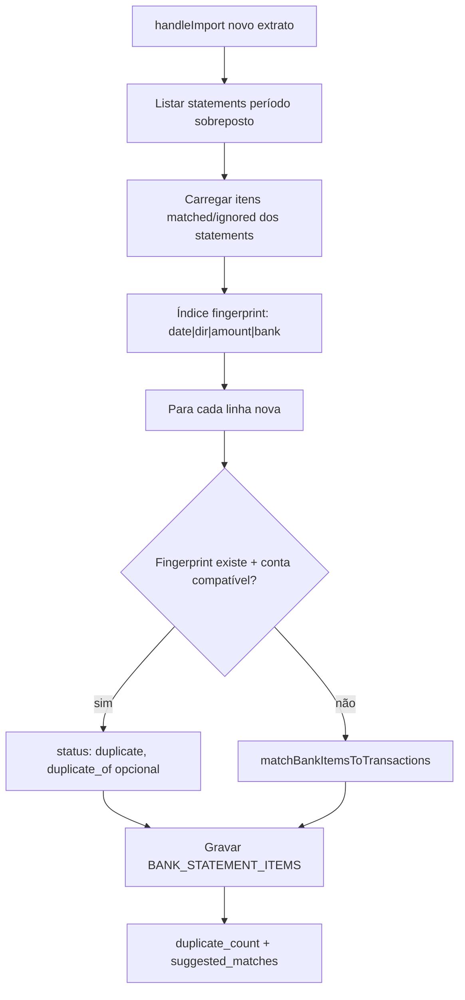

# Conciliação — Deduplicação entre extratos (Implementation Plan)

> **For agentic workers:** REQUIRED SUB-SKILL: Use superpowers:subagent-driven-development (recommended) or superpowers:executing-plans to implement this plan task-by-task. Steps use checkbox (`- [ ]`) syntax for tracking.

**Goal:** Ao importar um extrato com período sobreposto a outro da mesma conta, marcar automaticamente linhas bancárias já tratadas como `duplicate`, para que o gestor só revise o que é novo.

**Architecture:** Módulo puro `bankStatementDedup.js` com critério de igualdade (data + valor ±0,02 + direção + conta) e regras de elegibilidade do item original. `handleImport` carrega itens de statements com período sobreposto, classifica cada linha nova antes do matcher, persiste com `status: 'duplicate'` e retorna `duplicate_count`. Frontend trata `duplicate` como `ignored` nos agrupamentos/KPIs e exibe toast informativo.

**Tech Stack:** Node (Appwrite SDK), Vitest, React (`ReconciliationTab`, `ImportStatementModal`), sem nova Serverless Function.

**PRODUCT spec:** [2026-06-16-conciliacao-deduplicacao-extratos-PRODUCT.md](../specs/2026-06-16-conciliacao-deduplicacao-extratos-PRODUCT.md)

**Pré-requisito:** multi-conta (conta obrigatória no import) — já implementado.

---

## Decisões de produto (fecham perguntas em aberto da spec)

| # | Decisão | Justificativa |
|---|---------|---------------|
| **Q1** | Buscar apenas statements com **período sobreposto** (`period_start ≤ novo_end` e `period_end ≥ novo_start`), mesma `academy_id`, máx. 50 (mesmo limite de `handleList`). Itens carregados só dos statements retornados. | Evita varrer academia inteira; latência ~O(statements_overlap × items). |
| **Q2** | Marcar `duplicate` somente se o item original tem status **`matched` ou `ignored`**. Original ainda `unmatched` → **não** deduplica (evita falso positivo com dois extratos abertos em paralelo). | Cenário 1–15 finalizado + 1–30: linhas já tratadas viram duplicate; extrato A ainda pendente não bloqueia B. |
| **Q3** | Campo `duplicate_of` gravado com best-effort; **sem índice Appwrite** no P0. | P2 retroativo decide indexação depois. |
| **Q4** | Banner de deduplicação parcial no **toast pós-import** (não no modal de revisão). | Menos ruído no fluxo de upload; usuário vê ao confirmar. |

**Escopo deste plano:** P0 da spec (R-1 a R-5). P1 (badge, acordeão, reverter) fica em plano separado.

---

## Fluxo alvo



---

## Arquivos

| Ação | Arquivo | Responsabilidade |
|------|---------|------------------|
| Criar | `lib/server/bankStatementDedup.js` | Fingerprint, igualdade, filtro de conta, classificação |
| Criar | `tests/unit/finance/bankStatementDedup.test.js` | Testes puros da regra |
| Criar | `tests/unit/finance/bankReconciliationDedupImport.test.js` | Testes do fluxo de import com mocks Appwrite |
| Modificar | `lib/server/bankReconciliationHandler.js` | `handleImport`, `handleDetail`, `handleComplete`, `handleConfirmAll` |
| Modificar | `lib/server/bankReconciliationMatcher.js` | Exportar `amountsEqual` (ou mover para `money.js` / dedup) |
| Modificar | `src/components/finance/ReconciliationTab.jsx` | `grouped`, toast `onImported`, `workspaceEmpty` |
| Modificar | `src/components/finance/ImportStatementModal.jsx` | Repassar `duplicate_count` no callback |
| Modificar | `src/test/fixtures/bankReconDetail.js` | Item `duplicate` para testes |
| Modificar | `src/test/bankReconIntegration.test.jsx` | Linha duplicate fora de pendentes |
| Modificar | `docs/superpowers/specs/2026-06-16-conciliacao-deduplicacao-extratos-PRODUCT.md` | Status → Implementado (ao concluir) |

**Sem nova rota `/api/`** — tudo em `bankReconciliationHandler` via `api/finance.js`.

---

## Fase 1 — Helper `bankStatementDedup.js`

### Task 1: Fingerprint e igualdade

**Files:**
- Create: `lib/server/bankStatementDedup.js`
- Test: `tests/unit/finance/bankStatementDedup.test.js`

- [ ] **Step 1: Escrever testes falhando**

Casos mínimos:
- Mesma data, valor, direção, conta → `itemsAreDuplicates` true
- Valor difere em 0,01 → true (tolerância)
- Valor difere em 0,03 → false
- Direção diferente → false
- Conta A vs conta B (ambas preenchidas) → false
- Novo com conta, original sem conta → false (ambiguidade)
- Ambos sem conta → deduplica só por data/valor/direção
- `originalStatusEligibleForDedup`: `matched`/`ignored` → true; `unmatched`/`duplicate` → false

- [ ] **Step 2: Implementar**

```js
// lib/server/bankStatementDedup.js
import { roundMoney } from '../money.js';

const TOLERANCE = 0.02;

export function amountsEqualRecon(a, b) {
  return Math.abs(roundMoney(a) - roundMoney(b)) < TOLERANCE;
}

export function normalizeBankForDedup(value) {
  return String(value || '').trim().toLowerCase();
}

/** Contas compatíveis para dedup (regra de ambiguidade da spec). */
export function bankAccountsCompatibleForDedup(newBank, existingBank) {
  const nb = normalizeBankForDedup(newBank);
  const eb = normalizeBankForDedup(existingBank);
  if (nb && eb && nb !== eb) return false;
  if (nb && !eb) return false;
  if (!nb && eb) return false;
  return true;
}

export function bankStatementItemFingerprint(item, statementBank = '') {
  const bank = normalizeBankForDedup(item.bank_account || item.bankAccount || statementBank);
  const amt = roundMoney(item.amount);
  const dir = String(item.direction || '').toLowerCase();
  const date = String(item.date || '').slice(0, 10);
  return `${date}|${dir}|${amt}|${bank}`;
}

export function itemsAreDuplicates(newItem, existingItem, { newStatementBank, existingStatementBank } = {}) {
  if (String(newItem.date).slice(0, 10) !== String(existingItem.date).slice(0, 10)) return false;
  if (String(newItem.direction).toLowerCase() !== String(existingItem.direction).toLowerCase()) return false;
  if (!amountsEqualRecon(newItem.amount, existingItem.amount)) return false;
  const newBank = newItem.bank_account || newItem.bankAccount || newStatementBank;
  const existBank = existingItem.bank_account || existingItem.bankAccount || existingStatementBank;
  return bankAccountsCompatibleForDedup(newBank, existBank);
}

export const DEDUP_SOURCE_STATUSES = new Set(['matched', 'ignored']);

export function buildDedupIndex(existingRows) {
  // Map<fingerprint, { itemId, statementId }> — primeira ocorrência elegível
}

export function classifyImportItem(item, index, ctx) {
  // retorna { status: 'duplicate'|'unmatched', duplicate_of?: string } ou null → seguir matcher
}
```

- [ ] **Step 3:** `npm test -- --run tests/unit/finance/bankStatementDedup.test.js`

---

## Fase 2 — Backend: carregar contexto e deduplicar no import

### Task 2: `loadOverlappingStatementItems`

**Files:**
- Modify: `lib/server/bankReconciliationHandler.js`

- [ ] **Step 1: Função auxiliar**

```js
async function listOverlappingStatements(academyId, periodStart, periodEnd) {
  const resList = await databases.listDocuments(DB_ID, BANK_STATEMENTS_COL, [
    Query.equal('academy_id', academyId),
    Query.orderDesc('import_date'),
    Query.limit(50),
  ]);
  return (resList.documents || []).filter((d) => {
    const ps = d.period_start || '';
    const pe = d.period_end || '';
    return ps && pe && ps <= periodEnd && pe >= periodStart;
  });
}

async function loadItemsForDedup(statementDocs) {
  const eligible = [];
  for (const stmt of statementDocs) {
    const itemsRes = await databases.listDocuments(DB_ID, BANK_STATEMENT_ITEMS_COL, [
      Query.equal('statement_id', stmt.$id),
      Query.limit(500),
    ]);
    for (const d of itemsRes.documents || []) {
      if (!DEDUP_SOURCE_STATUSES.has(d.status)) continue;
      eligible.push({
        id: d.$id,
        statement_id: stmt.$id,
        date: d.date,
        amount: d.amount,
        direction: d.direction,
        status: d.status,
        statement_bank: stmt.bank_account || stmt.bankAccount || '',
      });
    }
  }
  return eligible;
}
```

**Nota performance:** no pior caso, 50 statements × 500 itens = 25k linhas em memória. Aceitável para P0; otimizar com filtro por `date` no overlap se necessário.

### Task 3: Integrar em `handleImport`

- [ ] **Step 1: Antes de `matchBankItemsToTransactions`**

```js
const overlapping = await listOverlappingStatements(academyId, period_start, period_end);
const existingForDedup = await loadItemsForDedup(overlapping);
const dedupIndex = buildDedupIndex(existingForDedup);

let duplicateCount = 0;
const classified = itemsWithBank.map((it) => {
  const hit = classifyImportItem(it, dedupIndex, { newStatementBank: bankAccount });
  if (hit?.status === 'duplicate') {
    duplicateCount += 1;
    return { item: it, status: 'duplicate', duplicate_of: hit.duplicate_of || null, match_score: 0, suggested_tx_id: null, matched_tx_id: null };
  }
  return null; // segue para matcher
});

const toMatch = itemsWithBank.filter((_, i) => !classified[i]);
const matchResults = matchBankItemsToTransactions(toMatch, naviTx);
// merge classified + matchResults na ordem original
```

- [ ] **Step 2: Persistir `duplicate_of` com try/catch `Unknown attribute`** (padrão já usado para `bank_account`)

- [ ] **Step 3: Resposta**

```js
return json(res, 200, {
  ok: true,
  statement_id: statement.$id,
  items_created: createdItems.length,
  suggested_matches: suggestedCount,
  duplicate_count: duplicateCount,
  dedup_partial: !bankAccount, // true → frontend avisa deduplicação por conta desabilitada
  status: st,
});
```

- [ ] **Step 4: Testes** em `tests/unit/finance/bankReconciliationDedupImport.test.js` com mocks de `databases.listDocuments` / `createDocument`

---

## Fase 3 — Backend: detail, complete, confirm-all

### Task 4: Tratar `duplicate` como resolvido

**Files:**
- Modify: `lib/server/bankReconciliationHandler.js`

- [ ] **`handleDetail`** — `pendingItems`:

```js
const pendingItems = items.filter(
  (i) => i.status !== 'matched' && i.status !== 'ignored' && i.status !== 'duplicate'
);
```

- [ ] **`handleDetail`** — mapear `duplicate_of` no JSON de items (se existir no doc)

- [ ] **`handleComplete`** — `unmatched` só `status === 'unmatched'` (duplicate não impede `reconciled`)

- [ ] **`handleConfirmAll`** — pular `duplicate` como `ignored`

- [ ] **`handleIgnoreItem`** — não permitir ignorar item já `duplicate`? (opcional P0: no-op ou 400; YAGNI: deixar como está)

---

## Fase 4 — Frontend

### Task 5: Agrupamento e KPIs

**Files:**
- Modify: `src/components/finance/ReconciliationTab.jsx`

- [ ] **`grouped` useMemo:**

```js
if (item.status === 'ignored' || item.status === 'duplicate') {
  ignored.push(item);
  continue;
}
```

- [ ] **`workspaceEmpty`** — já exclui duplicate se não estiver em unmatched/suggested ✓

### Task 6: Toast pós-import

**Files:**
- Modify: `src/components/finance/ImportStatementModal.jsx`
- Modify: `src/components/finance/ReconciliationTab.jsx`

- [ ] **`confirmImport`** — callback: `onImported?.(result.statement_id, result)`

- [ ] **`onImported`** em `ReconciliationTab`:

```js
const onImported = (statementId, result) => {
  setSelectedId(statementId);
  void refresh();
  const parts = ['Extrato importado.'];
  if (result?.suggested_matches) parts.push(`${result.suggested_matches} sugestão(ões).`);
  if (result?.duplicate_count) parts.push(`${result.duplicate_count} duplicata(s) ignorada(s).`);
  if (result?.dedup_partial) parts.push('Deduplicação parcial — sem conta no extrato anterior ou ambiguidade de banco.');
  toast.success(parts.join(' '));
};
```

Seguir [docs/ux-feedback.md](../../ux-feedback.md): toast para ação concluída, não `StatusBanner` no workspace.

---

## Fase 5 — Testes de integração

### Task 7: Fixtures e ReconciliationTab

**Files:**
- Modify: `src/test/fixtures/bankReconDetail.js`
- Modify: `src/test/bankReconIntegration.test.jsx`

- [ ] Fixture com item `{ id: 'item-dup', status: 'duplicate', description: 'PIX duplicado', ... }`

- [ ] Teste: linha `duplicate` **não** aparece em "Sem correspondência"

- [ ] Teste: `summary.pending_count` mock sem contar duplicate (via fixture)

### Task 8: Import modal (opcional P0)

- [ ] Se `ImportStatementModal` passar a mostrar preview de duplicatas no step review (futuro US-2): **fora do P0** — dedup só roda no servidor após confirmar. US-2 da spec pede contagem na revisão; **decisão P0:** contagem só no toast pós-import (menor escopo). Anotar US-2 como P1.

---

## Teste manual (~15 min)

1. Academia com conta **Sicoob** cadastrada.
2. Importar `extrato-jan-1-15.csv` (3 linhas) → conciliar 2, ignorar 1 → finalizar.
3. Importar `extrato-jan-1-30.csv` (mesmas 3 linhas + 2 novas dias 20–25).
4. Verificar toast: `3 duplicata(s) ignorada(s)` (ou número correto).
5. Workspace: só 2 linhas em "Sem correspondência" / sugestões; nenhuma das 3 primeiras.
6. KPI pendentes = 2, não 5.
7. Importar `extrato-jan-16-31.csv` sem sobreposição de linhas → `duplicate_count: 0`.

---

## Fora de escopo (P1+)

- Badge "N duplicatas" na lista de extratos (R-6)
- Acordeão "Duplicatas detectadas" + reverter para `unmatched` (R-7, R-8, US-3)
- Deduplicação retroativa em extratos antigos (R-9)
- Substituir extrato (R-10)
- Preview de duplicatas no step review do modal (US-2 completo)

---

## Ordem de entrega

1. `bankStatementDedup.js` + testes unitários
2. `handleImport` + testes com mock
3. `handleDetail` / `handleComplete` / `handleConfirmAll`
4. Frontend grouped + toast
5. Integração ReconciliationTab

**Estimativa P0:** ~6h (alinhado à spec).

---

## Riscos

| Risco | Mitigação |
|-------|-----------|
| Latência no import com muitos statements | Filtrar por overlap de período; log de timing; P1 cache |
| Appwrite sem índice em `statement_id` + `date` | Query por `statement_id` (já usada); aceitável até ~50×500 |
| Falso positivo (dois PIX iguais no mesmo dia) | Documentar; P1 botão "Reprocessar como pendente" |
| Campo `duplicate_of` rejeitado pelo schema | try/catch `Unknown attribute` — status `duplicate` ainda funciona |
