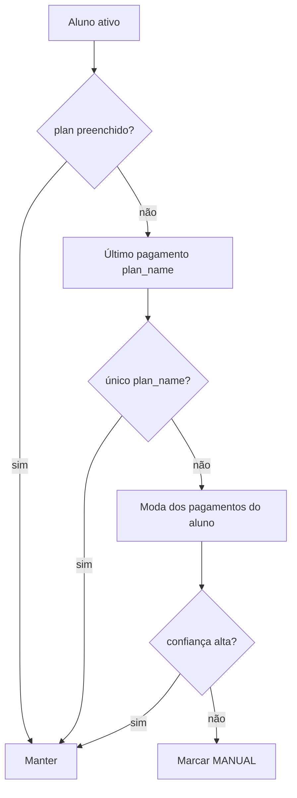

# Restauração de planos GBLP — Implementation Plan

> **For agentic workers:** REQUIRED SUB-SKILL: Use superpowers:subagent-driven-development (recommended) or superpowers:executing-plans to implement this plan task-by-task. Steps use checkbox (`- [ ]`) syntax for tracking.

**Goal:** Recriar o catálogo de planos de mensalidade da GBLP a partir da lista histórica (preços revisados manualmente) e reatribuir o campo `plan` nos alunos para que Mensalidades, CRM e automações voltem a refletir a realidade.

**Architecture:** Dois scripts offline (`scripts/*.mjs`) espelhando o padrão de contas bancárias — um grava planos em `financeConfig`/`settings` via `buildAcademyFinanceConfigUpdate`, outro faz backfill do atributo `plan` nos documentos de aluno/leads. Tudo com dry-run obrigatório, relatório CSV para revisão humana de preços e mapeamento, e consolidação final com auditoria existente.

**Tech Stack:** Node ESM, `node-appwrite`, `financeConfigStorage.js`, coleção leads/students (`VITE_APPWRITE_LEADS_COLLECTION_ID` ou `VITE_APPWRITE_STUDENTS_COLLECTION_ID`), pagamentos (`VITE_APPWRITE_STUDENT_PAYMENTS_COL_ID`).

**Escopo inicial:** Academia GBLP (`699f21b70006985daa90`). Generalizar flags `--academy=` depois.

---

## Estado atual (baseline)

| Fonte | GBLP hoje |
|-------|-----------|
| `settings.financePlans` | 2 planos: Recorrente Adulto - Promocional (R$ 289), Plano Trimestral Infantil (R$ 299) |
| `financeConfig.plans` inline | 0 (offload) |
| Campo `plan` nos alunos | **Vazio** nos documentos atuais (89 ativos; atributo não populado) |
| Auditoria 2026-06-17 | 13 nomes distintos em `plan` (69/76 alunos) — ver `docs/flows/VALIDATION.md` |

**Implicação:** Recriar catálogo é **independente** de reatribuir alunos. Sem o passo 2, Mensalidades não sabe valor esperado por aluno mesmo com planos cadastrados.

---

## Fase 0 — Preparação e decisões (humano + 1h)

### 0.1 Completar variáveis de ambiente locais

O `.env.local` atual tem `VITE_APPWRITE_LEADS_COLLECTION_ID` mas **não** `VITE_APPWRITE_STUDENT_PAYMENTS_COL_ID`. Sem pagamentos, não dá para inferir `aluno → plano` automaticamente.

- [ ] Rodar `vercel env pull .env.local --environment=production` e confirmar:
  - `VITE_APPWRITE_LEADS_COLLECTION_ID` (ou `VITE_APPWRITE_STUDENTS_COLLECTION_ID`)
  - `VITE_APPWRITE_STUDENT_PAYMENTS_COL_ID`
- [ ] Validar com `node scripts/audit-finance-plans.mjs --academy=699f21b70006985daa90` após corrigir o script (ver Fase 1.1).

### 0.2 Normalizar nomes canônicos (decisão de produto)

A lista histórica tem grafias que podem ser **um plano** ou **vários**. Decidir antes de gravar:

| Nome histórico (jun/2026) | Sugestão | Observação |
|---------------------------|----------|------------|
| Anual adulto | Manter | 25 alunos — principal |
| Anual infantil | Manter | |
| Anual | **Mesclar em "Anual adulto" ou manter separado?** | 3 alunos — revisar com dono |
| Recorrente Adulto | Manter | |
| Recorrente Adulto - Promocional | **Já cadastrado** (R$ 289) | Não duplicar |
| Recorrente Infantil | Manter | |
| Recorrente | **Mesclar em Recorrente Adulto?** | 3 alunos |
| Recorrente Promocional | Distinto de "Recorrente Adulto - Promocional"? | 3 alunos |
| Recorrente Família | Manter | |
| Mensal Adulto | Manter | |
| Mensal Infantil | Manter | |
| Mensal | **Mesclar ou manter?** | 5 alunos |
| Mensal (Promocional) | Manter ou unificar com promocional adulto | 1 aluno |
| Plano Trimestral Infantil | **Já cadastrado** (R$ 299) | |
| Diária | Manter (preço baixo / avulso) | 1 aluno |

- [ ] Dono da academia confirma tabela final (quantos planos no catálogo: ~11–13, não 15 com duplicatas).
- [ ] Registrar decisões na planilha de preços (seção 0.3).

### 0.3 Planilha de preços (revisão manual obrigatória)

Criar CSV `scripts/data/gblp-plans-restore.csv` (não commitar se tiver dados sensíveis; usar `.gitignore`):

```csv
name,price,applyCardFee,isExempt,notes
Anual adulto,,false,false,preencher preço
Recorrente Adulto - Promocional,289,false,false,já existe
...
```

- [ ] Preencher **todos** os `price` antes de `--fix`.
- [ ] Plano isento (se houver): `isExempt=true`, `price=0`.
- [ ] `applyCardFee`: padrão `false` salvo exceção conhecida.

**Fontes para sugerir preços (não confiar cegamente):**

1. Último pagamento por `plan_name` em `student_payments` (mediana).
2. Valor atual nos 2 planos já cadastrados.
3. Memória do dono / contratos antigos.

---

## Fase 1 — Scripts de catálogo (dev)

### Task 1.1: Corrigir `audit-finance-plans.mjs`

**Files:**
- Modify: `scripts/audit-finance-plans.mjs`
- Modify: `package.json` (adicionar `"audit:finance-plans"`)

**Problemas atuais:**
- Usa só `academyId` em alunos; no servidor lista com `academy_id` em alguns fluxos.
- Não faz fallback `STUDENTS_COL || LEADS_COL`.
- Mensagem cita `restore:plan-definitions` que não existe.

- [ ] Resolver coleção: `STUDENTS_COL || LEADS_COL`.
- [ ] Tentar `academyId` e, se 0 docs, `academy_id`.
- [ ] Incluir contagem de alunos **sem** `plan` vs com `plan`.
- [ ] Adicionar npm script.

### Task 1.2: `restore-plan-definitions.mjs`

**Files:**
- Create: `scripts/restore-plan-definitions.mjs`
- Modify: `package.json` → `"restore:plan-definitions"`
- Test: `src/test/restorePlanDefinitions.test.js` (parser CSV + merge, sem Appwrite)

**Interface (espelhar contas):**

```bash
# Dry-run
npm run restore:plan-definitions -- --academy=699f21b70006985daa90 --csv=scripts/data/gblp-plans-restore.csv

# Gravar
npm run restore:plan-definitions -- --academy=699f21b70006985daa90 --csv=... --fix

# Alternativa inline
npm run restore:plan-definitions -- --academy=... --plans='[{"name":"Anual adulto","price":1200}]' --fix
```

**Lógica:**
1. `mergeFinanceConfigFromAcademyDoc(doc)` → planos existentes.
2. Merge por `name` case-insensitive (`mergePlanLists` em `financeConfigStorage.js`).
3. Não sobrescrever preço de plano já cadastrado **a menos que** `--overwrite-prices`.
4. `buildAcademyFinanceConfigUpdate` + `updateDocument` na coleção academies.
5. Log: adicionados / ignorados / já existentes.

- [ ] Implementar script.
- [ ] Testes unitários do merge.
- [ ] Dry-run GBLP → revisar saída com dono.
- [ ] `--fix` após preços aprovados.

### Task 1.3: Consolidar overflow (opcional)

Se planos ficarem só em `settings.financePlans`, rodar consolidador (padrão contas):

- [ ] Estender `recover-bank-accounts.mjs` **ou** criar `recover-finance-plans.mjs` que mescla planos de settings → `financeConfig` quando `needsRecovery`.
- [ ] Dry-run + `--fix` para GBLP.

---

## Fase 2 — Mapeamento aluno → plano

### Task 2.1: `audit-student-plans.mjs`

**Files:**
- Create: `scripts/audit-student-plans.mjs`
- Modify: `package.json` → `"audit:student-plans"`

**Saídas:**
- `reports/gblp-student-plans-audit.csv`: `student_id,name,plan_current,plan_inferred,source,confidence`
- Resumo no terminal: quantos com plano vazio, quantos inferíveis, quantos ambíguos.

**Ordem de inferência (maior confiança primeiro):**



- [ ] Implementar leitura pagamentos (`student_id` / `lead_id`, `plan_name`, `reference_month` desc).
- [ ] Cruzar nomes inferidos com catálogo **após** Fase 1 (só nomes canônicos).
- [ ] Exportar CSV para revisão.

**Limitação honesta:** Se pagamentos também não têm `plan_name`, o mapeamento individual **não é recuperável por script** — só planilha manual exportada em junho (se existir) ou revisão no CRM.

### Task 2.2: Revisão humana do CSV

- [ ] Abrir CSV no Excel/Sheets.
- [ ] Filtrar `confidence=manual` ou `plan_inferred` vazio.
- [ ] Preencher coluna `plan_final` para cada aluno ambíguo.
- [ ] Salvar como `scripts/data/gblp-student-plans-assign.csv` (`student_id,plan_final`).

---

## Fase 3 — Backfill nos alunos

### Task 3.1: `backfill-student-plans.mjs`

**Files:**
- Create: `scripts/backfill-student-plans.mjs`
- Modify: `package.json` → `"backfill:student-plans"`
- Reuse: `updatesToStudentPatch` / campo `plan` como em `useStudentStore.js`

**Interface:**

```bash
npm run backfill:student-plans -- --academy=699f21b70006985daa90 --csv=scripts/data/gblp-student-plans-assign.csv
npm run backfill:student-plans -- --academy=... --csv=... --fix
npm run backfill:student-plans -- --academy=... --infer-from=payments --fix  # só alta confiança
```

**Regras:**
- Dry-run lista diff: `Ana: (vazio) → Anual adulto`.
- `--fix` atualiza **somente** `plan` (e opcionalmente `plan_price` se existir no schema e no CSV).
- Não alterar alunos `student_status=inactive` salvo `--include-inactive`.
- Rate limit: pausas entre batches de 25 updates.
- Log JSONL `reports/gblp-student-plans-backfill.jsonl` para rollback.

- [ ] Implementar.
- [ ] Dry-run → dono aprova contagem (~69 alunos esperados com plano).
- [ ] `--fix` em horário de baixo uso.

### Task 3.2: Caminho manual no CRM (paralelo)

Para exceções ou preferência operacional:

1. Alunos → abrir perfil → campo **Plano** (`PlanSelect` em `StudentProfile.jsx`).
2. `PlanSelect` só lista planos do `financeConfig` mesclado — **Fase 1 deve estar concluída antes**.

- [ ] Documentar no relatório quais alunos ficaram para correção manual (< 10% ideal).

---

## Fase 4 — Validação pós-restore

### Checklist automático

- [ ] `npm run audit:finance-plans -- --academy=699f21b70006985daa90` → mesclado ≥ N planos canônicos, órfãos = 0.
- [ ] `npm run audit:student-plans -- --academy=...` → ≥ 90% ativos com `plan` preenchido.
- [ ] `npm test -- financeConfigStorage mensalidadesExport automationAudience`

### Checklist manual (staging / produção)

1. [ ] `/empresa?tab=financeiro&section=planos` — lista completa, preços corretos.
2. [ ] `/financeiro?tab=a-receber&section=mensalidades` — valores esperados coerentes (plano − desconto).
3. [ ] Perfil de 3 alunos amostra (anual, recorrente, infantil) — plano correto no `PlanSelect`.
4. [ ] Registrar pagamento teste — valor default bate com plano.
5. [ ] Automações com filtro de plano (`AutomationAudienceSection`) — grupos aparecem.

### Rollback

- [ ] Antes do `--fix`, script salva snapshot JSON de `financeConfig`/`settings` e lista `{student_id, plan}` anterior.
- [ ] Restaurar via script inverso ou `updateDocument` manual se necessário.

---

## Ordem de execução recomendada

```
Fase 0 (humano) → Fase 1.2 dry-run → revisão preços → Fase 1.2 --fix
→ Fase 2.1 audit → revisão CSV → Fase 3.1 dry-run → Fase 3.1 --fix
→ Fase 4 validação
```

**Não inverter:** backfill de alunos **antes** do catálogo faz `PlanSelect` e Mensalidades inconsistentes.

---

## Riscos e mitigações

| Risco | Mitigação |
|-------|-----------|
| Preço errado no catálogo | Dry-run + planilha; não usar `--overwrite-prices` sem revisão |
| Nomes duplicados (Anual vs Anual adulto) | Fase 0.2 — decisão explícita antes de gravar |
| Pagamentos sem `plan_name` | CSV manual; não inventar inferência |
| Limite 12 functions Vercel | Scripts locais/cron existente; **não** criar `api/plans-restore.js` |
| `plan` attribute ausente no schema Appwrite | Rodar provision/verify schema CRM antes do backfill |
| Mensalidades com desconto individual | Backfill não mexe em `discount_amount`; validar amostra |

---

## Estimativa de esforço

| Fase | Dev | Operação (dono) |
|------|-----|-----------------|
| 0 | 30 min | 1–2 h (preços + nomes) |
| 1 | 3–4 h | 15 min (aprovar dry-run) |
| 2 | 2–3 h | 30–60 min (CSV ambíguos) |
| 3 | 2 h | 15 min (aprovar backfill) |
| 4 | 1 h | 30 min (smoke test UI) |

**Total:** ~1 dia dev + meio dia operação.

---

## Arquivos tocados (resumo)

| Ação | Arquivo |
|------|---------|
| Create | `scripts/restore-plan-definitions.mjs` |
| Create | `scripts/audit-student-plans.mjs` |
| Create | `scripts/backfill-student-plans.mjs` |
| Create | `scripts/data/gblp-plans-restore.csv` (local, gitignored) |
| Modify | `scripts/audit-finance-plans.mjs` |
| Modify | `package.json` |
| Modify | `.gitignore` (opcional: `scripts/data/*.csv`, `reports/`) |
| Test | `src/test/restorePlanDefinitions.test.js`, `src/test/backfillStudentPlans.test.js` |

---

## Fora de escopo (v1)

- Regras de cobrança / régua por plano.
- Contratos vinculados (`contractTemplateId`) — configurar depois no UI.
- Normalização global de grafias em todas as academias.
- Migração de histórico de pagamentos antigos (`plan_name` retroativo).

---

## Referências

- Lista histórica GBLP: `docs/flows/VALIDATION.md` § Auditoria audiência v3 (2026-06-17).
- Padrão restore contas: `scripts/restore-bank-account-definitions.mjs`.
- Persistência planos: `src/lib/financeConfigStorage.js` (`compactPlanForStorage`, `buildAcademyFinanceConfigUpdate`).
- UI plano no aluno: `src/pages/StudentProfile.jsx`, `src/lib/profileStudentFieldSave.js`.
- Fluxo mensalidades: `docs/flows/financeiro/a-receber-mensalidades.md`.
