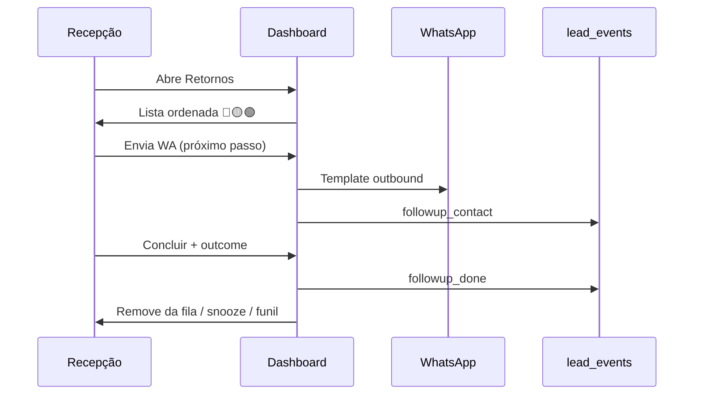
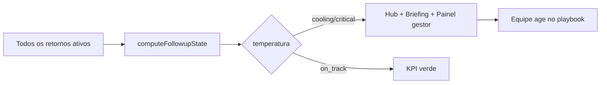

# Follow-up pós-aula experimental — Design v1

**Data:** 2026-06-10  
**Status:** Aguardando revisão  
**Problemas-alvo:** consistência operacional (C) e visibilidade de leads esfriando (D)

---

## 1. Objetivo

Padronizar o retorno de alunos que fizeram (ou faltaram à) aula experimental e dar visibilidade antecipada de quem está **esfriando**, antes do limite atual de 5+ dias.

### Critérios de sucesso

| Métrica | Meta (90 dias pós-lançamento fase 3) |
|---------|--------------------------------------|
| % comparecidos contatados em D+1 | ≥ 80% das academias ativas |
| Tempo médio até primeiro contato pós-aula | Redução de 30% vs baseline |
| Retornos marcados “feito” sem outcome | 0% (bloqueado na UI) |
| Gestor identifica lead esfriando | ≤ 1 dia após entrar em 🟡 (sem depender de memória da equipe) |

---

## 2. Contexto atual (baseline)

| Área | Comportamento |
|------|---------------|
| **Dashboard → Retornos** | Leads `COMPLETED` ou `MISSED`, janela de **7 dias** (`FOLLOWUP_AGENDA_MAX_DAYS`) |
| **Urgência visual** | Grupos fixos: hoje (D0), 1–4 dias, urgente (5+) |
| **Ações** | Template WA (`post_class` / `missed`) + marcar feito (`followup_done`) |
| **Marcar feito** | Evento em `lead_events`; cache em `followupDoneCache.js`; **sem outcome** |
| **Envio WA** | Não gera evento de auditoria por lead |
| **Pipeline** | Compareceu → `Aguardando decisão`; faltou → `Não compareceu` |
| **Pós 7 dias** | Filtro `?followup=kanban` no funil |
| **Streak** | `localStorage` por navegador (`dashboardFollowupStreak.js`) — não compartilhado |
| **Automações** | `presence_confirmed`, `waiting_decision`, `missed` — independentes do playbook de retorno |
| **Inbox** | Sem sinal de retorno pendente |
| **IA / NL** | Consultas sobre experimental; sem ações de follow-up |

---

## 3. Escopo

### Dentro do escopo (por fase)

| Fase | Entrega |
|------|---------|
| **1** | Termômetro 🟢🟡🔴, ordenação, alertas no hub/briefing |
| **2** | Playbook configurável + “próxima ação” por lead |
| **3** | Outcome obrigatório ao concluir + eventos estendidos |
| **4** | Painel gestor + resumo/draft IA (copilot) |
| **5** | Automação condicional D0/D+1 (opcional pós-validação) |

### Fora do escopo v1

- Atribuição por recepcionista (`assignedTo`) e ranking individual
- Agente autônomo enviando follow-up sem aprovação humana
- Novo endpoint Vercel dedicado (config em `academy.settings`; lógica em módulos compartilhados)
- Alteração do limite de 7 dias na agenda (mantido; termômetro também no Kanban pós-7 dias na fase 4)
- Follow-up de alunos já matriculados (permanece `EnrollmentFollowUpSection`)

---

## 4. Conceitos de domínio

### 4.1 Ciclo de retorno

Um **ciclo** começa quando o lead entra em retorno pós-aula:

- `status === COMPLETED` (compareceu), ou
- `status === MISSED` (faltou)

O ciclo é identificado por `(leadId, scheduledDate)` da aula em questão. Eventos e contatos são válidos apenas se `event.at >= classDate`.

Ao remarcar experimental (nova `scheduledDate`), inicia-se **novo ciclo**; eventos do ciclo anterior não contam.

### 4.2 Contato

**Contato válido no ciclo** = qualquer um:

1. Evento `followup_done` com `payload_json.scheduledDate` igual à aula atual
2. Evento `followup_contact` (novo) no ciclo — ex.: envio de template WA pelo Dashboard
3. Resposta **inbound** na conversa WhatsApp após `classDate` (fase 2+, se telefone vinculado)

### 4.3 Playbook

Sequência de **passos** por tipo (`attended` | `missed`), cada um com:

- `offset_days` — dias após `scheduledDate` (0 = D0)
- `action_type` — `whatsapp_template` | `task` | `pipeline_move` | `manual`
- `template_key` — quando `whatsapp_template` (chave em `whatsappTemplateDefaults`)
- `task_title` / `task_notes` — quando `action_type === task`
- `skip_if_contacted` — boolean (padrão `true` para WA)

### 4.4 Termômetro (temperatura)

| Valor | Label UI | Significado |
|-------|----------|-------------|
| `on_track` | Em dia | Passo do playbook cumprido ou dentro do prazo |
| `cooling` | Esfriando | 1+ dia além do passo esperado sem contato válido |
| `critical` | Crítico | 3+ dias desde a aula sem contato válido **ou** 2+ dias além do passo atual do playbook |

**Prioridade de ordenação:** `critical` > `cooling` > `on_track`; dentro do grupo, `daysAgo` desc.

Regras **fallback** (antes do playbook configurável — fase 1):

| Tipo | 🟡 Esfriando | 🔴 Crítico |
|------|--------------|------------|
| Compareceu | D+1 sem contato | D+3+ sem contato |
| Faltou | D+1 sem remarcar (`status` ainda `MISSED`) | D+3+ sem remarcar |

**Remarcado** = `status === SCHEDULED` com `scheduledDate` posterior à aula faltada, ou evento `schedule` após `missedAt`.

### 4.5 Outcome (fase 3)

Ao concluir retorno, escolha **obrigatória**:

| ID | Label | Efeito no funil |
|----|-------|-----------------|
| `interested` | Interessado | Mantém `Aguardando decisão`; opcional snooze D+2 |
| `thinking` | Vai pensar | Snooze D+2; nota opcional |
| `objection` | Objeção | Subtipo: `price` \| `schedule` \| `other`; mantém estágio |
| `reschedule` | Remarcar | Abre fluxo de reagendamento (existente) |
| `lost` | Sem interesse | Move para `Perdidos` |
| `enrolled` | Matriculou | Abre fluxo de matrícula (existente) |

---

## 5. Modelo de dados

### 5.1 `academy.settings.followupPlaybook` (JSON)

Armazenado via `parseAcademySettings` / merge em documento da academia (mesmo padrão de `enrollmentFollowUpTask`).

```json
{
  "version": 1,
  "enabled": true,
  "attended": [
    {
      "offset_days": 0,
      "action_type": "whatsapp_template",
      "template_key": "post_class",
      "skip_if_contacted": false
    },
    {
      "offset_days": 1,
      "action_type": "whatsapp_template",
      "template_key": "dashboard_contact",
      "skip_if_contacted": true
    },
    {
      "offset_days": 3,
      "action_type": "task",
      "task_title": "Ligar — retorno pós-aula",
      "task_notes": "Lead sem resposta após mensagens automáticas.",
      "skip_if_contacted": true
    },
    {
      "offset_days": 7,
      "action_type": "whatsapp_template",
      "template_key": "recovery",
      "skip_if_contacted": true
    }
  ],
  "missed": [
    {
      "offset_days": 0,
      "action_type": "whatsapp_template",
      "template_key": "missed",
      "skip_if_contacted": false
    },
    {
      "offset_days": 1,
      "action_type": "whatsapp_template",
      "template_key": "missed",
      "skip_if_contacted": true
    },
    {
      "offset_days": 3,
      "action_type": "task",
      "task_title": "Ligar — remarcar experimental",
      "skip_if_contacted": true
    }
  ]
}
```

**Defaults:** playbook acima embutido em `src/lib/followupPlaybookDefaults.js` quando `settings` ausente ou `enabled !== false`.

### 5.2 Eventos `lead_events`

| type | Quando | payload_json mínimo |
|------|--------|---------------------|
| `followup_done` | Outcome confirmado (fase 3+) | `{ source, scheduledDate, outcome, objectionType?, snoozeUntil?, note? }` |
| `followup_contact` | Envio WA de retorno (novo) | `{ source: 'dashboard', templateKey, scheduledDate }` |
| `followup_snooze` | Snooze explícito (fase 3) | `{ scheduledDate, untilYmd, reason }` |

Eventos legados `followup_done` sem `outcome` continuam válidos como contato; na fase 3 a UI exige outcome para **novos** fechamentos.

### 5.3 Campos derivados (cliente, não persistidos)

Por lead em retorno, calcular em `computeFollowupState(lead, ctx)`:

```ts
type FollowupState = {
  cycleKey: string;           // `${leadId}:${scheduledDate}`
  classDate: Date;
  daysAgo: number;
  kind: 'attended' | 'missed';
  temperature: 'on_track' | 'cooling' | 'critical';
  hasContactInCycle: boolean;
  currentStep: PlaybookStep | null;
  nextStep: PlaybookStep | null;
  doneForCurrentClass: boolean;  // compat Dashboard atual
  snoozedUntil: string | null;
};
```

`ctx`: `{ playbook, followupDoneByLead, followupContactByLead, conversationsByPhone?, now }`.

---

## 6. Módulos compartilhados (sem novo `/api/`)

| Módulo | Responsabilidade |
|--------|------------------|
| `src/lib/followupPlaybookDefaults.js` | Defaults + parse/merge settings |
| `src/lib/followupState.js` | `computeFollowupState`, `sortFollowupsByTemperature`, agrupamento |
| `src/lib/followupTemperature.js` | Regras 🟢🟡🔴 (fase 1 fallback + playbook fase 2) |
| `src/lib/followupOutcomes.js` | Constantes, labels, mapeamento funil |
| `src/lib/dashboardReceptionCopy.js` | Novos textos (termômetro, playbook, outcomes) |
| `src/test/followupState.test.js` | Casos de borda (ciclos, remarcar, snooze) |

Reutilizar `proactiveHub.js`, `dashboardDayBriefing.js`, `countPendingFollowUps` — estender para contar `cooling` / `critical`.

---

## 7. UI por superfície

### 7.1 Dashboard — Retornos (fases 1–3)

**Fase 1**

- Substituir agrupamento apenas por `daysAgo` por agrupamento primário por temperatura:
  - **Crítico** (🔴)
  - **Esfriando** (🟡)
  - **Em dia** (🟢)
- Badge de temperatura em cada `fu-row` (dot + `title` acessível).
- Ordenação dentro do grupo: `daysAgo` asc para crítico/esfriando (mais urgente primeiro).
- KPI “Retornos”: subtítulo opcional `· N esfriando` quando `cooling + critical > 0`.
- `getDayPriority`: priorizar `cooling` antes de `urgent` legado (D+5); mensagem ex.: *“Ana está esfriando — 2 dias sem retorno.”*
- `buildProactiveHubItems`: item `followups_cooling` quando `cooling + critical > 0`.

**Fase 2**

- Linha secundária em cada row: **Próxima ação:** *Enviar valores (D+1)* com ícone do tipo.
- Botão WA usa `template_key` do `nextStep` (não mais hardcoded `post_class`/`missed` só por status).
- Link “Abrir conversa” → `/inbox?phone={lead.phone}` quando houver telefone.

**Fase 3**

- Substituir ✓ direto por fluxo:
  1. Clique em “Concluir” abre `FollowupOutcomeDialog` (`ConfirmDialog` / `ModalShell`).
  2. Escolha outcome (+ subtipo se objeção).
  3. Persiste `followup_done` com payload completo.
  4. Efeitos colaterais por outcome (ver §4.5).
- Snooze: outcomes `thinking` / `interested` oferecem “Lembrar em 2 dias” (default) → `followup_snooze`; lead some da lista até `untilYmd`.

**Envio WA (fase 1)**

- Após envio bem-sucedido em `handleFollowUpWhatsApp`, registrar `followup_contact` via `addLeadEvent`.
- Isso alimenta `hasContactInCycle` sem exigir “marcar feito”.

### 7.2 Pipeline (fases 1–2)

- Cards em `Aguardando decisão` e `Não compareceu`: badge temperatura (mesmo componente `FollowupTemperatureBadge`).
- Filtro rápido existente `?followup=kanban`: adicionar chip **Esfriando** (`?followup=cooling`) na fase 4.
- Não duplicar SLA de etapa (`useSlaAlerts`) — temperatura de retorno é independente.

### 7.3 Lead Profile (fases 2–3)

- Faixa abaixo do header quando em ciclo de retorno ativo:
  - Temperatura + dias + próxima ação.
  - CTA: WhatsApp | Concluir retorno.
- Timeline: renderizar `followup_contact`, `followup_snooze`, `followup_done` com ícones distintos (já há estilo para `followup_done`).

### 7.4 Inbox (fase 4)

- Se `phone` do thread = lead em retorno com temperatura ≠ `on_track`:
  - Banner compacto no topo do thread: *Retorno · Esfriando · D+2 · Próxima: enviar valores*.
  - Ações: template sugerido, link perfil do lead.
- Lista de conversas: pill opcional “Retorno” (somente se cooling/critical) — performance: mapa `phone → FollowupState` memoizado no parent.

### 7.5 Automações → Processos (fase 2)

- Nova seção `FollowupPlaybookSection` abaixo de `TaskTemplatesSection`:
  - Toggle ativar playbook customizado.
  - Editor de passos por aba Compareceu / Faltou (reuso visual de itens ordenáveis como task templates).
  - Preview “Se compareceu hoje, amanhã o sistema sugere…”
  - Validação: `offset_days` únicos por trilha; `template_key` ∈ `WHATSAPP_TEMPLATE_KEYS`.

### 7.6 Painel gestor — Saúde dos retornos (fase 4)

Bloco no Dashboard (abaixo dos KPIs ou seção colapsável), visível para `owner` / `admin` (mesma regra de métricas gerenciais existente, se houver; senão todos os membros da equipe).

| Widget | Conteúdo |
|--------|----------|
| Contadores | 🟢 / 🟡 / 🔴 hoje |
| Taxa D+1 | % comparecidos na semana civil com contato em D+1 |
| Lista | Top 10 esfriando + link para retorno / lead |
| Tendência | Opcional: sparkline 7 dias de críticos (fase 4b, se couber) |

Cálculo D+1: leads com `attendedAt` na semana; numerador = contato válido com `at` ≤ `classDate + 1 dia 23:59`.

### 7.7 NL Command Bar (fase 4)

Novas queries em `nlAcademyQuery` / sugestões na barra:

- “Quem está esfriando no retorno?”
- “Quem compareceu e não foi contatado ontem?”

Resposta: lista com nome, telefone, temperatura, link implícito na UI de resultados.

---

## 8. IA integrada (fase 4 — copilot apenas)

### 8.1 Resumo pré-contato

No Dashboard/Inbox, botão “Resumo” chama endpoint existente do agente (`api/agent.js` hub) com rota interna `?route=followup_summary`:

- Input: `leadId`, `academyId`
- Contexto: últimas N mensagens WA, notas do lead, `daysAgo`, outcome anterior se houver
- Output: 2–3 frases + bullet de sugestão de abordagem
- **Não envia mensagem**; exibe em painel lateral ou tooltip expandido

### 8.2 Draft de mensagem

- Botão “Sugerir texto” ao lado do WA.
- Usa `template_key` do `nextStep` como base; IA personaliza placeholders com contexto.
- Usuário edita antes de enviar via fluxo outbound existente (`sendWhatsappTemplateOutbound` com corpo customizado se suportado; senão pré-preenche área de cópia / wa.me).

### Guardrails

- Respeitar `permissionContext` e `academyId` (multi-tenant).
- Sem execução autônoma de envio na fase 4.
- Log opcional em `lead_events` type `ai_followup_draft` (auditoria leve, sem PII no payload).

---

## 9. Automação condicional (fase 5 — pós-MVP)

- Novas chaves em `automationsConfig` (via `lib/automationCore.js`):
  - `followup_d1_attended` — WA D+1 se `skip_if_contacted` e sem inbound
  - `followup_d0_missed` — já parcialmente coberto por `missed`
- Disparo: cron diário existente ou extensão do processador de `pending_automations` no lead.
- Ao enviar auto: registrar `followup_contact` com `source: 'automation'`.
- Academia opt-in explícito; default **desligado**.

---

## 10. Fluxos principais

### 10.1 Recepção — manhã típica



### 10.2 Gestor — visibilidade



---

## 11. Multi-tenant e segurança

- Todo cálculo filtrado por `academyId` atual do store.
- Eventos com `academy_id` + permissões `buildClientDocumentPermissions`.
- Resumo IA: resolver lead só dentro da academia da sessão (padrão anti-IDOR dos handlers existentes).
- Playbook em `settings` da academia — não compartilhado entre tenants.

---

## 12. Compatibilidade e migração

- `followup_done` antigos: tratados como contato; não reabrir modal retroativo.
- Streak local: mantido; opcional fase 4 — streak da **academia** em `settings` ou métrica agregada (não bloqueante).
- Grupos “Urgente 5+ dias” removidos da UI quando temperatura estiver ativa (crítico 🔴 absorve).
- `FOLLOWUP_AGENDA_MAX_DAYS = 7` inalterado; leads 7+ dias continuam só no Kanban, mas com badge temperatura se ainda em retorno.

---

## 13. Testes

| Arquivo | Casos |
|---------|-------|
| `followupState.test.js` | D0/D+1/D+3 temperatura; contato via evento; ciclo novo após remarcar |
| `followupPlaybookDefaults.test.js` | Parse settings; fallback defaults |
| `followupTemperature.test.js` | Fallback fase 1 attended/missed |
| `dashboardDayBriefing.test.js` | Prioridade `cooling` vs aniversário |
| `proactiveHub` (estender) | Item esfriando |
| `nlAcademyQuery` (fase 4) | Query cooling list |

Testes E2E manuais (checklist):

1. Compareceu hoje → 🟢; amanhã sem contato → 🟡
2. Enviar WA → 🟢 mesmo sem marcar feito
3. Outcome “Perdido” → card sai do retorno e vai Perdidos
4. Snooze → some e reaparece na data
5. Playbook custom D+1 task → sugere tarefa no dia certo
6. Segunda academia não vê eventos da primeira

---

## 14. Rollout

| Fase | PR sugerido | Risco |
|------|-------------|-------|
| 1 | Termômetro + `followup_contact` + ordenação | Baixo |
| 2 | Playbook settings + UI Processos + próxima ação | Médio |
| 3 | Outcome dialog + snooze + funil | Médio |
| 4 | Painel gestor + Inbox banner + IA copilot | Médio-alto |
| 5 | Automação condicional | Alto — feature flag |

Feature flag: `settings.followupPlaybook.enabled` — se `false`, comportamento legado exceto termômetro fallback (fase 1 sempre on).

---

## 15. Decisões registradas

| Decisão | Escolha | Motivo |
|---------|---------|--------|
| Ordem de entrega | Termômetro antes de playbook configurável | Visibilidade (D) rápida; C vem forte na fase 2–3 |
| Onde persiste playbook | `academy.settings` | Padrão do projeto; sem novo serverless |
| Outcome obrigatório | Fase 3, não 1 | Evita fricção enquanto valida termômetro |
| WA gera evento | Sim, fase 1 | Corrige “marcar feito” sem contato real |
| SLA funil vs temperatura | Coexistem | Métricas diferentes |
| IA autônoma | Fase 5+ fora | Consistência com baixo risco |

---

## 16. Referências no código

- `src/pages/Dashboard.jsx` — retornos, WA, `markFollowupDone`
- `src/lib/followupDoneCache.js` — cache de feitos
- `src/lib/proactiveHub.js` — hub de pendências
- `src/lib/dashboardDayBriefing.js` — prioridade do dia
- `lib/whatsappTemplateDefaults.js` — templates
- `src/pages/AutomacoesProcessosTab.jsx` — aba Processos
- `src/lib/taskTemplates.js` — padrão de gatilhos/templates
- `src/lib/enrollmentSettings.js` — padrão settings JSON na academia

---

## Aprovação

Revisar este arquivo e confirmar antes do plano de implementação (`writing-plans`).

Possíveis ajustes na revisão:

- Limiares 🟡/🔴 (hoje: D+1 / D+3)
- Default de snooze (2 dias)
- Quais roles veem o painel gestor
