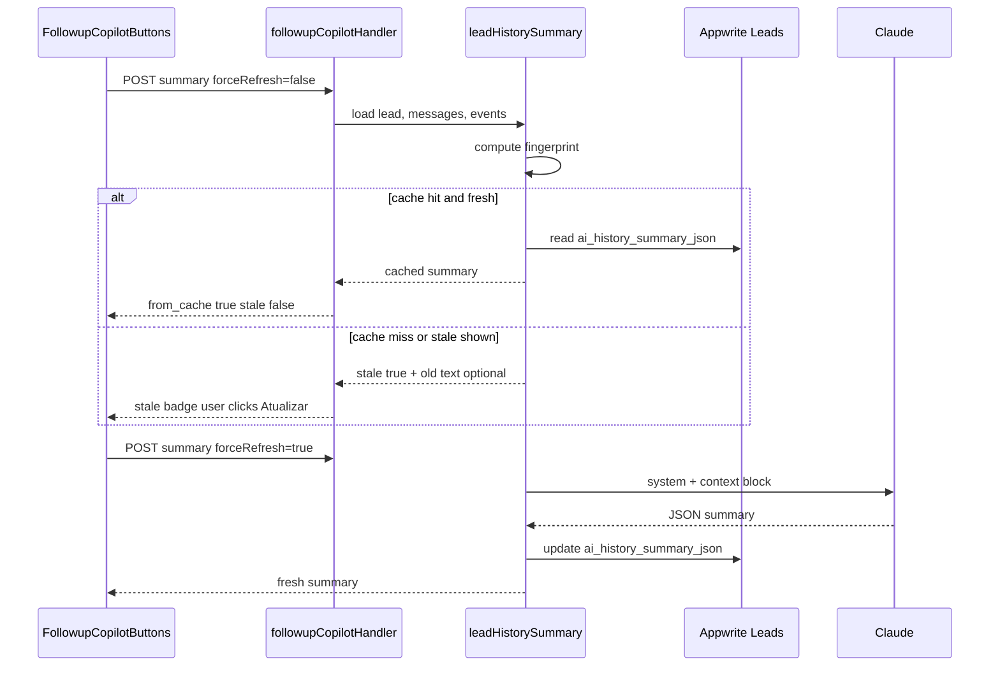

# Resumo IA do lead — cache com invalidação — Design v1

**Data:** 2026-06-12  
**Status:** Aprovado para implementação  
**Problema:** O botão “Resumo IA” chama Claude a cada clique, não persiste resultado, e pode divergir do resumo automático do Inbox (`conversations.summary`).

---

## 1. Objetivo

Persistir o resumo factual do histórico do lead (mensagens + eventos + cadastro) como **cache interpretativo**, com invalidação automática quando o contexto mudar, e UX que deixa claro quando o texto está desatualizado.

### Critérios de sucesso

| Métrica | Meta |
|---------|------|
| Segundo clique “Resumo IA” sem mudança de contexto | Resposta em < 500 ms (sem Claude) |
| Contexto alterado (nova msg, evento, etapa) | UI mostra “Desatualizado” antes de regenerar |
| Regeneração explícita | Botão “Atualizar” sempre chama Claude |
| Timeline / conversa ao vivo | Continuam sendo fonte da verdade operacional |
| Auditoria | Evento `ai_history_summary` opcional no histórico (não polui timeline principal) |

---

## 2. Decisões de arquitetura

### 2.1 Onde persistir

**Escolha:** campo `ai_history_summary_json` na coleção **Leads** (`LEADS_COL`).

**Por quê:**
- O copilot é **lead-centric** (`leadId`), não conversation-centric.
- O resumo inclui **eventos do CRM** que `conversations.summary` não tem.
- Permite exibir cache ao abrir perfil/Dashboard sem carregar doc de conversa.

**Formato (JSON string, máx. 8192 chars):**

```json
{
  "v": 1,
  "text": "parágrafos do resumo",
  "pontos_chave": ["bullet factual"],
  "pendencias_mencionadas": ["só o que consta no contexto"],
  "generated_at": "2026-06-12T15:00:00.000Z",
  "context_fingerprint": "sha256 ou string determinística",
  "source_counts": { "messages": 18, "events": 12 }
}
```

**Não** reutilizar `conversations.summary` como store principal — escopos diferentes (só mensagens vs. histórico completo). Unificação de **prompt** sim; unificação de **storage** fica para fase posterior.

### 2.2 Fingerprint de contexto (invalidação)

Calcular fingerprint determinístico a partir de:

| Input | Fonte |
|-------|--------|
| `last_message_at` | última mensagem da conversa (timestamp) |
| `last_event_at` | evento mais recente em `lead_events` (campo `at`) |
| `lead.$updatedAt` | Appwrite |
| `status`, `pipeline_stage` | documento lead |
| `message_count`, `event_count` | contagens usadas no prompt |

Se `stored.context_fingerprint !== currentFingerprint` → **`stale: true`**.

Sem TTL obrigatório na v1 — mudança de contexto é o gatilho principal. TTL opcional futuro (ex.: 7 dias) se quiser refresh periódico.

### 2.3 Quando chamar Claude

| Situação | Comportamento |
|----------|---------------|
| Cache ausente | Gerar + persistir |
| Cache presente, fingerprint igual, `forceRefresh !== true` | Retornar cache (`from_cache: true`) |
| Cache presente, fingerprint diferente, usuário abre resumo | Mostrar cache **com badge stale**; não auto-regenerar |
| Usuário clica “Atualizar” (`forceRefresh: true`) | Gerar + persistir |
| `mode: draft` | Nunca usa cache de resumo (sempre contexto fresco) |

### 2.4 Módulo compartilhado

Novo módulo `lib/server/leadHistorySummary.js`:

- `computeLeadHistoryFingerprint({ lead, messages, events })`
- `parseStoredLeadHistorySummary(raw)`
- `buildLeadHistoryContextBlock({ lead, messages, events, academyName })` — contexto melhorado
- `LEAD_HISTORY_SUMMARY_SYSTEM` — prompt unificado (JSON estruturado)
- `generateLeadHistorySummary({ context, previousText? })` — chamada Claude
- `resolveLeadHistorySummary({ lead, messages, events, forceRefresh })` — orquestra cache hit/miss

`followupCopilotHandler.js` delega para este módulo.  
`agentRespond.generateSummary` permanece na v1 (Inbox/agente); **fase 2** pode migrar para o mesmo prompt incremental.

### 2.5 Melhorias de contexto (incluídas na v1)

- Timestamps em mensagens e eventos (`[2026-06-10 14:32]`)
- Labels PT para tipos de evento (`agendamento`, `nota`, `mudança de etapa`, …)
- Campos extras do lead: `pipeline_stage`, `origin`, `last_contact_at`
- Substituir “Dias desde a aula” por “Dias desde último contato” (fallback: `$createdAt`)
- Nota de truncamento quando `message_count > window`

### 2.6 Prompt (system)

Manter tom factual (sem recomendações comerciais). Resposta JSON:

```json
{
  "summary": "1–3 parágrafos",
  "pontos_chave": ["máx. 5"],
  "pendencias_mencionadas": ["máx. 5 ou []"]
}
```

`temperature: 0.1`, `max_tokens: 800`.

### 2.7 API

**POST** `/api/agent?route=followup-copilot` (existente), body estendido:

```json
{
  "mode": "summary",
  "leadId": "...",
  "forceRefresh": false
}
```

Resposta estendida:

```json
{
  "ok": true,
  "summary": "...",
  "pontos_chave": [],
  "pendencias_mencionadas": [],
  "generated_at": "ISO",
  "from_cache": true,
  "stale": false,
  "context_fingerprint": "..."
}
```

**GET opcional (fase 1b):** incluir `ai_history_summary` parseado na resposta de lead existente ou endpoint leve `?route=lead-summary&leadId=` — evita POST só para ler cache. Prioridade: retornar cache no POST com `mode=summary` sem `forceRefresh` já cobre o fluxo do botão; GET na abertura do perfil é melhoria UX fase 2.

### 2.8 UI

`FollowupCopilotButtons.jsx`:

- Ao montar (opcional fase 2): prefetch cache se existir no lead store
- Ao clicar “Resumo IA”: POST sem `forceRefresh` → instantâneo se fresh
- Painel mostra: texto, `pontos_chave`, data “Gerado em …”
- Badge **Desatualizado** se `stale === true`
- Botão **Atualizar** → `forceRefresh: true`
- Loading states separados: “Carregando…” vs “Gerando resumo…”

Timeline **não** exibe eventos `ai_history_summary` (filtro existente já exclui; tipo reservado só se quiser auditoria futura).

### 2.9 Schema Appwrite

Provisionar atributo:

- `ai_history_summary_json` — string, size 8192, optional

Script: estender `scripts/verify-and-fix-schema-crm.mjs` ou script dedicado `scripts/provision-lead-ai-summary-attr.mjs`.

### 2.10 Fora de escopo v1

- Auto-regenerar resumo no webhook após cada mensagem (custo)
- Unificar storage com `conversations.summary`
- Resumo para `students` (StudentProfile)
- GET dedicado na abertura do perfil (fase 2)
- Invalidação via Redis/KV

---

## 3. Fluxo (mermaid)



---

## 4. Riscos e mitigação

| Risco | Mitigação |
|-------|-----------|
| Resumo antigo engana equipe | Badge stale + data visível; timeline sempre ao vivo |
| Campo JSON grande | Limite 8192; truncar `pontos_chave` no save |
| Race: duas regenerações paralelas | Last-write-wins; comparar fingerprint antes de save |
| Lead sem conversa | Resumo só de eventos + cadastro; prompt trata contexto vazio |
