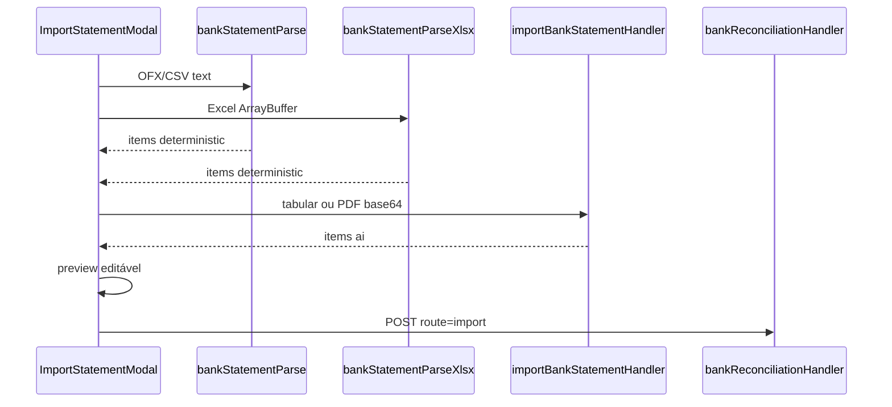

# Conciliação multi-formato — TECH Spec

**Data:** 2026-06-15  
**PRODUCT:** [2026-06-15-conciliacao-multi-formato-PRODUCT.md](./2026-06-15-conciliacao-multi-formato-PRODUCT.md)

---

## Arquivos novos

| Arquivo | Responsabilidade |
|---------|------------------|
| `lib/server/importBankStatementHandler.js` | IA tabular + PDF → `items[]` |
| `src/lib/bankStatementParseXlsx.js` | Parse Excel isolado |
| `src/components/finance/BankReconPairRow.jsx` | Linha extrato + ações |
| `src/components/finance/BankReconOrphanList.jsx` | Coluna órfãos + filtro |
| `src/test/bankStatementParseXlsx.test.js` | Testes parser Excel |
| `tests/unit/finance/importBankStatementHandler.test.js` | Sanitize IA |

---

## Arquivos alterados

| Arquivo | Mudança |
|---------|---------|
| `api/agent.js` | `route=import-bank-statement` |
| `src/lib/bankStatementParse.js` | Helpers exportados, detecção formato |
| `src/components/finance/ImportStatementModal.jsx` | Multi-formato, preview editável, IA |
| `src/components/finance/ReconciliationTab.jsx` | Workspace pareamento |
| `src/components/finance/styles/recon.css` | Seleção, filtro, preview |
| `lib/server/bankReconciliationHandler.js` | Metadados import + list |
| `src/lib/bankReconciliationApi.js` | `parseBankStatementWithAi()` |
| `scripts/provision-bank-reconciliation-schema.mjs` | `source_format`, `parse_method`, `parse_warnings` |

---

## Fluxo de parse



---

## API: import-bank-statement

```
POST /api/agent?route=import-bank-statement
Headers: Authorization, x-academy-id

Tabular:
{ mode: "tabular", headers: string[], sample_rows: object[], filename?: string }

PDF:
{ mode: "pdf", content_base64: string, filename?: string }

200: { items: BankStatementItem[], mapping?, confidence?, summary?, warnings? }
403: { error: "ai_disabled" }
422: { error, hint }
```

Modelo: `claude-haiku-4-5-20251001`, timeout 15s, `assertAiModuleEnabled`.

---

## Contrato de item

```json
{ "date": "YYYY-MM-DD", "description": "string", "amount": 150.00, "direction": "credit|debit" }
```

Import payload adicional: `source_format`, `parse_method`, `parse_warnings`.

---

## Schema bank_statements (novos atributos)

| Campo | Tipo |
|-------|------|
| `source_format` | string(16) |
| `parse_method` | string(16) |
| `parse_warnings` | string(2000) |

Fallback graceful se atributo ausente no Appwrite.

---

## Pareamento (sem mudança de API)

Usa `confirmBankMatch` existente. Filtro client: ±5% valor, ±3 dias (critérios do matcher).

---

## Testes

- `bankStatementParseXlsx.test.js` — colunas BR típicas
- `importBankStatementHandler.test.js` — sanitize, JSON inválido
- Regressão: `bankReconciliationMatcher`, `bankReconciliationValidation`

Comando: `npm test`
