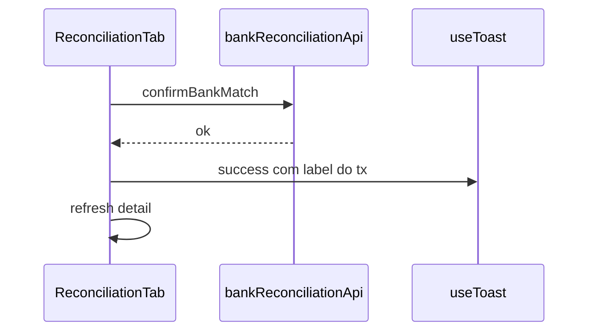

# Conciliação UX/UI — TECH Spec

**Data:** 2026-06-15  
**Status:** Implementado (Fases A–E)  
**PRODUCT:** [2026-06-15-conciliacao-ux-refactor-PRODUCT.md](./2026-06-15-conciliacao-ux-refactor-PRODUCT.md)

---

## Escopo

Refatoração **somente frontend** (componentes + CSS + feedback). Sem mudanças em `bankReconciliationHandler`, matcher ou rotas de API.

---

## Arquivos novos

| Arquivo | Responsabilidade |
|---------|------------------|
| `src/components/finance/BankReconSelectionBar.jsx` | Barra contextual da linha selecionada |
| `src/components/finance/BankReconKpiRow.jsx` | 3 KPIs compactos + accordion prova de saldo |
| `src/components/finance/ImportStatementSteps.jsx` | Stepper Upload / Revisar / Confirmar (opcional extrair do modal) |
| `src/test/bankReconUx.test.jsx` | Render barra seleção, hierarquia botões, filtro órfãos |

---

## Arquivos alterados

| Arquivo | Mudança |
|---------|---------|
| `src/components/finance/ReconciliationTab.jsx` | Toast via `useToast`; KPI row; selection bar; ConfirmDialog; modo foco |
| `src/components/finance/BankReconPairRow.jsx` | Hierarquia botões; badge Selecionada |
| `src/components/finance/BankReconOrphanList.jsx` | Classe `--candidate`; aria-live |
| `src/components/finance/ImportStatementModal.jsx` | Stepper, drop zone, auto PDF IA, busca preview, StatusBanner erros |
| `src/components/finance/styles/recon.css` | Selection bar, KPI, candidate highlight, focus mode |
| `src/components/finance/finance.css` | Estilos drop/stepper reutilizados no import extrato |
| `lib/server/importBankStatementHandler.js` | Opcional: `low_confidence: true` por item na resposta IA |

---

## Padrões a reutilizar

| Padrão | Origem |
|--------|--------|
| `useToast` | [docs/ux-feedback.md](../../ux-feedback.md) |
| `ConfirmDialog` | Ignorar / criar lançamento |
| `StatusBanner` / `ErrorBanner` | Erros persistentes de parse |
| `finance-import-drop` | [ImportFinanceModal.jsx](../../../src/components/finance/ImportFinanceModal.jsx) |
| Stepper visual | [ImportFinanceTxModal.jsx](../../../src/components/finance/ImportFinanceTxModal.jsx) `STEPS` |
| `ModalShell` | [form-modal-flows skill](../../../.agents/skills/form-modal-flows/SKILL.md) |

---

## Fase A — Feedback



**Implementação `run()` em ReconciliationTab:**

- Aceitar callback opcional `onSuccess(message)` após `fn()` resolver.
- Mapear ações:
  - `confirmBankMatch` → `toast.success('Linha conciliada.')` (+ nome se disponível no detail local)
  - `confirmAllBankMatches` → usar `confirmed` do response se exposto; senão mensagem genérica
  - `createTxFromBankItem` → `toast.success('Lançamento criado e conciliado.')`
  - `completeBankReconciliation` → `toast.success('Conciliação finalizada.')`
  - Erros: manter `ErrorBanner`; não duplicar toast

**ConfirmDialog state:**

```jsx
const [confirm, setConfirm] = useState(null);
// { type: 'ignore' | 'create', itemId, label }
```

---

## Fase B — Selection bar e foco

**Estado existente (manter):**

- `selectedBankItemId`
- `showAllOrphans`
- `unmatchedTxByItem`

**Novo estado:**

- `focusPendingOnly: boolean` — oculta `grouped.auto`

**BankReconSelectionBar props:**

```ts
{
  item: { date, description, amount, direction } | null;
  onClear: () => void;
}
```

Posição: entre `bank-recon-actions-head` e `bank-recon-columns`.

**CSS:**

- `.bank-recon-selection-bar` — `background: var(--color-primary-surface)`, padding 10px 12px
- `.bank-recon-pair--selected` — adicionar `.bank-recon-pair__badge` “Selecionada”
- `.bank-recon-navi-row--candidate` — borda `var(--finance-recon-suggested-border)`

---

## Fase C — Import modal

**Steps:**

| Step | Condição |
|------|----------|
| `upload` | `!editableItems.length && !aiBusy` |
| `review` | `editableItems.length > 0` |
| `confirm` | implícito no footer (mesmo step review) |

**PDF auto-flow:**

```jsx
// após readFileAsBase64 em onFile
if (format === 'pdf') {
  setStep('upload');
  void runAiParse(); // auto
}
```

**Busca preview:**

- `filterQuery` state
- `filteredEditableItems = useMemo` filtra description/amount

**low_confidence:**

- Server: em `sanitizeBankStatementItems`, aceitar `raw.low_confidence`
- Client: `itemsToEditable` preserva flag
- Legenda abaixo da tabela se alguma linha flagged

---

## Fase D — KPI compacto

Extrair grid atual de `ReconciliationTab` para `BankReconKpiRow`:

```jsx
<BankReconKpiRow
  pendingCount={...}
  pendingAmount={...}
  balanceGap={...}
  naviOrphanCount={...}
  balanceProof={...} // accordion interno
/>
```

---

## Testes

| Arquivo | Casos |
|---------|-------|
| `bankReconUx.test.jsx` | SelectionBar render null/com item; formatSourceLabel (já existe) |
| `bankReconPairing.test.jsx` | Estender: botões unmatched — só um `btn-primary` |
| Manual QA | Checklist PRODUCT §9 |

Comando: `npm test -- --run src/test/bankReconUx.test.jsx`

---

## Rollout

| Ordem | Fase | Risco | Entrega |
|-------|------|-------|---------|
| 1 | A | Baixo | Feedback imediato + dialogs |
| 2 | B | Médio | Pareamento visível |
| 3 | C | Médio | Modal paridade finance |
| 4 | D | Baixo | KPI + accordion |
| 5 | E | Baixo | A11y polish |

Cada fase = PR reviewável independente.

---

## Não alterar

- `bankReconciliationMatcher.js`
- `bankReconciliationValidation.js`
- Contratos API existentes
- Limite 500 itens / multi-tenant
