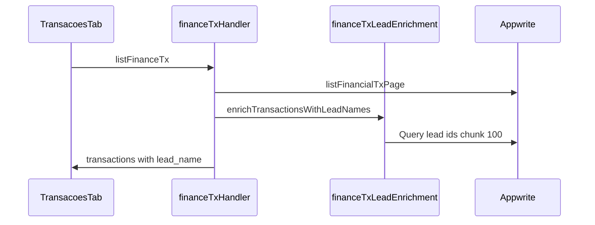

# Lançamentos — TECH Spec

**Data:** 2026-06-15  
**PRODUCT:** [2026-06-15-financeiro-lancamentos-refactor-PRODUCT.md](./2026-06-15-financeiro-lancamentos-refactor-PRODUCT.md)

---

## Arquivos novos

| Arquivo | Responsabilidade |
|---------|------------------|
| `lib/server/financeTxLeadEnrichment.js` | Batch `lead_name` via Appwrite |
| `src/lib/financeTxLeadNames.js` | Resolve nome client-side |
| `src/components/finance/FinanceTxStudentField.jsx` | Combobox aluno (API) |
| `src/components/finance/FinanceTxDetailDrawer.jsx` | Drawer detalhes |
| `src/components/finance/styles/tx-drawer.css` | Estilos drawer |

---

## Arquivos alterados

| Arquivo | Mudança |
|---------|---------|
| `lib/server/financeTxHandler.js` | Enriquecer list/create/patch |
| `lib/server/financeTxFields.js` | `lead_name` no map |
| `src/lib/financeTxExport.js` | Busca em `lead_name` |
| `src/components/finance/TransacoesTab.jsx` | Integração completa |
| `src/components/finance/finance.css` | Coluna descrição, row click |
| `src/components/finance/styles/tx.css` | Import drawer CSS |

---

## Server: enriquecimento

Reutiliza padrão de `inboxListLeadEnrichment.js` (`Query.equal('$id', chunk)`).

---

## Client: busca aluno modal

- `searchStudentsForSale` → `/api/leads?route=students&action=search`
- Debounce 280ms, mín. 2 chars (referência: `NovaVendaPlanPanel.jsx`)

---

## Drawer

- CSS base: `task-drawer-*` de `src/styles/tasks.css`
- Import em `tx-drawer.css` com prefixo `finance-tx-drawer-*`
- Reutiliza `FinanceTxRowActions` no footer

---

## Testes

- `src/test/financeTxExport.test.js` — busca por `tx.lead_name`
- `src/test/financeTxLeadNames.test.js` — resolve helper

---

## Rollout

1. Fase 1 standalone (bugfix)
2. Fase 2 depende Fase 1
3. Fase 3 após Fase 2
