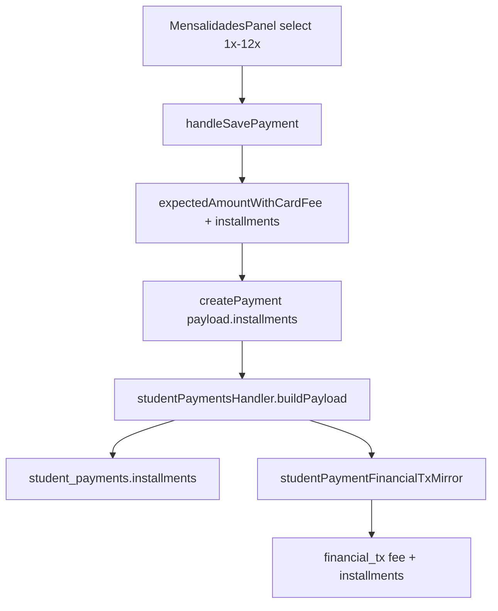

# Parcelamento no modal de Mensalidades — TECH Spec

**Data:** 2026-06-15  
**PRODUCT:** [2026-06-15-mensalidades-parcelamento-taxas-PRODUCT.md](./2026-06-15-mensalidades-parcelamento-taxas-PRODUCT.md)  
**Status:** Implementado (2026-06-15)

---

## 1. Diagnóstico técnico

### 1.1 O que já funciona (não reimplementar)

| Camada | Comportamento |
|--------|----------------|
| `paymentStatus.js` | `usesInstallmentCardFee` + `cardFeePercent` leem `credito_parcelado[n]` quando `installments >= 2` e método canônico = `cartao_credito` |
| `paymentMethods.js` | `canonicalPaymentMethodKey('cartão_crédito')` → `cartao_credito` |
| `studentPaymentFinancialTxMirror.js` | Calcula `fee` com `data.installments`; grava `installments` no `financial_tx` |
| `studentPayments.js` (client mirror) | Idem para espelho local quando API desligada |
| `TransacoesTab.jsx` | **Referência de UI** — select parcelas L1945–1977 |
| `paymentStatusCardFees.test.js` | Casos `cartão_crédito` + 3x já verdes |

### 1.2 O que está quebrado / incompleto

```
MensalidadesPanel.openPaymentModal
  → payForm sem installments (undefined)
  → UI sem select de parcelas
  → handleSavePayment
      → expectedAmountWithCardFee(..., payForm.installments)  // sempre undefined → à vista
      → paymentPayload SEM installments
  → studentPaymentsHandler.buildPayload
      → usa data.installments só no cálculo de expected_amount
      → NÃO grava installments no documento student_payments
```

**Gap principal:** UI + propagação `installments` ponta a ponta. Cálculo central **já existe**.

---

## 2. Solução proposta (v1)

### 2.1 Princípio

Espelhar o padrão de `TransacoesTab`: campo **Parcelas** só para `cartão_crédito`, valores 1–12, `1` = à vista.

### 2.2 Mudanças por arquivo

| Arquivo | Mudança |
|---------|---------|
| `MensalidadesPanel.jsx` | `payForm.installments`; select condicional; reset no change de método; incluir em `paymentPayload` + optimistic doc |
| `studentPaymentsHandler.js` | `buildPayload`: `payload.installments = clamp(1..12)` quando crédito; omitir ou `1` para outros |
| `scripts/ensure-student-payment-installments-attr.mjs` | **Opcional** — criar `installments` integer em `student_payments` se ausente |
| `src/test/mensalidadesInstallments.test.jsx` | **Novo** — render modal, change parcelas, assert payload |
| `paymentStatusCardFees.test.js` | Reforçar caso integração Mensalidades dialect (já coberto) |

**Fora de escopo v1:** `StudentPaymentModal.jsx` (P1).

---

## 3. UI — `MensalidadesPanel.jsx`

### 3.1 Estado `payForm`

```js
// openPaymentModal — adicionar:
installments: Math.min(12, Math.max(1, Number(preset.installments) || 1)),
```

### 3.2 Markup (após bloco de método de pagamento)

Reutilizar classes `form-group` + `form-input` (mesmo padrão `TransacoesTab`):

```jsx
{payForm.method === 'cartão_crédito' ? (
  <div className="form-group mensal-modal-installments">
    <label htmlFor="mensal-pay-installments">Parcelas</label>
    <select
      id="mensal-pay-installments"
      className="form-input finance-compact-input"
      value={String(payForm.installments || 1)}
      onChange={(e) =>
        setPayForm((p) => ({ ...p, installments: Number(e.target.value) || 1 }))
      }
    >
      {Array.from({ length: 12 }, (_, i) => i + 1).map((n) => (
        <option key={n} value={String(n)}>{n}x</option>
      ))}
    </select>
  </div>
) : null}
```

### 3.3 Change handler do método (botões/chips existentes)

Ao selecionar método:

```js
installments: method === 'cartão_crédito' ? (prev.installments || 1) : 1,
```

### 3.4 `handleSavePayment`

Normalizar antes do payload:

```js
const installments =
  payForm.method === 'cartão_crédito'
    ? Math.min(12, Math.max(1, Number(payForm.installments) || 1))
    : 1;
```

Incluir em `paymentPayload` e `optimisticDoc`:

```js
installments,
```

### 3.5 P1 — preview de valor (opcional)

`useEffect` ou handler de `installments`/`method`:

```js
const suggested = expectedAmountWithCardFee(
  selectedStudent,
  financeConfig,
  payForm.method,
  payForm.installments,
  paymentMap[selectedStudent?.id]
);
// se applyCardFee e suggested > parseCurrencyBRL(payForm.amount), atualizar máscara
```

Não bloquear v1 se omitido.

### 3.6 NL prefill

`openPaymentModal(student, preset)` já aceita `preset`; documentar que `preset.installments` é honrado quando método crédito.

---

## 4. Servidor — `studentPaymentsHandler.js`

### 4.1 `buildPayload`

Após montar `payload` base:

```js
const inst = Math.min(12, Math.max(1, Number(installments) || 1));
const creditKey = canonicalPaymentMethodKey(method);
if (creditKey === 'cartao_credito') {
  payload.installments = inst;
} else {
  payload.installments = 1;
}
```

Usar `canonicalPaymentMethodKey` de `paymentMethods.js` (import relativo server → `../../src/lib/paymentMethods.js` ou path já usado no handler).

### 4.2 PATCH pagamento

Garantir que `handlePatchStudentPayment` repassa `installments` quando cliente enviar (edição futura; v1 create é suficiente).

### 4.3 Strip unknown attribute

Se Appwrite rejeitar `installments` em `student_payments`, seguir padrão `updateStudentOverdueDoc`: retry sem campo. Espelho `financial_tx` **sempre** recebe `installments`.

---

## 5. Schema Appwrite (opcional)

### 5.1 Atributo

| Coleção | Key | Tipo | Notas |
|---------|-----|------|-------|
| `student_payments` | `installments` | integer | default 1, min 1, max 12, não required |

### 5.2 Script

`scripts/ensure-student-payment-installments-attr.mjs` — padrão `ensure-lead-payment-attrs.js`.

`npm run provision:student-payment-installments` em `package.json`.

**Não bloqueante:** espelho Caixa já persiste; pagamento sem atributo ainda funciona para taxa no save.

---

## 6. Testes

### 6.1 Unit (existente — manter verde)

`src/test/paymentStatusCardFees.test.js`:

- `cartão_crédito` + 3 → 216 (config fixture)
- `cartão_crédito` + 1 → taxa à vista (5% → 210)

### 6.2 Novo — `src/test/mensalidadesInstallments.test.jsx`

Abordagem mínima (sem E2E Appwrite):

1. Extrair helper `normalizeMensalidadesInstallments(method, installments)` para `src/lib/mensalidadesPaymentForm.js` **somente se** testar lógica pura; **preferir** teste de componente com mock de `createPayment`.

Cenários:

- Render com método crédito → select visível, default 1x
- Método PIX → select ausente
- Change para 3x → `createPayment` mock recebe `installments: 3`
- Change método crédito → débito → payload com `installments: 1`

### 6.3 Gate

```bash
npm test -- paymentStatusCardFees mensalidadesInstallments
npm run test:ci
```

---

## 7. Ordem de implementação

1. **Helper/normalize** (inline no panel ou extrair se teste unit puro)
2. **UI** select + reset método + `openPaymentModal` default
3. **Payload** client (`paymentPayload`, optimistic)
4. **Server** `buildPayload` persist `installments`
5. **Schema script** (opcional, documentar no PR)
6. **Testes** component + regressão `paymentStatusCardFees`
7. **QA manual** checklist PRODUCT §7

---

## 8. Definition of Done

- [ ] Select parcelas visível para `cartão_crédito` em Mensalidades
- [ ] `installments` no payload de create; espelho com `fee` correto para 3x+
- [ ] `buildPayload` persiste `installments` (ou strip seguro)
- [ ] Testes novos + regressão verdes
- [ ] Nenhum arquivo novo em `/api/`
- [ ] PRODUCT/TECH status → Implementado após merge

---

## 9. Diagrama fluxo pós-fix



---

## 10. Referência — lógica de taxa (inalterada)

```46:61:src/lib/paymentStatus.js
function cardFeePercent(financeConfig, method, installments) {
  const fees = financeConfig?.cardFees || {};
  const key = canonicalPaymentMethodKey(method);

  if (usesInstallmentCardFee(key, installments)) {
    const n = Math.max(2, Math.min(12, Math.trunc(Number(installments) || 2)));
    const parcelado = fees.credito_parcelado || {};
    return Number(parcelado[String(n)] ?? parcelado[n] ?? 0) || 0;
  }
  if (key === 'cartao_credito') {
    return Number(fees.credito_avista?.percent ?? 0) || 0;
  }
  // ...
}
```

`usesInstallmentCardFee`: `cartao_credito` + `installments >= 2` → tabela parcelada; caso contrário → à vista.
