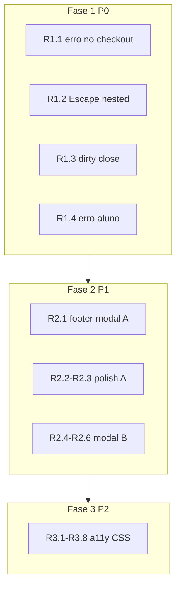
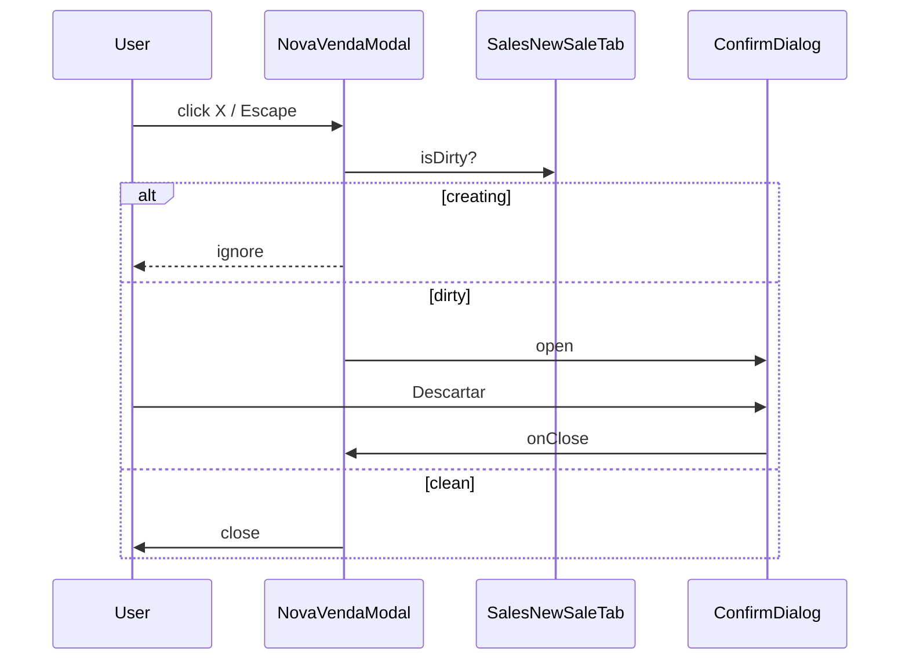
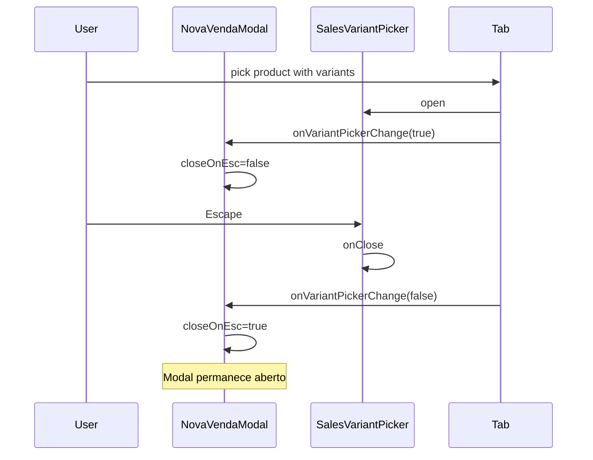

# Modal de Venda de Produto — TECH Spec

**Data:** 2026-06-15  
**PRODUCT:** [2026-06-15-modal-venda-produto-PRODUCT.md](./2026-06-15-modal-venda-produto-PRODUCT.md)  
**Status:** Aprovado para implementação

---

## Visão geral

Refatoração UX em dois fluxos que compartilham componentes de catálogo/carrinho/pagamento, sem alterar API ou regras de negócio de vendas.



---

## Arquivos alterados

| Arquivo | Fase | Mudança |
|---------|------|---------|
| `src/components/sales/SalesNewSaleTab.jsx` | P0–P2 | Erro no checkout; dirty helpers; `onNestedModalChange`; hints/toast `modalMode`; props footer |
| `src/components/sales/NovaVendaModal.jsx` | P0–P2 | `requestClose`; `ConfirmDialog`; footer; `closeOnEsc` condicional; título |
| `src/components/sales/SalesVariantPicker.jsx` | P0 | Documentar stacking; sem alteração de Escape se lift no pai |
| `src/components/student/StudentProductSaleStep.jsx` | P0–P2 | Banner erro; classes CSS; mobile tabs; expor submit state |
| `src/components/student/StudentPaymentModal.jsx` | P1–P2 | Footer produto; dirty close; dialogClassName scroll |
| `src/styles/modal-shell-variants.css` | P1–P2 | `student-payment-modal`; `@media (prefers-reduced-motion)` |
| `src/styles/sales.css` | P1–P2 | Footer sticky opcional; cleanup `.nova-venda-modal-backdrop` |
| `src/components/sales/SalesCatalogPicker.jsx` | P2 | `aria-selected` chips; empty state link handler |
| `src/components/shared/ModalShell.jsx` | — | **Sem mudança** na v1 (Escape nested via lift state) |

### Arquivos novos (opcionais)

| Arquivo | Fase | Responsabilidade |
|---------|------|------------------|
| `src/lib/saleModalDirty.js` | P0 | `isSaleCheckoutDirty(snapshot)` — testável unitariamente |

Preferir extrair helper apenas se a lógica dirty for usada em Fluxo A e B; caso contrário, função inline no modal.

---

## Decisões técnicas

### D1 — Nested Escape (R1.2)

**Problema:** Dois `ModalShell` registram `keydown` no `window` para Escape. Ambos disparam; o pai fecha a venda.

**Solução (diff mínimo):** Lift de `variantPickerParent` para `NovaVendaModal` via callback:

```jsx
// SalesNewSaleTab.jsx
<SalesNewSaleTab
  modalMode
  onVariantPickerChange={(open) => setVariantPickerOpen(open)}
  ...
/>

// NovaVendaModal.jsx
<ModalShell
  closeOnEsc={!variantPickerOpen && !creating}
  ...
/>
```

`SalesVariantPicker` mantém `closeOnEsc={true}` (fecha só o picker). Pai ignora Escape enquanto picker aberto.

**Alternativa descartada:** Alterar `ModalShell` com stack de modais — impacto global, fora do escopo v1.

### D2 — Dirty state (R1.3, R2.5)

```javascript
// saleModalDirty.js (proposta)
export function isSaleCheckoutDirty({
  cart = [],
  alunoId = '',
  clienteNome = '',
  clienteTelefone = '',
  descGeralCents = 0,
  descGeralPct = 0,
  deferredSale = false,
  payments = [],
} = {}) {
  if (cart.length > 0) return true;
  if (String(alunoId).trim()) return true;
  if (String(clienteNome).trim()) return true;
  if (String(clienteTelefone).replace(/\D/g, '')) return true;
  if (Number(descGeralCents) > 0) return true;
  if (Number(descGeralPct) > 0) return true;
  if (deferredSale) return true;
  // Pagamento alterado manualmente além do default vazio
  const hasNonDefaultPayment =
    payments.length > 1 ||
    (payments[0] && (payments[0].forma !== 'pix' || Number(payments[0].valorCents) > 0));
  if (hasNonDefaultPayment && cart.length === 0) return false; // edge: só pagamento sem itens não dirty
  return false;
}
```

**Fluxo A:** `NovaVendaModal` recebe snapshot via ref/callback de `SalesNewSaleTab` ou lift parcial de state.

**Implementação pragmática v1:** Passar prop `onDirtyChange(boolean)` de `SalesNewSaleTab` → `NovaVendaModal`, computado em `useEffect` quando deps mudam.

**Fluxo B:** Dirty = `cart.length > 0` (aluno já fixo).

### D3 — requestClose pattern (R1.3)

Espelhar `TransacoesTab`:

```jsx
const requestClose = useCallback(() => {
  if (creating) return;
  if (isDirty) {
    setShowDiscardDialog(true);
    return;
  }
  onClose();
}, [creating, isDirty, onClose]);
```

Wire em: `ModalShell.onClose`, botão X (via `onClose`), footer Cancelar, Escape (via `closeOnEsc` + handler custom se necessário).

### D4 — Footer submit via form attribute (R2.1)

```jsx
// NovaVendaModal.jsx
<ModalShell
  footer={
    <>
      <button type="button" className="btn-outline" onClick={requestClose}>Cancelar</button>
      <button
        type="submit"
        form="nova-venda-form"
        className="btn-primary"
        disabled={creating || !canSubmit}
      >
        {creating ? 'Registrando venda…' : submitLabel}
      </button>
    </>
  }
>
  <SalesNewSaleTab formId="nova-venda-form" hideSubmitButton={modalMode} ... />
</ModalShell>

// SalesNewSaleTab.jsx
<form id={formId} ref={formRef} ...>
  ...
  {!hideSubmitButton && <button type="submit" className="sales-submit-btn">...</button>}
</form>
```

Estado `canSubmit` / `submitLabel` expostos via `onSubmitStateChange` ou render prop.

### D5 — Erro no checkout (R1.1)

Mover bloco de `SalesNewSaleTab.jsx:1143-1147` para dentro de `.sales-checkout`, antes do submit (ou antes do footer se submit removido do body):

```jsx
import StatusBanner from '../shared/StatusBanner.jsx';

{(localError || error) && (
  <StatusBanner
    variant="error"
    message={friendlySaleError(localError || error)}
  />
)}
```

Remover `<p className="sales-form-error">` pós-form.

### D6 — Fluxo B footer + submit (R2.5, R2.6)

Elevar controle para `StudentPaymentModal`:

```jsx
// StudentProductSaleStep — novas props
onSubmitStateChange?.({ canSubmit, busy, label })
formId="student-product-sale-form"

// StudentPaymentModal — footer quando isProduct
footer={
  isProduct ? (
    <>
      <button type="button" className="btn-outline" onClick={requestClose}>Cancelar</button>
      <button
        type="submit"
        form="student-product-sale-form"
        className="btn-primary"
        disabled={!productSubmit.canSubmit || productSubmit.busy}
      >
        {productSubmit.busy ? 'Registrando…' : 'Confirmar venda'}
      </button>
    </>
  ) : ( /* footer pagamento existente */ )
}
```

Converter `<form>` implícito em `<form id="student-product-sale-form" onSubmit={...}>` no step.

### D7 — Scroll body modal aluno (R2.4)

Adicionar em `modal-shell-variants.css`:

```css
.navi-modal-shell.student-payment-modal {
  max-height: min(92vh, calc(100dvh - 32px));
  display: flex;
  flex-direction: column;
  overflow: hidden;
}

.navi-modal-shell.student-payment-modal .navi-modal-shell__body {
  flex: 1;
  min-height: 0;
  overflow-y: auto;
  -webkit-overflow-scrolling: touch;
  overscroll-behavior: contain;
}

.navi-modal-shell.student-payment-modal .navi-modal-shell__footer {
  flex-shrink: 0;
}
```

Reutilizar bloco existente de `.nova-venda-modal` (DRY: agrupar seletores).

### D8 — Mobile tabs Fluxo B (R3.8)

Reutilizar state `mobilePanel` / classes de `SalesNewSaleTab`:

- Copiar padrão mínimo (tabs + `sales-panel--active`) para `StudentProductSaleStep`.
- Não extrair hook compartilhado na v1 unless duplication > ~40 linhas.

### D9 — Empty state link (R3.7)

Em `SalesCatalogPicker`, empty state CTA:

```jsx
<Link
  to="/produtos"
  className="btn-primary"
  onClick={(e) => {
    if (onNavigateAway) {
      e.preventDefault();
      onNavigateAway('/produtos');
    }
  }}
>
```

`NovaVendaModal` passa `onNavigateAway={(path) => { onClose(); navigate(path); }}`.

---

## Sequência: dirty close (Fluxo A)



---

## Sequência: nested variant picker Escape



---

## Fase 1 — Implementação P0 (detalhe)

### SalesNewSaleTab.jsx

1. Adicionar props: `onVariantPickerChange`, `onDirtyChange`, `hideSubmitButton`, `formId`.
2. `useEffect` em `variantPickerParent` → `onVariantPickerChange(!!variantPickerParent)`.
3. `useEffect` dirty → `onDirtyChange(isSaleCheckoutDirty({...}))`.
4. Mover erro para `.sales-checkout` com `StatusBanner`.
5. Remover bloco pós-form linhas ~1143-1147.

### NovaVendaModal.jsx

1. State: `variantPickerOpen`, `isDirty`, `showDiscardDialog`.
2. `requestClose` + `ConfirmDialog`.
3. `closeOnEsc={!variantPickerOpen}` (e `!creating` via prop de Tab).
4. Passar callbacks para `SalesNewSaleTab`.

### StudentProductSaleStep.jsx

1. Import `StatusBanner` ou `FieldError`.
2. Substituir erro inline por banner no topo.
3. Remover estilos inline do erro.

---

## Fase 2 — Implementação P1 (detalhe)

### NovaVendaModal + SalesNewSaleTab

- Footer com Cancelar/Concluir (D4).
- `SalesPosHints`: wrap `{!modalMode && <SalesPosHints ... />}`.
- `pickProduct`: `{ if (!modalMode) addToast success ... }`.

### StudentPaymentModal + StudentProductSaleStep

- Footer produto (D6).
- CSS scroll (D7).
- `paymentValid` no disabled.

---

## Fase 3 — Implementação P2 (detalhe)

| ID | Arquivo | Mudança |
|----|---------|---------|
| R3.1 | NovaVendaModal | `title="Vender produto"` |
| R3.2 | SalesNewSaleTab | ids + aria combobox aluno |
| R3.3 | SalesNewSaleTab | `inputMode="tel"` |
| R3.4 | SalesCatalogPicker | `aria-selected` |
| R3.5 | modal-shell-variants.css | reduced-motion |
| R3.6 | sales.css | remover rules duplicadas backdrop |
| R3.7 | SalesCatalogPicker + modais | `onNavigateAway` |
| R3.8 | StudentProductSaleStep + sales.css | mobile tabs |

---

## Testes

### Unitários (recomendados)

| Arquivo | Caso |
|---------|------|
| `src/test/saleModalDirty.test.js` | `isSaleCheckoutDirty` — cart, aluno, desconto, clean |

### Manuais (obrigatórios)

Ver QA Checklist em PRODUCT §10.

### Regressão PDV full-page

- `SalesNewSaleTab` com `modalMode={false}`: hotkeys F2–F4, receipt panel, `CashShiftBanner`, toasts de add-to-cart permanecem.

---

## Rollout

| PR | Conteúdo | Risco |
|----|----------|-------|
| PR1 | Fase 1 P0 — R1.1–R1.4 | Baixo; bugfix UX |
| PR2 | Fase 2 P1 — R2.1–R2.6 | Médio; footer muda layout |
| PR3 | Fase 3 P2 — R3.1–R3.8 | Baixo; polish |

PR1 pode ir standalone. PR2 depende de PR1 para dirty close + erro já estáveis. PR3 independente após PR2.

---

## Riscos e mitigação

| Risco | Mitigação |
|-------|-----------|
| Footer submit não dispara validação HTML5 | Manter `onSubmit={submit}` no form; botão externo via `form=` |
| Lift dirty state complexo | Começar com `onDirtyChange` boolean; refinar depois |
| Duplicar mobile tabs no Fluxo B | Copiar padrão existente; extrair hook só se necessário |
| `creating` no store global | Ler `useSalesStore(s => s.creating)` no modal pai |

---

## Referências no codebase

| Padrão | Onde |
|--------|------|
| Dirty + ConfirmDialog | `src/components/finance/TransacoesTab.jsx` (~696, ~2151) |
| Modal scroll body | `src/styles/modal-shell-variants.css` (`.nova-venda-modal`) |
| Footer sticky matrícula | `src/components/MatriculaModal.jsx`, `.matricula-modal-footer` |
| Feedback visual | `docs/ux-feedback.md` |
| Form modal review | `.agents/skills/form-modal-flows/SKILL.md` |

---

## Mapeamento requirements → arquivos

| Req | Arquivos principais |
|-----|---------------------|
| R1.1 | SalesNewSaleTab, StatusBanner |
| R1.2 | NovaVendaModal, SalesNewSaleTab |
| R1.3 | NovaVendaModal, ConfirmDialog, saleModalDirty |
| R1.4 | StudentProductSaleStep |
| R2.1 | NovaVendaModal, SalesNewSaleTab, sales.css |
| R2.2 | SalesNewSaleTab |
| R2.3 | SalesNewSaleTab |
| R2.4 | modal-shell-variants.css, StudentPaymentModal |
| R2.5 | StudentPaymentModal, StudentProductSaleStep |
| R2.6 | StudentProductSaleStep, StudentPaymentModal |
| R3.x | Ver tabela Fase 3 acima |
