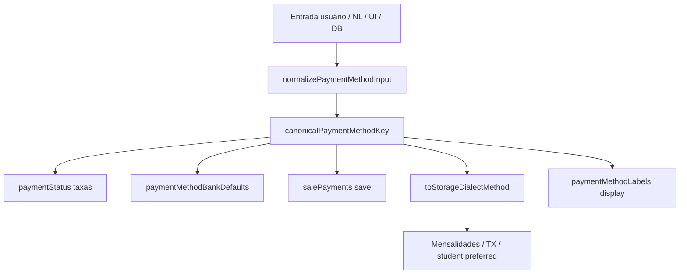

# Etiqueta de inadimplência (`overdueLabel`) + cleanup de aliases — TECH Spec

**Data:** 2026-06-15  
**PRODUCT:** [2026-06-15-overdue-label-etiqueta-aliases-PRODUCT.md](./2026-06-15-overdue-label-etiqueta-aliases-PRODUCT.md)  
**Status:** Implementado

---

## Parte A — `overdueLabel` UI

### A.1 Estado existente (não reinventar)

`useFinanceConfigState` já expõe:

```js
overdueLabel, setOverdueLabel  // L104–105, L456–457
```

Digest e persistência:

```js
digestCollection(collectionRules, overdueLabel)  // dirty.collection
buildMergedConfig → mergeCollectionIntoFinanceConfig(financeConfig, { collectionRules, overdueLabel })
```

`FinanceiroConfigTab` **não** passa props para a seção régua hoje:

```134:138:src/components/finance/FinanceiroConfigTab.jsx
<FinanceSettingsCollectionSection
  collectionRules={state.collectionRules}
  onRulesChange={state.setCollectionRules}
/>
```

### A.2 Mudanças de UI

| Arquivo | Mudança |
|---------|---------|
| `CollectionRulesSection.jsx` | Props opcionais `overdueLabel`, `onOverdueLabelChange`; bloco formulário acima da lista de etapas |
| `FinanceSettingsCollectionSection.jsx` | Repassar props |
| `FinanceiroConfigTab.jsx` | `overdueLabel={state.overdueLabel}` `onOverdueLabelChange={state.setOverdueLabel}` |

### A.3 Markup proposto (`CollectionRulesSection`)

```jsx
{typeof onOverdueLabelChange === 'function' ? (
  <div className="form-group mensal-collection-overdue-label">
    <label htmlFor="finance-overdue-label">Etiqueta de inadimplência</label>
    <input
      id="finance-overdue-label"
      className="form-input finance-compact-input"
      maxLength={30}
      value={overdueLabel ?? ''}
      placeholder={DEFAULT_OVERDUE_LABEL}
      onChange={(e) => onOverdueLabelChange(e.target.value)}
    />
    <p className="text-small text-muted">
      Exibida no badge do aluno quando a régua marca inadimplência. Alunos já marcados
      mantêm a etiqueta anterior até a próxima atualização automática.
    </p>
  </div>
) : null}
```

Importar `DEFAULT_OVERDUE_LABEL` de `collectionRules.js`. Opcional: `onBlur` → `onOverdueLabelChange(parseOverdueLabel(value))`.

### A.4 CSS

Reutilizar tokens existentes (`mensal-collection-rules`, `finance-compact-input`). Classe nova opcional: `mensal-collection-overdue-label` em `finance.css` só se precisar espaçamento — preferir `form-group` padrão.

### A.5 Testes

**Opção recomendada:** `src/test/financeCollectionOverdueLabel.test.jsx`

```jsx
render(<CollectionRulesSection
  collectionRules={DEFAULT_COLLECTION_RULES}
  onRulesChange={() => {}}
  overdueLabel="Devedor"
  onOverdueLabelChange={onChange}
  embedded
/>);
// expect input value; fireEvent.change → onChange called
```

**Unit:** `parseOverdueLabel('')` → `'Inadimplente'` (já em `collectionRules.js`; reforçar se necessário).

### A.6 P1 — resumo sidebar

`buildFinanceSettingsSummaries` — `REGUA.summary`:

```js
const overdue = parseOverdueLabel(financeConfig?.overdueLabel);
const rulesPart = rulesCount > 0 ? `${rulesCount} etapa${...}` : 'Padrão';
summary: `${rulesPart} · ${overdue}`;
```

Passar `financeConfig` já disponível no builder.

---

## Parte B — Cleanup e validação de aliases

### B.1 Inventário atual (duplicação)

| Arquivo | Símbolo | Saída típica |
|---------|---------|--------------|
| `src/lib/paymentMethods.js` | `PAYMENT_METHOD_ALIASES`, `canonicalPaymentMethodKey` | **canônico** snake_case |
| `src/lib/salePayments.js` | `FORMA_ALIASES`, `normalizePaymentForma` | canônico |
| `src/hooks/useNlAction.js` | `normalizePaymentMethod` | **acentuado** `cartão_crédito` |
| `src/lib/financeExpense.js` | `normalizeExpenseMethod` | acentuado |
| `lib/studentNlUpdates.js` | `normalizePreferredMethod` | acentuado |
| `src/lib/paymentMethodLabels.js` | `PAYMENT_METHOD_LABELS` overlay | display string |
| `src/hooks/useNlAction.js` | `mapNlPaymentFormToSale` | canônico (vendas) |

### B.2 API alvo em `paymentMethods.js`

Expandir módulo central (sem import circular):

```js
/** Entrada usuário/NL → chave canônica (taxas, vendas, comparação). */
export function canonicalPaymentMethodKey(method) { /* existente */ }

/**
 * Dialect gravado em mensalidades / transações / preferredPaymentMethod legado.
 * Mantém acentos onde o produto já persiste assim.
 */
const STORAGE_DIALECT_ALIASES = {
  cartao_credito: 'cartão_crédito',
  cartao_debito: 'cartão_débito',
  transferencia: 'transferência',
  // pix, dinheiro, outro → iguais
};

export function toStorageDialectMethod(method) {
  const key = canonicalPaymentMethodKey(method);
  if (!key) return '';
  return STORAGE_DIALECT_ALIASES[key] || key;
}

/** NL / texto livre: normaliza espaços e lowercase antes do canonical. */
export function normalizePaymentMethodInput(raw) {
  const trimmed = String(raw || '').trim().toLowerCase();
  const collapsed = trimmed.replace(/\s+/g, ' ');
  // mapa espaço → underscore para chaves tipo "cartão crédito" (P1)
  const keyed = PAYMENT_METHOD_ALIASES[collapsed]
    ? collapsed
    : collapsed.replace(/ /g, '_');
  return keyed;
}

export function canonicalPaymentMethodKeyFromInput(raw) {
  return canonicalPaymentMethodKey(normalizePaymentMethodInput(raw));
}
```

### B.3 Refactors por arquivo

| Arquivo | Antes | Depois |
|---------|-------|--------|
| `salePayments.js` | `FORMA_ALIASES` local | `canonicalPaymentMethodKey(normalizePaymentMethodInput(raw))` com replace `_` para espaços na entrada |
| `financeExpense.js` | mapa inline | `toStorageDialectMethod(method)` com fallback `dinheiro` |
| `lib/studentNlUpdates.js` | mapa inline | `toStorageDialectMethod` + `clip` se inválido |
| `useNlAction.js` | `normalizePaymentMethod` 20 linhas | `toStorageDialectMethod(normalizePaymentMethodInput(m))` |
| `useNlAction.js` | `mapNlPaymentFormToSale` | `canonicalPaymentMethodKeyFromInput(form)` ou manter map NL-specific só para `link_pagbank` |
| `paymentMethodLabels.js` | overlay manual | `formatPaymentMethod`: `canonicalPaymentMethodKey` + lookup `PAYMENT_METHODS`; manter extras `boleto`, `link_pagamento` |

**Não alterar** valores hardcoded em:
- `MensalidadesPanel.PAY_METHODS` (UI)
- `TransacoesTab` `<option value="cartão_crédito">`
- `StudentProfile` pay methods

Esses continuam dialect de storage; cálculos usam `canonicalPaymentMethodKey` (já feito em `paymentStatus.js`).

### B.4 Validação — arquivo de testes

**Novo:** `tests/unit/finance/paymentMethodCanonical.test.js`

```js
import { describe, it, expect } from 'vitest';
import {
  canonicalPaymentMethodKey,
  canonicalPaymentMethodKeyFromInput,
  toStorageDialectMethod,
} from '../../../src/lib/paymentMethods.js';

const CANONICAL_CASES = [
  ['cartão_crédito', 'cartao_credito'],
  ['cartao_credito', 'cartao_credito'],
  ['credito', 'cartao_credito'],
  ['cartão_débito', 'cartao_debito'],
  ['debito', 'cartao_debito'],
  ['transferência', 'transferencia'],
  ['pix', 'pix'],
];

describe('canonicalPaymentMethodKey', () => {
  it.each(CANONICAL_CASES)('%s → %s', (input, expected) => {
    expect(canonicalPaymentMethodKey(input)).toBe(expected);
  });
});

describe('toStorageDialectMethod', () => {
  it('round-trip acentuado para mensalidades', () => {
    expect(toStorageDialectMethod('cartao_credito')).toBe('cartão_crédito');
    expect(toStorageDialectMethod('cartão_crédito')).toBe('cartão_crédito');
  });
});

describe('cross-module parity', () => {
  it('normalizePaymentForma aligns with canonical', async () => {
    const { normalizePaymentForma } = await import('../../../src/lib/salePayments.js');
    expect(normalizePaymentForma('cartão_crédito')).toBe('cartao_credito');
  });
});
```

### B.5 Audit script (PR checklist)

Grep no PR deve retornar **zero** ocorrências de mapas locais:

```bash
rg "cartão_crédito.*cartao_credito|'cartão débito'" --glob "*.{js,jsx}" \
  --glob "!src/lib/paymentMethods.js" \
  --glob "!**/*.test.*"
```

Exceções permitidas: UI `value="cartão_crédito"`, testes, comentários.

### B.6 Riscos

| Risco | Mitigação |
|-------|-----------|
| NL passa a rejeitar método antes aceito | Testes com strings NL reais; manter fallback `clip` em preferred method |
| `normalizePaymentForma` quebra vendas importadas | Testes `salePayments` existentes + parity test |
| Import circular | `paymentMethods.js` não importa salePayments/financeExpense |

---

## Parte C — Ordem de implementação

1. **Aliases** — expandir `paymentMethods.js` + testes `paymentMethodCanonical.test.js`
2. **Refactor** consumidores (`salePayments`, `financeExpense`, `studentNlUpdates`, `useNlAction`, `paymentMethodLabels`)
3. **Grep audit** — confirmar zero mapas duplicados
4. **overdueLabel UI** — props + input + wire `FinanceiroConfigTab`
5. **Testes RTL** overdue label
6. **P1** — summary régua + alias espaço NL

---

## Parte D — Definition of Done

- [ ] Campo etiqueta na régua (owner) funcional end-to-end
- [ ] `dirty.collection` ao mudar só etiqueta
- [ ] `PAYMENT_METHOD_ALIASES` é o único mapa entrada→canônico
- [ ] `FORMA_ALIASES` e mapas NL/despesa removidos ou delegando
- [ ] `tests/unit/finance/paymentMethodCanonical.test.js` verde
- [ ] `src/test/financeCollectionOverdueLabel.test.jsx` (ou equivalente) verde
- [ ] Regressão `paymentStatusCardFees.test.js` verde
- [ ] Nenhum arquivo novo em `/api/`

---

## Parte E — Diagrama aliases pós-cleanup


