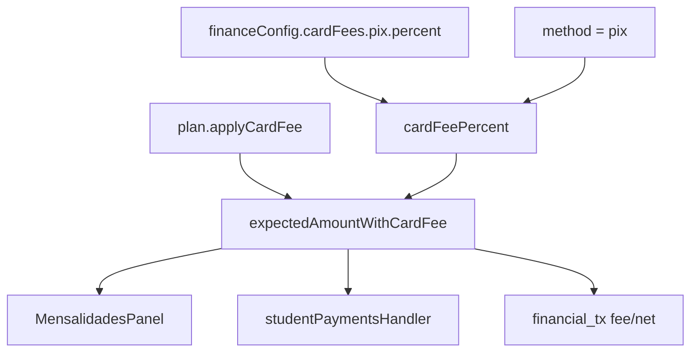

# Taxa PIX × configuração — TECH Spec

**Data:** 2026-06-15  
**PRODUCT:** [2026-06-15-taxa-pix-config-ui-codigo-PRODUCT.md](./2026-06-15-taxa-pix-config-ui-codigo-PRODUCT.md)  
**Status:** Implementado (2026-06-15)

---

## 1. Diagnóstico técnico

### 1.1 Contradição UI ↔ código

```
FinanceSettingsFeesSection
  → cardFees.pix.percent persistido em financeConfig
  → feesSummary exibe "PIX X%"

MensalidadesPanel.handleSavePayment
  → expectedAmountWithCardFee(..., 'pix', ...)
      → canonicalPaymentMethodKey('pix') === 'pix'
      → isCardPaymentMethod('pix') === false  ❌
      → return base (sem taxa)

cardFeePercent(..., 'pix', ...)
  → key === 'pix' cai no return 0 final  ❌
```

### 1.2 Pontos de integração (todos usam a mesma função)

| Arquivo | Uso |
|---------|-----|
| `src/lib/paymentStatus.js` | `cardFeePercent`, `expectedAmountWithCardFee` |
| `src/components/finance/MensalidadesPanel.jsx` | bump valor no save |
| `src/lib/studentPayments.js` | `fee` no mirror client |
| `lib/server/studentPaymentsHandler.js` | `expected_amount` no `buildPayload` |
| `lib/server/studentPaymentFinancialTxMirror.js` | `fee` / `net` |

**Nenhuma mudança de API** — só lógica compartilhada.

### 1.3 Testes a atualizar

| Arquivo | Mudança |
|---------|---------|
| `src/test/paymentStatusCardFees.test.js` | Adicionar caso PIX 3%; manter dinheiro/transferência |
| `src/test/deactivateStudentPolicy.test.js` | Substituir `não aplica taxa em pix` por casos PIX 0% vs PIX > 0 |

---

## 2. Solução proposta (Opção A — implementar)

### 2.1 Princípio

PIX passa a ser método **elegível a repasse de taxa do plano**, com percentual em `cardFees.pix.percent`, sob o mesmo gate `applyCardFee` do plano.

### 2.2 `paymentMethods.js` — helper de elegibilidade

Evitar inflar `isCardPaymentMethod` (nome semântico). Adicionar:

```js
/**
 * Métodos cuja taxa configurada em financeConfig.cardFees pode repassar ao aluno.
 * @param {string} canonical — resultado de canonicalPaymentMethodKey
 */
export function isPlanFeeEligiblePaymentMethod(canonical) {
  if (canonical === 'pix') return true;
  return isCardPaymentMethod(canonical);
}
```

Exportar para testes unitários opcionais.

### 2.3 `paymentStatus.js`

**`cardFeePercent`** — inserir antes do `return 0`:

```js
if (key === 'pix') {
  return Number(fees.pix?.percent ?? 0) || 0;
}
```

**`expectedAmountWithCardFee`** — trocar guard:

```js
// Antes:
if (!isCardPaymentMethod(key)) return base;

// Depois:
import { isPlanFeeEligiblePaymentMethod } from './paymentMethods.js';
// ...
if (!isPlanFeeEligiblePaymentMethod(key)) return base;
```

Atualizar JSDoc da função: mencionar PIX; nome da função mantido (compat).

### 2.4 Sem mudanças necessárias

| Arquivo | Motivo |
|---------|--------|
| `MensalidadesPanel.jsx` | Já chama `expectedAmountWithCardFee` com `payForm.method` |
| `StudentPaymentModal.jsx` | Idem |
| `studentPaymentsHandler.js` | Idem via `buildPayload` |
| `FinanceSettingsFeesSection.jsx` | Campo já existe (copy P1 opcional) |
| `financeConfigStorage.js` | Schema `cardFees.pix` já normalizado |

---

## 3. Copy (P1 — mesmo PR se rápido)

| Arquivo | Trecho |
|---------|--------|
| `FinanceSettingsFeesSection.jsx` L12–14 | Lead text → repasse ao aluno |
| `FinanceSettingsPlansSection.jsx` L70 | Label → “Repasse taxas de pagamento ao aluno” |
| `ConfigTab.jsx` | Idem se ainda usado internamente (opcional) |

Adicionar `text-small text-muted` sob input PIX:

> Aplica-se a mensalidades quando o plano repassa taxas ao aluno.

---

## 4. Testes

### 4.1 `src/test/paymentStatusCardFees.test.js`

Adicionar fixture com `pix: { percent: 3 }` no `financeConfig` global ou caso local:

```js
it('aplica taxa PIX quando configurada e applyCardFee', () => {
  const cfg = {
    ...financeConfig,
    cardFees: { ...financeConfig.cardFees, pix: { percent: 3 } },
  };
  expect(expectedAmountWithCardFee(student, cfg, 'pix', null, null)).toBe(206);
});

it('PIX 0% permanece base', () => {
  expect(expectedAmountWithCardFee(student, financeConfig, 'pix', null, null)).toBe(200);
});
```

Manter:

```js
it('não aplica taxa em dinheiro ou transferência', () => { ... });
```

Remover ou renomear teste que agrupa PIX com dinheiro/transferência sem distinguir `pix.percent`.

### 4.2 `src/test/deactivateStudentPolicy.test.js`

```js
it('aplica taxa PIX quando pix.percent configurado', () => {
  const cfg = {
    ...financeConfig,
    cardFees: { ...financeConfig.cardFees, pix: { percent: 2 } },
  };
  expect(expectedAmountWithCardFee({ plan: 'Mensal' }, cfg, 'pix', null, null)).toBe(204);
});

it('não aplica taxa PIX quando percent é 0', () => {
  expect(expectedAmountWithCardFee({ plan: 'Mensal' }, financeConfig, 'pix', null, null)).toBe(200);
});
```

### 4.3 Opcional — `tests/unit/finance/paymentMethodPlanFee.test.js`

```js
import { isPlanFeeEligiblePaymentMethod } from '../../../src/lib/paymentMethods.js';

expect(isPlanFeeEligiblePaymentMethod('pix')).toBe(true);
expect(isPlanFeeEligiblePaymentMethod('dinheiro')).toBe(false);
```

### 4.4 Gate CI

```bash
npm test -- paymentStatusCardFees deactivateStudentPolicy
npm run test:ci
```

---

## 5. Alternativa B (não implementar — referência)

Se produto reverter para **remover UI**:

| Arquivo | Ação |
|---------|------|
| `FinanceSettingsFeesSection.jsx` | Remover bloco PIX; lead só cartão |
| `financeSettingsSections.js` | `feesSummary` sem parte PIX |
| `useFinanceConfigState.js` | Manter `pix` no schema com 0 (não apagar JSON salvo) ou migrar leitura |
| Testes | Manter PIX sem taxa |

**Não recomendado** — ver PRODUCT §3.

---

## 6. Ordem de implementação

1. `isPlanFeeEligiblePaymentMethod` em `paymentMethods.js`
2. `cardFeePercent` + `expectedAmountWithCardFee` em `paymentStatus.js`
3. Atualizar testes (`paymentStatusCardFees`, `deactivateStudentPolicy`)
4. P1 copy (`FinanceSettingsFeesSection`, `FinanceSettingsPlansSection`)
5. QA manual checklist PRODUCT §9
6. Marcar specs **Implementado**

---

## 7. Definition of Done

- [ ] `pix.percent > 0` + `applyCardFee` → valor com taxa em Mensalidades
- [ ] `fee > 0` no espelho Caixa para PIX taxado
- [ ] Dinheiro / transferência inalterados
- [ ] Testes atualizados; CI verde
- [ ] Nenhum arquivo novo em `/api/`

---

## 8. Diagrama pós-correção



---

## 9. Matriz de regressão

| Cenário | Antes | Depois |
|---------|-------|--------|
| PIX, `pix.percent=0` | 200 | 200 |
| PIX, `pix.percent=3`, `applyCardFee=true` | 200 | **206** |
| PIX, `pix.percent=3`, `applyCardFee=false` | 200 | 200 |
| Dinheiro | 200 | 200 |
| Cartão crédito 5% | 210 | 210 |
