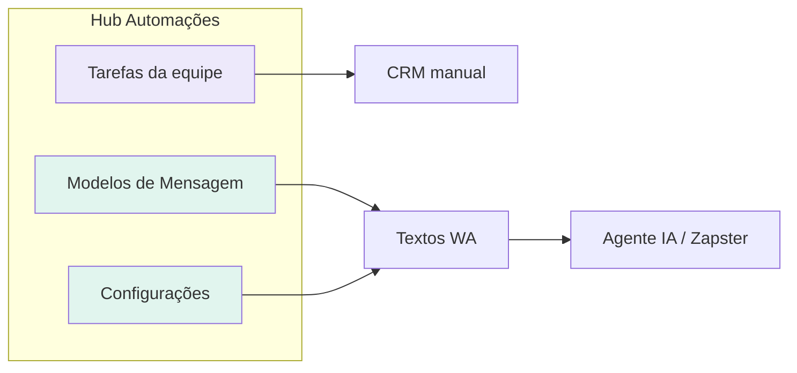

# Automações — UX, avisos visuais e onboarding

**Data:** 2026-06-16  
**Status:** implementado (2026-06-16, P0–P2)  
**TECH:** [2026-06-16-automacoes-ux-onboarding-TECH.md](./2026-06-16-automacoes-ux-onboarding-TECH.md)

**Fluxos relacionados:**

- [automacoes-funil.md](../../flows/atendimento/automacoes-funil.md)
- [agente-ia-automacoes.md](../../flows/atendimento/agente-ia-automacoes.md)

**Specs relacionadas:**

- [2026-06-16-lead-profile-whatsapp-offline-states-PRODUCT.md](./2026-06-16-lead-profile-whatsapp-offline-states-PRODUCT.md) — padrão de banner offline WA
- [2026-06-16-conciliacao-ux-evolucao-PRODUCT.md](./2026-06-16-conciliacao-ux-evolucao-PRODUCT.md) — wizard reutiliza estrutura `AutomacoesSetupWizard`

**Mock Figma:** Não disponível — spec define hierarquia, variantes de `StatusBanner`, copy canônica e estados. Seguir [DESIGN_SYSTEM.md](../../../DESIGN_SYSTEM.md) e [docs/ux-feedback.md](../../ux-feedback.md).

---

## Problema

O hub `/automacoes` agrupa **dois produtos** com o mesmo rótulo “Automações”:

| Trilha | Abas | Comportamento |
|--------|------|----------------|
| **Equipe (manual)** | Tarefas da equipe | Checklists e playbooks no CRM — **não** envia WhatsApp |
| **Funil (automático)** | Modelos de Mensagem + Configurações | Gatilhos que disparam mensagens via Agente IA / Zapster |

Hoje a interface gera **contradição cognitiva**:

1. Na aba **Tarefas da equipe**, o subtítulo diz que *não envia WhatsApp*, mas o wizard de onboarding pede *conectar WhatsApp para envio automático* na mesma tela.
2. O disclaimer “não envia WhatsApp” aparece **três vezes** (subtítulo do header, parágrafo da aba, contexto implícito do wizard).
3. Nomes divergem entre menu (“Processos”), aba (“Tarefas da equipe”) e wizard (“Gatilhos” vs aba “Configurações”).
4. O passo **WhatsApp** do wizard aparece em **qualquer aba** (`shouldShowSetupWizardOnTab` com `path` → sempre visível).
5. CTA primário verde **“Ir para Agente IA”** compete com o conteúdo da aba atual e sugere saída do módulo sem aviso visual.
6. Banner de **readiness** some na Configurações enquanto o wizard está ativo — perde-se feedback útil (“WhatsApp desconectado”).

**Quem é afetado:** owner e admin na primeira configuração; member que só consulta processos.

**Custo de não resolver:** abandono do wizard, medo de “ativar spam”, suporte (“Automações manda WhatsApp ou não?”), percepção de produto inconsistente.

---

## Goals

| # | Meta |
|---|------|
| G1 | Em ≤10 s, usuário distingue **tarefas da equipe** vs **mensagens automáticas no WhatsApp** |
| G2 | Wizard de primeira configuração **nunca contradiz** a aba visível |
| G3 | Avisos contextuais usam **componentes semânticos** (`StatusBanner`), não parágrafos cinza soltos |
| G4 | Onboarding de WhatsApp/gatilhos guia sem bloquear quem só quer configurar **tarefas internas** |
| G5 | Nomenclatura alinhada em menu, abas, wizard e links |
| G6 | Readiness (modelos + WhatsApp + gatilhos ativos) visível na Configurações **mesmo com wizard** |

---

## Non-Goals

- Unificar “tarefas” e “gatilhos WhatsApp” num único toggle.
- Novo módulo ou rota fora de `/automacoes`.
- Alterar lógica de envio (`lib/automationCore.js`, cron, Zapster).
- Tour overlay de 4 passos (escopo futuro; esta spec = wizard + banners).
- Nova Serverless Function em `/api/`.
- Redesign completo da aba Modelos (accordion de templates permanece).

---

## Decisão de produto — duas trilhas

| Superfície | Copy curta (badge mental) |
|------------|---------------------------|
| Tarefas da equipe | **Equipe** — lembretes internos |
| Modelos + Configurações | **WhatsApp** — envio automático no funil |

O header do hub comunica **as duas trilhas**; cada aba reforça só o escopo dela.

---

## Sistema visual de avisos

Reutilizar primitivos existentes — **não** inventar novo tipo de alerta.

### Hierarquia (de cima para baixo na página)

| Camada | Componente | Quando | Variante |
|--------|------------|--------|----------|
| 1 | `PageHeader` subtitle | Sempre no hub | Texto neutro de duas trilhas (ver copy deck) |
| 2 | `AutomacoesHubScopeBanner` | Sempre abaixo das abas | `info` — mapa Equipe × WhatsApp |
| 3 | `AutomacoesSetupWizard` **ou** `AutomacoesSetupWizardCompact` | Onboarding incompleto | Card roxo (full) ou faixa compacta |
| 4 | `StatusBanner` por aba | Contexto da aba ativa | `info` / `warning` conforme matriz |
| 5 | `AutomacoesReadinessBanner` | Aba Configurações | `warning` ou `success` — **não ocultar** por wizard |

### Regras visuais

1. **Um aviso persistente por intenção** — não repetir a mesma frase em header + banner + parágrafo.
2. **`StatusBanner variant="info"`** para educação (o que é esta aba).
3. **`StatusBanner variant="warning"`** para pré-requisito faltando (WhatsApp offline na Configurações).
4. **CTA que sai do módulo** (`/agente-ia`): `btn-secondary` ou link em banner — **nunca** `btn-action-primary` no wizard quando a aba ativa não é de WhatsApp.
5. **Wizard full** só nas abas **Modelos** e **Configurações**, ou quando `?wizard=1` força onboarding.
6. **Wizard compact** na aba **Tarefas da equipe**: faixa de 1 linha + link “Continuar configuração de WhatsApp” — sem card de 3 passos nem CTA verde dominante.
7. Ícones: `Info` (educação), `AlertTriangle` (warning), `CheckCircle2` (pronto) — via `StatusBanner`.

### Referências visuais no código

- Banner intro conciliação: `ReconciliationTab` + `StatusBanner variant="info"`.
- Banner offline WA: `ProfileWhatsAppOfflineBanner`.
- Card wizard: `AutomacoesSetupWizard` + `.automacoes-setup-wizard` em `pipeline.css`.

---

## Copy deck (canônica)

Substituir strings atuais por estas (PT-BR):

| Chave | Texto |
|-------|-------|
| `hub.subtitle` | Tarefas internas da equipe e mensagens automáticas no WhatsApp do funil. |
| `hub.scopeBanner` | **Equipe:** checklists que alguém executa no CRM. **WhatsApp:** modelos e gatilhos que enviam mensagem sozinhos quando o número está conectado no Agente IA. |
| `tab.processos.hint` | Checklists e follow-ups para a equipe executar no CRM. |
| `tab.processos.banner` | Esta aba não envia WhatsApp. Para mensagens automáticas, use as abas **Modelos de Mensagem** e **Configurações**. |
| `tab.modelos.hint` | Textos usados pelos gatilhos automáticos do funil. |
| `tab.configuracoes.hint` | Ative ou desative cada gatilho de envio automático. |
| `wizard.eyebrow` | Configurar mensagens automáticas |
| `wizard.title` | Três passos para o funil enviar WhatsApp |
| `wizard.step.modelos` | Revisar modelos |
| `wizard.step.whatsapp` | Conectar WhatsApp |
| `wizard.step.gatilhos` | Ativar gatilhos |
| `wizard.whatsapp.desc` | Os gatilhos do funil usam o número conectado no Agente IA. Tarefas da equipe (outra aba) não enviam mensagens. |
| `wizard.whatsapp.cta` | Abrir Agente IA |
| `wizard.whatsapp.ctaHint` | Você sairá desta página |
| `wizard.compact.processos` | Falta conectar o WhatsApp para os gatilhos automáticos funcionarem. |
| `wizard.compact.cta` | Continuar configuração |
| `wizard.modelos.confirm` | Marque quando tiver revisado os textos (não basta abrir a aba). |
| `readiness.zapster.offline` | WhatsApp desconectado — gatilhos não enviam até reconectar. |

**Alinhamento de nomes (menu = aba = wizard):**

| Antes (menu) | Depois |
|--------------|--------|
| Processos | Tarefas da equipe |

| Antes (wizard passo 3) | Depois |
|------------------------|--------|
| Gatilhos (rótulo curto) | Configurações (igual à aba) |

---

## Personas e user stories

### Owner — primeira visita

**US-1**  
Como owner ao abrir Automações, quero ver **de imediato** que existem tarefas de equipe e mensagens de WhatsApp, para não achar que tudo “manda zap”.

**US-2**  
Como owner na aba **Tarefas da equipe**, quero configurar playbooks **sem** um wizard grande de WhatsApp na frente — no máximo um aviso discreto se a configuração de WA estiver pendente.

**US-3**  
Como owner no wizard (abas Modelos/Configurações), quero passos **clicáveis** e copy que não negue o que estou fazendo.

**US-4**  
Como owner no passo WhatsApp, quero entender que vou para **outro módulo** antes de clicar.

### Owner — operação

**US-5**  
Como owner na Configurações com WhatsApp offline, quero banner **warning** + link Agente IA, mesmo se ainda não terminei o wizard.

**US-6**  
Como owner que dispensou o wizard, quero reabrir via **“Ver guia de configuração”** no intro banner (já existe no meta do header — manter).

### Member — leitura

**US-7**  
Como member, quero ler processos e modelos sem CTAs de edição enganosa; avisos `info` continuam visíveis.

---

## Fases e requisitos

### Fase 0 — P0: Copy + contexto + wizard na aba certa (~1 PR)

#### R0-1 — Subtítulo global do hub

| Campo | Valor |
|-------|-------|
| Onde | `PageHeader` em `Automacoes.jsx` |
| Comportamento | Subtítulo **fixo** `hub.subtitle` — não trocar por aba |
| Remover | `AUTOMACOES_TAB_HINTS[activeTab]` no subtitle do header |

**Aceite:** trocar de aba não muda o subtítulo do H1; hints por aba vão para banners (R0-2).

#### R0-2 — Banner de escopo do hub

| Campo | Valor |
|-------|-------|
| Componente | `AutomacoesHubScopeBanner` |
| Posição | Entre `HubTabBar` e wizard/conteúdo |
| UI | `StatusBanner variant="info"` com copy `hub.scopeBanner` |
| Persistência | Sempre visível (não dispensável na v1) |

**Aceite:** banner usa classes `navi-status-banner`; sem hex hardcoded.

#### R0-3 — Wizard contextual por aba

| Aba ativa | Passo wizard atual | UI |
|-----------|-------------------|-----|
| `processos` | `modelos` | Wizard **full** não aparece; CTA no compact leva a `?tab=modelos` |
| `processos` | `whatsapp` | **Compact** apenas (`AutomacoesSetupWizardCompact`) |
| `processos` | `configuracoes` | **Compact** → link `?tab=configuracoes` |
| `modelos` | `modelos` | Wizard **full** |
| `modelos` | `whatsapp` | Wizard **full** (passo atual) |
| `configuracoes` | `configuracoes` | Wizard **full** |
| `configuracoes` | `whatsapp` | Wizard **full** |
| Qualquer | `?wizard=1` | Wizard **full** (força onboarding) |

**Aceite:** na captura reportada (processos + passo WhatsApp), usuário vê **compact**, não card de 3 passos com CTA verde primário.

#### R0-4 — CTA externo secundário

| Campo | Valor |
|-------|-------|
| Onde | Passo WhatsApp no wizard full |
| Botão | `btn-secondary` + ícone `ExternalLink` opcional |
| Microcopy | `wizard.whatsapp.ctaHint` abaixo do botão, `text-xs text-muted` |

**Aceite:** nenhum `btn-action-primary` no passo que navega para `/agente-ia`.

#### R0-5 — Remover parágrafo duplicado em Processos

| Campo | Valor |
|-------|-------|
| Remover | `
` introdutório em `AutomacoesProcessosTab` |
| Substituir | `StatusBanner variant="info"` com `tab.processos.banner` (links para modelos/config) |

---

### Fase 1 — P1: Nomenclatura, passos clicáveis, readiness (~1 PR)

#### R1-1 — Alinhar menu lateral

| Campo | Valor |
|-------|-------|
| Arquivo | `naviMenu.js` → `buildAutomacoesAccordion` |
| Mudança | `Processos` → `Tarefas da equipe` |
| `defaultTo` | Manter `?tab=processos` |

Atualizar checklist em `docs/flows/atendimento/automacoes-funil.md`.

#### R1-2 — Passos do wizard clicáveis

| Campo | Valor |
|-------|-------|
| Comportamento | Cada `<li>` do wizard é `<button>`: passos com `tab` trocam aba; passo `whatsapp` navega `/agente-ia` |
| Estado | Passo `done` clicável para revisão; `current` com `aria-current="step"` |
| Acessibilidade | `aria-label="Passo 2 de 3: Conectar WhatsApp"` |

**Aceite:** teclado Enter/Space ativa passo; não remonta aba desnecessariamente.

#### R1-3 — Conclusão do passo Modelos

| Campo | Valor |
|-------|-------|
| Remover | Conclusão automática só por `modelosTabVisited` |
| Novo critério | `areTemplatesCustomized` **OU** checkbox explícito “Revisei os modelos padrão” no fim da aba Modelos (persistido `localStorage` por academia) |
| Wizard | Botão “Continuar” no passo modelos desabilitado até um dos critérios |

**Aceite:** abrir Modelos sem ação não avança wizard.

#### R1-4 — Readiness sempre na Configurações

| Campo | Valor |
|-------|-------|
| Remover | `!setupGuideActive` guard em `AutomacoesSection` para readiness |
| Layout | Wizard acima; readiness abaixo do wizard na mesma aba |

#### R1-5 — Banners por aba (hints migrados)

| Aba | Banner |
|-----|--------|
| Modelos | `StatusBanner info` — `tab.modelos.hint` (opcional se wizard full já visível: omitir para reduzir ruído) |
| Configurações | Se `!zapsterOk`: `warning` com link Agente IA antes da lista de gatilhos |
| Processos | `info` — `tab.processos.banner` |

Regra: **máximo 2 banners** empilhados (scope hub + aba OU wizard + aba).

---

### Fase 2 — P2: Polish visual wizard (~0,5 PR)

#### R2-1 — Barra de progresso

| Campo | Valor |
|-------|-------|
| UI | Barra fina abaixo do título do wizard (`doneCount / totalSteps`) |
| Token | `--color-primary-surface` / `--color-primary` |

#### R2-2 — Lista de passos sem numeração dupla

| Campo | Valor |
|-------|-------|
| Mudança | `<ol>` → `<ul role="list">` ou remover `{index+1}.` manual — manter só ícone + label |
| Labels | Usar copy deck (`wizard.step.*`) |

#### R2-3 — Wizard compact visual

| Campo | Valor |
|-------|-------|
| Estilo | Uma linha: ícone `Info` + texto + link/botão texto |
| CSS | `.automacoes-setup-wizard--compact` — sem gradiente roxo pesado; borda `var(--border-light)` |

#### R2-4 — Estado completo

| Campo | Valor |
|-------|-------|
| Manter | `AutomacoesSetupWizardComplete` |
| Ajuste | Copy menciona “mensagens automáticas do funil”, não “automações” genérico |

---

## Matriz de estados — avisos na aba Processos

| Wizard | WhatsApp | Banner processos | Wizard UI |
|--------|----------|------------------|-----------|
| Ativo passo modelos | — | `info` escopo aba | Compact → modelos |
| Ativo passo whatsapp | Offline | `info` escopo aba | Compact → WA |
| Ativo passo gatilhos | Online | `info` escopo aba | Compact → config |
| Dispensado | Offline | `info` + opcional `warning` global no hub | Nenhum |
| Completo | Online | Só `info` escopo aba | Nenhum |

---

## Critérios de aceite globais

1. Nenhuma tela do hub exibe simultaneamente “não envia WhatsApp” no header **e** “envio automático só funciona” no mesmo bloco visual sem clarificação de escopo.
2. Usuário em `?tab=processos` nunca vê wizard **full** do passo WhatsApp (salvo `?wizard=1`).
3. Todos os avisos educativos novos usam `StatusBanner` ou wizard — zero `
` de disclaimer solto.
4. `npm test -- automacoesSetupWizard automacoesHub automationUx` verde após ajustes.
5. Fluxo `automacoes-funil.md` atualizado na mesma entrega (Seção A checklist + mapa de telas).

---

## Validação

### Testes automatizados

- `shouldShowSetupWizardOnTab` — matriz aba × passo (inclui compact vs full).
- `resolveWizardCtaLabel` — CTA secundário no passo externo.
- `isModelosWizardStepDone` — sem `modelosTabVisited` sozinho.
- Snapshot opcional do compact banner (render mínimo).

### Teste manual (checklist)

1. [ ] Primeira visita: hub mostra scope banner + wizard na aba modelos (redirect).
2. [ ] Ir manualmente para Processos durante passo WhatsApp: só compact.
3. [ ] Passo WhatsApp: botão secundário + hint de saída.
4. [ ] Configurações WA offline: warning + readiness visível com wizard.
5. [ ] Menu: “Tarefas da equipe” bate com aba.
6. [ ] Dispensar wizard → reabrir pelo link no header.
7. [ ] Member: banners visíveis, edição bloqueada onde já era.

### Roteiro demo (30 s)

“Automações tem duas partes: tarefas que a equipe faz no CRM, e mensagens que o funil manda sozinhas no WhatsApp. O guia roxo é só para a segunda parte.”

---

## Histórico

| Data | Mudança |
|------|---------|
| 2026-06-16 | Spec inicial — análise UX/UI pós-relatório de contradições no hub |
