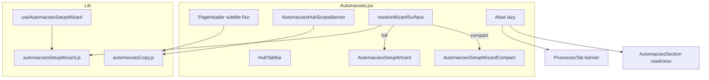

# Automações — UX, avisos visuais e onboarding (TECH)

**Data:** 2026-06-16  
**Status:** implementado (2026-06-16)  
**PRODUCT:** [2026-06-16-automacoes-ux-onboarding-PRODUCT.md](./2026-06-16-automacoes-ux-onboarding-PRODUCT.md)

---

## Escopo

Refatorar copy, banners e comportamento do wizard em `/automacoes` sem alterar backend de automações. Entregas por fase conforme PRODUCT (P0 → P2).

**Dependências no código:**

- `src/pages/Automacoes.jsx` — orquestração hub, subtitle, wizard compact/full
- `src/lib/automacoesHub.js` — tabs, hints (migrar para `AUTOMACOES_COPY` ou manter hints só para banners)
- `src/lib/automacoesSetupWizard.js` — `shouldShowSetupWizardOnTab`, critério modelos
- `src/components/academy/AutomacoesSetupWizard.jsx` — full wizard
- `src/hooks/useAutomacoesSetupWizard.js`
- `src/pages/AutomacoesProcessosTab.jsx` — remover parágrafo; banner
- `src/components/academy/AutomacoesSection.jsx` — readiness sempre visível
- `src/lib/naviMenu.js` — label menu
- `src/styles/pipeline.css` — wizard + compact
- `src/components/shared/StatusBanner.jsx` — primitivo de aviso

---

## Decisões

| # | Decisão | Escolha | Motivo |
|---|---------|---------|--------|
| Q1 | Subtitle do hub | Fixo (`hub.subtitle`) | Evita contradição aba × wizard |
| Q2 | Wizard em `processos` | Componente `AutomacoesSetupWizardCompact` | Separação visual; menos peso |
| Q3 | `shouldShowSetupWizardOnTab` | Renomear / split: `resolveWizardSurface({ step, tab, forceWizard })` → `'full' \| 'compact' \| 'hidden'` | Testável; substitui boolean |
| Q4 | CTA Agente IA | `btn-secondary` + hint | DESIGN_SYSTEM: primário verde = accent global, não “sair do fluxo” |
| Q5 | Modelos “visitado” | `localStorage` `navi_automacoes_modelos_ack_{academyId}` | Checkbox “Revisei” sem API |
| Q6 | Scope banner | Sempre visível v1 | Educacional; dispensar é P3 se necessário |
| Q7 | Copy centralizada | `src/lib/automacoesCopy.js` export const | Uma fonte para testes e UI |
| Q8 | CSS compact | Mesmo arquivo `pipeline.css` | Padrão wizard existente |

---

## Arquitetura



---

## Fase 0 — Arquivos

### Novos

| Arquivo | Responsabilidade |
|---------|------------------|
| `src/lib/automacoesCopy.js` | Strings do copy deck PRODUCT |
| `src/components/academy/AutomacoesHubScopeBanner.jsx` | `StatusBanner info` hub |
| `src/components/academy/AutomacoesSetupWizardCompact.jsx` | Faixa 1 linha + CTA texto |
| `src/components/academy/AutomacoesTabIntroBanner.jsx` | Banner `info`/`warning` por aba (props: `tabId`, `zapsterOk`) |

### Alterados

| Arquivo | Mudança |
|---------|---------|
| `Automacoes.jsx` | Subtitle fixo; scope banner; `resolveWizardSurface`; render compact/full |
| `automacoesSetupWizard.js` | `resolveWizardSurface`; ajustar `shouldShowSetupWizardOnTab` (deprecated alias) |
| `AutomacoesSetupWizard.jsx` | Passos clicáveis (Fase 1); CTA secundário passo WA; progress bar (Fase 2); copy |
| `AutomacoesProcessosTab.jsx` | `AutomacoesTabIntroBanner` em vez de `<p>` |
| `AutomacoesModelosTab.jsx` | Checkbox “Revisei os modelos” + persist ack (Fase 1) |
| `AutomacoesSection.jsx` | Remover guard `setupGuideActive` no readiness; banner WA offline |
| `naviMenu.js` | Label `Tarefas da equipe` |
| `automacoes-funil.md` | Metadados, mapa telas, checklist |
| `pipeline.css` | `.automacoes-setup-wizard--compact`, progress bar |

---

## `resolveWizardSurface` (outline)

```js
/**
 * @param {{ currentStep: object; activeTab: string; forceWizard?: boolean; wizardShow?: boolean }}
 * @returns {'hidden' | 'full' | 'compact'}
 */
export function resolveWizardSurface({ currentStep, activeTab, forceWizard = false, wizardShow = true }) {
  if (!wizardShow || !currentStep) return 'hidden';
  if (forceWizard) return 'full';

  const onProcessos = activeTab === 'processos';
  const stepTab = currentStep.tab || null;
  const isExternal = Boolean(currentStep.path);

  if (onProcessos) {
    // Na trilha equipe: nunca card full (salvo forceWizard acima)
    return 'compact';
  }

  if (isExternal) {
    // Passo WhatsApp em abas modelos/config: full
    return 'full';
  }

  if (stepTab === activeTab) return 'full';

  // Ex.: passo modelos enquanto usuário está em configuracoes
  return 'hidden';
}
```

**Migrar testes** em `automacoesSetupWizard.test.js`:

```js
it('processos + passo whatsapp → compact', () => {
  const step = AUTOMACOES_WIZARD_STEPS.find((s) => s.id === 'whatsapp');
  expect(resolveWizardSurface({ currentStep: step, activeTab: 'processos', wizardShow: true }))
    .toBe('compact');
});

it('?wizard=1 força full em processos', () => {
  expect(resolveWizardSurface({
    currentStep: step,
    activeTab: 'processos',
    forceWizard: true,
    wizardShow: true,
  })).toBe('full');
});
```

---

## `AutomacoesSetupWizardCompact`

Props mínimas:

```ts
{
  message: string;
  ctaLabel: string;
  onCta: () => void;
  onDismiss?: () => void; // opcional: esconder só compact, não wizard inteiro
}
```

Markup sugerido:

```jsx
<div className="automacoes-setup-wizard automacoes-setup-wizard--compact" role="status">
  <Info size={18} aria-hidden />
  <p className="automacoes-setup-wizard__compact-text">{message}</p>
  <button type="button" className="edit-link" onClick={onCta}>{ctaLabel}</button>
</div>
```

Mensagem derivada em `Automacoes.jsx`:

| `currentStep.id` | `message` (copy) | `onCta` |
|------------------|------------------|---------|
| `modelos` | Falta revisar modelos para o funil. | `requestTab('modelos')` |
| `whatsapp` | `wizard.compact.processos` | `navigate('/agente-ia')` ou abrir full em modelos — **preferir** `requestTab('modelos')` + `?wizard=1` para full |
| `configuracoes` | Falta ativar gatilhos automáticos. | `requestTab('configuracoes')` |

**Nota:** para passo WhatsApp no compact, CTA pode ser “Continuar configuração” → `setSearchParams({ tab: 'modelos', wizard: '1' })` para usuário ver wizard full em contexto WA; evita saída abrupta da aba Processos.

---

## `AutomacoesHubScopeBanner`

```jsx
import StatusBanner from '../shared/StatusBanner.jsx';
import { AUTOMACOES_COPY } from '../../lib/automacoesCopy.js';

export default function AutomacoesHubScopeBanner() {
  return (
    <StatusBanner variant="info" className="automacoes-hub-scope-banner mb-3">
      {AUTOMACOES_COPY.hub.scopeBannerRich} {/* JSX com <strong> Equipe / WhatsApp */}
    </StatusBanner>
  );
}
```

`scopeBannerRich` pode ser fragmento React exportado de `automacoesCopy.js` para negrito sem `dangerouslySetInnerHTML`.

---

## Passo Modelos — ack explícito (Fase 1)

### Storage

```js
export function automacoesModelosAckStorageKey(academyId) {
  return `navi_automacoes_modelos_ack_${String(academyId || '').trim()}`;
}
```

### `isModelosWizardStepDone`

```js
export function isModelosWizardStepDone({ templatesMap, modelosAcknowledged }) {
  return areTemplatesCustomized(templatesMap) || Boolean(modelosAcknowledged);
}
```

**Deprecar** `modelosTabVisited` para progresso do wizard (pode permanecer para analytics se necessário, mas não conclui passo).

### UI em `AutomacoesModelosTab`

- Checkbox + label `wizard.modelos.confirm` acima da lista de templates.
- Ao marcar: `writeModelosAck(academyId)`.
- Desmarcar ao salvar template customizado (opcional) — se customizado, ack redundante.

---

## Wizard full — passos clicáveis (Fase 1)

Em `AutomacoesSetupWizard.jsx`:

```jsx
<button
  type="button"
  className="automacoes-setup-wizard__step-btn"
  onClick={() => onStepAction(step.id)}
  aria-current={isCurrent ? 'step' : undefined}
  disabled={false}
>
  {/* ícone + label */}
</button>
```

CSS: reset botão (`background: none; border: none; font: inherit; cursor: pointer`), hover em passo não-done.

Passo WhatsApp no click: `onStepAction('whatsapp')` → `navigate('/agente-ia')` (já em `handleWizardStepAction`).

---

## CTA passo WhatsApp (Fase 0)

```jsx
<p className="automacoes-setup-wizard__panel-desc">{currentStep.description}</p>
<p className="text-xs text-muted automacoes-setup-wizard__external-hint">
  {AUTOMACOES_COPY.wizard.whatsapp.ctaHint}
</p>
<button type="button" className="btn-secondary" onClick={...}>
  <ExternalLink size={16} aria-hidden />
  {resolveWizardCtaLabel(currentStep, activeTab)}
</button>
```

---

## `AutomacoesSection` — readiness

Remover:

```jsx
{!setupGuideActive ? <AutomacoesReadinessBanner ... /> : null}
```

Substituir por sempre renderizar; opcionalmente `className="mt-3"` quando `setupGuideActive`.

Adicionar antes do readiness, se `!readiness.zapsterOk && canEdit`:

```jsx
<StatusBanner variant="warning" className="mb-3">
  {AUTOMACOES_COPY.readiness.zapster.offline}{' '}
  <Link to="/agente-ia" className="edit-link">Abrir Agente IA</Link>
</StatusBanner>
```

Evitar duplicar link se readiness step zapster já mostra — **ou** unificar só no readiness banner (preferir uma única superfície warning).

---

## CSS (`pipeline.css`)

```css
.automacoes-setup-wizard--compact {
  display: flex;
  align-items: center;
  gap: 10px;
  padding: 10px 14px;
  margin-top: 12px;
  margin-bottom: 12px;
  border-radius: 10px;
  border: 1px solid var(--border-light);
  background: var(--surface);
  /* sem gradiente roxo */
}

.automacoes-setup-wizard__compact-text {
  margin: 0;
  flex: 1;
  font-size: var(--font-sm);
  line-height: 1.45;
  color: var(--text-secondary);
}

.automacoes-setup-wizard__progress-bar {
  height: 4px;
  border-radius: 2px;
  background: var(--color-primary-surface);
  margin-bottom: 12px;
  overflow: hidden;
}

.automacoes-setup-wizard__progress-bar-fill {
  height: 100%;
  background: var(--color-primary);
  transition: width 0.2s ease;
}

.automacoes-setup-wizard__step-btn {
  display: inline-flex;
  align-items: center;
  gap: 8px;
  padding: 4px 6px;
  margin: -4px -6px;
  border: none;
  border-radius: 8px;
  background: transparent;
  font: inherit;
  font-size: var(--font-sm);
  color: inherit;
  cursor: pointer;
}

.automacoes-setup-wizard__step-btn:hover {
  background: var(--surface-hover);
}

.automacoes-hub-scope-banner .navi-status-banner__message {
  line-height: 1.5;
}
```

---

## `automacoesCopy.js` (estrutura)

```js
export const AUTOMACOES_COPY = {
  hub: {
    subtitle: 'Tarefas internas da equipe e mensagens automáticas no WhatsApp do funil.',
  },
  tab: {
    processos: { banner: '...' },
    modelos: { hint: '...' },
    configuracoes: { hint: '...' },
  },
  wizard: {
    eyebrow: 'Configurar mensagens automáticas',
    title: 'Três passos para o funil enviar WhatsApp',
    // ...
  },
};
```

Manter `AUTOMACOES_TAB_HINTS` como alias deprecated → apontar para `AUTOMACOES_COPY.tab.*` até remover referências.

---

## Testes

| Arquivo | Casos novos |
|---------|-------------|
| `automacoesSetupWizard.test.js` | `resolveWizardSurface` matriz; modelos ack; sem `modelosTabVisited` done |
| `automacoesHub.test.js` (criar se não existir) | copy keys presentes |
| `automationUx.test.js` | sem mudança esperada |

Comando harness:

```bash
npm test -- automacoesSetupWizard automacoesHub automationUx
```

---

## Ordem de implementação sugerida

1. `automacoesCopy.js` + hub subtitle + scope banner (P0 visual imediato).
2. `resolveWizardSurface` + compact component + testes.
3. CTA secundário WhatsApp + remover parágrafo Processos.
4. Menu label + fluxo doc.
5. Modelos ack + passos clicáveis + readiness guard.
6. Progress bar + polish CSS.

---

## Riscos

| Risco | Mitigação |
|-------|-----------|
| Usuários com `modelosTabVisited` já true mas sem ack | Wizard recalcula; passo modelos pode reabrir até ack ou customize — aceitável one-time |
| `?wizard=1` em processos mostra full grande | Documentado; só onboarding forçado |
| Mais banners = clutter | Regra máx. 2 empilhados; omitir hint modelos se wizard full visível |

---

## Fora de escopo técnico

- API / `automations_config`
- Cron / Zapster
- Novos arquivos em `/api/`
