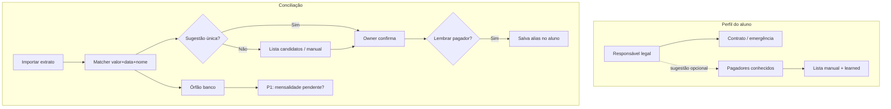

# Conciliação — Pagadores conhecidos e matching por nome no extrato

**Data:** 2026-06-16  
**Status:** P0a implementado (2026-06-16) · P0b implementado (2026-06-16) · P1 implementado (2026-06-16)  
**Contexto:** extensão de [conciliação bancária](../../flows/financeiro/conciliacao-bancaria.md) e análise de eficiência para academias de jiu-jitsu (mensalidades PIX, famílias, valores repetidos)  
**TECH:** [2026-06-16-conciliacao-pagadores-conhecidos-TECH.md](./2026-06-16-conciliacao-pagadores-conhecidos-TECH.md)

**Fluxos relacionados:**

- [conciliacao-bancaria.md](../../flows/financeiro/conciliacao-bancaria.md)
- [a-receber-mensalidades.md](../../flows/financeiro/a-receber-mensalidades.md)
- [crm/aluno-perfil-presenca.md](../../flows/crm/aluno-perfil-presenca.md) (perfil do aluno)

**Specs relacionadas:**

- [2026-06-15-conciliacao-multi-formato-PRODUCT.md](./2026-06-15-conciliacao-multi-formato-PRODUCT.md)
- [2026-06-15-conciliacao-ux-refactor-PRODUCT.md](./2026-06-15-conciliacao-ux-refactor-PRODUCT.md)
- [2026-06-16-conciliacao-deduplicacao-extratos-PRODUCT.md](./2026-06-16-conciliacao-deduplicacao-extratos-PRODUCT.md)

---

## Problema

Na conciliação bancária, o Nave sugere vínculos entre linhas do extrato e lançamentos liquidados usando **valor, data (±3 dias), direção e conta bancária**. O texto do extrato (`description` — ex.: `PIX RECEBIDO - JOSE SANTOS`) é exibido na UI, mas **não influencia o score de match**.

Em academias de jiu-jitsu isso gera atrito recorrente:

1. **Responsável ≠ pagador** — o campo `responsavel` alimenta contrato e contato de emergência, mas quem paga o PIX pode ser outra pessoa (mãe cadastra, pai paga; avó paga um mês).
2. **Valores repetidos** — dezenas de alunos no mesmo plano geram lançamentos com o mesmo valor no mesmo período; sem nome, a sugestão pode apontar para o aluno errado.
3. **Nome do aluno ausente na sugestão** — o espelho de mensalidade grava `planName` / `Mensalidade YYYY-MM`, não o nome do aluno; o owner precisa adivinhar na hora de confirmar.
4. **PIX sem registro na recepção** — linha no banco sem lançamento correspondente; hoje não há sugestão cruzada com mensalidades pendentes do mês.

**Quem é afetado:** owner na aba Conciliação; indiretamente recepção (menos retrabalho quando o dono questiona “de quem é esse PIX?”).

**Custo de não resolver:** conciliação lenta, confirmações erradas ocasionais, abandono da feature em favor de planilha paralela.

---

## Conceitos (separação obrigatória)

| Conceito | Significado | Onde vive hoje | Uso nesta feature |
|----------|-------------|----------------|-------------------|
| **Aluno** | Quem treina | `leads.name` | Candidato de match textual |
| **Responsável** | Quem representa legalmente / assina contrato | `student.responsavel`, `nome_responsavel` no contrato | Candidato de match, **não** substituto de pagador |
| **Pagador conhecido** | Nome(s) que costumam aparecer no extrato ao pagar por este aluno | **Novo** | Lista editável + aliases aprendidos |
| **Alias aprendido** | Nome extraído do extrato após confirmação manual | **Novo** (derivado) | Memória para próximos meses |

**Invariante de produto:** nunca sobrescrever nem reinterpretar `responsavel` como “quem paga”. Contratos e emergência permanecem intactos.

---

## Goals

1. Reduzir linhas “sem correspondência” e sugestões ambíguas em extratos com muitos PIX de mensalidade.
2. Permitir **vários pagadores por aluno** (pai, mãe, próprio aluno, avós) sem conflitar com o responsável legal.
3. **Aprender** nomes do extrato quando o owner confirma um vínculo manual — sem exigir cadastro completo na matrícula.
4. Tornar sugestões **legíveis**: nome do aluno + plano/mês, não só nome do plano.
5. Manter **confirmação humana** em todos os vínculos (sem auto-match silencioso na v1).

---

## Non-Goals

- Substituir `responsavel` ou fundir “pagador” com “responsável legal”.
- PIX automático / Open Finance / webhook de banco (feature futura separada).
- Auto-conciliar sem clique do owner (mesmo com score 100).
- Matching fuzzy agressivo que associe nomes parecidos de pessoas diferentes sem confirmação.
- Conciliação de despesas por CNPJ de fornecedor (escopo futuro: aliases de fornecedor em lançamentos recorrentes).
- Retreinar extratos já conciliados para regravar aliases em massa.
- Nova Serverless Function em `/api/` (regra Hobby: rotas em `api/finance.js?route=`).

---

## Personas e user stories

### Owner (conciliação)

**US-1**  
Como owner, ao importar o extrato quero que PIX com nome reconhecido sugira o lançamento do **aluno certo**, para não confirmar vínculo errado entre três mensalidades de R$ 200.

**US-2**  
Como owner, ao vincular manualmente uma linha `"PIX JOSE SANTOS"` ao aluno Pedro, quero que o sistema **ofereça salvar** “José Santos” como pagador de Pedro, para o próximo mês já vir sugerido.

**US-3**  
Como owner, nas sugestões quero ver **“Pedro Santos — Plano Kids — Jun/2026”**, não só “Plano Kids”.

**US-4**  
Como owner, para uma linha órfã no banco quero ver candidatos entre **mensalidades pendentes** do mês com valor compatível, para registrar o pagamento certo sem abrir a grade à parte.

### Recepção / admin (cadastro)

**US-5**  
Como recepção, no perfil do aluno quero adicionar **pagadores conhecidos** (opcional) além do responsável, para ajudar o dono na conciliação sem alterar o contrato.

**US-6**  
Como recepção, ao cadastrar criança com responsável preenchido, quero que o responsável apareça como **sugestão** de primeiro pagador (editável/removível), sem obrigar que seja quem paga.

### Edge cases

- Nome truncado no banco (`JOSE S DOS SA`) deve ainda dar match razoável após um alias salvo.
- Dois alunos diferentes com pagador homônimo → nunca auto-resolver; exigir escolha humana e não salvar alias global da academia.
- Aluno adulto paga em nome próprio diferente do cadastro (apelido, nome social não refletido no banco) → alias manual resolve.
- Linha de débito (despesa) → pagadores de aluno **não** aplicam; escopo v1 é crédito / recebimento.

---

## Requisitos

### P0 — Mínimo viável (entrega em duas fatias)

#### Fatia P0a — Legibilidade (sem schema novo)

**R-1: Enriquecer lançamentos na conciliação com nome do aluno**  
Em `handleDetail` / `listTxForMatching`, incluir `lead_name` (reutilizar `enrichTransactionsWithLeadNames`). Labels de sugestão e seletor manual:  
`{lead_name} — {planName ou categoria} — {competence_month formatado}`.

**R-2: Espelho de mensalidade mais descritivo**  
Ao espelhar `student_payment` → `FINANCIAL_TX`, se houver `lead_id` e nome do aluno disponível:  
- `planName` preferencial: `"{Nome do aluno} — {nome do plano}"`  
- `note` mantém `Mensalidade YYYY-MM` ou nota do operador; não remover metadados existentes.

**R-3: Exibir motivo da sugestão (quando houver match por nome)**  
Na linha de sugestão, badge ou texto secundário: `Nome no extrato compatível` quando o score textual tiver contribuído (prepara P0b; na P0a pode ficar só o label melhorado).

**Critério:** zero migração de dados; deploy independente.

#### Fatia P0b — Pagadores e matcher textual

**R-4: Modelo “pagadores conhecidos” por aluno**  
Por `lead_id` / academia:

| Campo | Tipo | Regras |
|-------|------|--------|
| `payer_aliases` | lista de strings (máx. 10 por aluno) | Nomes normalizados para busca; exibição preserva forma digitada |
| `source` | `manual` \| `learned` \| `from_responsavel` | Rastreio de origem |
| `learned_at` | ISO opcional | Só para `learned` |

Armazenamento: preferir JSON no documento do aluno (`students` / lead) ou coleção filha tenant-scoped — decisão em TECH. Limite 10 aliases por aluno; UI avisa ao atingir.

**R-5: UI no perfil do aluno**  
Seção **“Quem costuma pagar”** (aba dados / financeiro do perfil):

- Lista editável de nomes (adicionar / remover).
- Hint: “Nomes que aparecem no extrato do banco. O responsável do contrato pode ser diferente.”
- Botão “Usar responsável como pagador” (pré-preenche um item, não vincula os campos).
- Não exibir CPF do pagador na v1 (só nome).

**R-6: Aprendizado na conciliação**  
Ao `confirmBankMatch` ou `manualReconcileTx` bem-sucedido, se a `description` do item tiver texto extraível de pagador (ver TECH) e o TX tiver `lead_id`:

- `ConfirmDialog` opcional (checkbox marcado por padrão):  
  **“Lembrar ‘{nome extraído}’ como pagador de {lead_name}?”**
- Se confirmado: append em `payer_aliases` com `source: learned` se ainda não existir (comparação normalizada).
- Se recusado: não perguntar de novo para o mesmo par `(lead_id, alias_normalizado)` na mesma sessão; pode perguntar em conciliações futuras.

**R-7: Bônus de score por texto no matcher**  
Estender `scoreBankItemToTx`:

1. Extrair tokens da `description` do item (normalizar acentos, maiúsculas, remover ruído `PIX`, `TED`, etc.).
2. Comparar com: `lead_name`, `responsavel` (se lead menor ou sempre como candidato fraco), cada `payer_alias` do aluno.
3. Se match forte de nome **e** valor/data já passam no critério atual → score até **100**; nome desempata entre TXs de mesmo valor/data.
4. Se só nome bate mas valor/data não → **não** sugerir (score 0).
5. Múltiplos TXs com mesmo valor/data + nomes diferentes → retornar o de maior score textual; se empate → **sem sugestão única** (lista de candidatos na UI — ver R-8).

**R-8: Ambiguidade explícita**  
Quando ≥2 TXs tiverem score ≥ limiar e diferença &lt; 5 pontos: não preencher `suggested_tx_id` único; UI mostra “Vários candidatos” com lista ranqueada (nome do aluno + valor + data).

**R-9: Escopo de crédito**  
Matching textual de pagador aplica-se a `direction === 'credit'` e TX de entrada (`direction in`). Débitos fora do escopo v1.

### P1 — Eficiência operacional

**R-10: Sugestão extrato → mensalidade pendente**  
Para item `unmatched` crédito, buscar `student_payments` do mês (`reference_month` do período do extrato) com status `pending` / `awaiting` e valor esperado compatível (±2 centavos). Exibir bloco **“Possível mensalidade não registrada”** com aluno, mês e CTA **“Registrar pagamento e conciliar”** (abre fluxo mínimo: confirma método PIX, conta, data do extrato → cria payment + mirror + vínculo).

**R-11: Busca no seletor manual por pagador**  
`SearchableSelect` de lançamentos: buscar também em `lead_name`, `responsavel` e aliases (server-side ou índice client após load).

**R-12: Indicador de confiança refinado**  
Substituir “N% confiança” por rótulos: `Alta (valor + data + nome)`, `Média (valor + data)`, `Baixa (só valor aproximado)`.

### P2 — Futuro

**R-13: Aliases de fornecedor** em templates de recorrência (aluguel, professor).  
**R-14: Import em lote de pagadores** via planilha no perfil / migração.  
**R-15: Sugestão ao registrar pagamento na recepção** — “Este PIX costuma vir no nome de José Santos; deseja adicionar?”

---

## Fluxos de UI (resumo)

---

## Critérios de aceitação

### P0a — Labels

- [ ] Dado lançamento de mensalidade com `lead_id` Pedro Santos  
- [ ] Quando o owner abre o detalhe do extrato  
- [ ] Então a sugestão exibe “Pedro Santos — …” e o link para `/student/{id}` permanece

### P0b — Mãe cadastra, pai paga

- [ ] Dado aluno Pedro, responsável Maria, sem pagadores cadastrados  
- [ ] Quando o owner vincula manualmente linha `PIX JOSE SANTOS` R$ 180 ao lançamento de Pedro  
- [ ] E confirma “Lembrar pagador”  
- [ ] Então `payer_aliases` de Pedro inclui “José Santos” (`learned`)  
- [ ] E `responsavel` continua “Maria”

### P0b — Próximo mês

- [ ] Dado alias `José Santos` em Pedro e novo extrato com mesma descrição e valor compatível  
- [ ] Quando o owner abre sugestões  
- [ ] Então Pedro é o candidato principal (score maior que outro aluno mesmo valor/data sem alias)

### P0b — Valores repetidos sem nome

- [ ] Dado três alunos plano R$ 200 mesmo dia, extrato `PIX RECEBIDO` sem nome identificável  
- [ ] Então nenhum recebe sugestão única automática (ou empate tratado como R-8)  
- [ ] E o owner escolhe manualmente sem alias incorreto gravado

### P0b — Limite e duplicata

- [ ] Dado 10 aliases já cadastrados  
- [ ] Quando tenta adicionar o 11º  
- [ ] Então UI bloqueia com mensagem clara

### Regressão

- [ ] Confirmar match continua exigindo TX `settled`  
- [ ] Deduplicação entre extratos ([spec dedup](./2026-06-16-conciliacao-deduplicacao-extratos-PRODUCT.md)) inalterada  
- [ ] Admin/member sem acesso à aba Conciliação

---

## Métricas de sucesso

| Métrica | Linha de base | Alvo (60 dias pós P0b) | Como medir |
|---------|---------------|------------------------|------------|
| % linhas com sugestão no import | medir atual | +25% em academias com &gt;30 alunos | `suggested_tx_id` / total itens crédito |
| % confirmações sem troca manual de TX | — | ≥ 70% das sugestões aceitas como vieram | eventos confirm vs manual override |
| Tempo médio até `completeBankReconciliation` | — | −30% | delta import → complete |
| Aliases aprendidos por academia/mês | 0 | ≥ 5 em academias ativas | contagem `source: learned` |
| Erros de vínculo reportados | — | sem aumento | suporte / owner feedback |

---

## Feedback e copy (pt-BR)

Seguir [docs/ux-feedback.md](../../ux-feedback.md):

- `useToast` ao salvar pagador aprendido: “Pagador ‘José Santos’ associado a Pedro Santos.”
- `ConfirmDialog` para lembrar pagador (não `window.confirm`).
- Hint no perfil: tom educativo, sem culpar o operador (“É comum o pai ou a mãe pagar em nome diferente do responsável do contrato.”).

---

## Dependências e riscos

| Item | Notas |
|------|--------|
| `bankReconciliationMatcher.js` | Alteração de score — exige testes unitários extensivos |
| `financeTxLeadEnrichment.js` | Já existe; wire na conciliação |
| Schema aluno | Novo campo ou coleção — provision script Appwrite |
| Limite 12 functions Vercel | Endpoints em `api/finance.js?route=` |
| Privacidade | Nomes em aliases são PII; escopo por `academy_id`; não exportar em CSV público sem revisão |
| Falso positivo homônimos | Mitigação: aprendizado só após confirmação; ambiguidade R-8 |

---

## Perguntas em aberto

| # | Pergunta | Dono | Bloqueante? |
|---|----------|------|-------------|
| Q1 | Aliases no documento `students` vs coleção `student_payer_aliases`? | Eng | **Resolvido:** `students.payer_aliases_json` — ver TECH |
| Q2 | Extrair nome do pagador: regex por banco ou lista de prefixos (`PIX`, `TED`, `TRANSF`)? | Eng | **Resolvido:** `bankStatementPayerName.js` — ver TECH |
| Q3 | P0a pode ir para produção antes de P0b? | Produto | Não — recomendado sim |
| Q4 | Recepção edita pagadores ou só owner/admin? | Produto | Sim para UI |
| Q5 | P1 “registrar e conciliar” pode ser só deep link para mensalidades com prefill? | Produto | Não |

---

## Estimativa de esforço (ordem de grandeza)

| Fase | Escopo | Estimativa |
|------|--------|-----------|
| P0a | Enriquecimento + labels espelho | ~4h |
| P0b | Schema + perfil + matcher + aprendizado | ~12–16h |
| P1 | Mensalidade pendente + busca + confiança | ~8–10h |
| Testes | matcher, handler, UI perfil, e2e conciliação | ~6h |

---

## Histórico

| Data | Autor | Mudança |
|------|-------|---------|
| 2026-06-16 | — | Criação a partir de análise de conciliação para academias de jiu-jitsu |
