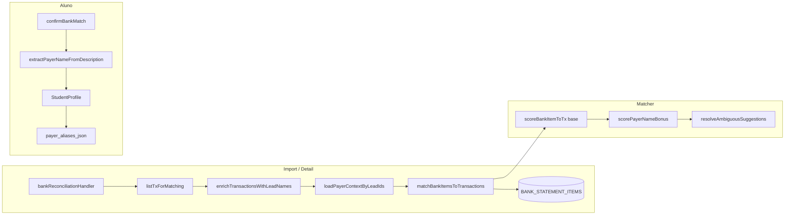

# Conciliação — Pagadores conhecidos (TECH)

**Data:** 2026-06-16  
**Status:** P0a implementado (2026-06-16) · P0b implementado (2026-06-16) · P1 implementado (2026-06-16)  
**PRODUCT:** [2026-06-16-conciliacao-pagadores-conhecidos-PRODUCT.md](./2026-06-16-conciliacao-pagadores-conhecidos-PRODUCT.md)

---

## Escopo

Implementar matching textual extrato ↔ lançamentos (recebimentos), cadastro de **pagadores conhecidos** por aluno, aprendizado pós-confirmação e melhorias de legibilidade na conciliação. Sem nova Serverless Function; sem auto-match sem confirmação humana.

**Fases:** P0a (labels, sem schema) → P0b (aliases + matcher) → P1 (mensalidade pendente + UX).

---

## Decisões (PRODUCT Q1–Q5 resolvidas)

| # | Decisão | Escolha | Motivo |
|---|---------|---------|--------|
| Q1 | Onde persistir aliases | `students.payer_aliases_json` (string JSON, máx. 4096) | ≤10 entradas/aluno; mesmo padrão de `custom_answers_json`; sem coleção nova; isolamento por `academyId` do aluno |
| Q2 | Extração de nome no extrato | Módulo determinístico `bankStatementPayerName.js` (prefixos + heurística) | Sem LLM no hot path; testável; PDF/OFX já normalizam `description` |
| Q3 | Deploy P0a antes P0b | **Sim** | PR1 só enriquecimento; PR2 schema + matcher |
| Q4 | Quem edita pagadores | member, admin, owner (mesmo perfil do aluno) | Consistente com `responsavel` / dados cadastrais |
| Q5 | P1 registrar + conciliar | Deep link para mensalidades com prefill (`NL_PAYMENT_PREFILL_EVENT` ou query `?student=&month=&amount=`) + retorno à conciliação | Evita modal duplicado na v1 |

---

## Arquitetura



---

## Modelo de dados

### `students.payer_aliases_json`

String JSON (Appwrite `string`, size **4096**). Array de objetos:

```ts
type PayerAliasSource = 'manual' | 'learned' | 'from_responsavel';

type PayerAlias = {
  display: string;       // forma exibida na UI, máx. 128
  normalized: string;  // chave de dedupe, gerada server-side
  source: PayerAliasSource;
  learned_at?: string;   // ISO, só learned
};

type PayerAliasesDoc = PayerAlias[]; // máx. 10 itens
```

**Regras server (`src/lib/studentPayerAliases.js`):**

- `normalizePayerName(s)` — NFD, remove acentos, uppercase, colapsa espaços, remove pontuação exceto espaço.
- `dedupeKey(normalized)` — string estável para comparar alias vs extrato.
- `parsePayerAliasesJson(raw)` — tolerante a `null` / `[]` / JSON inválido → `[]`.
- `appendPayerAlias(existing, { display, source })` — rejeita 11º item; se `normalized` já existe, atualiza `source` apenas se `manual` > `from_responsavel` > `learned`.
- `serializePayerAliases(aliases)` — `JSON.stringify` truncado a 4096.

**Provision:** adicionar em `scripts/verify-and-fix-schema-crm.mjs` → `STUDENTS_ATTRS`:

```js
{ key: 'payer_aliases_json', type: 'string', size: 4096 },
```

Também incluir `responsavel` e `cpf_responsavel` no manifest se ainda ausentes (já usados em runtime via `OPTIONAL_STUDENT_PATCH_ATTRS`).

### Contexto de pagador para matching

```ts
type PayerMatchContext = {
  lead_id: string;
  lead_name: string;
  responsavel: string;
  payer_aliases: PayerAlias[];
};
```

Carregado em batch por `lead_id` únicos do pool de TXs do período.

---

## Módulos novos

| Arquivo | Responsabilidade |
|---------|------------------|
| `src/lib/studentPayerAliases.js` | parse/serialize/normalize/append; **sem** import Appwrite |
| `lib/server/bankStatementPayerName.js` | `extractPayerNameFromDescription`, `scorePayerNameMatch` |
| `lib/server/studentPayerContext.js` | `loadPayerContextByLeadIds(databases, academyId, leadIds)` |
| `src/lib/financeReconTxLabel.js` | `formatReconTxLabel(tx)` → string UI |
| `src/components/student/StudentPayerAliasesSection.jsx` | UI lista pagadores no perfil |
| `src/test/studentPayerAliases.test.js` | normalização, limite 10, dedupe |
| `src/test/bankStatementPayerName.test.js` | extração + score textual |
| `tests/unit/finance/bankReconciliationMatcher.payer.test.js` | matcher integrado |

---

## Extração de nome (`bankStatementPayerName.js`)

### `extractPayerNameFromDescription(description)`

1. `raw = trim(description).slice(0, 512)`
2. Remover prefixos case-insensitive (repetir até estável):

   `PIX`, `PIX RECEBIDO`, `PIX ENVIADO`, `TED`, `DOC`, `TRANSFERENCIA`, `TRANSF`, `RECEBIMENTO`, `CREDITO`, `CRÉDITO`, `DEPOSITO`, `DEPÓSITO`, `TARIFA`, `TAXA`, `SISPAG`, `PAGAMENTO`

3. Remover sufixos numéricos/CNPJ/CPF parcial (`\d{2}\.\d{3}\.\d{3}` etc.) e tokens só dígitos.
4. Se resto &lt; 3 caracteres ou só números → `null`.
5. Capitalizar para display (`titleCasePt` simples); retornar `{ display, normalized }`.

### `scorePayerNameMatch(description, context: PayerMatchContext | null)`

Retorna `0 | 15 | 25 | 35` (bônus, não score isolado):

| Condição | Bônus |
|----------|-------|
| `normalized` do extrato igual a alias `normalized` (`learned` ou `manual`) | **35** |
| Igual a `normalizePayerName(lead_name)` | **25** |
| Igual a `normalizePayerName(responsavel)` | **15** |
| `normalized` extrato **contém** alias normalized ≥ 8 chars (truncamento banco) | **30** |
| Token overlap ≥ 2 tokens significativos (≥3 chars) com `lead_name` ou alias | **20** |

Se múltiplas regras batem, usar o **maior** bônus.

**Escopo:** só chamado quando `item.direction === 'credit'` e `txDirection(tx) === 'in'`.

---

## Matcher (`bankReconciliationMatcher.js`)

### Assinatura estendida

```js
export function scoreBankItemToTx(item, tx, payerContextByLeadId = null)

export function matchBankItemsToTransactions(
  items,
  transactions,
  { payerContextByLeadId = null } = {}
)
```

### Score composto

```js
const base = scoreBankItemToTxBase(item, tx); // lógica atual inalterada
if (base === 0) return { score: 0, base: 0, name_bonus: 0, match_tier: null };

const ctx = payerContextByLeadId?.get(tx.lead_id) || null;
const name_bonus =
  item.direction === 'credit' ? scorePayerNameMatch(item.description, ctx) : 0;

const score = Math.min(100, base + name_bonus);
const match_tier =
  name_bonus > 0 ? 'amount_date_name' :
  base >= 70 ? 'amount_date' :
  base >= 50 ? 'amount_approx' : null;

return { score, base, name_bonus, match_tier };
```

Refatorar `scoreBankItemToTx` atual para `scoreBankItemToTxBase` (privado no mesmo arquivo) para não quebrar testes existentes — export público mantém compatibilidade retornando só `number` ou passar a retornar objeto com wrapper.

**Recomendação:** export `scoreBankItemToTx` continua retornando `number` (score final); export adicional `scoreBankItemToTxDetailed` para testes e UI.

### Ambiguidade (R-8)

Constantes:

```js
export const BANK_MATCH_AMBIGUITY_DELTA = 5;
export const BANK_MATCH_MIN_CANDIDATES = 2;
```

Em `matchBankItemsToTransactions`, por item:

1. Calcular scores detalhados para todos TX elegíveis.
2. Ordenar desc por `score`.
3. Se `top.score < BANK_MATCH_SUGGEST_SCORE` → `unmatched`, sem sugestão.
4. `candidates = todos com score >= BANK_MATCH_SUGGEST_SCORE e top.score - score < BANK_MATCH_AMBIGUITY_DELTA`.
5. Se `candidates.length >= 2` **e** (`candidates[0].name_bonus === 0` **ou** empate no `lead_id` distinto):
   - `suggested_tx_id: null`
   - `suggested_tx_candidates: candidates.slice(0, 5).map(...)` 
6. Senão → `suggested_tx_id: candidates[0].tx.id` (comportamento atual).

**Importante:** `confirm-all` ignora itens sem `suggested_tx_id` único (já ignora ambíguos).

### Payload do item (API)

Estender resposta `handleDetail` / itens persistidos no import:

```js
{
  // existentes...
  match_tier: 'amount_date_name' | 'amount_date' | 'amount_approx' | null,
  suggested_tx_candidates: [{ tx_id, score, match_tier, lead_name }] | null,
}
```

Persistir em `BANK_STATEMENT_ITEMS` (opcional P0b):

- `match_tier` string 32
- `suggested_candidates_json` string 2048 (só se ambíguo; senão omitir)

Se atributo Appwrite desconhecido, degradar como hoje (`duplicate_of` pattern) — gravar só campos core.

---

## Backend — `bankReconciliationHandler.js`

### P0a

**`listTxForMatching`**

```js
import { enrichTransactionsWithLeadNames } from './financeTxLeadEnrichment.js';

// após .map(mapFinanceTxDoc)
const mapped = docs.map(...).filter(Boolean);
return enrichTransactionsWithLeadNames(databases, academyId, mapped);
```

**`studentPaymentFinancialTxMirror.js`**

```js
function buildMirrorPlanName({ studentName, planName, refMonth }) {
  const name = String(studentName || '').trim();
  const plan = String(planName || '').trim();
  if (name && plan) return `${name} — ${plan}`.slice(0, 256);
  if (name) return name.slice(0, 256);
  return plan || (refMonth ? `Mensalidade ${refMonth}` : 'Pagamento');
}
```

Resolver `studentName` de `studentDoc?.name` no `mirrorStudentPaymentToFinancialTx`.

### P0b

**`handleImport` / `handleDetail`**

```js
const naviTx = await listTxForMatching(...);
const leadIds = [...new Set(naviTx.map((t) => t.lead_id).filter(Boolean))];
const payerContextByLeadId = await loadPayerContextByLeadIds(databases, academyId, leadIds);
const matchResults = matchBankItemsToTransactions(matchInput, naviTx, { payerContextByLeadId });
```

**`loadPayerContextByLeadIds`** (`studentPayerContext.js`):

- Query `STUDENTS_COL` com `Query.equal('$id', chunk)` + `Query.equal('academyId', academyId)` em chunks de 100.
- Select: `$id`, `name`, `responsavel`, `payer_aliases_json`.
- Montar `Map<leadId, PayerMatchContext>`.

**`handleConfirmMatch` / `handleManualReconcile`**

Resposta 200 estendida:

```json
{
  "ok": true,
  "learn_payer": {
    "lead_id": "...",
    "lead_name": "Pedro Santos",
    "extracted_display": "José Santos",
    "extracted_normalized": "JOSE SANTOS",
    "already_known": false
  }
}
```

`learn_payer` omitido quando:

- sem `lead_id` no TX;
- `extractPayerNameFromDescription` retorna null;
- alias já existe (`already_known: true` — client pode pular dialog).

**Salvar alias** — novo body flag em confirm (opcional, idempotente):

```json
{ "item_id": "...", "transaction_id": "...", "remember_payer": true }
```

Se `remember_payer === true` e `learn_payer` válido:

- `appendPayerAlias` + `updateDocument` em `STUDENTS_COL` com strip unknown fallback.
- Validar `assertOrRepairStudentInAcademy` antes de gravar.

Alternativa: endpoint separado `POST ...?route=remember-payer` — **não preferido** (extra round-trip); flag no confirm é suficiente.

### Rotas (sem nova function)

Tudo em `bankReconciliationHandler` via rewrite existente `/api/bank-reconciliation`:

| route | Mudança |
|-------|---------|
| `detail` | TX enriquecidos; itens com `match_tier`, `suggested_tx_candidates` |
| `import` | matcher com payer context |
| `confirm-match` | `learn_payer` + `remember_payer` |
| `manual-reconcile` | idem |

---

## Frontend

### P0a — labels

| Arquivo | Mudança |
|---------|---------|
| `src/lib/financeReconTxLabel.js` | `formatReconTxLabel(tx)` |
| `src/components/finance/ReconciliationTab.jsx` | `txLabel()` usa helper |
| `src/components/finance/BankReconPairRow.jsx` | título Nave = `formatReconTxLabel(tx)`; badge tier (P0b) |

Formato:

```js
// "Pedro Santos — Plano Kids — Jun/2026"
// fallback: planName / category / "Lançamento"
```

`formatCompetenceMonth('2026-06')` → `Jun/2026` (reutilizar helper existente ou inline).

### P0b — perfil do aluno

| Arquivo | Mudança |
|---------|---------|
| `src/lib/mapAppwriteStudentDoc.js` | `payerAliases: parsePayerAliasesJson(doc.payer_aliases_json)` |
| `src/lib/studentAppwritePatch.js` | `payer_aliases_json` em optional attrs |
| `src/store/useStudentStore.js` | patch `payer_aliases_json` no save |
| `src/components/student/StudentPayerAliasesSection.jsx` | lista editável, hint, botão “Usar responsável” |
| `src/pages/StudentProfile.jsx` | inserir seção após responsável (aba dados) |

**`StudentPayerAliasesSection`:**

- Props: `aliases`, `responsavel`, `onChange`, `disabled`, `max=10`
- Adicionar: input + botão; lista com remover
- “Usar responsável”: chama `appendPayerAlias` client-side com `source: 'from_responsavel'` se não duplicado

### P0b — conciliação

| Arquivo | Mudança |
|---------|---------|
| `src/lib/bankReconciliationApi.js` | `confirmBankMatch(..., { remember_payer })` |
| `src/components/finance/ReconciliationTab.jsx` | após confirm: se `learn_payer` e não `already_known` → `ConfirmDialog` checkbox “Lembrar pagador…”; segundo request ou mesma request com `remember_payer: true` |
| `src/components/finance/BankReconPairRow.jsx` | se `suggested_tx_candidates?.length` → lista compacta em vez de par único; `match_tier` → copy: `Alta (valor + data + nome)` etc. |

**Sessão — não repetir dialog:**

```js
const dismissedLearnKeys = useRef(new Set()); // `${lead_id}:${normalized}`
```

### P1 — mensalidade pendente (outline)

Novo helper server `suggestPendingPaymentsForBankItem(academyId, item, statementPeriod)`:

- `reference_month` = mês do `item.date` (ou overlap com `period_start/end`).
- Query `student_payments`: `academy_id`, `reference_month`, `status in pending,awaiting`.
- Filtrar `expected_amount` ±0.02 vs `item.amount`.
- Enriquecer com nome + aliases; ranquear por nome se `description` presente.
- Retornar em `handleDetail` por item órfão: `pending_payment_hints: [{ payment_id, lead_id, lead_name, reference_month, expected_amount }]`.

UI: bloco em `BankReconPairRow` unmatched crédito com link:

`/financeiro?tab=a-receber&section=mensalidades&student={lead_id}&month={ref}`

(evento prefill existente se houver).

---

## Permissões

- Editar `payer_aliases_json`: mesma regra de update do aluno (`ensureAcademyAccess` + member+).
- Conciliação: continua **owner-only** (`requireOwner` em `bankReconciliationHandler`).
- Aprendizado (`remember_payer`): só owner (dentro do handler de conciliação).

---

## Testes

### Unitários obrigatórios

| Arquivo | Casos |
|---------|-------|
| `studentPayerAliases.test.js` | normalize; dedupe; max 10; parse inválido |
| `bankStatementPayerName.test.js` | `PIX RECEBIDO - JOSE SANTOS`; truncado; só ruído → null |
| `bankReconciliationMatcher.payer.test.js` | mesmo valor/data, 2 alunos, alias desempata; empate → candidates; débito sem bônus |
| `bankReconciliationHandler.test.js` | confirm retorna `learn_payer`; remember grava JSON |

### Integração

Estender `src/test/bankReconIntegration.test.jsx`:

- Mock detail com `lead_name` no TX
- Dialog lembrar pagador após manual reconcile

### Harness

```bash
npm test -- studentPayerAliases bankStatementPayerName bankReconciliationMatcher bankRecon
```

Registrar em `HARNESS.md` se novo arquivo de teste.

---

## Performance

| Operação | Budget |
|----------|--------|
| `loadPayerContextByLeadIds` | 1 query / 100 leads; típico &lt;30 TXs/período → 1 round-trip |
| Matcher | O(items × txs); igual hoje; bônus O(aliases) com máx 10 |
| `handleDetail` | +1 batch students; aceitável dentro `maxDuration: 60` |

Cache: **não** cache cross-request na v1.

---

## Rollout

1. **PR1 (P0a):** enrichment + `formatReconTxLabel` + mirror planName — deploy imediato, zero migration.
2. **PR2 (P0b):** rodar `node scripts/verify-and-fix-schema-crm.mjs` em staging/prod → deploy código.
3. **PR3 (P1):** hints mensalidade pendente + labels de confiança.

Feature flag: **não necessária** — matcher novo é retrocompatível (sem aliases = bônus 0).

---

## Arquivos alterados (checklist)

### P0a

- [ ] `lib/server/bankReconciliationHandler.js` — enrich em `listTxForMatching`
- [ ] `lib/server/studentPaymentFinancialTxMirror.js` — `buildMirrorPlanName`
- [ ] `src/lib/financeReconTxLabel.js` — novo
- [ ] `src/components/finance/ReconciliationTab.jsx`
- [ ] `src/components/finance/BankReconPairRow.jsx`

### P0b

- [ ] `scripts/verify-and-fix-schema-crm.mjs`
- [ ] `src/lib/studentPayerAliases.js` — novo
- [ ] `lib/server/bankStatementPayerName.js` — novo
- [ ] `lib/server/studentPayerContext.js` — novo
- [ ] `lib/server/bankReconciliationMatcher.js`
- [ ] `lib/server/bankReconciliationHandler.js` — import/detail/confirm
- [ ] `src/lib/mapAppwriteStudentDoc.js`
- [ ] `src/lib/studentAppwritePatch.js`
- [ ] `src/store/useStudentStore.js`
- [ ] `src/components/student/StudentPayerAliasesSection.jsx` — novo
- [ ] `src/pages/StudentProfile.jsx`
- [ ] `src/lib/bankReconciliationApi.js`
- [ ] `src/components/finance/ReconciliationTab.jsx` — learn dialog
- [ ] Testes listados acima

### P1

- [ ] `lib/server/bankReconPendingPaymentHints.js` — novo
- [ ] `src/components/finance/BankReconPairRow.jsx` — hints UI
- [ ] `docs/flows/financeiro/conciliacao-bancaria.md` — checklist seção A

---

## Riscos técnicos

| Risco | Mitigação |
|-------|-----------|
| Atributo `payer_aliases_json` ausente em prod | `stripUnknownStudentPatch`; matcher funciona sem campo |
| Homônimos | ambiguidade R-8; learned só após confirmação |
| `responsavel` fora do schema CRM | incluir no manifest; leitura já funciona em runtime |
| Confirm-all concilia errado em empate | não preencher `suggested_tx_id` quando ambíguo |

---

## Histórico

| Data | Autor | Mudança |
|------|-------|---------|
| 2026-06-16 | — | TECH inicial (P0a/P0b/P1) |
