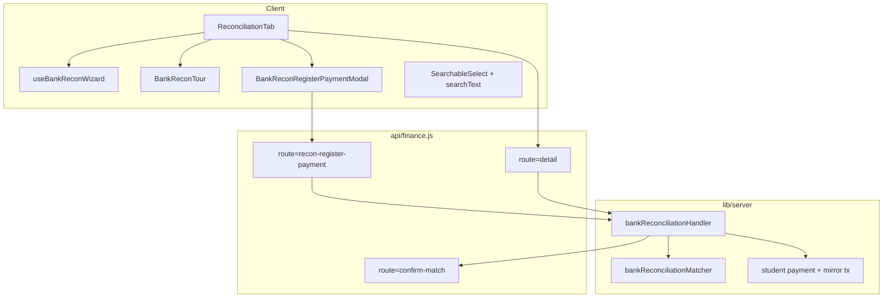

# Conciliação — Evolução UX (TECH)

**Data:** 2026-06-16  
**Status:** rascunho — aguardando implementação  
**PRODUCT:** [2026-06-16-conciliacao-ux-evolucao-PRODUCT.md](./2026-06-16-conciliacao-ux-evolucao-PRODUCT.md)

---

## Escopo

Implementar onboarding (wizard + tour), polish de busca/confiança (R-11/R-12), modal de mensalidade inline com vínculo atômico, layout mobile com tabs/rodapé, e regras memorizadas de pagador (P2). Sem nova Serverless Function — rotas em `api/finance.js?route=`.

**Dependências já no código:**

- `ReconciliationTab.jsx`, `BankReconPairRow.jsx`, `BankReconOrphanList.jsx`, `BankReconSelectionBar.jsx`
- `ImportStatementModal.jsx`
- `lib/server/bankReconciliationHandler.js`, `bankReconciliationMatcher.js`
- `src/lib/financeReconTxLabel.js` (`matchTierLabel` já existe)
- `src/lib/automacoesSetupWizard.js` (padrão localStorage + steps)
- `MensalidadesPanel.jsx` + `validateMensalidadesPaymentForm` (validação pagamento)
- `buildBankReconPaymentHintPath` (fallback deep link)

**Override de decisão anterior:** [pagadores-conhecidos TECH Q5](./2026-06-16-conciliacao-pagadores-conhecidos-TECH.md) escolheu deep link para evitar modal duplicado na v1. Esta spec **introduz modal dedicado** `BankReconRegisterPaymentModal` — subset do fluxo Mensalidades, não fork do painel inteiro.

---

## Decisões

| # | Decisão | Escolha | Motivo |
|---|---------|---------|--------|
| Q1 | Tour library | Componente próprio `BankReconTour.jsx` | Zero deps; overlay + `getBoundingClientRect` |
| Q2 | Wizard storage | `navi_recon_wizard_*` / `navi_recon_tour_*` por `academyId` | Mesmo padrão `automacoesSetupWizard` |
| Q3 | Busca R-11 | Server: `search_keywords[]` em cada TX no `detail` | Dados de alias/responsável já carregados no matcher; evita N+1 client |
| Q4 | SearchableSelect | Estender filtro para `opt.searchText` opcional | Mudança mínima em `SearchableSelect.jsx` |
| Q5 | Register inline | Nova rota `recon-register-payment` POST | Atomicidade; evita 3 round-trips client |
| Q6 | Regras P2 | Estender `payer_aliases_json` com `{ display, normalized, auto_suggest?: boolean }` | Sem coleção nova; reutiliza load no matcher |
| Q7 | Efeito da regra | Bônus no matcher, nunca `status=matched` automático | Invariante produto |

---

## Arquitetura



---

## Fase 0 — Wizard + tour

### Arquivos novos

| Arquivo | Responsabilidade |
|---------|------------------|
| `src/lib/bankReconOnboarding.js` | Storage keys, `read/write/dismiss`, steps constants, `computeWizardState` |
| `src/hooks/useBankReconWizard.js` | Estado wizard + tour; integração `statements.length`, `selectedId` |
| `src/components/finance/BankReconSetupWizard.jsx` | UI card (copiar estrutura de `AutomacoesSetupWizard`) |
| `src/components/finance/BankReconTour.jsx` | Overlay 4 passos, targets via `data-recon-tour` |
| `src/components/finance/styles/recon-onboarding.css` | Wizard + tour (z-index acima de tabela, abaixo de modal) |

### Arquivos alterados

| Arquivo | Mudança |
|---------|---------|
| `ReconciliationTab.jsx` | Hook wizard; `data-recon-tour` em KPI, coluna extrato, coluna lançamentos, Confirmar todos |
| `finance.css` ou `recon.css` | Import onboarding CSS |

### `bankReconOnboarding.js` (outline)

```js
export const RECON_WIZARD_STEPS = [
  { id: 'import', label: 'Importar', title: '...', cta: 'openImport' },
  { id: 'review', label: 'Revisar', ... },
  { id: 'link', label: 'Vincular', ... },
  { id: 'finish', label: 'Finalizar', ... },
];

export function reconWizardDismissKey(academyId) {
  return `navi_recon_wizard_dismissed_${academyId}`;
}
export function reconTourSeenKey(academyId) {
  return `navi_recon_tour_seen_${academyId}`;
}
```

### Gatilhos

| Estado | Wizard lista | Tour detalhe |
|--------|--------------|--------------|
| `!selectedId && statements.length === 0` | Sim (se não dismissed) | Não |
| `selectedId && first detail load` | Oculto ou passo 2+ | Sim (se tour não seen) |
| `?recon_wizard=1` | Força wizard | `?recon_tour=1` força tour |

### Testes

- `src/test/bankReconOnboarding.test.js` — storage keys, `computeWizardState`, dismiss
- `src/test/bankReconUx.test.jsx` — estender: wizard render na lista vazia; tour skip

---

## Fase 1a — R-11 busca + R-12 confiança

### Server: enriquecer `navi_unmatched`

Em `bankReconciliationHandler.js` → função que monta resposta `detail`:

```js
function buildTxSearchKeywords(tx, payerContext) {
  const parts = [
    tx.lead_name,
    tx.responsavel,
    ...(payerContext?.aliases || []).map((a) => a.display),
    formatReconTxShortTitle(tx), // já no client; server pode duplicar helper leve
  ];
  return [...new Set(parts.map(normalizeSearch).filter(Boolean))];
}
```

Cada TX em `navi_unmatched` ganha `search_keywords: string[]`.

### Client: `manualTxOptions`

```js
(detail?.navi_unmatched || []).map((tx) => ({
  value: tx.id,
  label: formatReconTxSelectLabel(tx, formatters),
  searchText: (tx.search_keywords || []).join(' '),
}))
```

### `SearchableSelect.jsx`

```js
function filterOptions(options, query) {
  const q = String(query || '').trim().toLowerCase();
  if (!q) return options;
  return options.filter((opt) => {
    const label = String(opt.label || '').toLowerCase();
    const extra = String(opt.searchText || '').toLowerCase();
    return label.includes(q) || extra.includes(q);
  });
}
```

Prop `searchText` opcional — backward compatible.

### R-12 — `BankReconPairRow.jsx`

```jsx
// Substituir bloco atual:
{tierLabel ? (
  <span className="bank-recon-confidence"> · {tierLabel}</span>
) : item.match_score > 0 && item.match_score < 100 ? (
  <span className="bank-recon-confidence"> · Confiança média ({item.match_score}%)</span>
) : null}
```

Multi-candidatos: remover `· ${c.score}%` quando `c.match_tier` presente.

### Testes

- `tests/unit/finance/bankReconciliationHandler.test.js` — `search_keywords` no detail
- `src/test/bankReconUx.test.jsx` — filtro por alias
- `financeReconTxLabel.test.js` — já cobre `matchTierLabel`

---

## Fase 1b — Mensalidade inline

### Nova rota

`POST api/finance.js?route=recon-register-payment`

**Body:**

```json
{
  "item_id": "bank_item_id",
  "payment_id": "optional_existing_pending_id",
  "lead_id": "student_lead_id",
  "reference_month": "2026-06",
  "amount": 200.0,
  "paid_at": "2026-06-10",
  "method": "pix",
  "bank_account_id": "..."
}
```

**Resposta 200:**

```json
{
  "ok": true,
  "payment_id": "...",
  "transaction_id": "...",
  "item_id": "...",
  "learn_payer": { ... }
}
```

### Handler (pseudo)

```js
async function handleReconRegisterPayment(academyId, body, res) {
  // 1. Auth owner
  // 2. Load bank item (unmatched, credit, same academy)
  // 3. Validate amount ±0.02 vs item.amount
  // 4. createOrSettleStudentPayment(...) — extrair de fluxo Mensalidades/billing
  // 5. ensureMirrorFinancialTx(...)
  // 6. confirmMatchInternal(item_id, transaction_id) — sem segundo POST client
  // 7. extract learn_payer se nome no extrato
  return json(res, 200, { ok: true, ... });
}
```

**Idempotência:** se `item` já `matched`, retornar 409 `already_matched`.

**Transação:** se Appwrite não suporta multi-doc transação, ordem segura:

1. Payment + mirror TX primeiro  
2. Match item  
3. Em falha no passo 2, marcar payment com flag reconciliação pendente OU deletar mirror órfão (preferir handler único já usado em billing)

Reutilizar funções existentes em `lib/server/` — **não duplicar** lógica de `handlePatchStudentPayment` / mirror.

### Componente `BankReconRegisterPaymentModal.jsx`

| Prop | Tipo |
|------|------|
| `open` | boolean |
| `hint` | `pending_payment_hints[0]` shape |
| `bankItem` | item órfão (data, amount, description) |
| `statementId` | string |
| `financeConfig` | contas, métodos |
| `onSuccess` | `(result) => void` |
| `onClose` | `() => void` |

Campos: reutilizar inputs de `MensalidadesPanel` modal (extrair subcomponente `MensalidadePaymentFields` se necessário — escopo mínimo: só campos do hint).

### `BankReconPairRow.jsx`

- Trocar `<Link to={buildBankReconPaymentHintPath}>` por `onRegisterPayment(hint)`  
- Link secundário: `btn-text` “Abrir em Mensalidades” → deep link existente

### API client

`src/lib/bankReconciliationApi.js`:

```js
export function registerBankReconPayment(academyId, payload) {
  return financePost(academyId, 'recon-register-payment', payload);
}
```

### Testes

- `tests/unit/finance/bankReconciliationHandler.reconRegister.test.js` — happy path, amount mismatch, already matched
- `src/test/bankReconIntegration.test.jsx` — modal submit → refresh detail

---

## Fase 1c — Mobile

### `ReconciliationTab.jsx`

```js
const [mobilePanel, setMobilePanel] = useState('extrato');
const isMobile = useMediaQuery('(max-width: 900px)'); // ou matchMedia hook existente
```

Ao `onSelect` linha unmatched em mobile: `setMobilePanel('lancamentos')`.

### CSS (`recon.css`)

```css
.bank-recon-mobile-tabs { /* copiar tokens de .sales-mobile-tabs */ }
.bank-recon-mobile-footer {
  position: sticky;
  bottom: 0;
  /* safe-area */
}
```

Marcadores `data-recon-tour="extrato-col"` / `lancamentos-col` para tour.

### `BankReconNextPendingBar.jsx`

- Props: `unmatchedItems`, `selectedId`, `onSelectNext`, `busy`
- `onSelectNext`: índice circular na lista `unmatched`

### Testes

- Teste CSS snapshot opcional; preferir RTL: tabs render em viewport 375px (`matchMedia` mock)

---

## Fase 2 — Regras memorizadas

### Schema (extensão `payer_aliases_json`)

```json
[
  {
    "display": "José Santos",
    "normalized": "jose santos",
    "source": "learned",
    "auto_suggest": true,
    "created_at": "2026-06-10T12:00:00.000Z"
  }
]
```

Sem migration Appwrite — JSON flexível.

### Matcher (`bankReconciliationMatcher.js`)

Após calcular candidatos, se `extracted_normalized` + `lead_id` tem alias com `auto_suggest: true`:

- Forçar `match_tier: 'amount_date_name'`
- `name_bonus` máximo
- Flag `from_rule: true` no item sugerido (não persistir em DB — só response)

### UI confirmação

Estender `learnPayerPrompt` em `ReconciliationTab`:

```jsx
<label>
  <input type="checkbox" checked={rememberRule} onChange={...} />
  Sempre sugerir este vínculo na conciliação
</label>
```

`rememberBankPayer` API: aceitar `auto_suggest: boolean`.

### Revisão mensal

`handleDetail` agrega:

```js
rules_applied: [{ normalized, lead_id, lead_name, hit_count }]
```

Banner em `ReconciliationTab` — `StatusBanner variant="info" collapsible`.

### Gerenciar regras

Modal `BankReconRulesModal.jsx` — lista aliases com `auto_suggest` de todos alunos (endpoint `route=recon-payer-rules` GET + PATCH) **ou** client-side scan se lista pequena.

**Preferência v1:** GET `recon-payer-rules` que query students com `payer_aliases_json` não vazio (paginado, limite 50 regras ativas).

### Testes

- `bankReconciliationMatcher.payer.test.js` — rule boost
- `rememberBankPayer` handler — `auto_suggest` flag

---

## Limites Vercel Hobby

| Rota nova | Arquivo |
|-----------|---------|
| `recon-register-payment` | `api/finance.js` (hub existente) |
| `recon-payer-rules` (opcional P2) | `api/finance.js` |

Não criar `api/bank-recon.js`.

---

## Plano de PRs

| PR | Arquivos principais | Risco |
|----|---------------------|-------|
| PR1 P0 | `bankReconOnboarding.*`, `BankReconSetupWizard`, `BankReconTour`, `ReconciliationTab` | Baixo |
| PR2 P1a | `SearchableSelect`, `bankReconciliationHandler`, `BankReconPairRow` | Baixo |
| PR3 P1b | `BankReconRegisterPaymentModal`, handler, `bankReconciliationApi` | **Alto** — atomicidade pagamento |
| PR4 P1c | `recon.css`, `BankReconNextPendingBar`, mobile state | Médio |
| PR5 P2 | matcher, remember payer, rules modal | Médio |

**Ordem:** PR1 → PR2 → PR3 → PR4 → PR5. PR3 pode ser dividido (handler primeiro, UI depois) se facilitar review.

---

## Verificação

```bash
npm test -- bankRecon bankReconciliationMatcher bankReconciliationHandler bankReconOnboarding
npm run lint
```

Checklist manual (owner):

1. Lista vazia → wizard → importar → tour no detalhe  
2. Buscar alias no seletor manual  
3. Hint mensalidade → modal → conciliado sem mudar aba  
4. Mobile 375px → tabs + próximo pendente  
5. Criar regra → próximo extrato sugere com badge

---

## Riscos

| Risco | Mitigação |
|-------|-----------|
| Pagamento inline diverge de Mensalidades | Mesma validação `validateMensalidadesPaymentForm`; handler chama código compartilhado server |
| Mirror TX órfão se match falhar | Handler único; teste de rollback |
| Tour quebra layout em zoom alto | Targets opcionais; skip se elemento não visível |
| 50+ regras degradam matcher | Índice `Map<normalized, lead_id[]>` em memória no detail |
