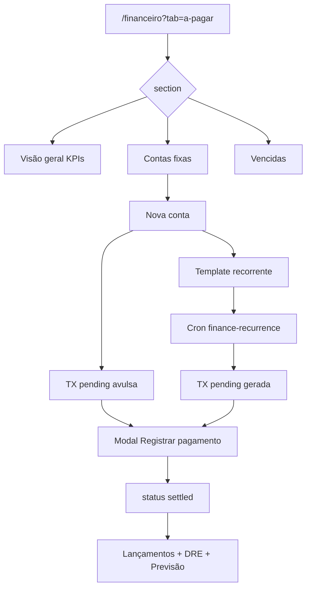

# Contas a pagar — PRODUCT Spec

**Data:** 2026-06-16  
**Status:** Implementado (Fase 1 P0 — 2026-06-16)  
**TECH:** [2026-06-16-contas-a-pagar-TECH.md](./2026-06-16-contas-a-pagar-TECH.md)  
**Fluxo (pós-implementação):** `docs/flows/financeiro/a-pagar-contas-fixas.md` (criar no mesmo PR)

**Contexto:** O Nave já possui **A receber** (mensalidades, cobrança, vendas a prazo), **Lançamentos** com recorrência e **Previsão** de caixa. Contas fixas (água, luz, telefone, aluguel, salários) hoje só podem ser cadastradas como lançamentos recorrentes escondidos em Lançamentos — sem fila operacional, sem vencimento explícito na UI e sem KPIs de saídas pendentes.

---

## 1. Problem Statement

Donos e gestores de academia precisam **programar e acompanhar obrigações de saída** (contas de consumo, aluguel, folha, fornecedores) com vencimento conhecido. Hoje:

- Despesas pendentes ficam misturadas em **Lançamentos** junto com entradas e movimentos já pagos.
- **A receber** ignora despesas pendentes de propósito (`buildPendingTxReceivableItems` exclui `direction=out`).
- **Previsão** mostra saídas, mas não substitui uma fila de “pagar até dia X”.
- Recorrência existe, porém sem fluxo guiado para “cadastrar conta fixa mensal”.
- Não há categorias específicas para utilidades (água, luz, telefone).

**Impacto de não resolver:** pagamentos em atraso, multa/juros, surpresa no fluxo de caixa, retrabalho no fechamento mensal e dependência de planilha externa.

**Personas afetadas:** owner, admin (principal); member com permissão de caixa (registrar pagamento, sem config avançada).

---

## 2. Goals

| # | Objetivo | Métrica de sucesso |
|---|----------|-------------------|
| G1 | Hub **A pagar** no Financeiro, simétrico a A receber | Aba visível para owner/admin com módulo `finance` |
| G2 | Fila operacional de obrigações em aberto (pendente + projetada) | 100% das saídas `pending` e recorrências futuras listadas com vencimento |
| G3 | Cadastro rápido de conta fixa (ex.: luz, dia 10, R$ 450) | ≤ 6 campos; concluir em ≤ 60 s (QA manual) |
| G4 | Liquidar conta da fila sem reabrir Lançamentos | Ação “Registrar pagamento” → status `settled` + conta bancária |
| G5 | Integração com Previsão e Visão Geral | Saídas de A pagar alimentam `expected_outflow` sem duplicar |
| G6 | Zero regressão em A receber, Lançamentos, recorrência cron | Testes existentes + novos passam |

---

## 3. Non-Goals

| Item | Motivo |
|------|--------|
| Pagamento automático via banco/PIX agendado | Integração externa; fase futura |
| Anexo de boleto/PDF | Requer Blob + UI upload; fase 2 |
| WhatsApp de lembrete para gestor | Só mensalidades de aluno hoje; fase 2 |
| Pagamento parcial de conta | Complexidade contábil; fase 3 |
| Nova coleção Appwrite dedicada (`payables`) | Reutilizar `FINANCIAL_TX` + `financeConfig` |
| Novo arquivo em `/api/` | Limite Hobby 12/12 — rota em `api/finance.js?route=payables` |
| Bloqueio operacional por inadimplência de fornecedor | Fora do domínio academia |
| DDA / Open Finance | Escopo enterprise |

---

## 4. Visão da solução

Nova seção **Financeiro → A pagar** (`/financeiro?tab=a-pagar`) com sub-abas:

| Sub-aba | Conteúdo |
|---------|----------|
| **Visão geral** | KPIs + próximos vencimentos (7/30 dias) + link para Previsão |
| **Contas fixas** | Templates recorrentes (água, luz…) + contas avulsas pendentes |
| **Vencidas** | Saídas pendentes com `due_date < hoje` (fila de regularização) |

**Princípio:** toda obrigação a pagar é um `FINANCIAL_TX` com `direction=out` e `status=pending` (ou template `is_recurrence_template=true`). Liquidar = mesmo fluxo de Lançamentos (`patchFinanceTx action settle`).

---

## 5. User Stories

### Owner / Admin

- **US1:** Como gestor, quero ver quanto tenho a pagar nos próximos 30 dias para planejar o caixa.
- **US2:** Como gestor, quero cadastrar “Conta de luz — CPFL — R$ 450 — vence dia 10” que se repete todo mês sem ir em Lançamentos.
- **US3:** Como gestor, quero uma lista de contas **vencidas** para não esquecer multas.
- **US4:** Como gestor, quero marcar uma conta como paga informando método e conta bancária, como faço com mensalidades.
- **US5:** Como gestor, quero filtrar por categoria (água, luz, aluguel) e buscar por nome do fornecedor.
- **US6:** Como gestor, quero cancelar uma recorrência sem apagar histórico de pagamentos já liquidados.

### Recepcionista (member)

- **US7:** Como recepcionista, quero ver contas a pagar do dia e registrar que o owner pagou (se tiver permissão de caixa).
- **US8:** Como recepcionista, **não** quero acessar configuração de templates recorrentes (somente owner/admin).

### Edge cases

- **US9:** Conta avulsa sem recorrência (ex.: conserto pontual) — cadastro único com vencimento.
- **US10:** Template recorrente sem `due_date` legado — vencimento derivado de `recurrence_day` + mês de competência.
- **US11:** Valor estimado vs valor real — permitir ajuste de `gross` ao liquidar (com confirmação se diferir > 5%).
- **US12:** Academia sem módulo `finance` — aba oculta; URL direta redireciona para A receber ou Visão Geral.

---

## 6. UX detalhada

### 6.1 Navegação

```
Sidebar → Financeiro
  ├ Visão Geral
  ├ A receber
  ├ A pagar          ← NOVO (owner/admin; member: oculto ou só leitura — ver R-perm)
  ├ Lançamentos
  ├ Previsão
  ├ Conferência do mês
  └ Conciliação
```

**URL canônica:** `/financeiro?tab=a-pagar&section=contas-fixas`  
**Deep link liquidar:** `/financeiro?tab=a-pagar&section=contas-fixas&tx=<id>`  
**Atalho sidebar (opcional v1.1):** “Nova conta a pagar” → `?tab=a-pagar&new=1`

### 6.2 Visão geral (section=visao)

**KPIs (cards):**

| KPI | Cálculo |
|-----|---------|
| Total em aberto | Soma `amount` itens pending + projetados no mês corrente |
| Vence em 7 dias | `due_date` entre hoje e hoje+7 |
| Vencidas | `due_date < hoje` e status pending |
| Fixas ativas | Count templates `is_recurrence_template=true` direction=out |

**Lista “Próximos vencimentos”:** top 8 itens ordenados por `due_date` (reutilizar padrão `ReceivablesOverviewCard`).

**Empty state:** “Nenhuma conta programada” + CTA “Cadastrar conta fixa”.

### 6.3 Contas fixas (section=contas-fixas)

**Toolbar:** busca (fornecedor/descrição), filtro categoria, filtro status (pendente / paga / todas do mês), botão **Nova conta**.

**Tabela desktop:**

| Coluna | Conteúdo |
|--------|----------|
| Vencimento | `due_date` dd/mm/aaaa; badge “Hoje”, “Atrasada” |
| Fornecedor / Descrição | `vendor_label` (ver TECH) |
| Categoria | Água, Luz, … |
| Valor | `gross` formatado BRL |
| Recorrência | ícone Repeat + “Mensal dia 10” ou “Avulsa” |
| Status | Pendente / Paga |
| Ações | Pagar · Editar · ⋮ (cancelar recorrência, ver lançamento) |

**Mobile:** card compacto (mesmo padrão `MonthlyGridMobileCard` / finance cards).

**Modal “Nova conta a pagar”:**

| Campo | Obrigatório | Notas |
|-------|-------------|-------|
| Fornecedor / descrição | Sim | Ex.: “CPFL”, “Sabesp”, “Vivo Fibra” |
| Categoria | Sim | Default utilidades; lista em §6.5 |
| Valor (R$) | Sim | Estimado; editável na liquidação |
| Vencimento | Sim | Date picker; define `due_date` |
| Repetir mensalmente | Não | Se sim: dia do mês (= `recurrence_day`) |
| Repetir até | Não | `recurrence_end` YYYY-MM |
| Conta bancária (pagamento) | Não na criação | Obrigatória ao liquidar |
| Observação | Não | `note` |

**Comportamento ao salvar:**

- **Avulsa:** cria `FINANCIAL_TX` pending, `direction=out`, `due_date` informado.
- **Recorrente:** cria **template** (`is_recurrence_template=true`) + opcionalmente primeira instância pending se vencimento ≤ 30 dias (config: sempre gera via cron no dia — ver TECH).

### 6.4 Vencidas (section=vencidas)

Mesma tabela, filtro fixo `due_date < hoje` e `status=pending`.  
**Empty state:** “Nenhuma conta vencida” (tom positivo).  
Destaque visual: badge vermelho + contagem no HubTabBar (badge numérico se > 0).

### 6.5 Categorias novas (utilidades)

Adicionar em `FINANCE_CATEGORIES` (tipo `expense_operational`, DRE 6.2.1):

| Chave | Label |
|-------|-------|
| AGUA | Água e esgoto |
| LUZ | Luz / energia |
| TELEFONE_INTERNET | Telefone e internet |
| CONDOMINIO | Condomínio |
| IMPOSTOS_TAXAS | Impostos e taxas |

Manter categorias existentes (Aluguel, Salários, …). **Não** remover “Outras despesas”.

### 6.6 Fluxo “Registrar pagamento”

1. Operador clica **Pagar** na linha.
2. Modal reutiliza campos de liquidação de Lançamentos: método, conta bancária, data pagamento, valor (pré-preenchido).
3. Confirmar → `patchFinanceTx` settle + side effects contábeis.
4. Toast sucesso; item some da fila pending; Previsão invalida cache (`navi-finance-forecast-invalidate`).

**Erros:** conta bancária ausente → `FieldError` + link `EMPRESA_FINANCE_ACCOUNTS_PATH` (mesmo padrão mensalidades).

### 6.7 Diagrama de fluxo



---

## 7. Requirements por fase

### Fase 1 — MVP (P0) — ship mínimo

| ID | Requisito | Critérios de aceite |
|----|-----------|---------------------|
| R1.1 | Aba **A pagar** no hub Financeiro | [ ] Visível owner/admin com `finance`; [ ] URL `?tab=a-pagar`; [ ] member redireciona ou oculta (default: oculta) |
| R1.2 | API `GET ?route=payables` | [ ] Retorna `{ items, summary }` agregado; [ ] Filtra academyId; [ ] Auth igual receivables |
| R1.3 | Agregador `payablesAggregate.js` | [ ] Pending outflow TX; [ ] Projeção templates recorrentes (reutiliza `projectRecurrenceOccurrences`); [ ] Status overdue/soon |
| R1.4 | Campo **vencimento** na UI | [ ] Modal nova conta e edição pending; [ ] Persiste `due_date` em FINANCIAL_TX; [ ] Cron recorrência copia `due_date` na instância |
| R1.5 | Categorias utilidades | [ ] 5 categorias §6.5; [ ] Aparecem no modal A pagar e Lançamentos saída |
| R1.6 | Sub-abas visao / contas-fixas / vencidas | [ ] HubTabBar interno espelha A receber; [ ] `?section=` na URL |
| R1.7 | Registrar pagamento da fila | [ ] Settle idempotente; [ ] Conta bancária obrigatória se configurado em financeConfig |
| R1.8 | Previsão consistente | [ ] Itens pending out com `due_date` usam data real (não só competência-28); [ ] Sem duplicar template + instância no mesmo dia |
| R1.9 | Testes unitários | [ ] `payablesAggregate.test.js`; [ ] handler test; [ ] regressão `receivablesAggregate` inalterada |

### Fase 2 — Operacional (P1)

| ID | Requisito | Critérios de aceite |
|----|-----------|---------------------|
| R2.1 | Cadastro de **fornecedores** em Minha academia → Financeiro | [ ] Lista `{ id, name, defaultCategory, defaultDueDay }` em `financeConfig.vendors`; [ ] Autocomplete no modal |
| R2.2 | Badge vencidas no menu Financeiro | [ ] Count overdue > 0 no hub tab |
| R2.3 | Card na Visão Geral financeira | [ ] “X contas vencem esta semana” linkando A pagar |
| R2.4 | Import CSV contas fixas | [ ] Colunas: fornecedor, categoria, valor, vencimento, recorrente, dia |
| R2.5 | NL / agente | [ ] Query “contas a pagar esta semana” via `nlAcademyQuery` |

### Fase 3 — Avançado (P2)

| ID | Requisito | Notas |
|----|-----------|-------|
| R3.1 | Anexo boleto (Blob) | Campo `attachment_url` opcional |
| R3.2 | Lembrete e-mail/dashboard D-3 | Sem WhatsApp aluno |
| R3.3 | Pagamento parcial | Dois TX ou campo `paid_amount` |
| R3.4 | Conciliação sugere match com saída pending | Extensão bank recon |

---

## 8. Permissões

| Papel | Ver A pagar | Criar/editar conta | Liquidar | Cancelar recorrência |
|-------|-------------|-------------------|----------|----------------------|
| **owner** | Sim | Sim | Sim | Sim |
| **admin** | Sim | Sim | Sim | Sim |
| **member** | Não (v1) | Não | Não | Não |

**Rationale v1:** member já usa A receber para cobrança; contas a pagar são sensíveis. Reavaliar em v1.1 se academias pedirem delegação.

---

## 9. Success Metrics

**Leading (30 dias pós-launch):**

| Métrica | Meta |
|---------|------|
| Academias com ≥1 template recorrente out | ≥ 40% das academias com módulo finance ativo |
| Contas liquidadas via A pagar (vs só Lançamentos) | ≥ 60% das saídas pending |
| Tempo médio cadastro conta fixa (observacional QA) | ≤ 60 s |

**Lagging (90 dias):**

| Métrica | Meta |
|---------|------|
| Tickets “esqueci de pagar conta” / planilha paralela | Redução ≥ 50% (baseline manual) |
| Uso da aba Previsão correlacionado | Usuários de A pagar abrem Previsão 2× mais |

---

## 10. Open Questions

| # | Pergunta | Owner | Default proposto |
|---|----------|-------|------------------|
| Q1 | Member pode ver A pagar read-only? | Produto | Não em v1 |
| Q2 | Template recorrente gera instância no cadastro ou só no cron? | Eng | Só cron (comportamento atual); preview na UI |
| Q3 | `vendor_label` em campo novo ou reutilizar `planName`? | Eng | v1: `planName`; v2: `financeConfig.vendors` |
| Q4 | Editar valor do template altera instâncias pending futuras? | Produto | Sim, só próximas; liquidadas intactas |
| Q5 | Provisionar `due_date` no Appwrite em prod? | Eng | Script `provision-finance-payables-schema.mjs` obrigatório antes deploy |

---

## 11. QA Checklist (Fase 1)

1. [ ] Cadastrar conta avulsa água R$ 120 venc. amanhã → aparece em Contas fixas
2. [ ] Cadastrar luz recorrente dia 10 → template visível; no dia 10 cron gera pending
3. [ ] Liquidar conta → some da fila; aparece em Lançamentos settled
4. [ ] Conta com vencimento ontem → aparece em Vencidas + KPI
5. [ ] Previsão mostra saída na semana correta (não competência-28)
6. [ ] A receber não lista despesas pending
7. [ ] Cancelar recorrência → template desativado; instâncias pending editáveis
8. [ ] Academia sem finance → aba ausente
9. [ ] Mobile: cards e modal usáveis
10. [ ] Export/relatórios DRE: despesa operacional categorizada (Água, Luz)

---

## 12. Referências no código atual

| Área | Arquivo |
|------|---------|
| Hub tabs | `src/lib/financeiroHubTabs.js` |
| A receber (espelho) | `src/lib/receivablesAggregate.js`, `ReceivablesTab.jsx` |
| Recorrência | `src/lib/financeRecurrence.js`, `runFinanceRecurrenceCron.js` |
| Previsão saídas | `lib/server/financeForecastHandler.js` |
| Categorias | `src/lib/financeCategories.js` |
| Lançamentos | `TransacoesTab.jsx`, `financeTxHandler.js` |
