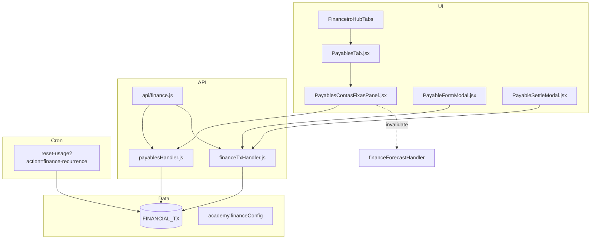

# Contas a pagar — TECH Spec

**Data:** 2026-06-16  
**PRODUCT:** [2026-06-16-contas-a-pagar-PRODUCT.md](./2026-06-16-contas-a-pagar-PRODUCT.md)

---

## 1. Arquitetura



**Princípios:**

- Reutilizar coleção `FINANCIAL_TX` — **sem** nova coleção e **sem** novo arquivo `/api/*.js`.
- Rota: `GET /api/finance?route=payables&academy_id=&from=&to=&section=`.
- Espelhar padrões de `financeReceivablesHandler` + `receivablesAggregate.js`.
- Cron existente `finance-recurrence` estendido para propagar `due_date`.

---

## 2. Modelo de dados

### 2.1 FINANCIAL_TX (campos usados)

| Campo | Uso A pagar |
|-------|-------------|
| `direction` | `'out'` (obrigatório) |
| `status` | `pending` \| `settled` \| `cancelled` |
| `type` | `expense_operational` (ou subtipos existentes) |
| `category` | Água, Luz, … |
| `planName` | **v1:** label fornecedor/descrição (“CPFL”, “Sabesp”) |
| `gross` | Valor estimado / pago |
| `due_date` | **ISO date YYYY-MM-DD** — vencimento civil |
| `competence_month` | YYYY-MM (competência contábil) |
| `is_recurrence_template` | `true` = conta fixa modelo |
| `recurrence_type` | `monthly` \| `weekly` \| `none` |
| `recurrence_day` | Dia do mês (1–28) ou weekday |
| `recurrence_end` | YYYY-MM ou vazio |
| `recurrence_origin_id` | ID do template na instância gerada |
| `bank_account` | Preenchido na liquidação |
| `note` | Observações livres |

### 2.2 Schema Appwrite

Adicionar atributo opcional `due_date` (string, 10 chars) na coleção `FINANCIAL_TX` se ausente.

**Script:** `scripts/provision-finance-payables-schema.mjs`

```javascript
// Pseudocódigo — idempotente
await ensureStringAttribute(FINANCIAL_TX_COL, 'due_date', 10, required: false);
```

Registrar em `OPTIONAL_FINANCIAL_TX_ATTRS` em `lib/server/financeTxFields.js` e mapear em `buildFinanceTxPayload` / `mapFinanceTxDoc`.

### 2.3 financeConfig (Fase 2)

```typescript
// academy.financeConfig.vendors — JSON array, optional
type FinanceVendor = {
  id: string;           // uuid
  name: string;         // "CPFL"
  defaultCategory?: string;
  defaultDueDay?: number; // 1-28
  active?: boolean;
};
```

**v1:** omitir; usar só `planName`.

---

## 3. Agregação — `payablesAggregate.js`

**Arquivo:** `src/lib/payablesAggregate.js`

### 3.1 Fontes de itens

| Source constant | Origem | Incluído quando |
|-----------------|--------|-----------------|
| `PAYABLE_SOURCE.LANCAMENTO` | `FINANCIAL_TX` status=pending, direction=out | Sempre |
| `PAYABLE_SOURCE.RECORRENCIA` | Projeção de templates out (futuro) | `due_date` em [from, to] e sem instância pending duplicada |
| `PAYABLE_SOURCE.TEMPLATE` | Template ativo (lista Contas fixas) | section=contas-fixas, linha “modelo” |

**Excluir:**

- TX `direction=in`
- TX `status=settled|cancelled` (exceto filtro “pagas do mês” — optional v1.1)
- Templates com `recurrence_end` passado

### 3.2 Funções públicas

```javascript
export const PAYABLE_SOURCE = {
  LANCAMENTO: 'lancamento',
  RECORRENCIA: 'recorrencia',
  TEMPLATE: 'template',
};

/** Pending outflow TX com due_date ou fallback competence_month-28 */
export function buildPendingPayableItems(transactions = [], { today = new Date() } = {});

/** Templates is_recurrence_template=true direction=out */
export function buildRecurrenceTemplateItems(templates = []);

/** projectRecurrenceOccurrences filtrado out + dedupe vs pending by recurrence_origin_id+competence_month */
export function buildProjectedPayableItems(templates, fromYmd, toYmd, existingPending = []);

export function mergePayableItems(...groups);
export function summarizePayables(items = []);
export function classifyPayableStatus(dueYmd, todayYmd); // 'overdue' | 'due_soon' | 'open' | 'paid'

export function buildPayablesSnapshot({
  pendingTransactions,
  recurrenceTemplates,
  fromYmd,
  toYmd,
  today,
  section, // 'visao' | 'contas-fixas' | 'vencidas'
});
```

### 3.3 Dedupe projeção vs instância

Evitar double-count na Previsão e A pagar:

```javascript
function hasPendingInstanceForPeriod(pending, templateId, competenceMonth) {
  return pending.some(
    (tx) =>
      String(tx.recurrence_origin_id) === templateId &&
      String(tx.competence_month) === competenceMonth &&
      String(tx.status).toLowerCase() === 'pending'
  );
}
```

Mesma regra já usada implicitamente em `alreadyGeneratedThisPeriod` no cron — **reutilizar lógica** em helper compartilhado `src/lib/financeRecurrenceDedup.js` (extrair do cron + aggregate).

### 3.4 Item shape (API response)

```json
{
  "id": "tx:abc123",
  "source": "lancamento",
  "sourceLabel": "Conta pendente",
  "vendor_label": "CPFL",
  "category": "Luz / energia",
  "amount": 450,
  "due_date": "2026-06-10",
  "status": "overdue",
  "recurrence": { "active": true, "type": "monthly", "day": 10 },
  "tx_id": "abc123",
  "template_id": null,
  "linkTab": "a-pagar",
  "linkSection": "contas-fixas"
}
```

---

## 4. API

### 4.1 Rota

**Arquivo:** `lib/server/payablesHandler.js`  
**Registro:** `api/finance.js` — `if (route === 'payables' || route === 'a-pagar')`.

**GET** query params:

| Param | Default | Descrição |
|-------|---------|-----------|
| `academy_id` | session | Tenant |
| `from` | today | YYYY-MM-DD |
| `to` | today+30d | YYYY-MM-DD |
| `section` | `visao` | Filtra subset |
| `search` | — | Substring em vendor_label/category |
| `category` | — | Filtro categoria exata |

**Response:**

```json
{
  "ok": true,
  "from": "2026-06-16",
  "to": "2026-07-16",
  "section": "contas-fixas",
  "summary": {
    "totalOpen": 1250,
    "overdueCount": 1,
    "overdueAmount": 120,
    "dueSoonCount": 2,
    "dueSoonAmount": 549,
    "activeTemplates": 4
  },
  "items": [ /* ... */ ]
}
```

**Implementação:**

1. `ensureAuth` + `ensureAcademyAccess`
2. Paralelo: `listPendingFinancialTxOut(academyId)`, `listRecurrenceTemplatesOut(academyId)`
3. `buildPayablesSnapshot(...)`
4. Cache opcional 2 min in-memory keyed by academy+from+to (mesmo padrão forecast leve)

### 4.2 Mutations (sem rota nova)

| Ação | Endpoint existente |
|------|-------------------|
| Criar avulsa / template | `POST ?route=tx` via `createFinanceTx` |
| Liquidar | `PATCH ?route=tx` `action: settle` |
| Cancelar recorrência | `PATCH ?route=tx` `action: cancel_recurrence` |
| Editar pending | `PATCH ?route=tx` |

**Payload create (conta fixa recorrente):**

```json
{
  "direction": "out",
  "type": "expense_operational",
  "category": "Luz / energia",
  "planName": "CPFL",
  "gross": 450,
  "due_date": "2026-06-10",
  "receive_now": false,
  "is_recurrence_template": true,
  "recurrence_type": "monthly",
  "recurrence_day": 10,
  "competence_month": "2026-06"
}
```

---

## 5. Alterações no cron de recorrência

**Arquivo:** `lib/server/runFinanceRecurrenceCron.js`

Ao `createFromTemplate`, calcular e persistir `due_date`:

```javascript
function dueDateForRecurrenceInstance(template, ym) {
  const day = Math.min(28, Math.max(1, Number(template.recurrence_day) || 1));
  const [y, m] = ym.split('-').map(Number);
  const last = new Date(y, m, 0).getDate();
  const dom = Math.min(day, last);
  return `${y}-${String(m).padStart(2, '0')}-${String(dom).padStart(2, '0')}`;
}
```

Incluir `due_date` no payload de instância gerada.

**Invalidação:** após create, chamar `invalidateFinanceForecastCache(academyId)` (import de forecast handler).

---

## 6. UI — arquivos novos e alterados

### 6.1 Novos

| Arquivo | Papel |
|---------|-------|
| `src/lib/payablesAggregate.js` | Agregação client-safe |
| `src/lib/payablesApi.js` | `fetchPayables()` |
| `src/lib/financeiroPayablesSections.js` | `PAYABLES_SECTIONS`, URL builders |
| `src/components/finance/PayablesTab.jsx` | Hub sub-abas (espelho ReceivablesTab) |
| `src/components/finance/PayablesOverviewPanel.jsx` | section=visao |
| `src/components/finance/PayablesContasFixasPanel.jsx` | Tabela + toolbar |
| `src/components/finance/PayablesVencidasPanel.jsx` | Filtro overdue |
| `src/components/finance/PayableFormModal.jsx` | Nova conta |
| `src/components/finance/PayableSettleModal.jsx` | Liquidar (wrap settle existente) |
| `lib/server/payablesHandler.js` | GET handler |
| `src/test/payablesAggregate.test.js` | Unit |
| `tests/unit/finance/payablesHandler.test.js` | Handler |
| `docs/flows/financeiro/a-pagar-contas-fixas.md` | Fluxo usuário |

### 6.2 Alterados

| Arquivo | Mudança |
|---------|---------|
| `src/lib/financeiroHubTabs.js` | `FINANCEIRO_SECTIONS.A_PAGAR = 'a-pagar'`; incluir em `buildFinanceiroAllowedLeafTabs` (owner/admin) |
| `src/lib/financeCategories.js` | 5 categorias utilidades §PRODUCT 6.5 |
| `lib/server/financeTxFields.js` | `due_date` em optional attrs + payload/map |
| `src/components/finance/TransacoesTab.jsx` | Campo vencimento quando saída pending (opcional v1 se só modal A pagar) |
| `lib/server/financeForecastHandler.js` | `txDueYmd` prioriza `due_date`; dedupe template vs pending |
| `api/finance.js` | Registrar `payables` route |
| `src/pages/Caixa.jsx` | Render `PayablesTab` quando `tab=a-pagar` |
| `src/lib/naviMenu.js` | Item sidebar / highlight |
| `docs/flows/README.md` | Indexar fluxo A pagar |

### 6.3 Componentes reutilizados

- `FinanceTabShell`, `FinanceFiltersBar`, `HubTabBar`
- `FinanceBankAccountsSetupBanner` (liquidação sem conta)
- `patchFinanceTx` / `createFinanceTx` de `financeTxApi.js`
- `gridStatusBadge` — estender variantes `overdue`, `due_soon`
- Padrão toast / `useToast` / `ConfirmDialog` cancelar recorrência

---

## 7. Navegação e URL

```javascript
// src/lib/financeiroPayablesSections.js
export const PAYABLES_SECTIONS = {
  VISAO: 'visao',
  CONTAS_FIXAS: 'contas-fixas',
  VENCIDAS: 'vencidas',
};

export function buildPayablesPath({ section, tx, new: isNew } = {}) {
  const p = new URLSearchParams();
  p.set('tab', 'a-pagar');
  if (section && section !== PAYABLES_SECTIONS.VISAO) p.set('section', section);
  if (tx) p.set('tx', tx);
  if (isNew) p.set('new', '1');
  return `/financeiro?${p.toString()}`;
}
```

**Legacy:** nenhum redirect necessário (feature nova).

---

## 8. Previsão — ajustes

**Arquivo:** `lib/server/financeForecastHandler.js`

1. Em loop `pendingTx` outflow: usar `doc.due_date` quando presente.
2. Em loop `templates`: antes de `pushForecastItem`, skip se `hasPendingInstanceForPeriod`.
3. Não projetar template se instância pending já existe para competência do mês da ocorrência.

**Evento cliente:** disparar `navi-finance-forecast-invalidate` após create/settle em PayablesTab (já usado em TransacoesTab).

---

## 9. Visão Geral financeira (Fase 2)

**Arquivo:** `lib/server/financeOverviewHandler.js`

Incluir opcional `payablesPreview`:

```javascript
payablesPreview: {
  overdueCount,
  dueSoonCount,
  nextItems: items.slice(0, 5),
}
```

Query flag: `includePayables=1` (default off para não aumentar payload v1).

---

## 10. Categorias — `financeCategories.js`

```javascript
AGUA: {
  label: 'Água e esgoto',
  type: 'expense_operational',
  dreGroup: 'Despesas Operacionais',
  dreAccount: '6.2.1',
  operationalBucket: 'operational',
},
LUZ: { label: 'Luz / energia', /* ... */ },
TELEFONE_INTERNET: { label: 'Telefone e internet', /* ... */ },
CONDOMINIO: { label: 'Condomínio', /* ... */ },
IMPOSTOS_TAXAS: { label: 'Impostos e taxas', /* ... */ },
```

Exportar helper `getUtilityExpenseCategories()` para modal A pagar (subset ordenado).

Atualizar `getExpenseCategories()` tests.

---

## 11. Testes

### 11.1 Unit — `src/test/payablesAggregate.test.js`

- Pending out TX → item com `source=lancamento`
- Pending in TX → excluído
- Template mensal projeta 3 meses em range
- Dedupe: pending com `recurrence_origin_id` suprime projeção do mesmo mês
- `classifyPayableStatus`: overdue, due_soon (≤7d), open
- `summarizePayables` totais corretos

### 11.2 Unit — handler

- 401 sem auth
- 403 academy errado
- Response shape estável
- Filtro `section=vencidas` só overdue

### 11.3 Integração manual

- Cron gera instância com `due_date` no dia configurado
- Liquidar remove da GET payables
- DRE/fechamento: despesa settled entra em operational outflow

### 11.4 Regressão

- `receivablesAggregate.test.js` — inalterado
- `financeForecastCore.test.js` — casos dedupe out
- `financeRecurrence.test.js` — due_date instance

**Comando:** `npm test -- payablesAggregate payablesHandler financeForecast financeRecurrence`

---

## 12. Plano de implementação (ordem sugerida)

| Step | Entrega | Depende |
|------|---------|---------|
| 1 | Schema `due_date` + financeTxFields | — |
| 2 | `payablesAggregate.js` + tests | 1 |
| 3 | `payablesHandler.js` + api/finance route + tests | 2 |
| 4 | Categorias utilidades | — |
| 5 | Cron due_date + dedupe helper | 1 |
| 6 | PayablesTab UI (visao + contas-fixas + vencidas) | 2–4 |
| 7 | PayableFormModal + PayableSettleModal | 1, 6 |
| 8 | Hub tabs + naviMenu + Caixa.jsx wiring | 6 |
| 9 | Forecast dedupe + due_date priority | 5 |
| 10 | Flow doc + README index | 8 |

**Estimativa:** Fase 1 ≈ 3–5 dias dev (1 dev familiarizado com financeiro).

---

## 13. Riscos e mitigação

| Risco | Mitigação |
|-------|-----------|
| `due_date` ausente no Appwrite prod | Script provision + stripUnknown fallback |
| Dupla contagem previsão | Dedupe centralizado |
| Confusão Lançamentos vs A pagar | A pagar = saídas pending/recorrentes; copy UX “também visível em Lançamentos” |
| Limite 12 functions | Zero arquivos novos em `/api/` |
| Template sem direction=out no legado | Migration: filtrar `txDirection(mapped)==='out'` |

---

## 14. Fora de escopo técnico (Fase 2+)

- Coleção `vendors` dedicada
- Blob storage attachments
- Cron lembrete payables (novo `action=finance-payables-reminder` em `reset-usage.js` — permitido, não nova function file)
- PagBank pagamento outbound
