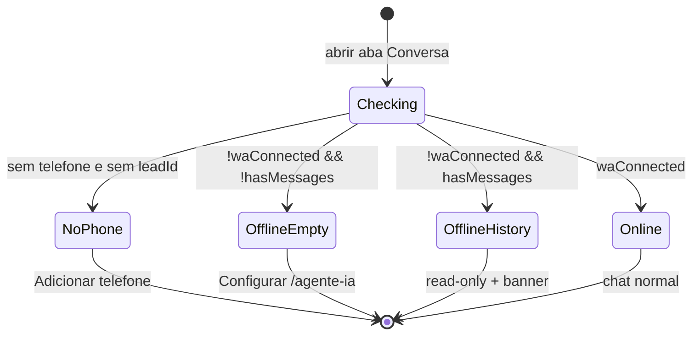

# Lead Profile — Estados offline do WhatsApp integrado

**Data:** 2026-06-16  
**Status:** Fases 1–2 implementadas (2026-06-16)  
**TECH:** [2026-06-16-lead-profile-whatsapp-offline-states-TECH.md](./2026-06-16-lead-profile-whatsapp-offline-states-TECH.md)

**Fluxos relacionados:**

- [funil-lead-matricula.md](../../flows/crm/funil-lead-matricula.md) — perfil do lead no CRM
- [conversas-inbox.md](../../flows/crm/conversas-inbox.md) — inbox WhatsApp
- [agente-ia-whatsapp.md](../../flows/atendimento/agente-ia-whatsapp.md) — conexão Zapster

**Specs relacionadas:**

- [2026-06-11-conversa-cadastro-lead-ia-design.md](./2026-06-11-conversa-cadastro-lead-ia-design.md) — aba Conversa no perfil
- [2026-06-09-ia-acoes-whatsapp-design.md](./2026-06-09-ia-acoes-whatsapp-design.md) — envio e integração WA

**Arquivos-chave (implementação):** `src/pages/LeadProfile.jsx`, `src/components/chat-widget/NaviChatWidgetPanel.jsx`, `src/components/chat-widget/NaviChatThread.jsx`, `src/hooks/useZapsterWhatsAppConnection.js`

**Mock Figma:** Não disponível — spec define copy, hierarquia e estados; seguir tokens em [DESIGN_SYSTEM.md](../../../DESIGN_SYSTEM.md) e [docs/ux-feedback.md](../../ux-feedback.md).

---

## 1. Problem Statement

O perfil do lead (`/lead/:id`) centraliza WhatsApp na **aba Conversa** (`NaviChatWidgetPanel`), sem botão dedicado no hero — decisão de produto para evitar redundância quando a integração está ativa.

Porém, quando a academia **não conectou** ou **perdeu** a conexão Zapster, o operador vê mensagens ambíguas (“Nenhuma conversa ainda”) em vez de orientação clara sobre o bloqueio. O composer fica desabilitado sem explicar o próximo passo. Quem abre o perfil pelo funil para agendar ou matricular pode nem abrir a aba Conversa e não perceber que o canal integrado está indisponível.

**Quem sofre:** recepcionista e owner no dia a dia do CRM, especialmente em mobile.

**Custo de não resolver:** tentativas repetidas de enviar mensagem, confusão entre “lead silencioso” vs “integração offline”, suporte manual (“por que não consigo mandar WhatsApp?”), e percepção de bug no produto.

---

## 2. Goals

| # | Objetivo | Métrica |
|---|----------|---------|
| G1 | Operador identifica em ≤5 s que o bloqueio é **integração**, não falta de mensagens do lead | Teste moderado: 4/5 usuários escolhem “WhatsApp da academia desconectado” vs “lead nunca respondeu” |
| G2 | Caminho óbvio para reconectar | CTA **Configurar WhatsApp** visível no empty state offline; link para `/agente-ia` |
| G3 | Paridade de estados entre perfis que usam chat embutido | Lead Profile e Student Profile exibem os mesmos empty states e banners |
| G4 | Hero do lead permanece limpo (sem botão WA duplicado) | Zero regressão: nenhum `comm-btn-primary` de WhatsApp no hero |
| G5 | Ações comerciais do perfil continuam utilizáveis offline | Agendar, matricular, notas e timeline funcionam independentemente do status WA |

---

## 3. Non-Goals

- Reintroduzir botão verde “WhatsApp” no hero do lead (canal integrado na aba Conversa).
- Alterar lógica de envio Zapster, webhooks ou `api/whatsapp.js`.
- Forçar conexão WA para usar o CRM (agendamento e matrícula seguem offline).
- Redesign completo do layout split perfil + painel.
- Substituir o Inbox como superfície principal de atendimento.
- Promover templates automáticos como ação primária quando offline (fallback `wa.me` permanece secundário — ver §8).

---

## 4. Decisão de produto (contexto)

| Decisão | Motivo |
|---------|--------|
| **Sem botão WA no hero** | Conversa integrada na aba dedicada; evita dois pontos de entrada quando conectado |
| **Estados explícitos quando offline** | Integração embutida exige feedback quando o pré-requisito (Zapster) falha |
| **CTA de configuração, não de “tentar enviar”** | Offline = problema de conta/academia, não do lead |

---

## 5. Personas e user stories

### Recepcionista

- Abrir `/lead/:id` vindo do funil e entender se posso enviar WhatsApp **sem** abrir a aba Conversa primeiro (banner leve na coluna esquerda).
- Na aba Conversa, ver **“WhatsApp não conectado”** com instrução e botão **Configurar** quando nunca houve sync ou não há histórico local.
- Se já existir histórico, ler mensagens antigas e ver banner de que **envio está bloqueado**.
- Lead sem telefone: ver empty state com **Adicionar telefone** (já existe — preservar).
- Continuar agendando experimental e registrando notas mesmo com WA offline.

### Owner / quem configura Agente IA

- Link **Configurar** leva a `/agente-ia` para reconectar QR / instância.
- Após reconectar, voltar ao perfil e enviar mensagem sem recarregar manualmente (poll já existente em `useZapsterWhatsAppConnection`).

### Edge cases

| Caso | Comportamento esperado |
|------|------------------------|
| `waStatusChecked === false` (checando) | Skeleton ou spinner no painel; sem empty state “não conectado” prematuro |
| WA desconectado + histórico em cache | Banner + thread read-only + composer desabilitado |
| WA desconectado + zero mensagens | Empty state dedicado (não “Nenhuma conversa ainda”) |
| Lead sem telefone | Empty state atual + `onRequestEditPhone` |
| Módulo IA desabilitado na academia | Empty state genérico “WhatsApp indisponível” + link config (não culpar o lead) |
| Usuário sem permissão para `/agente-ia` | Copy neutra + “Peça ao responsável da academia para conectar o WhatsApp” (sem link quebrado) |
| Mobile, painel Conversa fullscreen | Mesmos estados; banner offline também visível antes de abrir painel (coluna esquerda) |

---

## 6. Matriz de estados (UX)

Fonte de verdade: `useZapsterWhatsAppConnection` → `waConnected`, `waStatusChecked`.

### 6.1 Coluna esquerda (Lead Profile — sempre visível quando painel fechado no mobile)

Quando `waStatusChecked && !waConnected`:

| Elemento | Especificação |
|----------|---------------|
| Componente | `StatusBanner` variant `warning` ([docs/ux-feedback.md](../../ux-feedback.md)) |
| Copy | **WhatsApp desconectado** — mensagens pelo app estão indisponíveis até reconectar. |
| Ação | Link **Conectar WhatsApp** → `/agente-ia` (se rota acessível ao usuário) |
| Posição | Abaixo do header (`LeadFollowupBand` quando presente, senão topo do scroll) |
| Não mostrar | Enquanto `!waStatusChecked` ou quando `waConnected` |

### 6.2 Aba Conversa — sem telefone (existente, preservar)

| Campo | Valor |
|-------|-------|
| Título | Nenhum telefone cadastrado |
| Descrição | Adicione o telefone do contato para ver o histórico de mensagens. |
| CTA | Adicionar telefone → `onRequestEditPhone` |

### 6.3 Aba Conversa — WA offline + sem mensagens (novo)

Substituir combinação atual (banner + “Nenhuma conversa ainda”).

| Campo | Valor |
|-------|-------|
| Ícone | `WifiOff` (lucide), decorativo `aria-hidden` |
| Título | WhatsApp não conectado |
| Descrição | Conecte o WhatsApp em **Agente IA** para enviar e receber mensagens por aqui. |
| CTA primário | **Configurar WhatsApp** → `/agente-ia` |
| CTA secundário (P1) | **Abrir WhatsApp Web** → `wa.me/{telefone}` em nova aba, só se lead tem telefone válido; copy de apoio: “Envio manual — não registra no histórico do app” |
| Composer | Oculto ou desabilitado com mesma mensagem — não mostrar textarea “Digite uma mensagem…” como se funcionasse |

**Referência de implementação existente (paridade):** `ProfileConversationTab.jsx` linhas 161–173 — extrair para componente compartilhado.

### 6.4 Aba Conversa — WA offline + com histórico (refinar)

| Elemento | Especificação |
|----------|---------------|
| Banner | `WhatsApp desconectado — não é possível enviar mensagens` (`role="status"`) — já existe |
| Thread | Mensagens visíveis (read-only) |
| Composer | `compactDisabled={true}`; placeholder: **Conecte o WhatsApp para enviar mensagens** |
| CTA inline no banner (P1) | Link **Reconectar** → `/agente-ia` |

### 6.5 Aba Conversa — WA conectado (sem mudança)

Chat normal via `InboxComposer` + `NaviChatThread`.

### 6.6 Aba Conversa — label e badge (P1)

| Condição | UI |
|----------|-----|
| `!waConnected && waStatusChecked` | Sufixo ou badge na tab: **Conversa (offline)** ou ponto âmbar |
| `conversationUnreadCount > 0 && waConnected` | Manter **Conversa (N)** atual |

---

## 7. Copy canônico (pt-BR)

| Chave | Texto |
|-------|-------|
| `banner.left.offline` | WhatsApp desconectado — mensagens pelo app estão indisponíveis até reconectar. |
| `banner.left.action` | Conectar WhatsApp |
| `empty.offline.title` | WhatsApp não conectado |
| `empty.offline.desc` | Conecte o WhatsApp em Agente IA para enviar e receber mensagens por aqui. |
| `empty.offline.cta` | Configurar WhatsApp |
| `empty.offline.fallback` | Abrir WhatsApp Web |
| `empty.offline.fallback.hint` | Envio manual — não registra no histórico do app. |
| `banner.panel.offline` | WhatsApp desconectado — não é possível enviar mensagens |
| `composer.offline.placeholder` | Conecte o WhatsApp para enviar mensagens |
| `tab.offline` | Conversa (offline) |

Usar reticências Unicode `…` em estados de loading ([Web Interface Guidelines](https://github.com/vercel-labs/web-interface-guidelines)).

---

## 8. Menu de templates no hero (⋮)

**Estado atual:** dropdown `MoreVertical` envia templates via `sendWhatsappTemplateOutbound` (Zapster ou fallback `wa.me`).

| Cenário | Comportamento proposto |
|---------|------------------------|
| WA conectado | **Remover** menu de templates do hero (envio pelo composer integrado) |
| WA offline + instância configurada | Manter menu **ou** mover fallback para empty state secundário (P1) |
| WA offline + sem instância | Templates abrem `wa.me` — útil como escape hatch; label do menu: **Enviar template (manual)** |

**Decisão P0:** remover templates do hero quando `waConnected` para não competir com a aba Conversa.

**Decisão P1:** quando offline, expor fallback manual no empty state (§6.3) em vez de ícone ⋮ oculto.

---

## 9. Requirements

### P0 — Must have

| ID | Requisito | Aceite |
|----|-----------|--------|
| R1 | Empty state offline dedicado em `NaviChatWidgetPanel` quando `!waConnected && !loading && messages.length === 0` | Título “WhatsApp não conectado”; CTA `/agente-ia`; **não** exibir “Nenhuma conversa ainda” nesse caso |
| R2 | Extrair `ProfileConversationEmpty` compartilhado | Usado por `NaviChatWidgetPanel` e código legado `ProfileConversationTab` (DRY) |
| R3 | Banner warning na coluna esquerda do Lead Profile quando offline | `StatusBanner` + link; some quando conectado |
| R4 | Composer offline com placeholder explícito | Textarea desabilitada; placeholder §7 |
| R5 | Paridade Student Profile | Mesmo painel embutido → mesmos estados sem trabalho duplicado no page |
| R6 | Guard de loading | Enquanto `!waStatusChecked`, não renderizar empty offline |
| R7 | Remover menu templates do hero quando WA conectado | Hero sem ⋮ WA se `waConnected`; ações comerciais intactas |

### P1 — Should have

| ID | Requisito | Aceite |
|----|-----------|--------|
| R8 | Badge/tab “Conversa (offline)” | Visível na tablist quando offline |
| R9 | Link **Reconectar** no banner do painel (com histórico) | Navega `/agente-ia` |
| R10 | CTA secundário `wa.me` no empty offline | Abre nova aba; hint de envio manual |
| R11 | Fallback templates offline via empty state | Remover ⋮ se R10 cobrir escape hatch |

### P2 — Future

| ID | Requisito | Notas |
|----|-----------|-------|
| R12 | Notificação global estilo Inbox (`InboxGlobalBanners`) no app shell | Reutilizar quando WA cai em qualquer módulo |
| R13 | Deep link `/lead/:id?tab=conversation&wa=offline` | Analytics / suporte |
| R14 | Permissão granular: recepcionista vê banner sem link de config | Copy alternativa §5 |

---

## 10. Success metrics

**Leading (pós-release 2 semanas):**

- Redução de sessões com clique no composer desabilitado sem navegar a `/agente-ia` (proxy de confusão).
- Aumento de cliques em **Configurar WhatsApp** a partir do perfil quando `waStatus !== connected`.

**Lagging:**

- Menos tickets internos / feedback “não consigo mandar WhatsApp no lead”.
- Tempo médio para primeiro envio bem-sucedido após onboarding de academia (baseline comparativo).

**Qualitativo:**

- Teste com 3 recepcionistas: identificar offline vs lead quieto em ≤5 s (meta G1).

---

## 11. Validação e governança de docs

### Testes automatizados

- Render `NaviChatWidgetPanel` embedded: offline + sem msgs → empty title “WhatsApp não conectado”.
- Offline + com msgs → banner + composer disabled.
- Conectado → sem empty offline; composer habilitado.
- Lead Profile: banner esquerdo quando `waConnected=false`.

Comando sugerido: `npm test -- NaviChatWidget LeadProfile`

### Atualizar no mesmo PR da implementação

| Doc | Mudança |
|-----|---------|
| [funil-lead-matricula.md](../../flows/crm/funil-lead-matricula.md) | Passo 7: enviar WhatsApp via aba Conversa; estado offline |
| [VALIDATION.md](../../flows/VALIDATION.md) | Checklist: WA desconectado mostra empty + CTA config |
| Seção A do funil | Item: abrir lead sem WA → empty state correto |

---

## 12. Open questions

| # | Pergunta | Dono | Default se não decidir |
|---|----------|------|-------------------------|
| Q1 | Recepcionista sem acesso a `/agente-ia` vê link ou só copy? | Produto | Copy sem link + “fale com o responsável” |
| Q2 | Manter ⋮ templates offline ou só `wa.me` no empty? | Produto | P1: só empty state; remover ⋮ |
| Q3 | Banner na coluna esquerda também no Student Profile? | Produto | Sim (paridade via mesmo hook no page) |
| Q4 | Default da aba ao abrir perfil offline: Conversa ou Histórico? | UX | Manter Conversa (mostra empty offline imediatamente) |

---

## 13. Fases de entrega

| Fase | Escopo | Saída |
|------|--------|-------|
| **1** | R1, R2, R4, R6 — empty offline + composer | PR pequeno, só `NaviChatWidgetPanel` |
| **2** | R3, R7 — Lead Profile banner + limpeza hero | UX visível no funil |
| **3** | R8–R11 — polish tab badge, wa.me, templates | ✅ Implementado |

---

## 14. Histórico

| Data | Autor | Mudança |
|------|-------|---------|
| 2026-06-16 | — | Fase 3: Reconectar no banner, wa.me no empty, remoção ⋮ templates do hero |
| 2026-06-16 | — | Rascunho inicial (decisão: WA integrado na aba; estados offline explícitos) |
