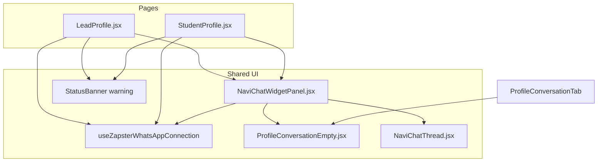

# Lead Profile — Estados offline do WhatsApp — TECH Spec

**Data:** 2026-06-16  
**Status:** Fases 1–2 implementadas (2026-06-16)  
**PRODUCT:** [2026-06-16-lead-profile-whatsapp-offline-states-PRODUCT.md](./2026-06-16-lead-profile-whatsapp-offline-states-PRODUCT.md)

---

## Escopo

Refatoração **frontend** para estados de UX quando `useZapsterWhatsAppConnection` reporta WhatsApp desconectado. Sem novos endpoints Vercel. Sem alteração em `api/whatsapp.js`, webhooks Zapster ou regras de envio.

---

## Diagnóstico (código atual)

| Componente | Comportamento hoje | Gap |
|------------|-------------------|-----|
| `NaviChatWidgetPanel.jsx` | Banner se `!waConnected`; thread via `NaviChatThread` | Sem empty offline; thread mostra “Nenhuma conversa ainda” |
| `ProfileConversationTab.jsx` | Empty offline completo (WifiOff + link `/agente-ia`) | **Não usado** em páginas — lógica duplicada / morta |
| `NaviChatThread.jsx` | Empty genérico “Nenhuma conversa ainda” | Não recebe sinal para diferenciar offline vs thread vazia online |
| `LeadProfile.jsx` | Hero com menu ⋮ templates; aba Conversa default | Sem banner offline na coluna esquerda |
| `StudentProfile.jsx` | Mesmo `NaviChatWidgetPanel` embedded | Herda gaps automaticamente após fix central |

**Hook:**

```javascript
// useZapsterWhatsAppConnection.js
const waConnected = waStatus === 'connected';
// LeadProfile panel usa:
const waConnected = !waStatusChecked || String(waStatus || '').trim() === 'connected';
```

> **Nota de implementação:** alinhar interpretação de `waConnected` — enquanto `!waStatusChecked`, tratar como **loading**, não como conectado. `NaviChatWidgetPanel` linha 79 usa optimistic connected; corrigir para `waStatusChecked && waStatus === 'connected'`.

---

## Arquitetura alvo



---

## Arquivos novos

| Arquivo | Responsabilidade |
|---------|------------------|
| `src/components/inbox/ProfileConversationEmpty.jsx` | Empty state compartilhado (extrair de `ProfileConversationTab.jsx`) |
| `src/test/leadProfileWhatsappOffline.test.jsx` | Estados offline Lead Profile + panel embedded |

Opcional:

| Arquivo | Responsabilidade |
|---------|------------------|
| `src/hooks/useWhatsAppConnectionState.js` | Wrapper fino: `{ loading, connected, status }` para evitar divergência entre painéis |

---

## Arquivos alterados

| Arquivo | Mudança |
|---------|---------|
| `src/components/chat-widget/NaviChatWidgetPanel.jsx` | Corrigir `waConnected`; branch empty offline; placeholder composer; loading guard |
| `src/components/inbox/ProfileConversationTab.jsx` | Importar `ProfileConversationEmpty`; remover duplicata inline |
| `src/components/chat-widget/NaviChatThread.jsx` | Prop opcional `emptyVariant: 'no_messages' \| 'hidden'` ou não renderizar empty quando pai trata offline |
| `src/pages/LeadProfile.jsx` | `StatusBanner` offline na coluna esquerda; remover bloco templates hero quando `waConnected`; consumir hook WA |
| `src/pages/StudentProfile.jsx` | Banner offline na coluna esquerda (paridade) |
| `src/styles/chat-widget.css` ou `lead-profile.css` | Estilos mínimos se empty/banner precisarem ajuste de spacing |
| `src/test/NaviChatWidget.test.jsx` | Casos offline empty + composer disabled |

---

## Implementação por requisito

### R1 + R2 — Empty offline (`NaviChatWidgetPanel`)

**Extrair componente:**

```jsx
// ProfileConversationEmpty.jsx
export default function ProfileConversationEmpty({ icon: Icon, title, description, action }) { ... }
```

**Lógica no panel (após hooks de conversa):**

```javascript
const { waStatus, waStatusChecked } = useZapsterWhatsAppConnection(academyId, {
  statusPollWhileMounted: true,
  watchAcademyStatus: true,
});

const waConnected = waStatusChecked && String(waStatus || '').trim() === 'connected';
const hasMessages = messages.length > 0;

// Ordem de early return (embedded):
// 1. sem telefone (existente)
// 2. !waStatusChecked → skeleton no body (novo)
// 3. !waConnected && !loading && !hasMessages → ProfileConversationEmpty offline
// 4. render normal (banner se !waConnected && hasMessages)
```

**Empty offline:**

```jsx
<ProfileConversationEmpty
  icon={WifiOff}
  title="WhatsApp não conectado"
  description="Conecte o WhatsApp em Agente IA para enviar e receber mensagens por aqui."
  action={
    <>
      <Link to="/agente-ia" className="btn btn-primary">Configurar WhatsApp</Link>
      {/* P1: wa.me secondary */}
    </>
  }
/>
```

### R4 — Composer offline

```jsx
<InboxComposer
  compactDisabled={!waConnected}
  compactPlaceholder={
    waConnected
      ? 'Digite uma mensagem…'
      : 'Conecte o WhatsApp para enviar mensagens'
  }
  ...
/>
```

Quando empty offline (sem histórico), **omitir** composer wrapper inteiro para não mostrar textarea falsa.

### R3 — Banner Lead Profile (coluna esquerda)

```jsx
// LeadProfile.jsx — dentro de lead-profile-left__scroll, antes do hero
{waStatusChecked && !waConnected ? (
  <StatusBanner
    variant="warning"
    message="WhatsApp desconectado — mensagens pelo app estão indisponíveis até reconectar."
    action={{ label: 'Conectar WhatsApp', to: '/agente-ia' }}
  />
) : null}
```

Verificar se `StatusBanner` suporta `action` com `Link`; se não, usar padrão existente em `InboxGlobalBanners` / `ConversationList`.

Hook no page level (evitar duplicar poll — panel já faz poll; acceptable duplicata leve ou lift state via hook compartilhado no mount).

### R7 — Remover templates do hero quando conectado

Em `LeadProfile.jsx`, envolver bloco `DropdownMenu` (templates) com:

```javascript
{!waConnected ? ( /* menu templates existente */ ) : null}
```

Fase 3 (P1): remover completamente se empty state tiver fallback `wa.me`.

Dependências a manter para follow-up band:

- `sendTemplateKey` / `handleFollowupWhatsApp` — usados por `LeadFollowupBand`, não remover.

### R8 — Tab badge offline

```javascript
const conversationTabLabel = !waConnected && waStatusChecked
  ? 'Conversa (offline)'
  : conversationUnreadCount > 0
    ? `Conversa (${conversationUnreadCount})`
    : 'Conversa';
```

---

## `NaviChatThread` — evitar empty conflitante

Opção A (preferida): prop `suppressEmpty={!waConnected && !hasMessages}` — pai renderiza empty offline.

Opção B: passar `emptyTitle` / `emptyDescription` quando offline — mais acoplamento.

Implementar A para manter thread dumb.

---

## Testes

### `NaviChatWidget.test.jsx` (estender)

| Caso | Assert |
|------|--------|
| `waStatus: 'disconnected'`, messages `[]`, `waStatusChecked: true` | `getByText('WhatsApp não conectado')` |
| Mesmo + messages `[{...}]` | banner “não é possível enviar”; sem empty title |
| `waStatus: 'connected'` | composer habilitado; sem empty offline |
| `waStatusChecked: false` | skeleton ou ausência de empty offline |

Mock: `useZapsterWhatsAppConnection`, `useInboxConversation`.

### `leadProfileWhatsappOffline.test.jsx`

| Caso | Assert |
|------|--------|
| Lead profile render com WA offline | `StatusBanner` ou texto banner esquerda |
| WA conectado | sem banner; sem menu ⋮ templates (R7) |

---

## Performance

- Reutilizar poll existente (`statusPollWhileMounted: true`) — **não** adicionar segundo intervalo no page se panel já montado.
- Quando painel fechado no mobile, banner esquerdo ainda precisa do hook → poll no `LeadProfile` é aceitável (mesmo hook, cache em `useZapsterWhatsAppConnection` / localStorage se existir).

Verificar `writeWaConnectionCache` no hook — banner pode ler cache síncrono no first paint para evitar flash.

---

## Acessibilidade

| Item | Regra |
|------|-------|
| Empty offline | Título em heading adequado (`h2` ou `p` com classe title existente) |
| Banner | `role="status"` ou `StatusBanner` semântico |
| Composer disabled | `aria-disabled` / `disabled` no textarea |
| Link configurar | `<Link>` nativo, não `button` + navigate |
| Ícones | `aria-hidden="true"` |

---

## Rollout

- Feature flag **não necessária** — correção de UX / bug de copy.
- Deploy único; validar manualmente com academia teste em estado `disconnected`.

---

## Checklist de PR

- [ ] PRODUCT critérios P0 (R1–R7)
- [ ] Testes verdes
- [ ] `docs/flows/crm/funil-lead-matricula.md` + `VALIDATION.md`
- [ ] Sem novo arquivo em `/api/`
- [ ] Paridade visual Student Profile
- [ ] Lint nos arquivos tocados

---

## Histórico

| Data | Autor | Mudança |
|------|-------|---------|
| 2026-06-16 | — | Rascunho inicial |
